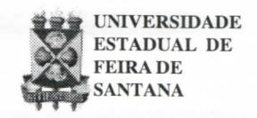
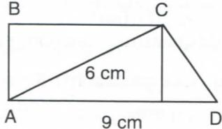

# FOLHETIM DE EDUCAÇÃO MATEMÁTICA

Folhetim Educ. Mat., Ano 7, n. 86, jan. 2000

ISSN 1415-8779

#### **OBJETIVO**

Este Folhetim é um veículo de divulgação, circulação de idéias e de estímulo ao estudo e à curiosidade intelectual. Dirige-se a todos os interessados pelos aspectos pedagógicos, filosóficos e históricos da Matemática. Pretende construir uma ponte para unir os que estão próximos e os que estão distantes.

### **EDITORIAL**

É bem verdade que as inovações, de qualquer natureza, demandam um certo tempo para serem absorvidas. Porém, não podemos nos conformar que os próprios proponentes de reformas, não os coloque em prática de imediato.

O texto da coluna Pergunte que o NEMOC Responde traz uma indignada amostragem dessa realidade. Lendo atentamente você poderá inferir sobre os caminhos que estão sendo apontados para a formação de professores. Os nossos alunos, principalmente de Licenciatura em Matemática, encontrarão razões para serem pragmáticos: para que "perder tempo" estudando tantas definições, demonstrações, ... perguntarão eles. Basta apenas estudar por um manual de ensino fundamental e médio, resolvendo os exercícios ali apresentados, para obter sucesso - pelo menos em matemática - em alguns concursos para professor.

## COMITÉ EDITORIAL

Carloman Carlos Borges (Doutor) Inácio de Sousa Fadigas (Mestre)

## PERGUNTE QUE O NEMOC RESPONDE

**Pergunta.** Muitos colegas de outros Estados perguntam como é o ensino da Matemática na Bahia.

R. Em 22 de dezembro de 1999 foi realizado em todo o Estado da Bahia concurso para Professor Nível III, isto é, para selecionar professores para o Ensino Fundamental e Médio. Os candidatos deveriam, pelo menos, possuir Licenciatura Plena em Matemática. As provas foram organizadas pelo IBRASP, Instituto Brasileiro de Seleção Pública, e constaram de três testes: uma redação, uma prova de conhecimentos pedagógicos, e outra de matemática. As duas últimas foram distribuídas, cada uma, em 25 questões. Após cada pergunta, eram apresentadas cinco alternativas. É a chamada múltipla escolha, cuja única justificativa, é a facilidade na correção, que se torna computadorizada.

Eis as questões:

- 1ª) Usando os símbolos indo-arábicos, o numeral "um milhão, três mil e dois" é escrito como;
  - 2ª) O valor da expressão

$$\{2^3 - (3^2 \cdot 7 - 80) + [41 + (7^2 + 8^2)] : 14\}: 2 \text{ \'e};$$

3ª) O valor da expressão

$$\{(-2)^3 + 4 \cdot [3^2 + 8 : (-2)]\}: (-1)^5 \text{ \'e};$$

- 4ª) A densidade de um corpo é a razão entre a sua massa e o seu volume. Então a densidade de uma bola que tem 35 gramas de massa e ocupa um volume de 128cm³ é aproximadamente igual a;
  - 5ª) Num jogo de futebol as torcidas do Vitória e do Bahia

compareceram ao estádio numa razão de 3 para 4. Sabendo-se que a lotação nesse dia foi de 77.000 torcedores, então o número de torcedores do Bahia foi de:

- 6ª) Um trem percorre certa distância em 8 horas, com velocidade de 60 km/h. Então esse trem, com a velocidade de 50 km/h, para fazer o mesmo percurso, demoraria:
- 7ª) Foram empregados 32 kg de fio para tecer 4 peças de tecido com 15 m cada uma. Quantos quilogramas serão necessários para tecer 6 peças de tecido com 20 m cada uma?;
- 8ª) Sabendo-se que certa mistura foi feita com
  12 litros de água e 8 litros de álcool, então a porcentagem
  de álcool contida na mistura é de;
- 9ª) Os juros simples produzidos por um capital de R\$ 1.200,00, aplicado à taxa de 18% ao semestre durante dois meses, são de;
  - 10ª) Assinale a sentença verdadeira.

A)
$$\Re^*$$
$\cup$ $\Re^*$ = $\Re^*$

B)
$$\Re$$
$\cap$ $\Re$ = $\emptyset$

C)
$$Z \subset \Re^*$$

D)
$$\mathbb{Z} \not\subset \Re$$

E)
$$\Re \subset Z$$

11ª) Simplificando-se a fração

$$\frac{15x^{2} - 10xy + 3xz - 2yz}{25x^{2} + 10xz + z^{2}}$$
obtém-se;

12ª) Dividindo-se um polinômio P por x² -x+1 obtém-se para quociente exato, x+1. O polinômio P é;

13ª) O conjunto solução da equação

$$\frac{x-1}{10} - \frac{x+1}{5} - \frac{1-2x}{15} = 0$$
é;

14ª) O conjunto solução da equação

$$(x-8)^2 + (x-1)^2 = (x+1)^2 \text{ \'e};$$

- 15ª) Sabendo-se que o raio da Terra é igual a 6.370.000 m e que a distância da Lua à Terra equivale em média a 60 raios terrestres, então essa distância, em quilômetros, é igual a;
  - 16ª) O valor da expressão
- $(2,4 \text{ dam}^2 + 120 \text{ dm}^2) (540 \text{ cm}^2 + 2,8 \text{ m}^2),$ em dm², é;
- 17ª) A quantidade de ar (volume) em cm³ contida numa bola de 18cm de diâmetro é igual a;
- 18ª) Comprei 1,2 kg de bacalhau por R\$9,84. Meio quilo desse mesmo bacalhau custará;
- 19ª) A probabilidade de obter-se um número menor que 3 no lançamento de um dado não-viciado é igual a;
- 20ª) A soma dos 15 primeiros termos da progressão aritmética (28, 23, 18, ...) é;
- 21ª) O produto dos 10 primeiros termos da progressão geométrica $(\frac{1}{8}, -\frac{1}{4}, \frac{1}{2}, ...)$ é;
- 22ª) Num plano marcam-se 12 pontos, dos quais exatamente 5 estão sobre uma mesma reta. Quantos triângulos podem ser formados unindo-se 3 quaisquer

# NEMOC - NÚCLEO DE EDUCAÇÃO MATEMÁTICA OMAR CATUNDA

Folhetim Educ. Mat., Ano 7, n. 86, janeiro 2000 - **Editores:** Carloman e Inácio - **Secretária:** Josenildes Oliveira Venas Almeida - **Editoração:** Evandro Vaz e Nivaldo de Assis - **Impressão:** Imprensa Gráfica Universitária - **Periodicidade:** mensal - **Tiragem:** 1.500 exemplares - _Distribuição gratuita_ - **Endereço:** Av. Universitária, s/n - km 03 - BR 116 - Campus Universitário - **Telefone:** (075)224-8115 - **Fax:** (075)224-8085 - CEP 44031-460 - Feira de Santana - Ba - BRASIL - **E-mai**l: nemoc@uefs.br

desses 12 pontos?;

23ª) Para alcançar-se o primeiro andar de um edifício, sobe-se uma rampa que forma com o solo um ângulo de 30º. Sabendo-se que a rampa mede 6m, então a altura do solo ao primeiro andar é igual a;

24ª) A área do trapézio retângulo ABCD da figura abaixo é:

25ª) Uma pirâmide regular tem todas as arestas iguais (congruentes). Sendo sua base um quadrado de 4 cm de diagonal, então seu volume é igual a.

Estou convicto de que os colegas após a leitura dessas questões já se acham em condições de julgar como o Estado da Bahia, através de sua Secretaria de Educação, pensa o ensino da matemática neste Estado. É bom enfatizar que as questões propostas foram destinadas a jovens formados em Licenciatura Plena em Matemática. Isso significa que são jovens que estudaram durante quatro anos, entre outras, as disciplinas: Cálculo Diferencial e Integral I, II, III e IV, dados em quatro semestres; além dessas disciplinas, estudaram, também: Análise Matemática, Topologia e Variável Complexa, bem como de Fundamentos de Matemática Elementar I e II. Todas as disciplinas citadas têm a duração de um semestre cada. Muitos deles estudaram História da Matemática, curso de duração de dois semestres (é o caso por exemplo dos egressos da UEFS). Achamos pertinentes os seguintes comentários sobre essa "prova": a) o seu nível de dificuldade está abaixo do teste de matemática do vestibular para ingresso na

Universidade; b) pessoas apenas com uma razoável alfabetização em nível de ensino fundamental resolveriam a maior parte das questões propostas; c) os que a elaboraram não levaram em consideração as fortes recomendações sugeridas pelos parâmetros curriculars nacionais cujo conhecimento foi por eles exigido no teste de Conhecimentos Pedagógicos; d) nenhuma questão sobre a História da Matemática - como elemento esclarecedor acerca da origem das idéias matemáticas; d') igualmente, nenhuma questão de Aritimética Elementar - campo onde os espaços para o raciocínio lógico são amplos e férteis; e) outra tendência moderna da Matemática, como problemas ligados à Contagem não mereceram quase nenhuma atenção e, pasmem os leitores, problema envolvendo produto de termos de uma Progressão Geométrica foi exigido. Vários manuais escolares trazem a fórmula para o cálculo do produto dos n primeiros termos de uma progressão geométrica:

$$P_n = (\sqrt{a_1.a_n})^n$$

Trata-se de, no mínimo, uma fórmula incompleta (tente aplicá-la, calculando o produto dos três primeiros termos da progressão: 1, -3, 9, ...). Por outro lado não há qualquer relevância teórica ou prática nesse tipo de cálculo. Os processos lógicos envolvidos no ensino da Matemática, nenhum deles, foi solicitado nesse processo seletivo. Definir, inferir, demonstrar, atos inerentes a essa aprendizagem foram esquecidos pelos examinadores. Até mesmo o raciocínio analógico. A pergunta que surge, então, é a seguinte: pode-se considerar essa "prova" como uma caricatura da Matemática? Certamente, estamos diante de uma situação na qual um aspecto menor da Matemática,

qual seja, "o fazer contas", a "calculeira" foi privilegiado. O conteúdo é obsoleto, antiquado e inútil. E o teste de Conhecimentos Pedagógicos? Dele não consta nenhuma questão de Psicologia Cognitiva aplicada à Matemática. Nenhuma questão envolvendo a Pedagogia com a Matemática, donde se pode concluir que tanto a "prova" de Matemática como a "prova" de Conhecimentos Pedagógicos não levaram em conta as recomendações dos parâmetros curriculares nacionais. É incrível que em um teste desse tipo não se formule uma questão, sequer, envolvendo a Psicologia Cognitiva e a Matemática. Omissões assim contribuem para que os estudantes de Matemática considerem as disciplinas pedagógicas como algo inútil, porque imprestável - o que, sabemos, constitue um erro acompanhado de consequências no ensino. Exemplo de questões pertinentes, em nosso entendimento, que poderiam ser solicitadas:

i) analizar, segundo a teoria de Piaget, a seguinte declaração: "o número é uma propriedade dos conjuntos, da mesma maneira que idéias como cor, tamanho e forma se referem a propriedades dos objetos" (vide: A Criança e o Número - Constance Kamii, Papirus, 2ª edição).

ii) Ainda segundo Piageté correto afirmar que a abstração que leva ao conhecimento "cor de um objeto" é a mesma que leva ao conhecimento "este objeto é maior do que aquele"? Essas são apenas pequenas sugestões que possivelmente fariam nossos alunos de Matemática a levarem, com mais atenção, o estudo das disciplinas pedagógicas. Essas 25 questões transcritas acima - pescadas no "baú da vovó" -

pertencem a outro mundo que não é o mundo moderno no qual vivemos, onde o aleatório, o incerto, o imprevisível nos envolvem a cada instante. Não pertencem, certamente ao jogo da vida e sim a um mundo congelado, morto, rigidamente determinístico onde o maior grau de inferência consiste em, a partir do conhecimento de um quilo de bacalhau chegar-se ao conhecimento de quanto custam 600 gramas desse mesmo bacalhau ... (vide questão 18).

Pergunte que o NEMOC Responde é uma coluna de autoria do prof. Dr. Carloman Carlos Borges e objetiva atingir ao público interessado em Matemática nos seus múltiplos aspectos.

Caso o leitor queira fazer alguma pergunta escreva-nos.

## PRÓXIMO NÚMERO

Porque a Matemática Moderna fracassou? A culpa foi dos professores?

Aguardem!

## **NÚMEROS ATRASADOS**

Envie para cada folhetim um selo de postagem nacional de 1º porte. Dentro de no máximo quatro semanas, contadas a partir da data de recebimento do seu pedido, você estará recebendo os folhetins solicitados.

OBS.: É permitida a reprodução total ou parcial desse folhetim, desde que citada a fonte.
