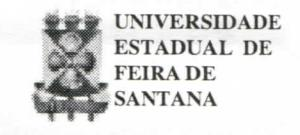
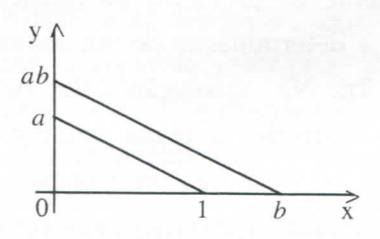
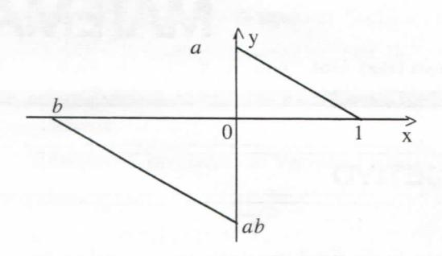
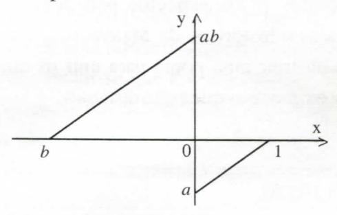
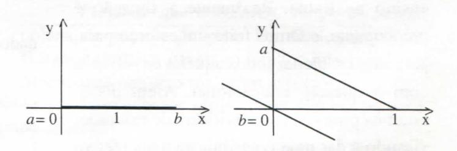
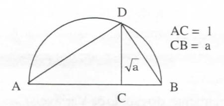

# FOLHETIM DE EDUCAÇÃO MATEMÁTICA

Folhetim Educ. Mat., Ano 7, n. 88, mar. 2000

ISSN 1415-8779

#### **OBJETIVO**

Este _Folhetim_ é um veículo de divulgação, circulação de idéias e de estímulo ao estudo e à curiosidade intelectual. Dirige-se a todos os interessados pelos aspectos pedagógicos, filosóficos e históricos da Matemática. Pretende construir uma ponte para unir os que estão próximos e os que estão distantes.

#### **EDITORIAL**

Temos a satisfação de informar aos nosssos leitores que recebemos várias manifestações a respeito do Folhetim nº 86, que tratou do ensino na Bahia. Realmente a situação é preocupante, e temos feito um esforço para, pelo menos, alertar todos aqueles envolvidos com a questão educacional. Além disso, estamos promovendo atividades de extensão, visando a dar uma contribuição mais efetiva para a melhoria do ensino, a exemplo do curso de atualização "A Matemática do Século XXI", inserido no projeto Pró-Ciências, cujo início está previsto para o próximo dia 11 de maio e visa atualizar professores da Rede Pública do Ensino Médio.

## COMITÊ EDITORIAL

Carloman Carlos Borges (Doutor) Inácio de Sousa Fadigas (Mestre)

#### PERGUNTE QUE O NEMOC RESPONDE

**Pergunta.** Neusa da Silva Peçanha A. dos Santos, de Uberlândia, deseja maiores explicações sobre _os três problemas clássicos_.

- R. Os três famosos problemas referidos pela leitora são:
- 1. Duplicação do cubo
- 2. Trissecção do ângulo
- 3. Quadratura do círculo

Parafraseando, podemos dizer que aos três problemas mencionados logo acima, correspondem, respectivamente, as seguintes construções:

- 1'. Construir o lado de um cubo cujo volume é o dobro de um cubo dado.
- 2'. Dividir um ângulo qualquer dado em três partes iguais.
- 3'. Contruir um quadrado com área igual à de um círculo dado.

Este é equivalente ao problema da retificação da circunferência, isto é, a determinação de um segmento de comprimento igual a 2π. Na resolução deles os gregos impunham a seguinte restrição: a régua empregada não deveria possuir marcas, ou seja, não serviria para efetuar medidas (uma régua sem escala!). Formulados nos séculos V/IV antes de Cristo, eles só foram resolvidos no século XIX. Diga-se de passagem: todos eles foram resolvidos negativamente, ou seja, foi provada a impossibilidade de sua construção - excetuando-se os casos de alguns ingênuos, de todas as idades, que ainda persistem na construção daqueles segmentos... Qual a razão de tanta demora? O intervalo temporal entre os séculos citados abrange mais de dois mil anos! Naquela época os gregos não possuiam a matemática capaz de os levarem à resolução definitiva desses problemas - como aconteceu no século XIX. A solução desejada somente seria

alcançada se os gregos criassem uma nova matemática e disto foram incapazes. Talvez entre eles não existisse nenhum Newton que, no século XVII, debatendo-se com dificuldades em problemas de Física, criou uma nova matemática, o Cálculo Diferencial e Integral. provavelmente a maior criação matemática de todos os tempos, ou as circunstâncias sociais eram desfavoráveis... Todos os três problemas clássicos (TPC) mencionados requerem a construção de segmentos com régua e compasso. Portanto, é pertinente saber quais segmentos podem ser construídos com esses dois instrumentos. Podem ser construídos com régua e compasso, dados um ou mais segmentos, s1, s2..., o segmento X, desde que estejam envolvidas nessas construções apenas as operações racionais - adição, subtração, multiplicação e divisão de quantidades conhecidas. Acrescente-se a essas quatro construções mais a extração da raiz quadrada: dado o segmento s, com régua e compasso pode-se construir √s. Abaixo, vamos tentar visualizar essas três últimas operações, já que as duas primeiras são triviais.

1. O produto de dois números positivos a e b, é um número positivo ab.

2. O produto de um número positivo _a_ por um número negativo _b_ é um número negativo _ab_.

3. O produto de dois números negativos, a e b, é um número positivo ab.

4. Se a e b são dois números reais tais que a = 0 ou b = 0, então ab = 0

(Veja RPM n° 42 - Operações com segmentos, segundo Hilbert, escrito por Claudia A. C. de Araújo).

Quanto à extração da raiz quadrada de um dado número <u>a</u>, veja a figura abaixo:

# NEMOC - NÚCLEO DE EDUCAÇÃO MATEMÁTICA OMAR CATUNDA

Folhetim Educ. Mat., Ano 7, n. 88, março 2000 - **Editores:** Carloman e Inácio - **Secretária:** Josenildes Oliveira Venas Almeida - **Editoração:** Evandro Vaz e Nivaldo de Assis - **Impressão:** Imprensa Gráfica Universitária - **Periodicidade:** mensal - **Tiragem:** 1.600 exemplares - _Distribuição gratuita_ - **Endereço:** Av. Universitária, s/n - km 03 - BR 116 - Campus Universitário - **Telefone:** (75)224-8115 - **Fax:** (75)224-8086 - CEP 44031-460 - Feira de Santana - Ba - BRASIL - **E-mai**l: nemoc@uefs.br

Para provar que $DC = \sqrt{a}$ , aplique a teoria de semelhança de triângulos.

Os números assim construídos são denominados de <u>números algébricos</u> e, de uma maneira mais formal: qualquer número que satisfaça a equação polinomial:

$a_n x^n + a_{n-1} x^{n-1} + ... + a_1 x + a_0 = 0, \ a_i \in \mathbf{Q}$ é chamado de número algébrico. Exemplos de números algébricos: $\sqrt{2}$ , i, $\sqrt[n]{a}$ . Qualquer número racional é algébrico, pois é solução da equação

$$a_n x^n + a_{n-1} x^{n-1} + ... + a_1 x + a_0 = 0.$$

Um número que não é algébrico é denominado número transcendente. Exemplos: os números $e, \pi$ . Demonstra-se que: tanto a soma como a multiplicação de dois números algébricos é um número algébrico. Além disso, sabe-se que todos os números construtíveis são algébricos, enquanto um número transcendente como o número π não pode ser construído com régua e compasso. A estratégia empregada pelos matemáticos para mostrar a impossibilidade das três construções exigidas pelos TPC foi transformar esses problemas geométricos em problemas algébricos. Excetuando a quadratura do círculo, que não depende de nenhuma equação algébrica de coeficientes racionais os dois outros foram traduzidos algebricamente, dando origem a equações algébricas de coeficientes racionais. Vejamos o problema da trissecção de um ângulo qualquer dado. Da Trigonometria, sabemos que

$$\cos 3x = 4 \cos^3 x - 3 \cos x$$
(I)

Vamos, pois, exibir um ângulo que não pode ser dividido em três partes iguais. Na equação ( I ), façamos $\cos 3x = \frac{1}{2}$ , isto é, $3x = 60^{\circ}$ ; vê-se imediatamente, que (I) se transforma na equação:

$\cos 3x = \frac{1}{2} = 4 (\cos 20^{\circ})^3 - 3 (\cos 20^{\circ})$ . Para $\cos 20^{\circ} = t$ , tem-se: $\frac{1}{2} = 4t^3 - 3t$ ou $8t^3 - 6t - 1 = 0$ $\iff (2t)^3 - 3(2t) - 1 = 0$ . Fazendo 2t = z, vem: $z^3 - 3z - 1 = 0$ (II). Quanto ao problema da duplicação do cubo, tem-se: $V_1 = a^3$ , sendo a a aresta do cubo, cujo volume V é naturalmente conhecido. Seja, agora, x a aresta do cubo, cujo volume V, seja o dobro de $V_1$ . Temse: $V = x^3 = 2a^3$ , isto é, $x^3 - 2a^3 = 0$ (III).

Vamos, agora, examinar mais detalhadamente. as equações II e III. Para isso citemos um importante resultado devido ao matemático francês Pierre Laurent Wantzel (1814-1848): A condição necessária e suficiente para que as três raízes de uma equação do terceiro grau, de coeficientes racionais, sejam construtíveis por régua e compasso é que uma delas seja racional. Esse teorema foi apresentado em um trabalho de apenas 7 páginas: Pesquisa sobre os meios de se saber se um problema de Geometria pode ser resolvido com régua e compasso. Esse trabalho foi publicado em 1837, e apesar de sua importância, é estranho que Wantzel não seja ao menos citado nos índices remissivos de livros como: História da Matemática, Carl B. Boyer, Introdução à História da Matemática, H. Eves, História Concisa das Matemáticas, de Dirk J. Struik. Apenas em História de las matematicas, de E. T. Bell são encontradas referências ao matemático citado. No Dicionário de Matemática, de Francisco Vera, Lexicon Kapelusz, ele écitado como o matemático que estabeleceu as condições necessárias e suficientes para a construção geométrica das raízes de uma equação algébrica de coeficientes racionais. A bem da verdade, deve-se acrescentar que Wantzel chegou ao resultado mencionado fundamentado nos trabalhos anteriores do italiano Rufini, do Norueguês Abel e do seu compatriota, o genial e sempre irascível Galois.

A equação II: $z^3 - 3z - 1 = 0$ , equivalente algébrico do problema da trissecção do ângulo, não possui raízes fracionárias (o coeficiente de $z^3$ é igual a um) e suas possíveis raízes racionais estão entre os divisores

de -1, que são ±1. Como nenhum desses números é raiz, conclui-se que a equação não possui qualquer raiz racional e, pelo teorema de Wantzel, é impossível a trissecção de um ângulo qualquer dado. O problema da duplicação do cubo, ao qual corresponde a equação algébrica

$$x^3 - 2a = 0$$
,

segue a mesma marcha, isto é, mostra-se que a equação $x^3 - 2a = 0$ não admite raízes racionais. Facilmente, mostra-se que $\sqrt[n]{2}$ é um irracional. Basta lembrar que o número $\sqrt[n]{a}$ , onde a e n são inteiros positivos, ou é irracional ou é um inteiro, no segundo caso, é a n-ésima potência de um inteiro. Esse fato é uma decorrência imediata do conhecido teorema:

Seja a equação polinomial:

$$a_n x^n + a_{n-1} x^{n-1} + ... + a_1 x + a_0 = 0, \ a_i \in \mathbf{Q}$$

Se esta equação tiver uma raiz racional, a/b, onde a/b é uma fração irredutível, então $\underline{a}$ será um divisor de $\underline{a}_0$ e $\underline{b}$ um divisor de $\underline{a}_n$ . Um lembrete: pode-se, claramente, considerar a aresta como unidade na medida de segmentos. Nesse caso, a equação correspondente a duplicação do cubo se transforma nesta outra:

$$x^3 - 2 = 0$$

Ainda, e de um modo mais geral, pode-se considerar o seguinte problema: dado o volume de um cubo , construir outro cubo cujo volume, seja m vezes o volume do cubo dado. A equação neste caso é $x^3$ - m=0 e esta equação terá raízes racionais somente quando m for o cubo exato de um número inteiro ou fracionário. Por exemplo, $m=27, \frac{64}{27}, \dots$ Quanto ao terceiro problema, o da quadratura do círculo, ele equivale à construção de um segmento $x=\sqrt{\pi}$ (estamos supondo a área de um círculo unitário que é igual a $\pi$ ; logo a sua quadratura consiste na construção de um quadrado de ladoigual a $\sqrt{\pi}$ ). Pelos resultados anteriores, a construção de um segmento, com régua e compasso, de tamanho igual a $\sqrt{\pi}$ é impossível, pois $\pi$ não é um número construtível e sim um número transcendente. A

transcendência do número $\pi$ decorre facilmente do seguinte teorema do matemático inglês Alan Baker: se x $não é nulo então pelo menos um dos números <math>x e e^x$ é transcendente.

Realmente, do estudo de Variáveis Complexas, sabemos que:

$$e^{i\pi} = -1$$
sendo $i = \sqrt{-1}$ .

Como o número -1 é algébrico, o mesmo acontece com o número $e^{i\pi}$ . Segundo o teorema de Alan Baker, o número $i\pi$ é transcendente. Como o número i é algébrico (solução da equação $x^2 + 1 = 0$ ) e o produto de dois números algébricos é um número algébrico, conclui-se que $\pi$ é um número transcendente. A impossibilidade de todas essas construções é devida não somente à restrição de que a régua seja não graduada como também à outra restrição, qual seja a de que o número de construções seja finito, pois, ao admitir-se o contrário, teremos esses três segmentos como limites de sucessões, com a impossibilidade considerada devidamente superada.

Pergunte que o NEMOC Responde é uma coluna de autoria do prof. Dr. Carloman Carlos Borges e objetiva atingir ao público interessado em Matemática nos seus múltiplos aspectos.

Caso o leitor queira fazer alguma pergunta escreva-nos.

# PRÓXIMO NÚMERO

Os três problemas clássicos (continuação).

## **NÚMEROS ATRASADOS**

Envie para cada folhetim um selo de postagem nacional de 1º porte. Dentro de no máximo quatro semanas, contadas a partir da data de recebimento do seu pedido, você estará recebendo os folhetins solicitados.

OBS.: É permitida a reprodução total ou parcial desse folhetim, desde que citada a fonte.
