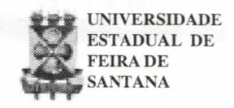
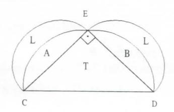

# FOLHETIM DE EDUCAÇÃO MATEMÁTICA

Folhetim Educ. Mat., Ano 7, n. 89, abr. 2000

ISSN 1415-8779

#### **OBJETIVO**

Este Folhetim é um veículo de divulgação, circulação de idéias e de estímulo ao estudo e à curiosidade intelectual. Dirige-se a todos os interessados pelos aspectos pedagógicos, filosóficos e históricos da Matemática. Pretende construir uma ponte para unir os que estão próximos e os que estão distantes.

#### **EDITORIAL**

Continuando o assunto do Folhetim anterior (nº 88), a coluna _Pergunte que o NEMOC Responde_ traz algumas informações complementares obre os três problemas clássicos. É oportuno lembrar estes problemas, principalmente pelos resultados produzidos durante esses mais de dois mil anos de formulação. Isso nos faz remeter também ao famoso teorema de Fermat, só solucionado por completo recentemente, após séculos de sua formulação.

Recentemente, um incentivo à pesquisa em Matemática foi dado através do anúncio da premiação à solução de 7 problemas em aberto, cem anos depois da apresentação de uma lista de 23 problemas pelo matemático alemão David Hilbert.

Esses prêmios fazem parte da comemoração do Ano Internacional da Matemática, decretado pela UNESCO.

# COMITÉ EDITORIAL

Carloman Carlos Borges (Doutor) Inácio de Sousa Fadigas (Mestre)

#### PERGUNTE QUE O NEMOC RESPONDE

Pergunta. Os três problemas clássicos (continuação). R. Claramente, há ângulos que podem ser divididos em três partes iguais com régua e compasso e, entre eles, os ângulos de 180°, 90°. Esse fato pode ser facilmente verificado pelo leitor: basta empregar a equação $\cos 3x = 4 \cos^3 x - 3 \cos x$ a qual se transformará em equações algébricas com coeficientes racionais do terceiro grau e com raízes racionais. Surge, agora, o problema de conhecer todos os ângulos que podem ser divididos em três partes iguais, com régua e compasso (sempre com as restrições mencionadas!). Isso exigiria o desenvolvimento da teoria dos corpos de racionalidade, assunto que poderá ser encontrado no excelente livro ¿Que Es La Matemática? de Richard Courant e H. Robbins, Editora Aguilar. Na trissecção do ângulo, a demonstração empregada foi a chamada "demonstração por contra-exemplo" - a qual muitas vezes é recebida com estranheza pelo aluno. É preciso, pois, que o professor o habitue a esse tipo de demonstração. Assim, com a exibição de um único exemplo, mostra-se que: a) a potenciação não é comutativa; b) a divisão não é associativa; c) dentro de R, a equação $x^2$ - 5x + 6 = 0 possui, ao menos uma raiz (basta exibir araiz 2). Se desejarmos, exemplificando, mostrar que a divisão por zero não é permitida, basta considerar:

$$0 \times 5 = 0 \times 7$$

"Dividindo" ambos os membros por zero, chegaremos ao "resultado" absurdo: 5 = 7. Essa falsidade ou absurdo surgiu da divisão por zero. Lembramos, aqui, que, na Lógica Clássica (aquela que emprega os princípios da Identidade, da Contradição e do Terceiro Excluído) é impossível, de uma proposição verdadeira $(0 \times 5 = 0 \times 7)$ deduzir uma proposição falsa (5 = 7). Retornando aos problemas clássicos. Vejamos, de mais perto, os dois problemas: trissecção do ângulo e duplicação do cubo. Como já vimos, ambos conduzem a equações do 3º grau. Além disso, são equações cúbicas irredutíveis sobre o corpo dos racionais. É essa irredutibilidade que "decreta" a impossibilidade dessas construções com régua e compasso. Como sabemos, diz-se que um polinômio p(x) pode ser fatorado sobre um determinado corpo, quando ele pode ser escrito como um produto de polinômios de grau maior que zero com coeficientes nesse corpo. Exemplos: a) x2-1 pode ser fatorado sobre os racionais pois $x^2$ - 1= (x - 1)(x + 1) e, por via de consequência, a equação x² - 1 = 0 não é irredutível sobre os racionais; b) o polinômio x2 - 2 é irredutível sobre os racionais, porém não o é sobre os reais, pois $x^2 - 2 = (x - \sqrt{2})(x + \sqrt{2})$ . Convém lembrar que expressões como 4x + 8 que pode ser escrita como 4(x + 2) não são levadas em conta nessa discussão, vez que 4 é um polinômio de grau zero. A expressão citada, assim, é irredutível sobre os racionais, os reais e os complexos. Quanto ao problema da quadratura do círculo, ele apresenta um perfil

diferente daqueles outros dois, pois, escapa a uma formulação algébrica. Desde o tempo de Arquimedes, milhares e milhares de tentativas foram feitas nessa direção. Lembro-me bem que, há poucos anos, apareceu na Universidade Estadual de Feira de Santana, um conhecido professor de Salvador, velhinho, com as mãos trêmulas, porém firme na sua conviçção de que teria solucionado esse problema... Na melhor das hipóteses, as soluções apresentadas eram aproximadas. Assim, quando vemos nos manuais escolares sobre desenho geométrico tópicos versando acerca de "divisão da circunferência em um número qualquer de partes". devemos ler: "divisão aproximada", pois, apenas para ilustrar, com esses dois instrumentos não se pode construir um heptágono regular. A razão? É simples: é a mesma que sustenta a impossibilidade da trissecção do ângulo e a da duplicação do cubo. Recai-se numa equação do terceiro grau de coeficientes inteiros, irredutível. Segundo Howard Eves, em Introdução à História da Matemática, Editora da Unicamp, o matemático grego Hipócrates de Quio, ao quadrar algumas de suas famosas <u>luas</u> - figuras em forma de lua limitadas por dois arcos de circunferência alimentou a esperança de também quadrar o círculo. Abaixo, damos exemplo de uma lua de Hipócrates que facilmente pode ser quadrada. Sobre os lados de um triângulo retângulo

## NEMOC - NÚCLEO DE EDUCAÇÃO MATEMÁTICA OMAR CATUNDA

Folhetim Educ. Mat., Ano 7, n. 89, abril 2000 - **Editores:** Carloman e Inácio - **Secretária:** Josenildes Oliveira Venas Almeida - **Editoração:** Evandro Vaz e Nivaldo de Assis - **Impressão:** Imprensa Gráfica Universitária - **Periodicidade:** mensal - **Tiragem:** 1.600 exemplares - _Distribuição gratuita_ - **Endereço:** Av. Universitária, s/n - km 03 - BR 116 - Campus Universitário - **Telefone:** (75)224-8115 - **Fax:** (75)224-8086 - CEP 44031-460 - Feira de Santana - Ba - BRASIL - **E-mai**l: nemoc@uefs.br

isósceles, tomados como diâmetros, traçaremos semicircunferências, as figuras L e L são chamadas de luas ou <u>lúnulas de Hipócrates</u>. Considerando que cada letra na figura representa também a área correspondente e aplicando o Teorema de Pitágoras em sua versão generalizada (se figuras semelhantes são construídas sobre a hipotenusa e sobre os catetos de um triângulo retângulo, então a área da figura maior - construída sobre a hipotenusa - é igual à soma das áreas das outras duas - construídas sobre catetos), temos

no triângulo retângulo isósceles CED, o semi-círculo construído sobre a hipotenusa CD, possui área igual à soma de A + B + T, que é igual à soma das áreas construídas sobre os catetos CE e DE: A + L + B + L.

$$A + B + T = A + L + B + L$$
, donde $T = 2L$

As três impossibilidades aqui discutidas são devidas às restrições impostas (régua sem escala e finitude das operações envolvidas). Como bem assinalam os historiadores, pode-se trisseccionar um ângulo qualquer com base em uma cônica. Isso foi feito por Papus (c.300 d.C). Outras curvas conseguem também o mesmo objetivo destacando-se a quadratriz, inventada por Hípias (c.425 a.C). Ela serve igualmente para quadrar o círculo. Essas mesmas observações se aplicam a espiral de Arquimedes. Outro matemático grego Menecmo (375-325), discípulo do grande Eudoxo demonstrou que a elipse, a hipérbole e a parábola

podiam ser empregadas na duplicação do cubo.

Antes do século XVII era desconhecido o fato de que problemas envolvendo apenas a régua levam, em linguagem algébrica, as <u>equações lineares</u> e problemas envolvendo o compasso levam a problemas que se traduzem algebricamente em <u>equações do segundo grau</u>. Como vimos anteriormente, os dois problemas: duplicação do cubo e a trissecção do ângulo são traduzidos algebricamente em equações do 3º grau, irredutíveis.

Acrescentemos mais algumas palavras sobre o mais famoso desses três problemas: a quadratura do círculo. Qual o primeiro problema colocado por esta questão? Naturalmente o de saber o que se compreende por área de uma figura não delimitada por segmentos de reta. O próprio Arquimedes calculou, com razoável aproximação, o valor do número $\pi$ inscrevendo e circunscrevendo polígonos regulares em um círculo, chegando ao cálculo dos polígonos de 96 lados, dando, então, por satisfeito ao constatar que o valor de $\pi$ se encontra entre $3\frac{10}{70}$ e $3\frac{10}{71}$ . Mas, veja bem, esse processo é um processo limite, isto é, um processo no qual intervem a infinidade e grandezas chamadas por alguns matemáticos de infinitesimais - o que não é permitido devido às restrições já mencionadas. Foi o próprio Arquimedes a reconhecer essa primeira dificuldade. O valor encontrado por esse grande sábio foi melhorado através dos séculos, destacando-se o achado pelo matemático francês Fançois Viéte (1540-1603) que usou um polígono de muito mais lados do que o calculado por Arquimedes, para chegar ao resultado de $\pi$ com 10

decimais corretas. No momento o valor desse número é conhecido com centenas e centenas de decimais corretas. No século XVIII, o matemático Johann Heinrich LAMBERT (1728-1777) demonstrou a irracionalidade de $\pi$ partindo do desenvolvimento de tgx em fração contínua. Em seguida, Legendre (1752-1833) mostrou que o número e não é raiz de uma equação do segundo grau com coeficientes racionais. Bastaria esse resultado para mostrar a impossibilidade da quadratura do círculo. Mas, como a esperança é a última que morre, o número $\pi$ , quem sabe?, poderia ser um número algébrico.

Em 1873, o matemático francês Charles Hermite mostrou a transcedência do número e; nove anos mais tarde o alemão Lindemann, estimulado pela descoberta de Hermite, demonstrou a transcendência do número π. A descoberta de novos objetos matemáticos (números trascendentes) e a riqueza interna de suas estruturas, os processos infinitesimais aí envolvidos, a postulação da existência do infinito acabado, atualizado, isto é, a tomada de consciência de todos os elementos de um conjunto infinito, logo no início da Teoria dos Conjuntos, por Cantor, incomodaram alguns matemáticos, principalmente aqueles que defendiam uma posição denominada de intuicionismo. Tobias Dantzig, em seu interessante livro: Número - A Linguagem da Ciência, Zahar Editores, assim retrata essa situação: "Entre esses ergueu-se a voz de Leopold Kronecker, o pai do intuicionismo moderno. Proclamando a natureza absoluta dos números naturais afirmou que o domínio natural, e o domínio racional imediatamente redutível ao mesmo, eram as únicas bases sólidas em que a Matemática podia se apoiar. 'Deus fez os números naturais, o resto é obra do homem' - é a famosa frase pela qual ele ficou mais conhecido para a posteridade. Essa frase lembra-me da piedosa senhora que dirigia uma comissão encarregada de uma nova igreja. O arquiteto que apresentou os projetos logo percebeu que a velha senhora levava o trabalho muito a sério. E seu protesto mais veemente foi contra os vidros coloridos especificados pelo projeto. Finalmente, em desespero, ele perguntou-lhe por que ela era contra os vidros coloridos coloridos. 'Quero meus vidros como Deus o fez'! - foi uma enfática resposta."

Pergunte que o NEMOC Responde é uma coluna de autoria do prof. Dr. Carloman Carlos Borges e objetiva atingir ao público interessado em Matemática nos seus múltiplos aspectos.

Caso o leitor queira fazer alguma pergunta escreva-nos.

## PRÓXIMO NÚMERO

A equação do 2º grau.

## **NÚMEROS ATRASADOS**

Envie para cada folhetim um selo de postagem nacional de 1º porte. Dentro de no máximo quatro semanas, contadas a partir da data de recebimento do seu pedido, você estará recebendo os folhetins solicitados.

OBS.: É permitida a reprodução total ou parcial desse folhetim, desde que citada a fonte.
