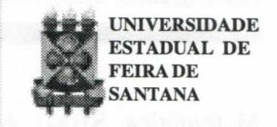
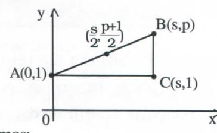
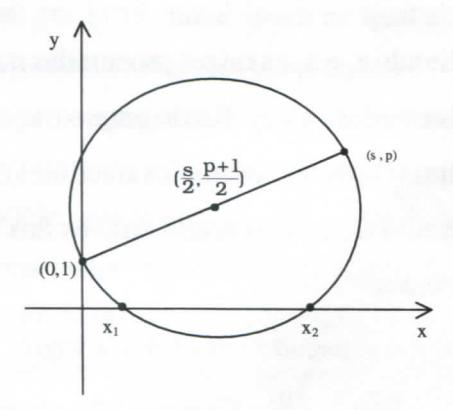
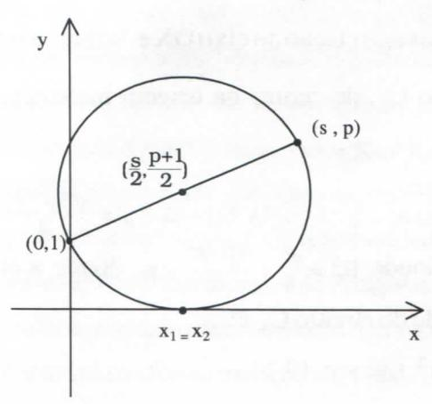
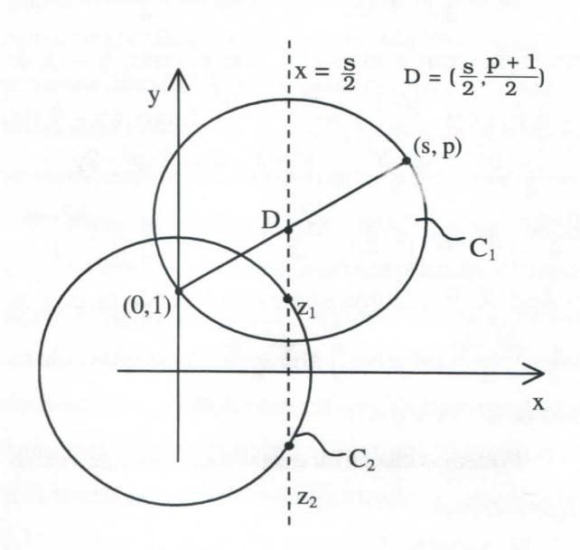
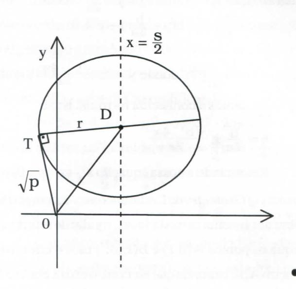

# **FOLHETIM DE EDUCAÇÃO MATEMÁTICA**

Folhetim Educ. Mat., Ano 7, n. 90, maio 2000

**ISSN 1415-8779**

#### OBJETIVO

Este _Folhetim é_ um veículo de divulgação, circulação de **ideias** e de estímulo ao estudo e **à** curiosidade intelectual. Dirige-se a todos os interessados pelos aspectos pedagógicos, filosóficos e históricos da Matemática. Pretende construir uma ponte para unir os que estão próximos e os que estão distantes.

### EDITORIAL

Nesse número, o professei Carloman Carlos Borges em sua coluna _"Pergunte que o Nemoc Responde",_ conta a história e faz aplicações da equação do 2° grau, o que além de proporcionar um enriquecimento do conteúdo, irá ajudar muitos professores de matemática em sua tarefa na sala de aula, pois tem-se observado que o ensino das equações do 2° grau tem se restringido praticamente à apresentação de fórmulas. A história tem vários aspectos interessantes, em virtude dos quais ela se constitui num tópico atraente para estudo e discussão entre alunos e professores de Matemática. Lendo este Folhetim teremos conhecimento, por exemplo, de que matemáticos babilónios por volta do ano 1700a.C. já conheciam regras para resolver equações do _2°_ grau, sob forma de problemas e que mais tarde os gregos aperfeiçoaram esse conhecimento demonstrando tais regras pela utilização de processos geométricos.

Enfim, este número traz uma explicação satisfatória para aqueles que querem entender melhor o assunto.

## COMITÉ EDITORIAL

Carloman Carlos Borges (Doutor) Inácio de Sousa Fadigas (Mestre)

## PERGUNTE QUE O NEMOC RESPONDE

**Pergunta.** Aline B. S. de Souza, de Aracaju, deseja maiores informações acerca da _equação do 2° grau,_ inclusive detalhes acerca da "fórmula de Báskara". tão badalada em nossos manuais escolares.

R. Quem não sentiu uma ponta de orgulho sobre seus próprios conhecimentos matemáticos quando conseguiu, pela primeira vez, resolver uma equação do 2° grau empregando a famosa "fórmula de Báskara"? Este matemático nasceu na índia em 1114c. e faleceu em 1185, numa época na qual ainda não existia aquilo que alguns historiadores denominam de "álgebra simbólica", isto é, o emprego generalizado de letras e símbolos matemáticos. Esse fato veio a acontecer com o matemático francês François Viete, que viveu de 1540 a 1603. Assim, a famosa fórmula resolvente não deve ser atribuída àquele matemático indiano. Problemas envolvendo equações quadráticas datam de milhares de anos (em tomo de quatro mil anos...) e podem ser encontrados na cultura babilónica, civilização que vicejou na antiga Mesopotâmia, região situada entre os rios Tigre e Eufrates, e onde hoje fica parte do Iraque. Pesquisas históricas recentes mostram que a matemática cultivada na Babilónia possuia um grau de sofisticação superior à praticada pelos egípcios, tão festejada em alguns livros de divulgação, provavelmente devido à construção das pirâmides.. .Alguns tabletes dessa cultura (a da Babilónia) mostram que eles, os babilónios, já sabiam que a diagonal de um quadrado é **V2** vezes seu lado - o que implica o conhecimento do célebre teorema de Pitágoras, mesmo em um caso particular e, segundo o historiador Asger Aaboe, eles usavam esse teorema em sua forma mais geral (Veja: _Episódios da História Antiga da Matemática,_ Coleção Fundamentos da

Matemática, SBM). As equações quadráticas eram resolvidas pelos babilónios em casos particulares porém, segundoessehistoriador, "as instruções sãotãoespecfficas que temos certeza do processo geral: e, após ter resolvido uma grande quantidade de problemas, não haverá nenhuma dúvida". Um dos mais antigos problemas da Matemática pode ser aquele que manda achar dois números, conhecidos sua soma s e seu produto g. Como os babilónios resolviam tal problema? Ora, nessa época a álgebra ainda se encontrava em seu primeiro estágiora álgebra retórica, quando os argumentos para resolver uma questão matemática eram escritos em prosa, sem abreviações ou símbolos específicos. Vejamos a tradução Uvre de um tablete da Babilónia antiga: "Somei a área e dois terços do lado do meu quadrado, e o resultado é 0;35. Tome 1, o 'coeficiente'. Dois terços de 1, o coeficiente, é 0;40. Metade disso 0;20, você muMpUcará por 0;20 (e o resultado), que é 0;6,40, você adicionará 0;35, e o (resultado), 0;41,40, tem raiz quadrada 0:50. MultipUque O ;20 por ele próprio e subtraia (o resultado) de 0:50, e 0;30 é o lado do quadrado "(os ponto-evírgulas fazem parte da tradução literal)". As intruções acima conduzem não apenas à equação

- I - 2/3x = 0,35 como permitem resolvê-la. (Vej a obra mencionada de Asger Aaboe). Para resolver o problema de achar dois números, conhecidos sua soma s e o seu produto a instrução era a seguinte: "Eleve ao quadrado a metade da soma, subtraia o produto e extraia a raiz quadrada da diferença. Some ao resultado a metade da soma. Isso dará o maior dos números procurados. Subtraia-o da soma para obter o outro número". Abaixo damos alguns métodospara aresolução desse problema. U m primeiro método é conhecido por "completando o quadrado". Ele é baseado no seguinte: todo polinómio quadrático ax^ -i- bx -i- c pode ser escrito na forma a[(x - q)^-I-r]. Exemplificando:

$$x^2 - 5x + 6 = (x - q)^2 + r = x^2 - 2qx + q^2 + r$$

identificando os polinômios, vem: $q = \frac{5}{2}e r = -\frac{1}{4}$ ; logo,  
 $x^2 - 5x + 6 = (x - \frac{5}{2})^2 - \frac{1}{4}$ .

Em nosso caso,
$$x^2 - sx + p = (x - \frac{s}{2})^2 - \frac{s^2}{4} + p = 0$$

U m outro método é o chamado "método de **Viete"** o qual consiste no seguinte: Seja ax^+bx -i- c=0, _a^O._ Faz-se x=u-f-v,uev incógnitas auxiUares, donde: a(u + v**)2** -I - b(u -I - v) -I - c = 0; _a(ii^ +_ 2uv -i- v^) + b(u -i- v)+ - I - c = O considerando o acima desenvolvido como uma equação em v, vem: av^ -i- (2au + b )v -i- au^-i- bu -(- c = 0. Anulando o coeficiente de v, isto é, 2au H- b = O, donde u = , obtem-se uma equação incompleta: av^ -l- ^(-â)' + b(-^ ) + c = O, donde: v^ = e v=±^^^^ ^ e (b^-4ac >0). Assim,X = u V = **\_ i + Vb^-4a: ~ 2a - 2a •**

Ainda pode-se resolver a equação do _2°_ grau ax^ -I - bx -1- c = O, tendo em conta que a equação a^x" + - I - a^x""' -h... + a^**j** X -t- a\_^ = O pode ser transformada numa equação do mesmo grau, sem o termo a^x"', fazendo-se a transformação x = y - — r (isso pode ser verificado

## **NEMOC - NÚCLEO DE EDUCAÇÃO MATEMÁTICA OMAR CATUNDA**

Folhetim Educ. Mat., Ano 7 , n. 90, maio 2000 - **Editores:** Carloman e Inácio - **Secretária:** Josenildes Oliveira Venas Almeida - **Editoração:** Evandro Vaz e Nivaldo de Assis - **Impressão:** Imprensa Gráfica Universitária - **Periodicidade:** mensal - **Tiragem:** 1.600 exemplares - _Distribuição gratuita -_ **Endereço:** Av. Universitária, s/n km 03 - BR 116 - Campus Universitário - **Telefone:** (75)224-8115 - **Fax:** (75)224-8086 - CEP 44031-460 - Feira de Santana - Ba - BRASIL - **E-mail:** nemoc@uefs.br

empregando apenas o binómio de Newton...). No caso da equação do 2° grau como a^ = b, a^ = a, n = 2 a transformação apropriada é x = y - ^ . Assim,

$$a(y - \frac{b}{2a})^2 + b(y - \frac{b}{2a}) + c = 0$$
e

$$y^{2} = \frac{b^{2} - 4ac}{4a^{2}} \text{ donde } y = \pm \frac{\sqrt{b^{2} - 4ac}}{2a}; \text{ como}$$

$$x = y - \frac{b}{2a}, \text{ temos a conhecida fórmula, isto é,}$$

$$x = \frac{b}{2a} \pm \frac{\sqrt{b^{2} - 4ac}}{2a}.$$

Retomando a nossa equação x^ - sx+p = O, nos _Elements ofGeometry_ de LesUe encontra-se a sugestão: "Sobre um sistema cartesiano retangular de referência marque os pontos A(0,1) e B(s,p). Trace o círculo de diâmetro AB e suponha que ele corte o eixo x em M e N . Mostre que as abscissas de M e N são as raízes da equação quadrática dada. A resolução desse importante problema agora inserido no texto foi-me sugerida pelo Sr. Thomas Carlyle, um jovem e engenhoso matemático, outrora meu aluno". (Veja Howard Eves: _Introdução à História da Matemática,_ Editora UNICAMP). Thomas Carlyle (1795-1881) foi um famoso escritor escocês que no início de sua vida fora professor de Matemática. Ele traduziu para o inglês a geometria de Legendre _(Elements de Géométrie)._ Sejam, pois, a equação x^ - sx + p =0 e os pontos A(0,1) e B(s,p). Então, o ponto médio do segmento AB é dado por D , o qual será o centro da circunferência desej ada.

Temos:

$$AC = |s|$$
; $BC = |p-1| e$

$$AB = \sqrt{AC^2 + BC^2} = \sqrt{s^2 + (p-1)^2}$$
; donde,

$$R = \frac{AB}{2} = \frac{\sqrt{s^2 + (p-1)^2}}{2}$$
(raio da circunferência)

Assim a equação dessa curva é:

$$(x - \frac{s}{2})^2 + (y - \frac{p+1}{2})^2 = \frac{s^2 + (p-1)^2}{4}$$
e sua

intersecção com o eixo OX, isto é, com, y = O, é:

$$(x - \frac{s}{2})^{2} + (0 - \frac{p+1}{2})^{2} = \frac{s^{2} + (p-1)^{2}}{4} \cdot \text{Logo}, (x - \frac{s}{2})^{2} = \frac{s^{2} + (p-1)^{2}}{4} - \frac{(p+1)^{2}}{4} = \frac{s^{2} + p^{2} - 2p + 1 - p^{2} - 2p - 1}{4} = \frac{s^{2} - 4p}{4}, \text{ donde: } \left| x - \frac{s}{2} \right| = \frac{\sqrt{s^{2} - 4p}}{2} \text{ e } x = \frac{s}{2} \pm \frac{\sqrt{s^{2} - 4p}}{2},$$

(s^ - 4p> 0). E a última expressão fornece os pontos M ( f-^^^ ,0)eN( 1 + ^í^^,0),osquaissãoa s raízes de x^ - sx + p = 0.

Podemos visualizar essa situação por intermédio da figura abaixo:

No caso das raízes seremiguais**,Xj =X2**,comona **equação**

x^ -4x + 4 = 0, teremos a figura:

Finalmente, quando as raízes são complexos conjugados

**Zj** = a + bi e z^ = a - bi, a figura correspondente é dada abaixo:

Sendo **Zj** e z^ as raízes procuradas no plano da variável complexa x + iy. Realmente, o traçado de C, é conhecido (veja os dois exemplos anteriores), enquanto que o círculo é encontrado através dos seguintes procedimentos:

seja a equação
$$x^2$$

- $sx+p=0$ ; logo:
  $$x = \frac{s \pm \sqrt{s^2 - 4p}}{2} \cdot \text{Como } s^2 - 4p < 0, \text{ suas raízes}$$
  são os complexos conjugados:

$$Z_1 = \frac{s}{2} + \frac{\sqrt{4p}}{2}$$
i e $Z_2 = \frac{s}{2} - \frac{\sqrt{4p}}{2}$ i, simétricos em relação ao eixo OX e "sobre" a reta $x = \frac{s}{2}$ . O círculo $C_2$ , de centro na origem intersecta a reta $x = \frac{s}{2}$ , em $Z_1$ e $Z_2$ :

$$|OA| = \frac{s}{2}$$
$|AZ_1| = |AZ_2| = \frac{\sqrt{4p - s^2}}{2}$  
donde $R^2 = \frac{s^2}{4} + \frac{4p - s^2}{4} = p$ , donde a equação procurada do círculo $C_2$ é:

$$x^2 + y^2 = p (I)$$

Aessemesmo resultado pode-sechegar traçando a tangente OT e considerando-a como raio do círculo C^.

_Pergunte que o NEMOC Responde é_ uma coluna de autoria do prof. Dr. Carloman Carlos Borges e objetiva atingir ao púbUco interessado em Matemática nos seus múltiplos aspectos.

Caso o leitor queira fazer alguma pergunta escreva-nos.

# PRÓXIMO NUMERO

_A equação do 2° grau (continuação)._

## NÚMEROS ATRASADOS

Envie para cada folhetim um selo **ae** postagem nacional de 1° porte. Dentro de no máximo quatro semanas, contadas a partir da data de recebimento do seu pedido, você estará recebendo os folhetins solicitados.

OBS.: É permitida a reprodução total ou parcial desse folhetim, desde que citada a fonte.
