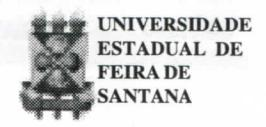
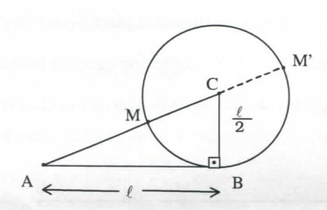
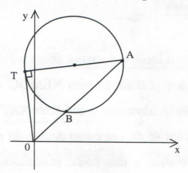

# FOLHETIM DE EDUCAÇÃO MATEMÁTICA

Folhetim Educ. Mat., Ano 7, n. 91, jun. 2000

ISSN 1415-8779

#### **OBJETIVO**

Este Folhetim é um veículo de divulgação, circulação de idéias e de estímulo ao estudo e à curiosidade intelectual. Dirige-se a todos os interessados pelos aspectos pedagógicos, filosóficos e históricos da Matemática. Pretende construir uma ponte para unir os que estão próximos e os que estão distantes.

#### **EDITORIAL**

Continuando o tema abordado no Folhetim anterior, a coluna Pergunte que o NEMOC Responde apresenta mais alguns aspectos interessantes a respeito das equações do 2º grau.

O artigo começa apresentando a relação ente o "número áureo" e as equações do 2º grau, e no final relaciona esse número com o método geométrico para solução das equações do 2º grau apresentado no _Folhetim_ anterior, quando se tratou das raízes que são complexos conjugados.

## COMITÊ EDITORIAL

Carloman Carlos Borges (Doutor)

Inácio de Sousa Fadigas (Mestre)

#### PERGUNTE QUE O NEMOC RESPONDE

Pergunta. A equação do 2º grau (continuação).

R. Na chamada "divisão em média e extrema razão" temos mais uma aplicação da equação do 2º grau, pois, dividir um segmento AB em média e extrema razão é dividi-lo em duas partes AM e MB tais que uma delas (no caso AM) seja média proporcional entre o segmento AB dado e a outra parte MB. Visualizando:

$$\begin{array}{cccccccccccccccccccccccccccccccccccc$$

$$\frac{AB}{AM} = \frac{AM}{MB}$$
(1). Calculemos o segmento áureo AM.

Como mostram a figura e a expressão (1) podemos escrever: $\frac{\ell}{x} = \frac{x}{\ell - x}$ , donde:

$$x^{2} + \ell x - \ell^{2} = 0 \quad (2) \quad e \quad x = \frac{-\ell \pm \ell \sqrt{5}}{2} \quad e$$

$$x_{1} = \frac{(\sqrt{5} - 1)\ell}{2} = 0,618\ell \quad e \quad x_{2} = \frac{(-\sqrt{5} - 1)\ell}{2} = -1,618\ell$$

Visualizando:

$$M'$$
$A$ $M$ $B$ $X_2$ $X_3$ $X_4$ $X_5$

Assim, o segmento AB foi dividido em média e extrema razão pelos dois pontos M e M': o primeiro o divide em duas partes (AM e MB) cuja a soma é AB; o outro (M') o divide em duas partes (AM' e M'B) cuja diferença é AB.

A construção geométrica do segmento áureo. Considerem a equação $x^2 + \ell x = \ell^2$ cuja dedução foi feita anteriomente. Completando o quadrado:

$$x^{2} + \ell x + \frac{\ell^{2}}{4} = \ell^{2} + \frac{\ell^{2}}{4}$$
, donde:  
 $(x + \frac{\ell}{2})^{2} = \ell^{2} + (\frac{\ell}{2})^{2}$

Agora, basta considerar $x+\frac{\ell}{2}$ a hipotenusa de um triângulo retângulo cujos catetos são $\ell$ e $\frac{\ell}{2}$ e traçar a figura:

A circunferência é traçada com centro no ponto Ce raio igual a $\frac{\ell}{2}$ . O segmento AM é o segmento áureo interno de AC e AM' é o segmento áureo externo também de AC. Deve-se observar que o número $\frac{(\sqrt{5}-1)\ell}{2}$ é o comprimento do lado do decágono regular inscrito em um círculo de raio $\ell$ . Considerem a equação $x = \frac{(\sqrt{5}-1)\ell}{2}$ ; daí, $\ell = \frac{2x}{\sqrt{5}-1}$ e, finalmente $\frac{\ell}{x} = \frac{1+\sqrt{5}}{2}$ .

$Esse\,n\'umero\,\'e,\,geralmente\,designado\,por\,\phi\,(em$ homenagem ao grande arquiteto grego Fidias) e seu valor

aproximado é 1,618. Ele desempenha uma certa importância no estudo das proporções, visto pelo seu aspecto estético. Alguns autores o chamam número de ouro.

As relações abaixo são notáveis e deixamos ao leitor o trabalho de demonstrá-las:

$$\begin{cases} \phi^2 = \phi + 1 \\ \frac{1}{\phi} = \phi - 1 \\ \phi^n = \phi^{n-1} + \phi^{n-2} \end{cases}$$

Retornando ainda à equação $x^2$ - sx + p=0, com suas raízes, $x_1$ e $x_2$ , cumprindo as condições:

$$x_1 + x_2 = s$$
(3)

$$x_1 \cdot x_2 = p$$
(4)

pode-se perguntar se existe outro par de números $x'_1 e x'_2$ que cumpra as condições (3) e (4). A resposta é negativa, pois, eliminando $x_1$ em (3) vem, conforme (4):

$$(s - x_2) x_2 - p = 0$$
ou  
 $x_2^2 - sx_2 + p = 0$ .

O estudo da chamada equação completa do $2^{\circ}$ grau $ax^2 + bx + c = 0$ ( $a \neq 0$ ) pode seguir a mesma marcha seguida no estudo da equação $x^2 - sx + p = 0$ , uma vez que aquela sempre pode ser reduzida a esta. Apenas a seguinte observação. Sabemos que:

# NEMOC - NÚCLEO DE EDUCAÇÃO MATEMÁTICA OMAR CATUNDA

Folhetim Educ. Mat., Ano 7, n. 91, jun. 2000 - Editores: Carloman e Inácio - Secretária: Josenildes Oliveira Venas Almeida - Editoração: Evandro Vaz e Nivaldo de Assis - Impressão: Imprensa Gráfica Universitária - Periodicidade: mensal - Tiragem: 1.600 exemplares - Distribuição gratuita - Endereço: Av. Universitária, s/n - km 03 - BR 116 - Campus Universitário - Telefone: (75)224-8115 - Fax: (75)224-8086 - CEP 44031-460 - Feira de Santana - Ba - BRASIL - E-mail: nemoc@uefs.br

$$\begin{cases} x_1 + x_2 = -\frac{b}{a} & (5) \\ x_1 \cdot x_2 = \frac{b^2}{4a^2} - \frac{b^2 - 4ac}{4a^2} = \frac{c}{a} & (6) \end{cases}$$

Ora, a fórmula (6) indica que o valor máximo do produto $x_1$ . $x_2$ de dois números de soma constante é alcançado quando $\Delta = b^2 - 4ac = 0$ , isto é, quando os dois números são iguais: $x_1 = x_2$ .

Uma simples aplicação desse fato é: entre todos os retângulos de igual perímetro o de área máxima é o quadrado.

A equação $ax^2 + bx + c = 0$ pode sempre ser escrita na forma $x^2 + \frac{b}{a}x + \frac{c}{a} = 0$ , vez que $\underline{a}$ é sempre diferente de zero. Assim, imediatamente, vemos que ela é o modelo para a questão: quais são os dois únicos números cuja soma $\underline{s}$ é $-\frac{b}{a}$ e seu produto $\underline{p}$ é igual a $\frac{c}{a}$ ? Ora, podemos, chegar ao resultado desejado, calculando a diferença:

$z = |x_1 - x_2|$ entre suas raízes, vez que é dada a sua soma $-\frac{b}{a}$ ; conseqüentemente:

$$z^{2} = x_{1}^{2} - 2x_{1}x_{2} + x_{2}^{2} = (x_{1} + x_{2})^{2} - 4x_{1}x_{2} = \frac{b^{2}}{a^{2}} - 4\frac{c}{a} = \frac{b^{2} - 4ac}{a^{2}} = \frac{\Delta}{a^{2}}, \text{ donde } z = \pm \frac{\sqrt{\Delta}}{a}.$$

Agora o problema se resume simplesmente em calcular dois números envolvendo sua soma e sua diferença. Exemplificando, resolver:

$$2x^2 - 6x + 4 = 0$$

Resolução: A equação dada é equivalente à:

$$x^2$$

- $3x$ + $2$ = $0$ , sendo $a$ = $1$ e $\Delta$ = $1$ ; logo $x_1$ - $x_2$ = $1$ . Combinando essa diferença com o fato já conhecido de que $x_1$ + $x_2$ = $3$ , chegamos ao resultado

desejado: $x_1 = 2 e x_2 = 1$ .

Outra alternativa na resolução de

$$ax^2 + bx + c = 0.$$

Multiplicando-a por 4a:

$4a^2x^2 + 4abx + 4ac = 0$ e "completando o quadrado"

$$(2ax + b)^2 - (b^2 - 4ac) = 0$$
(7)

Como $\Delta$ = $b^2$ - 4ac, pode-se escrever a expressão (7) como:

$$(2ax + b + \sqrt{\Delta})(2ax + b - \sqrt{\Delta}) = 0$$
\ne daí, concluir que: $2ax + b - \sqrt{\Delta} = 0$ , donde
$$x_1 = \frac{-b + \sqrt{\Delta}}{2a} \text{ ou } 2ax + b + \sqrt{\Delta} = 0, \text{ donde}$$

$$x_2 = \frac{-b - \sqrt{\Delta}}{2a}. \text{ Veja que a diferença entre as duas raízes}$$

$$x_1 - x_2 \text{ \'e igual a } \frac{2\sqrt{\Delta}}{2a} = \frac{\sqrt{\Delta}}{a} \neq 0, \text{ se } \Delta \neq 0.$$

No folhetim anterior vimos que, quando as raízes são complexos conjugados, pode-se chegar a este resultado, geometricamente, traçando-se dois círculos $C_1$ e $C_2$ , e considerando a tangente OT como raio do círculo $C_2$ (veja as últimas figuras naquele folhetim)

Sempre que OT = AB (secante ao círculo $C_1$ ) e tendo em vista que, $OT^2 = OA$ . OB (potência de um ponto em relação a um círculo), podemos escrever:

OA. OB-AB2 = 0 ou
$$OA [OA-AB] - AB^{2} = 0 \Rightarrow$$

$$\Rightarrow OA^{2}-OA. AB-AB^{2} = 0 \Rightarrow$$

$$\Rightarrow \left(\frac{OA}{AB}\right)^{2} - \left(\frac{OA}{AB}\right) - 1 = 0 \text{ ou}$$

$$x^{2} - x - 1 = 0, \text{ donde}$$

$$x = \frac{OA}{AB} = \frac{1+\sqrt{5}}{2} = \phi, \text{ o número de ouro.}$$

Quando a equação $ax^2 + bx + c = 0$ possui duas raízes distintas, deve-se evitar escrever

Recomendação:

$$x = \frac{-b \pm \sqrt{b^2 - 4ac}}{2a}, \text{ expressão que pode}$$

sugerir para x dois valores: $x = \alpha e x = \beta \neq \alpha$ . Neste caso,

escreve-se $x = \frac{-b + \varepsilon \sqrt{\Delta}}{2a}$ , com $\varepsilon = +1$ ou $\varepsilon = -1$ .

Deixa-se ao leitor a prova da seguinte proposição:

A condição necessária e suficiente para que a equação $ax^2+bx+c=0$ possua duas raízes iguais é que $\Delta=0$ .

## NOTÍCIAS

Por falta de espaço nos últimos _Folhetins_, não noticiamos a realização pelo NEMOC do curso de atualização "A Matemática do Século XXI".

Trata-se de um curso dentro do projeto Pró-Ciências-Bahia, e tem como conteúdos principais: Lógica Matemática e Conjuntos; Equações do 2º grau; Construções Geométricas; Cônicas; Funções e Gráficos; Trigonometria; Análise Combinatória e Probabilidade. O curso teve seu início no dia 17/05 mas, em virtude da greve dos professores da UEFS, iniciada no último dia 08/06, foi interrompido.

Folhetim Especial com um artigo do Professor Geraldo Ávila. Aguardem!!!

Pergunte que o NEMOC Responde é uma coluna de autoria do prof. Dr. Carloman Carlos Borges e objetiva atingir ao público interessado em Matemática nos seus múltiplos aspectos.

Caso o leitor queira fazer alguma pergunta escreva-nos.

### **COLUNA DO LEITOR**

Acatando a sugestão de alguns leitores, estamos abrindo esta nova coluna dedicada à comentários, críticas e sugestões. Aguardamos sua colaboração.

## PRÓXIMO NÚMERO

A Eficácia da Matemática, por Geraldo Ávila.

# **NÚMEROS ATRASADOS**

Envie para cada folhetim um selo de postagem nacional de 1º porte. Dentro de no máximo quatro semanas, contadas a partir da data de recebimento do seu pedido, você estará recebendo os folhetins solicitados.

OBS.: É permitida a reprodução total ou parcial desse folhetim, desde que citada a fonte.
