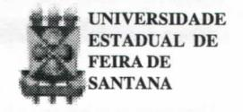
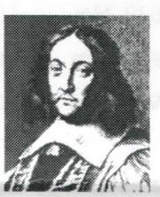

# **FOLHETIM DE EDUCAÇÃO MATEMÁTICA**

**Folhetim Educ. Mat., Ano 8, n. 93, ago. 2000 ISSN 1415-8779**

#### **OBJETIVO**

Este _Folhetim_ é um veículo de divulgação, circulação de ideias e de estímulo ao estudo e à curiosidade intelectual. Dirige-se a todos os interessados pelos aspectos pedagógicos, filosóficos e históricos da Matemática. Pretende construir uma ponte para unir os que estão próximos e os que estão distantes.

#### **EDITORIAL**

Com o n° 93 do nosso _Folhetim,_ chegamos a mais um ano dessa publicação, iniciando agora o oitavo ano. Queremos desde já agradecer aos leitores pela aceitação do nosso modesto trabalho.

Nessse número, o professor Carloman Borges começa a responder à indagação sobre o "Último Teorema de Fermat".

Não é uma tarefa fácil, escrever sobre tal assunto em mVel de divulgação que se pretende. Esperamos que o objetivo seja alcançado, e contribua para o entendimento dessa jóia da Matemática que é o Último Teorema de Fermat.

# **COMITÊ EDITORIAL**

Carloman Carlos Borges (Doutor) Inácio de Sousa Fadigas (Mestre)

#### **PERGUNTE QUE O NEMOC RESPONDE**

**Perçunta.** Josenildes Oliveira Venas Almeida, Av. João Durval Carneiro n° 150, Condomínio Parque Cajueiro, BI. 05, Apt° 202, Bairro Eucaliptos, Feira de Santana - Ba, indaga: _Em que consistem o Último Teorema de Fermat e a sua demonstração? >_

R. Pierre Simon de FERMAT nasceu em 1601 formando-se em Jurisprudência na cidade francesa de Toulouse, na qual desempenhou as funções de magistrado. Morreu no ano de 1665. **A** fl Algunshistoriadoresoconsideramcomoomaior

matemático amador de todos os tempos.Nessas condições ele é, também, considerado como um dos fundadores da Teoria dos Números, cujo objeto é o estudo das propriedades dos números inteiros. Em 1637, Fermat anotou na **MARGEM DO LIVRO** Aní/imeíícado matemático grego Diofanto: "nãoexistem inteiros positivos **X, y** , z, n onde n > 2, de modo que x" +**y "** = z°" . Esta era a famosa conjectura de Fermat, conhecida como "Último Teorema de Fermat" mesmo antes de ser demonstrada. Na margem daquele livro (tradução de Bachet ao lado do Problema 8 do Livro II, ele escreveu: "Dado um número quadrado, dividi-lo em dois quadrados. Dividir um cubo em dois cubos, uma quarta potência ou, em geral, uma potência qualquer, em duas potências da mesma denominação acima da segunda é impossível, e eu seguramente encontrei uma prova admirável desse fato, mas a margem é demasiado estreita para contê-la" _(Vide Introdução à História da Matemática,_ Howard Eves, Editora UNICAMP). Para n igual a dois, a conjectura de Fermat nada mais é do que uma versão do Teorema de

Pitágoras e, consequentemente admite uma infinidade de soluções, tais como 3^ + 4^ = 5^; 6^ + 8^ = 10^. Expliquemos o porquê do nome Último Teorema de Fermat (UTF). A palavra teorema diz respeito a uma proposição já demonstrada e seu emprego alusivo no UTF, antes de sua demonstração - denota um abuso de linguagem. A demonstração do UTF deu-se no ano de 1995; portanto, só a partir daí, justifica-se o termo teorema. Antes dessa data esse "teorema" era uma conjectura, isto é, um palpite... Quanto ao adjetivo constante do UTF explica-se: seu filho Samuel, após a morte de seu pai organizou toda correspondência matemática paterna, que foi publicada em 1670. Nos fins do século XVIII, todas as conjecturas propostas por Fermat haviam sido resolvidas, menos uma que teimava em continuar em aberto (o UTF). Outra designação para o UTF ainda é o Grande Teorema de Fermat. Pois bem, retomemos ao UTF: "não existem inteiros positivos x, **y,** z, n, n > 2, de modo que **X " + y** " = z ". Somente em 1995 o UTF foi demonstrado pelo matemático Andrew Wiles, professor de Princeton. Nesses 358 anos, o UTF desafiou as mentes mais brilhantes desses séculos. Leonhard Euler, o maior matemático do século XVIII teve que admitir sua própria derrota. E assim aconteceu com vários outros. Em 1993, decorridos 356 anos do desafio lançado por Fermat, Andrew Wiles sacode o mundo ao anunciar a sua demonstração. Logo depois, constatou-se um erro nessa demonstração que o fez retomar às pesquisas

por mais catorze meses quando finalmente, em 1995 termina de vez a sua demonstração, pelo que ganhou 50 mil Hbras da fundação Wolfskehl, nome de um famoso empresário alemão. Já que era tão difícil demonstrar o UTF, alguns estudiosos especulavam se a demonstração de sua falsidade não seria um caminho maisfácil. Ora, paramostrarafalsidade de uma conjectura basta exibir um contra-exemplo; no caso, seria suficiente encontrar um temo de inteiros positivos, x, **y** e z e um n maior que 2, tal que satisfizessem a relação **x°-i-y "** = z". Ninguém conseguia tal intento. Ante as duas impossibilidades (a) demonstrar a veracidade do UTF e (b) demonstrar a sua falsidade - aventou-se, então, a hipótese de que o UTF fosse uma proposição indecidível. Mas, que é uma proposição indecidível? Segundo os lógicos um enunciado E é decidível dentro de um determinado sistema se eles (os lógicos) possuem os procedimentos adequados para responder à dupla questão: i) E é demonstrável? ii) a negação de E é demonstrável? Exemplificando: 3 + 3 = 6 é decidível porque é possível demonstrá-lo dentro do sistema conhecido como a aritmética de nosso ensino fiindamental. 3 + 3 = 5 é igualmente decidível porque sua negação é demonstrável empregando-se as mesmas leis da aritmética usual. Portanto, se um enunciado não é demonstrável e sua negação tampouco o é, então ele é indecidível sempre dentro de uma determinada axiomática. A existência de enunciados indecidíveis foi devidamente provada por um famoso matemático

#### **NEMOC - NÚCLEO D E EDUCAÇÃO MATEMÁTICA OMA R CATUNDA**

**Folhetim Educ. Mat., Ano 8, n. 93, ago. 2000 - Editores: Carloman e Inácio - Secretária: Josenildes Oliveira Venas Almeida - Editoração: Evandro Vaz e Nivaldo de Assis - Impressão: Imprensa Gráfica Universitária - Periodicidade: mensal - Tiragem: 1.600 exemplares -** _Distribuição gratuita -_ **Endereço: Av. Universitária, s/n - km 03 - BR 116 - Campus Universitário - Telefone: (75)224-8115 - Fax: (75)224-8086 - CEP 44031-460 - Feira de Santana - Ba - BRASIL - E-mail: nemoc@uefs.br**

austríaco chamado Kurt Gõdel. Ele apenas provou a existência de tais enunciados sem exibi-los. Assim, alguns estudiosos aventavam a hipótese de o UTF ser um desses enunciados indecidíveis - o que claramente foi refutado por Andrew Wiles. A fim de continuarmos a nossa caminhada devemos ir até à cidade de Alexandria, no Egito; lá floresceu aquilo que ficou conhecido como a Escola de Alexandria, cujo ápice foi atingido no século III a.C. com Euclides, Arquimedes e Apolônio. No declínio dessa Escola, chamado por alguns estudiosos de a idade de prata e que vai de 250 a 350 de nossa era, surge Diofanto e Papus, aquele, o maior algebrista grego e este o último geômetra da Grécia antiga. Nessa época Alexandriaproduziu a notável obra _Arithmetica_ de Diofanto, tratado composto de treze livros, dos quais somente os seis primeiros sobreviveram. Seu assunto principal gira em tomo da resolução de equações algébricas com coeficientes inteiros. Essas equações algébricas com diversas variáveis, coeficientes inteiros, cujas soluções são números inteiros, são denominadas equações diofantinas. Exemplos simples de equações diofantinas: 3x+6y = 7 (consideramos sempre as variáveis inteiras) ex^+y^=z^ (de fácil solução, pois se trata do Teorema de Pitágoras). Já a equação x ^ **+ y** ^ = z ^, não possui solução afirmativa, isto é, não existem inteiros positivos **X, y,** z que a verifique, a qual pode ser traduzida pelo enunciado: encontrar três números inteiros x, **y** e z que verifiquem a relação x ^ **+ y** ^ = z ^. A resposta negativa foi provada pelo próprio Fermat. Euler provou a conjectura x - -i- **y** " = z ° para n = 3e n = 4de forma diferente daquela empregada por Fermat. Dirichlet, em 1828, conseguiu uma prova para n = 5 e Legendre, em 1930, o fez também. Lamé e Lebesgue conseguiram-no para n=7. Desta forma, duzentos anos após a sua formulação o UTF fora provado apenas para

os expoentes 3,4,5,6 e 7. Em termos computacionais, por volta de 1993, "provou-se" que o UTF persistia até o expoente de n = 4 milhões. Mas, a questão somente seria encerrada se alguém o provasse para qualquer inteiro n maior que 2. Com o pronome qualquer megulhamos no infinito. Que são quatro milhões perante o infinito? Metaforicamente, não chega a ser sequer uma gota d'água no oceano Atlântico... Antes de "chegarmos ao infinito", isto é, aprova de Andrew Wiles, retomemos às equações diofantinas. Não existe um tratamento unificado para as equações diofantinas. Talvez, com a demonstração de Wiles estejamos próximos a essa unificação. Equações diofantinas diversas costumam exigir métodos diferentes de abordagem e até mesmo verdadeiros truques na sua resolução. Em agosto de 19(X), no Congresso Internacional de Matemática, realizado em Paris, o matemático alemão David Hilbert apresentou 23 problemas - verdadeiros desafios à argúcia dos jovens matemáticos durante todo o decorrer do século. O décimo problema apresentado pelo grande matemático é o seguinte: dada uma equação diof antina com um número arbitrário de incógnitas e com coeficientes inteiros encontrar um procedimento que envolva um número finito de operações que permita decidir se a equação é solúvel nos inteiros. Esse problema ainda continua em aberto (sem solução) apesar de alguns resultados já alcançados nessa direção. Em 1970, o matemático russo Yuri Matiyasevi provou que há equações diofantinas indecidíveis. isto é, existem equações diofantinas perante as quais não temos sequer a possibilidade de mostrar que possuem soluções ou que não possuem soluções. Em 1982 James P. Jones, da universidade de Calgary, mostrou que nenhum algoritmo pode resolver as equações diofantinas com nove variáveis. A indecidibilidade pode ser encarada como uma barreira impenetrável

para o conhecimento humano... No que diz respeito a esse tipo de equações, os matemáticos podem assegurar apenas o seguinte: aquelas com três variáveis - graças ao resultado de Andrew Wiles - não são indecidíveis. E fora das equações diofantinas, existem enunciados indecidíveis? A resposta é afirmativa. O tão conhecido 5° Postulado de Euclides (em um plano, por um ponto fora de uma reta passa uma e somente uma paralela à reta dada) é um enunciado indecidível, considerando o sistema eucUdiano. Ainda mais: Paul Cohen, um matemático na época (em 1963)com29anosfoi "manchete" de jornais e revistas no mundo inteiro ao mostrar que a "hipótese do contínuo" era um enunciado indecidível. Mas, que é a "hipótese do contínuo"? Como sabemos, o conjunto dos números naturais: 1, 2, 3,... , n, ... foi criado para ajudar os homens e as mulheres nos problemas de contar os objetos. Na realidade, o conjunto N é uma idealização do problema da contagem. Assim, esse conjunto se encontra intimamente ligado ao problema de contagem. Contar significa enumerar, isto é, colocar os objetos em correspondência um-a-um com o conjunto N dos naturais ou com uma parte dele. O conjunto N, claramente, contém infirútos elementos: é um conjunto infinito como o é também o conjunto dos números reais, o conjunto dos racionais e outros mais. Os conjuntos cujos elementos podem ser contados são chamados de conjuntos enumeráveis. Exemplos de conjuntos enumeráveis: o conjunto cujos elementos são todos os números pares, o conjunto cujos elementos são todos os números ímpares, o conjunto dos números racionais e muitos outros. Um conjunto cujos elementos não podem ser enumerados é o conjunto dos números reais. Antes de Cantor, matemático criador da Teoria dos Conjuntos, todos os conjuntos infinitos eram considerados como equivalentes, isto é, tendo o "mesmo

número" de elementos. Costumava-se afirmar: já que dois conjuntos são infinitos, então nenhum é "maior" do que o outro... A partir de Cantor, isso mudou radicalmente. Ele estabeleceu uma hierarquia entre os vários tipos de conjuntos infinitos, criando, assim, os chamados números transfinitos. Dentro dessahierarquia os conjuntos enumeráveis são os "menores" entre os conjuntos infinitos. Por vários anos. Cantor tentou, sem obter sucesso, estabelecer a "hipótese do contínuo": entre o conjunto dos naturais e o conjunto dos reais, não existe um terceiro conjunto "maior" do que os naturais e "menor" do que os reais.» . \_^

_Pergunte que o NEMOC Responde é_ uma coluna de autoria do prof. Dr. Carloman Carlos Borges e objetiva atingir ao público interessado em Matemática nos seus múltiplos aspectos.

Caso o leitor queira fazer alguma pergunta cscrcva-nos.

### **PRÓXIMO NÚMERO**

_último Teorema de Fermat (continuação)._

# **NÚMEROS ATRASADOS j**

Envie para cada folhetim um selo de postagem nacional de 1° porte. Dentro de no máximo quatro semanas, contadas a partir da data de recebimento do seu pedido, você estará recebendo os folhetins solicitados.

OBS.: É permitida a reprodução total ou parcial desse folhetim, desde que citada a fonte.
