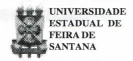
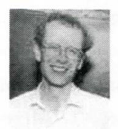

# **FOLHETIM DE EDUCAÇÃO MATEMÁTICA**

**Folhetim Educ. Mat., Ano 8, n. 94, set. 2000** 

**ISSN 1415-8779** 

### **OBJETIVO**

Este *Folhetim* **é** um veículo de divulgação, circulação de **ideias** e de estímulo ao estudo e **à**  curiosidade intelectual. Dirige-se a todos os interessados pelos aspectos pedagógicos, filosóficos e históricos da Matemática. Pretende construir uma ponte para unir os que estão próximos e os que estão distantes.

## **EDITORIAL**

Após as primeiras exposições sobre o Último Teorema de Fermat, no folhetim anterior, o prof. Carloman Carlos Borges continua sua explanação, de forma menos técnica, porém sem perder o obj eti vo principal que é mostrar o caminho percorrido para a demonstração fmal.

Ao final do artigo, algumas notas sobre Andrew Wiles são apresentadas. Percebe-se nelas a determinação e genialidade desse jovem matemático contemporâneo.

# **COMITÉ EDITORIAL**

Carloman Carlos Borges (Doutor) Inácio de Sousa Fadigas (Mestre)

#### **PERGUNTE QUE O NEMOC RESPONDE**

Pergunta. *Último Teorema de Fermat (continuação).* 

R. Para tomar a leitura menos "dolorida" possível, doravante vamos ser bastante informais. Há necessidade, agora, da introdução do que sejam as chamadas "curvas elípticas".

A expressão =x"\* -i- ax+b, cujos coeficientes a e b são inteiros representa aquilo que **é** denominado de curvas elípticas. Este último adjetivo se justifica pela sua conexão com as funções elípticas empregadas no cálculo de comprimentos de arcos de elipses. Em seguida lembramos que um movimento rígido é aquela transformação que movimenta o plano sem esticar nem encolher qualquer uma de suas partes. Se cada ponto do plano se translada duas unidades para a direita, então esse é um exemplo de um movimento rígido. Quando cada ponto do plano roda em tomo de um eixo imaginário, de um ângulo reto, essa transformação também serve de exemplo de um movimento rígido. Agora, é fácil imaginar que se um ponto específico de um plano sofrer uma sequência de translações e rotações, a esse ponto corresponderá um ponto para cada nova posição do plano. Consequentemente, tal seqiiênciade movimentos rígidos origina um conjunto de classes de equivalência, sendo cada uma delas distribuída para cada ponto do plano. É possível o estabelecimento de algumas conexões entre funções periódicas e movimentos rígidos. A essas funções periódicas dá-se o nome de funções modulares. Esse arrazoado, aparentemente complicado, pode ser clareado se você lembrar-se que as funções periódicas estudadas na Trigonometria de seno e coseno produzem uma nova curva, a nossa conhecida circunferência, cujos pontos são solução da equação -I- = 1. Lembre-se que essas duas funções, seno e co-seno descrevem um ponto cujas coordenadas x e y, satisfazem a equação da circunferência. A extensão dessa **ideia** ao plano complexo, com a geometria não euclidiana, serve para ilustrar o que seja uma curva modular elíptica. O estudo das curvas elípticas era um estudo pertencente à Teoria dos Números, enquanto que o estudo das funções modulares, dos movimentos rígidos eraum domíruo da Topologia, Geometria e Anáhse, com suas conhecidas aplicações na engenharia e na Física. Assim, de um lado existiam os especialistas em funções elípticas e do outro lado os especialistas em funções modulares, como se fossem dois campos inteiramente distintos. Então, dois jovens matemáticos japoneses Taniyama-Shimura conjecturaram: todas as curvas ehpticas estão ligadas àformas modulares. Estava, assim, formulada aquilo que passou a chamar-se Conjectura Taniyama-Shimura (CTS), recebida com espantos e reservas pela comunidade científica, embora conexões desse tipo sejam - se assim podemos nos expressar - um dos motores do desenvolvimento científico. O

estabelecimento de conexões entre domínios aparentemente tão distintos sinaliza a criatividade quer do cientista, que do artista. É marca indiscutível do criador. A ausência de tais conexões tomaria o desenvolvimento científico não apenas extremamente lento como o levaria a morte. A extraordinária unidade escondida pelos fenómenos vem sendo cada vez mais desvelada pelos estudiosos - para grandeza do ser humano. A CTS nos faz lembrar as famosas equações de Maxwell (1864) que unificam a Eletricidade e o Magnetismo, apoiando-se sobre as noções de Campo Elétrico o do Campo Magnético já introduzido pelo inglês Michael Faraday. Encerrando as leis fundamentais do Eletromagnetismo, essas equações continuam sendo de aplicação nas atividades humanas. Ao efetuar a conexão entre os campos, o elétrico e o magnético, Maxwell impulsionou vigorosamente o saber humano para além das fronteiras de sua época. Fato similar aconteceu com a CTS, pois, em seguida a ela Gerhard Frey e Ken Ribet fizeram outra conexão: ligaram a CTS ao Último Teorema de Fermat: se alguém mostrasse que toda equação elíptica é modular (esta é a *CTS),* então isto implicaria que o Teorema de Fermat estaria automaticamente demonstrado. Foi precisamente isso queomatemático Andrew Wilesfezem 1995 empregando

#### NEMOC - NÚCLEO DE EDUCAÇÃO MATEMÁTICA OMAR CATUNDA

FolhetimEduc.Mat., Ano 8, n. 94, set. 2000 - Editores: Carloman e Inácio - Secretária: Josenildes Oliveira Venas Almeida - Editoração: Evandro Vaz e Nivaldo de Assis - Impressão: Imprensa Gráfica Universitária - Periodicidade: mensal - Tiragem: 1.700 exemplares - *Distribuição gratuita -* Endereço: Av. Universitária, s/n - km 03 - BR 116 - Campus Universitário - Telefone: (75)224-8115 - Fax: (75)224-8086 - CEP 44031-460 - Feira de Santana - Ba - BRASIL - E-mail: nemoc@uefs.br

modernas técnicas matemáticas, inclusive algumas delas inventadas por ele próprio.

Agora, algumas divagações: Fermatteriamesmo conseguido - como escreveu à margem do livro Aritmética de Diofanto - demonstrar o seu Teorema? Tudo diz que não e mesmo se o fizesse, ele não encontraria, em qualquer parte do mundo livro algum cuja margem pudesse conter tal demonstração, pois Andrew Wiles em sua proeza gastou 200 páginas! É extremamente improvável que a demonstração de Fermat estivesse correta. Muitos especularam que Fermat teria fatorado a expressão x"-!- y''= z" no campo complexo, não atinando que aí a f atoração não é iínica como acontece quando se fatora nos inteiros. Aliás, esse mesmo erro foi cometido pelo grcinde matemático francês e não menos arrogante Cauchy. Lembre-se que, exemplificando:

$$16 = (1 + i\sqrt{15})(1 - i\sqrt{15}) = (3 + i\sqrt{7})(3 - i\sqrt{7})$$

Enganos desse tipo são comuns.

Ainda 
$$10 = 2.5 = (2 + i\sqrt{6})(2 - i\sqrt{6})$$

O primeiro produto apresenta os f atores primos 2 e 5 em C.

> Notarque **(2+V6i)** e **(2-A**/ã) sãoprimosem C. Fermat cometeu outros enganos.

Ao ler o livro do matemático polonês Waclaw Sierpinsk, "A selection of problems in the Theory of Numbers" tomamos conhecimento que em 1641, Fermat, numa carta aMersenne enunciou três proposições falsas:

L Nenhum primo da forma 12k +1 éum divisor de qualquer inteiro da forma 3" + 1.

Falso: o primo 12.5 **-f-** 1 =61 é um divisor do inteiro 3^ -t- 1 = 244, pois: 244 = 61.4.

n. Nenhum primo da forma 10k+1 éum divisor de qualquer inteiro da forma 5" + 1.

Falso: o primo 10.52+l=521 é um divisor do inteiro 5'+ 1 =3126, pois: 3126 = 521.6.

ni. Nenhum primo da forma lOk-1 éum divisor de qualquer inteiro da forma 5" -)-1.

Falso: o primo 10.3 - 1 = 29 é um divisor do inteiro 5' + 1 = 78126, pois: 78126 = 29.2694.

Acrescente-se mais o seguinte: para cada uma dessas três proposições, existe uma infinidade de primos para os quais cada uma dela é falsa. Encerramos este número com as próprias palavras de Andrew Wiles:" Eu tive o raro privilégio de conquistar, em minha vida adulta, o que fora um sonho da minha infância. Sei que este é um privilégio raro, mas se você puder trabalhar, como adulto, com algo que signifique tanto para você, isto será mais compensador do que qualquer coisa imaginável. Tendo resolvido este problema, existe um certo sentimento de perda, mas ao mesmo tempo há uma tremenda sensação de liberdade. Eu fiquei tão obcecado por este problema durante oito anos, pensava nele o tempo todo - quando acordava de manhã e quando ia dormir de noite. Isto é um tempo muito longo pensando só em uma coisa. Esta odisseia particular agora acabou. Minha mente pode repousar". •

*AndrewJohn* W/Zeí nasceu em 11 de abril de 1953 em Cambridge, Inglaterra. Seu interesse pelo "Último Teorema de Fermat" começou na juventude. Ele disse:... eM /m/iíJMn j *dez anos de idade e um dia aconteceu* 

*que eu estava na biblioteca pública local e encontrei um livro de matemática que contava um pouco da história desse problema, e numa linguagem que eu podia entender apesar da pouca idade. Daquele momento em diante tentei resolver sozinho, como um desafio, tão belo problema; esse problemafoi o Último Teorema de Fermat.* 

Em 1971, Wiles entrou no Merton College, Oxford, graduando-se com um bacharelado em 1974. Então entrou no Clare College Cambridge para fazer seu doutorado.

Wiles não trabalhou no Último Teorema de Fermat em seu doutorado. Ele disse:... *oproblemade trabalhar com o Teorema de Fermat é que você pode levar anos tentando em vão, e quando eu fiii para Cambridge meu orientador estava trabalhando com a teoria de Iwasawa das curvas elípticas e comecei a trabalhar com ela ... .* 

De 1977 até 1980, Wiles foi pesquisador júnior no Clare College, Cambridge e também professor assistente na Universidade de Harvard, EEUU. Em 1980, concluiu seu dourtorado e ficou uns tempos na Sonderforschungsbereich Theoretische MathematUc em Bonn. Retomou em 1981 aos EEUU para assumir um posto no Instituto de Estudos Avançados em Princeton. Entre 1985-1986 visitou o Institut des Hautes Etudes Scientifique em Paris e também à Ecole Normale

Supérieure em Paris.

Conhecendo a prova de K. Ribet que o Ultimo Teorema de Fermat segue da conjectura de Taniyama-Shimura de que curva elíptica definida sobre os números racionais é modular, Wiles abandonou todas as suas outras pesquisas, e por sete anos concentrou-se apenas na tentativadeprovaraconjectura de Taniyama-Shimura.

Em 1988, Wiles foi para a Universidade de Oxford onde ficou por dois anos como Royai Society Research Professor.

A trajetória da prova não foi tão suave quanto pode parecer e, em 1993, quando publicada, foi constatado um erro sutil, posteriormente resolvido. Foi publicado nos Annals of Mathematics em 1995. A partir daí, Wiles tem recebido prémios honrosos pelo seu feito. ^—'

*Pergunte que o NEMOC Responde é* uma coluna de autoria do prof. Dr. Carloman Carlos Borges e objetiva atingir ao público interessado em Matemática nos seus múltiplos aspectos.

Caso o leitor queira fazer alguma pergunta escreva-nos.

# **PRÓXIMO NÚMERO**

*Aguardem!* 

# **NÚMEROS ATRASADOS**

Envie para cada folhetim um selo de postagem nacional de 1° porte. Dentro de no máximo quatro semanas, contadas a partir da data de recebimento do seu pedido, você estará recebendo os folhetins solicitados.

OBS.: É permitida a reprodução total ou parcial desse folhetim, desde que citada a fonte.