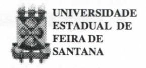

# FOLHETIM DE EDUCAÇÃO MATEMÁTICA

Folhetim Educ. Mat., Ano 8, n. 95, out. 2000

ISSN 1415-8779

### **OBJETIVO**

Este Folhetim é um veículo de divulgação, circulação de idéias e de estímulo ao estudo e à curiosidade intelectual. Dirige-se a todos os interessados pelos aspectos pedagógicos, filosóficos e históricos da Matemática. Pretende construir uma ponte para unir os que estão próximos e os que estão distantes.

### **EDITORIAL**

Não sendo uma ciência empírica, a matemática necessita da demonstração formal para validar seus resultados. Os métodos de demonstração portanto ganham uma importância vital dentro desta ciência. Este _Folhetim_, procura apresentar em um mesmo texto, as diversas formas de demonstração utilizadas na matemática, com exemplos de aplicação.

Esperamos que o artigo se preste, entre outras, para minimizar o pavor de alunos (e de professores também) quando se trata de demonstrar algumas afirmações em matemática.

# COMITÉ EDITORIAL

Carloman Carlos Borges (Doutor)
Inácio de Sousa Fadigas (Mestre)

## PERGUNTE QUE O NEMOC RESPONDE

**Pergunta.** Carlos Moreira S. da Silva, de Alagoinhas e muitos estudantes do curso de Licenciatura em Matemática nos indagam: _Como aprender a demonstrar em matemática?_

R. Quem ensina Matemática nos diversos cursos de licenciatura dessa ciência, não deixa de constatar esta coisa absurda: "os alunos de Matemática, na sua maioria, detestam demonstrações e aqueles que as fazem, fazem-nas com grande insegurança, pois não têm certeza se elas estão certas e, até mesmo se chegaram ao seu final". Mas, que é mesmo uma demonstração? Dentro de uma teoria 5, a elaboração de um enunciado verdadeiro a partir de outro suposto verdadeiro H, é chamada de dedução. Sempre que de H pode-se deduzir T. anota-se H⇒T. Isso significa dizer que a implicação H⇒T é verdadeira. Para chegar a T, usando H, empregamos o chamado raciocínio lógico, isto é, aquele que é justificado pelas regras da lógica usual (a lógica clássica). Mas, que é a lógica clássica? Para nosso propósito é a lógica baseada nos três princípios: I) Princípio da Não Contradição: p e não p não podem ser simultaneamente verdadeiros num mesmo contexto; II) Princípio do 3º Excluído: uma das duas proposições: p, ou não p, é verdadeira; III ) Princípio da Identidade: $p \leftrightarrow p$ (p equivalente a p, em nível de cálculo proposicional). As três formulações acima sofrem sérias restrições por parte dos lógicos, inclusive nas apresentações dadas - assunto que foge, repetimos, aos nossos propósitos. As demonstrações matemáticas são geralmente baseadas em tautologias. Que é uma tautologia? Considere a implicação $[p \land (p \Rightarrow q)] \Rightarrow q$ . Essa implicação é uma tautologia. Veja sua tabela-verdade:

| p   | q   | $p \Rightarrow q$ | $[p \land (p \Rightarrow q)]$ | $[p \land (p \Rightarrow q)] \Rightarrow q$ |
| --- | --- | ----------------- | ----------------------------- | ------------------------------------------- |
| V   | V   | V                 | V                             | V                                           |
| V   | F   | F                 | F                             | V                                           |
| F   | V   | V                 | V                             | V                                           |
| F   | F   | V                 | V                             | V                                           |

A última coluna contém apenas o valor lógico V; e isso caracteriza uma tautologia.

Aliás, a implicação acima, pela sua importância, recebe o nome de Modus Ponens e é de amplo uso na Matemática. Muitos teoremas da Geometria Elementar, aquela estudada no curso médio, podem ser demonstrados por intermédio dela. Exemplificando, seja a proposição p: dois lados de um triângulo são congruentes e seja q: os ângulos opostos a esses lados são congruentes. A proposição q salta à vista quando traçamos uma reta a partir do terceiro ângulo até o ponto médio do terceiro lado. Logo, pelo Modus Ponens podemos assegurar que a implicação $p \Rightarrow q$ é verdadeira. Assim, acabamos de demonstrar o teorema: "Se o triângulo ABC possui dois lados congruentes, então, os ângulos da base são congruentes. "Outro exemplo: p: 5 = 4. Subtraindo de ambos os membros 2 unidades, temos: 3=2. Adicionando membro a membro, vem a proposição q: 8 = 6. A implicação $p \Rightarrow q$ é correta, porém, como p é falsa, nada podemos saber sobre o valor lógico da proposição q, apenas baseado nessa implicação; nosso conhecimento da falsidade da proposição q não provém da veracidade da implicação em estudo, mas, sim, de outras fontes. Um segundo Método de Demonstração é baseado no Modus Tollens; isto é, na tautologia:

| p   | q   | ~ p | ~ q | $p \Rightarrow q$ | $[(p \Rightarrow q) \land \sim q]$ | $[(p \Rightarrow q) \land \neg q] \Rightarrow \neg p$ |
| --- | --- | --- | --- | ----------------- | ---------------------------------- | ----------------------------------------------------- |
| V   | V   | F·  | F   | V                 | F                                  | V                                                     |
| V   | F   | F   | V   | F                 | F                                  | V                                                     |
| F   | V   | V   | F   | V                 | F                                  | V                                                     |
| F   | F   | V   | V   | V                 | V                                  | V                                                     |

Seja a seguinte questão: "Se um número é ímpar, então seu quadrado é ímpar; $x^2$ representa um número par". Pergunta-se: que se pode afirmar sobre a paridade do número x? Pelo _Modus Tollens_, podemos afirmar que x é um número par, pois tem-se: p: x é um número ímpar; q: $x^2$ é ímpar; logo, a implicação $p \Rightarrow q$ é verdadeira (o quadrado de todo número ímpar é ímpar), a proposição $x^2$ é par é a negação de q; logo, pela Regra do Modus Tollens, podemos afirmar que x é par.

<u>3º Método de Demonstração</u>: <u>Disjunção</u> <u>de Casos</u>. É baseada na seguinte tautologia $[(p \Rightarrow q) \land \sim p \Rightarrow q)] \Rightarrow q]$ . Exemplificando: seja n um número natural; mostrar que $n^2 \neq 2$ . Sejam: $p: n \leq 1$ ; $\sim p: n \geq 2$ . Temos: Se $n \leq 1$ então, $n^2 \leq 1$ donde $n^2 \neq 2$ ; se $n \geq 2$ então $n^2 \geq 4$ , donde $n^2 \neq 2$ . Fica, assim, demonstrada a proposição $q: n \neq 2$ . Outro exemplo: sejam A, B e C conjuntos. Mostre que:

$$
\begin{array}{c}
A \cup B \subset A \cup C & (I) \\
A \cap B \subset A \cap C & (II)
\end{array} \Rightarrow B \subset C
$$

Demonstração: Seja x um elemento de B: Se $x \in A$ , então, $x \in A \cap B$ ; segundo (II), $x \in A \cap C$ ,

donde, $x \in \mathbb{C}$

Se $x \notin A$ , então, $x \in A \cup B$ ; segundo (I), $x \in A \cup C$ ; e como $x \notin A$ , $x \in C$ .

4º Método de Demonstração: O método que

# NEMOC - NÚCLEO DE EDUCAÇÃO MATEMÁTICA OMAR CATUNDA

Folhetim Educ. Mat., Ano 8, n. 95, out. 2000 - Editores: Carloman e Inácio - Secretária: Josenildes Oliveira Venas Almeida - Editoração: Evandro Vaze Nivaldo de Assis - Impressão: Imprensa Gráfica Universitária - Periodicidade: mensal - Tiragem: 1.700 exemplares - Distribuição gratuita - Endereço: Av. Universitária, s/n - km 03 - BR 116 - Campus Universitário - Telefone: (75)224-8115 - Fax: (75)224-8086 - CEP 44031-460 - Feira de Santana - Ba - BRASIL - E-mail: nemoc@uefs.br

vamos descrever serve para mostrar a irracionalidade de muitos números, inclusive a irracionalidade de certos valores de funções trigonométricas. Ele é fundamentado no seguinte teorema: se a equação algébrica $a_0 x^n + a_1 x^{n-1} + ... + a_{n-1} x + a_n = 0$ cujos coeficientes são números inteiros possui uma raiz racional $\frac{m}{n}$ ( $m \in n$ primos entre si), então o número mé divisor do número an e o número n é divisor do número an. Do enunciado acima fica claro que a equação: $x^n + a_1 x^{n-1} + ... + a_{n-1} x +$ + a = 0 de coeficientes inteiros, sendo a igual a 1, não possui raízes fracionárias e suas possíveis raízes racionais estão entre os divisores de a . Exemplificando: mostrar que a raiz quadrada de 2 é um número irracional. Temos $x = \sqrt{2}$ . Elevando ambos os membros ao quadrado, tem-se a equação x2-2=0, na qual seus coeficientes são inteiros e $a_0 = 1$ e $a_n = 2$ . Essa equação, portanto, não possui raízes fracionárias (pois a0 = 1) e suas possíveis raízes inteiras estão entre os divisores de 2, que são ±1 e ±2. A substituição direta desses números na equação revela que eles não podem ser raízes dela. Ora, a equação em foco não possui raízes inteiras e nem raízes fracionárias, logo suas raízes são irracionais, uma vez que ela possui raízes reais, pois sua construção partiu do número $\sqrt{2}$ que é uma de suas raízes. Outro exemplo: mostremos que o número $x = \sqrt{2} + \sqrt{5}$ é irracional. Construindo a equação correspondente chegamos na seguinte $x^4$ - $6x^2$ + 1 = 0, a qual não possui raízes fracionárias e suas possíveis raízes inteiras se encontram entre os divisores de 1. A substituição direta desses números na equação revela que nenhum deles é raiz, donde, a irracionalidade de $x = \sqrt{2} + \sqrt{5}$ . Finalmente, um terceiro exemplo: demonstraremos que cos 20° é um número irracional. Segundo fórmula da trigonometria tem-se:

$\cos 60^{\circ} = 4\cos^{3}20^{\circ} - 3\cos 20^{\circ}$ $\cos 60^{\circ} = 1/2 \text{ e fazendo } x = \cos 20^{\circ} \text{ nessa relação},$ obtemos a equação algébrica de coeficientes inteiros:

$$8x^3 - 6x - 1 = 0$$
ou $(2x)^3 - 3(2x) - 1 = 0$

Novamente, fazendo a transformação 2x = z, obtemos a equação equivalente $z^3$ - 3z - 1 =0 que não possui raízes fracionárias e suas possíveis raízes inteiras estão entre os divisores de 1: ±1. A substituição direta mostra que nenhum deles é solução dela; $\log_{10} x = \cos 20^{\circ}$ é um número irracional. Devemos observar que a fórmula do arco triplo dada acima não serve para calcular, por exemplo, cos10°, uma vez que a construção de uma equação de raiz $x = \cos 10^{\circ}$ leva a uma equação de 3° grau porém de coeficientes irracionais e não inteiros. Nesse caso e em outros similares, usa-se a seguinte observação: toda vez que o ângulo θ possui determinado valor tal que cos 2θ é um número irracional, então cosθ. senθ, tgθ são também números irracionais. Vejamos como tudo isso funciona. Primeiro: da Trigonometria sabemos que:

$$1 + \cos 2\theta = 2 \cos^2 \theta \qquad (I)$$

$$1 - \cos 2\theta = 2 \sin^2 \theta \quad (II)$$

$$1 + tg^2 \theta = 1/\cos^2 \theta \quad (III)$$

As três fórmulas acima são facilmente deduzidas como simples exercício trigonométrico. Assim, as fórmulas (I) e (II) derivam da fórmula: cos(a+b) = cosa.cosb --sena.senb, fazendo $a = b = \theta$ enquanto a fórmula (III) pode ser derivada da conhecida fórmula fundamental: $sen^2\theta + cos^2\theta = 1$ , dividindo-se ambos os membros por $\cos^2\theta$ . Mostremos, agora, a irracionalidade de $\cos 10^\circ$ . Jásabemos, pelo exemplo anterior que cos 20° é irracional, donde basta em (I) fazer θ igual a 10° para chegar à expressão: 1+cos20°=2cos210°. Examinando-se essa expressão notamos que: no primeiro membro aparece a soma de um número racional 1 com um número irracional que écos 20°, logo temos um número irracional (isso será demonstrado brevemente...). Se o primeiro membro de uma igualdade é um número irracional, claramente o segundo membro também o é. Assim, 2cos210º deve ser irracional. Como 2 éracional, cos 10° tem de ser irracional. pois se fosse racional ao ser elevado ao quadrado permaneceria racional e ao ser multiplicado por 2 continuaria racional. Ora, um número irracional (primeiro membro) não pode ser igual a um número racional. Conclusão: cos10° é um número irracional. (Lembre-se que um número racional diferente de zero - no caso 2-multiplicado por um irracional - no caso cos²10° - produz um número irracional. Isso, também será demonstrado logo mais). É claro que cos5° também é um número irracional, bem como sen5° e tg5°. O leitor é convidado para exercitar-se nessa direção.

5º Método de Demonstração: A Descida Infinita. Esse método é geralmente atribuído a Fermat, grande matemático amador francês do século XVII. Ele é uma consequência do Princípio do Menor Inteiro ou Princípio de Boa Ordem: qualquer conjunto C de inteiros positivos, diferente do vazio, deve conter um elemento mínimo m. Isso quer dizer que não se pode ter uma série infinita de números inteiros positivos decrescentes, pois ela sendo um subconjunto de inteiros positivos deve terum elemento mínimo. Se nosso referencial é o conjunto Q dos racionais positivos, temos a seguinte descida infinita: 50, 25, 25/2, 25/4,...25/2n. No conjunto dos naturais ficaria: 50, 25, e a descida (que não é infinita...) pararia em 25. Outro exemplo: em N, com a instrução dividir por 3, temos 810, 270, 90, 30, 10. A descida pararia em 10, pois 10/3 não pertence a N. Claro que em Qela seria infinita: 10/3, 10/32, ... 10/3n. Exemplifiquemos a aplicação da descida infinita para mostrar que $x = \sqrt{2}$ é um número irracional. Mais uma vez empregamos a demonstração por absurdo, a qual será tratada com detalhes mais adiante. Por enquanto, lembremos seu princípio: para demonstrar a verdade de uma proposição p, faz-se a hipótese de que $\sim p$ (a negação de p é verdadeira). Em seguida desenvolve-se uma cadeia de raciocínios lógicos que desemboca numa evidente contradição com $\sim p$ . Daí, e fazendo uso do princípio do 3º excluído, a

falsidade de $\sim p$ mostra a verdade de p. No caso específico da raiz quadrada de 2, temos: supõe-se que ela éracional, isto é: $\sqrt{2} = \frac{a}{b}$ (I)(a, b inteiros positivos, $b \neq 0$ , primos entre si).

Sabe-se que $\sqrt{2}+1=\frac{1}{\sqrt{2}-1}(II)$ ; substituindo (I) em (II): $\frac{a}{b}+1=\frac{1}{\frac{a}{b}-1}=\frac{b}{a-b}$ $\frac{a}{b}=\frac{2b-a}{a-b}$ (III). Ora, sabe-se que $1<\sqrt{2}<2$ (IV). Como $\sqrt{2}=\frac{a}{b}$ , (IV) fica: $1<\frac{a}{b}<2$ ou b<a<2b (V). De (V) vem: i) a>b, a-b>0 e ii) 2b-a>0; logo, a-b e 2a-b, são inteiros positivos iguais respectivamente a $a_1$ e $b_1$ , donde (III) passa a ser reescrita: $\sqrt{2}=\frac{a}{b}=\frac{a_1}{b_1}$ , com $a_1<a$ . Repetindo-se o processo, chega-se a: $\sqrt{2}=\frac{a_2}{b_2}$ , com $a_2$ inteiro positivo menor do que $a_1$ . Como o processo pode ser repetido, por iteração, indefinidamente, temos a "descida infinita": $a>a_1>a_2>a_3>...>a_n>...$ , o que é um absurdo. Logo $\sqrt{2}$ é irracional. $\bullet$

Pergunte que o NEMOC Responde é uma coluna de autoria do prof. Dr. Carloman Carlos Borges e objetiva atingir ao público interessado em Matemática nos seus múltiplos aspectos.

Caso o leitor queira fazer alguma pergunta escreva-nos.

# PRÓXIMO NÚMERO

Como aprender a <u>demonstrar</u> em matemática? (continuação).

# **NÚMEROS ATRASADOS**

Envie para cada folhetim um selo de postagem nacional de 1º porte. Dentro de no máximo quatro semanas, contadas a partir da data de recebimento do seu pedido, você estará recebendo os folhetins solicitados.

OBS.: É permitida a reprodução total ou parcial desse folhetim, desde que citada a fonte.
