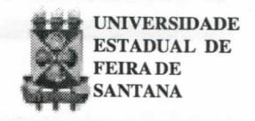
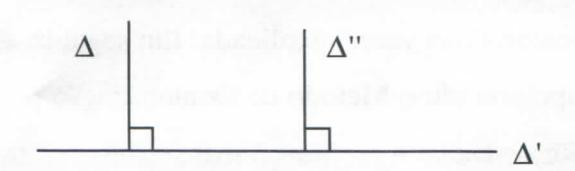

# **FOLHETIM DE EDUCAÇÃO MATEMÁTICA**

**Folhetim Educ. Mat., Ano 8, n. 96 nov. 2000**

**ISSN 1415-8779**

#### **OBJETIVO**

Este _Folhetim_ é um veículo de divulgação, circulação de ideias e de estímulo ao estudo e à curiosidade intelectual. Dirige-se a todos os interessados pelos aspectos pedagógicos, filosóficos e históricos da Matemática. Pretende construir uma ponte para unir os que estão próximos e os que estão distantes.

## **EDITORIAL**

Em prosseguimento à exposição dos métodos de demonstração em matemática, este _Folhetim_ traz outros métodos dedutivos. Apresenta mais um exemplo da Descida Infinita, cuj a exposição foi iniciada no _Folhetim_ anterior. Chamamos a atenção do leitor para a Demonstração por Absurdo, que é bastante utíUzada, sem que sua fundamentação lógica seja, na maioria das vezes, explicada. Em seguida, é apresentado o Método de Demonstração por Recorrência ou por Indução Matemática.

# **COMITÉ EDITORIAL**

Carloman Carlos Borges (Doutor) Inácio de Sousa Fadigas (Mestre)

#### **PERGUNTE QUE O NEMOC RESPONDE**

**Pergunta.** _Como aprender a demonstrar em matemática ? (continuação)._

**R.** Outro exemplo: o célebre Algoritmo de EucUdes para cálculo do máximo divisor comum entre dois inteiros a e b não conjuntamente nulos. Dos primeiros estudos escolares sabemos que existem e são únicos os inteiros q e r que satisfazem às condições a = bq -i- r e O < r < b.

A aplicação repetida do conhecimento desse fato, também denominado de algoritmo da divisão, produz as seguintes desigualdades:

$$\begin{aligned} \mathbf{a} &= \mathbf{b}\mathbf{q}_1 + \mathbf{r}_1 \;, \, 0 < \mathbf{r}_1 < \mathbf{b} \\ \mathbf{b} &= \mathbf{r}_1\mathbf{q}_2 + \mathbf{r}_2 \;, \, 0 < \mathbf{r}_2 < \mathbf{r}_1 \\ \mathbf{r}_1 &= \mathbf{r}_2\mathbf{q}_3 + \mathbf{r}_3 \;, \, 0 < \mathbf{r}_3 < \mathbf{r}_2 \\ &\dots \\ \mathbf{r}_{n-2} &= \mathbf{r}_{n-1}\mathbf{q}_n + \mathbf{r}_n \;, \, 0 < \mathbf{r}_n < \mathbf{r}_{n-1} \\ \mathbf{r}_{n-1} &= \mathbf{r}_n\mathbf{q}_{n+1} + \mathbf{r}_{n+1} \;, \; \mathbf{r}_{n+1} = \mathbf{0} \end{aligned}$$

Como sabemos que este processo chega realmente ao fim? Basta observar que O < r < r ,<... < r, < b forma uma **T n n-l 1** sequência estritamente decrescente de inteiros positivos, conjunto no qual, como já vimos, não há uma descida infinita. Desta forma, chegamos a um resto nulo e o primeiro resto anterior a ele é chamado de máximo divisor comum de a e b. No caso, r^ é o

máximo divisor comum de a e b. 6° Processo de Demonstração: Demontração por Absurdo. Esta é, provavelmente, a mais empregada de tod^as demonstrações matemáticas e, do ponto de vista do aluno, a mais absurda... Vamos tentar esclarecê-la. Em primeiro lugar, devese aceitar a tautologia

$$[(H \Rightarrow T) \Leftrightarrow (H \land \sim T) \Rightarrow f] \qquad (A)$$

A sua comprovação pode ser verificada por intermédio da _Tabela-Verdade_ e o seu uso vai ser, agora, ilustrado por vários exemplos. 1° exemplo: Sendo a um número racional e b um número irracional, então: i) c = a + b é irracional e c = ab (a dif. de zero) é, também irracional. Para (i) temos:

H
$$\begin{cases} a, \text{ racional} \\ b, \text{ irracional} \end{cases}$$
$T \{ c = a + b, \text{ irracional} \}$

$$H' = (H \land \neg T) \begin{cases} a, \text{ racional} \\ b, \text{ irracional} \\ \neg T, c = a + b, \text{ racional} \end{cases}$$

$$T' \begin{cases} f \end{cases}$$

Temos c = a + b=>c-a = b. Essa igualdade é falsa (absurdo), pois, no primeiro membro temos (c - a), um número racional, por hipótese, enquanto que no segundo membro, temos b, um número irracional. A demonstração de ii) é análoga. 2° exemplo: mostre que **x=V2**+V5 é irracional. Conforme a tautologia (A) , temos o seguinte esquema:

$$\begin{split} &H \; \big\{ \; x \! = \! \sqrt{2} \! + \! \sqrt{5} & T \; \big\{ x \; \text{\'e irracional}; \\ &H' \! = \! \big( \; H \land \sim T \; \big) \; \left\{ \begin{array}{l} x \! = \! \sqrt{2} \! + \! \sqrt{5} \\ \text{\'e racional} \end{array} \right. & T' \; \big\{ \; f \end{split}$$

Ora, se **x = V2**+V5, que por H' é racional, seu quadrado **x^** =7**+VlÕ** também é racional (o quadrado de um número racional é um número racional). Vimos, anteriormente que a soma de um número racional com um número irracional é um número irracional (7**+ViÕ)** ,como é raciouíil por H', ele não pode ser igual a 7+ **Vlõ**, que é irracional.

7° Processo de Demonstração: Demonstração porcontra-exemplo: Para mostrar que uma determinada proposição é falsa, basta a exibição de contra-exemplo. Mas, que significa a exibição de um contra-exemplo? As coisas se passam da seguinte maneira, do ponto de vista lógico: para mostrar que a imphcação*p=^q* não é tautologicamente verdadeira, basta exibir um exemplo que tome a negação da implicação, que é dada por (p A ~ q) verdadeira. A situação abaixo serve para ilustração: se n é divisível por 4 e por 6, então _n é_ divisível por 24. Temos a implicação:

$$(\forall n) [(4|n \land 6|n) \Rightarrow 24|n]$$

A suanegação (4136,6136e 24/36) é verdadeira. Logo, a implicação dadaé falsa (vej a, aqui, mais uma vez, a aplicação do terceiro excluído). 2° exemplo: veja a imphcação [(ac = bc) => (a = b)] (nos reais). Para mostrar sua falsidade basta mostrar que a sua negação, [(ac = bc) A (a ^ b)] é verdadeira exibindo números adequados. Nesse caso para a = 4, b = 2ec = 0 temos que (ac = bc) é verdadeiro, enquanto a = b é falso. 3° exemplo: Arelação "perpendicular" no conjunto das retas do plano: [(A \_L A') e (A' ± A")], então (A _1_ A"). AfigurinhaabaLxoé suficiente paramostrar que anegação dessa imphcação é verdadeira, donde, ela (a imphcação, é falsa).

# **NEMOC - NÚCLEO DE EDUCAÇÃO MATEMÁTICA OMAR CATUNDA**

Folhetim Educ. Mat., Ano 8, n. 96, nov.2000 - **Editores:** Carloman e Inácio - **Secretária:** Josenildes Oliveira Venas Almeida - **Editoração:** Evandro Vaz e Nivaldo de Assis - **Impressão:** Imprensa Gráfica Universitária - **Periodicidade:** mensal - **Tiragem:** 1.700 exemplares - _Distribuição gratuita -_ **Endereço:** Av. Universitária, s/n - km 03 - BR 116 - Campus Universitário - **Telefone:** (75)224-8115 - **Fax:** (75)224-8086 - CEP 44031-460 - Feira de Santana - Ba - BRASIL - **E-maO:** nemoc@uefs.br

8° Método de Demonstração: A Contrapositiva. Este tipo de demonstração é baseado na tautologia:

$$[(H \Rightarrow T) \Leftrightarrow (\sim T \Rightarrow \sim H)]$$

Exemplificando: considere o teorema: "se x^ é divisível por 5, então x também o é. Temos:

H: x^ é divisível por 5; Tese: x é divisível por 5; ~T: X não é divisível por 5; ~H: x^ não é divisível por 5. Podemos, pois, escrever a equivalência:

"x^ é divisível por 5, implica x também é divisível por5" <=^ "x não é divisível por 5, implica x^ também não é divisível por 5". Nesse caso, segue a seguinte arrumação:

~T
$$\begin{cases} x = 5n + r, \\ r = 1, 2, 3, 4 \end{cases}$$
~H $\begin{cases} x^2 = 5p + r, \\ r = 1, 2, 3, 4 \end{cases}$

Agora é considerar, separadamente, cada um dos quatro tipos de hipótese (~T) e verificar se, partindo daí, chega-se a um dos tipos representados pela tese (~H). 2° exemplo: Sejam A, B, e C três conjuntos, f uma aphcação de A dentro de B e g uma aphcação de B dentro de C. Demonstrar: se gof é injetora então f é injetora. No Teorema direto tem-se: H: gof é injetorae T: f é injetora. Então, podemos escrever: ~T: f não é injetora e ~H: gof não é injetora. Demonstração: se f não é injetora, então, por definição, existem em A dois elementos a e a^ com a mesma imagem y por f, donde se conclui que a e al terão mesma imagem g( y ) por gof, o que impUca a função composta ser não injetora.

9° Método de Demonstração: A Demonstração Construtiva. Esta demonstração é baseada nos princípios intuicionistas, recentemente ressurgidos com novaforça pelos trabalhos de Bishop, antigo professor da Universidade da CaUfómia, nos Estados Unidos da América do Norte. Em seu trabalho publicado em 1967, _Os Fundamentos das Matemáticas Construtivistas,_ Bishop apresenta-se com o firme propósito de mostrar que os resultados obtidos através dos métodos intuicionistas nada ficam a dever àqueles obtidos pelos formalistas. Sobre o intuicionismo. escreveremos mais adiante em Comentários Gerais. Agora, exemplo de uma demonstração construtivista. Seja o sistema de equaçãoes Uneares abaixo:

$$\begin{aligned} a_{11}x_1 + a_{12}x_2 + \dots + a_{1n} x_n &= b_1 \\ a_{21}x_1 + a_{22}x_2 + \dots + a_{2n}x_n &= b_2 \\ &\vdots \end{aligned} (I)$$

$$a_{n1}x_1 + a_{n2}x_2 + ... + a_{nn}x_n = b$$

no qual os a.. e os b. são constantes reais. Demonstremos o seguinte teorema: "Se b^ = b^ =... = b^ = O em (I ) e o determinante dos coeficientes é A = O, então o sistema ( I) tem uma solução diferente da trivial".

Demonstração para n = 2:

$$a_{11}x_1 + a_{12}x_2 = 0$$

$$a_{11}x_1 + a_{12}x_2 = 0$$

donde; a^a^^ - a^^aj^ = 0. Se a^^t O, = **12 11 =1.** é uma solução. Se ajj = 0 e a^j T^^O, = X2=l é uma solução. Se a^j = a^^ = O, x^ = 1 e x^ = O é uma solução. Outro exemplo: vamos mostrar de modo construtivo que existem infinitos números primos. Sejam: N = 2.3 -(- 1 = 7 (novo número primo); N = 2.3.5 **-I-** 1 = 31 (novo número primo). Quando N. não for primo, evidentemente ele conterá entre seus divisores, pelo menos um número primo não achado anteriormente. Para muitos ilustres matemáticos, a existência de um "objeto matemático" está associada a um método que permita a construção desse objeto. Dentro dessa perspectiva, a tão famosa demonstração "por absurdo" é rejeitada hminarmente.

10° Método de Demonstração: Demonstração por Recorrência ou por Indução Matemática. Ela diz respeito a uma forma proposicional na qual intervenha uma variável _n,_ inteiro natural. Para mostrar que a proposição p(«) é verdadeira é suficiente estabelecer: para n = 1 a proposição obtida é verdadeira; se, para todo inteiro _n_ a proposição p(n) é verdadeira, então ela é verdadeira para (n + 1), isto é, da veracidade de p(n) mostra-se a veracidade de p(n -l- 1). Se isso for possível, então a proposição em apreço, p (n) é verdadeira. Exemplo: Um torneio de xadrez tem «jogadores. Cada jogador joga uma partida, e uma só, contra todos os outros. Mostre que o número total de partidas do torneio é igual a (n -1 )n /2. Seja p(n) a proposição se a^ é o número de partidas jogadas num torneio com _n_ jogadores, então _= (n - \)nl2._ A proposição é verificada para _n =_ 1 (nenhuma partida) e « = 2 (uma só partida). Suponhamos que a proposição é verificada para n = 1,2, 3, _n ._ Mostremos, então que ela continua verdadeira para _(n +_ 1), isto é a^^, = _n(n +_ l)/2. Num torneio de (n -l-1) jogadores, temos as jogadas por «jogadores (a^) mais aquelas do _(n +_ l)-ésimo jogador. Logo podemos escrever: a^^, = a^+ _n._ Como, por hipótese a^ = (n - l)n / 2, obtemos a^^^ _=n(n+_ l)/2. Logo P(/í) é verdadeira para 77 > 1.

É um engano pensar que qualquer proposição na qual intervenha a variável inteira _n(n>0)_ possa ter a sua veracidade comprovada por esse método de demonstração. O exemplo abaixo ilustra o ponto em questão: sejaaproposição

$$P(n)$$
: $\frac{1}{9} + \frac{1}{25} + \dots + \frac{1}{(2n+1)^2} < \frac{1}{4}$

Com o emprego da indução; temos:

i) P(1):
$$\frac{1}{9} < \frac{1}{4}$$
, o que é verdadeiro,

ii) supondo a verdade de P(n), tentemos, daí, demonstrar a veracidade de P(« -l-1), isto é, supondo verdadeira a proposição

$$\frac{1}{9} + \frac{1}{25} + \dots + \frac{1}{(2n+1)^2} < \frac{1}{4}.$$

Como mostrar que:

$$\frac{1}{9} + \frac{1}{25} + \dots + \frac{1}{(2n+1)^2} + \frac{1}{(2n+3)^2} <$$

$$<\frac{1}{4}+\frac{1}{(2n+3)^2}$$
é verdadeira?

Esse exemplo mostra que nem sempre uma proposição na qual figura a variável inteira « (n > 0) pode ser demonstrada pelo método de Indução Matemática.»

### **NOTÍCIAS**

A UEFS, através do NEMOC, vai oferecer novamente à comunidade o _CURSO DE ESPE-CIALIZAÇÃO EM EDUCAÇÃO MATEMÁTICA._

#### _Inscrições:_

26 de dezembro de 2000 a 16 de janeiro de 2001.

#### _Informações:_

**PPPG: (75)224-8257; e-mail: pppg@uefs.br DEXA: (75)224-8086; e-mail: exa@uefs.br NEMOC: (75)224-8115; e-mail: nemoc@uefs.br**

_Pergunte que o NEMOC Responde é_ uma coluna de autoria do prof. Dr. Carloman Carlos Borges e objetiva atingir ao púbUco interessado em Matemática nos seus múltiplos aspectos.

Caso o leitor queira fazer alguma pergunta escreva-nos.

# **PRÓXIMO NÚMERO "**

_Como aprendera demonstrarem matemática ? (continuação)._

_Aguardem!_

# **NÚMEROS ATRASADOS**

Envie para cada folhetim um selo de postagem nacional de 1° porte. Dentro de no máximo quatro semanas, contadas a partir da data de recebimento do seu pedido, você estará recebendo os folhetins solicitados.

OBS.: É permitida a reprodução total ou parcial desse folhetim, desde que citada a fonte. -
