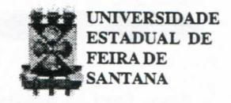
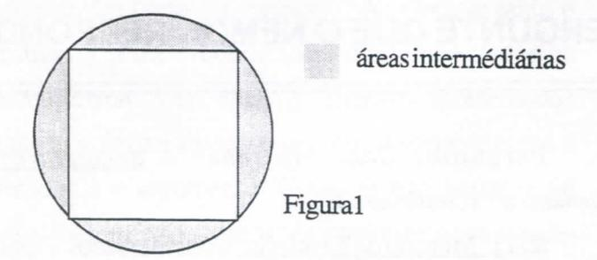
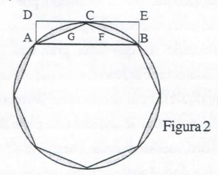

# **FOLHETIM DE EDUCAÇÃO MATEMÁTiCA**

**Folhetim Educ. Mat., Ano 8, n. 97, dez. 2000**

**ISSN 1415-8779**

#### **OBJETIVO**

Este _Folhetim é_ um veículo de divulgação, circulação de ideias e de estímulo ao estudo e à curiosidade intelectual. Dirige-se a todos os interessados pelos aspectos pedagógicos, filosóficos e históricos da Matemática. Pretende construir uma ponte para unir os que estão próximos e os que estão distantes.

#### **EDITORIAL**

Não poderíamos deixar de lembrar neste _Folhetim_ que esse ano é um marco para a maior parte dos povos, pois trata-se do encerramento de mais um século, e de mais um milénio.

Muitos avanços ocorreram na matemática durante o último século. Nós queremos lembrar que muitos dos resultados que hoje usamos, remontam até mais de dois milénios atrás. Um desses temas é tratado peloprof Carloman Carlos Borges na coluna _Pergunte que o NEMOC Responde._ Trata-se de um método de demonstração chamado "Método de Exaustão", prosseguindo assim a discussão do tema sobre demonstração em matemática, iniciado no Folhetim n° 95.

# **COMITÉ EDITORIAL**

Carloman Carlos Borges (Doutor) Inácio de Sousa Fadigas (Mestre)

#### **PERGUNTE QUE O NEMOC RESPONDE**

**Pergunta.** _Como aprender a demonstrar em matemática? (continuação)._

R. 11° Método de Exaustão: Consideremos o seguinte problema: "São dados dois círculos C e c, de áreas A e a, e a diâmetros D e d. Provar que = ^ ".

Nessa prova empregamos os pré-requisitos: i) Lei de Tricotomia: todo número realx ou é maior do que zero ou menor do que zero ou é nulo; ii) sendo _p^_ e áreas de polígonos ' regulares inscritos nos círculos c e C, um conhecido teorema afirma: =**~ 2** ; iii) duas reduções ao absurdo. O método a ser empregado é o histórico Método de Exaustão, por muitos historiadores creditado ao matemático grego Eudoxo (c.370 a.C). Ele parte do postulado de que uma grandeza pode ser subdivididaindefinidamentee se fundamentana proposição: "Se de uma grandeza qualquer subtrai- se uma parte não menor do que sua metade, do restante subtrai-se também uma parte não menor que sua metade e assim, sucessivamente, chegar-se-á finalmente a uma grandeza menor do que qualquer outra pré-determinada da mesma espécie". No caso particular do teorema que vamos a demonstrar, ele diz que, se no círculo _C_ (ou no círculo c) de área A (ou de área a) inscrevermos um quadrado e formos duphcando seus lados chegaremos à desigualdade A-P^< 8 (ou a-p^<E), sendo £ > O uma grandeza positiva pré-determinada. Exaurir significa esgotar. Logo, se no círculo Cé inscrito um quadrado, pode-se afirmar que exaurirmos da área A uma área igual a área do quadrado inscrito que é igual a 2R^. É como se a área do círculo ficasse reduzida às áreas intermediáreas, isto é, aquelas

áreas fora do quadrado, porém dentro do círculo. Por isso é que se afirma que houve uma destruição ou exaustão de uma parte da área do círculo, agora reduzida às áreas intermédiárias (veja figura 1 abaixo).

Quando duplicamos os lados do quadrado, temos inscrito no círculo C, um octógono de área igual a $\frac{3}{2}$ R $^2$ $\sqrt{3}$ ; conseqüentemente, a área do círculo, agora reduzida novamente a novas áreas intermediárias, irá decrescendo e, pela proposição na qual é baseada o Método de Exaustão, pode-se afirmar que chegaremos à expressão A - $P_n$ < $\epsilon$ para $\epsilon$ > 0 fixado (veja a figura 2).

Um pequeno parênteses, para vermos mais de perto o que acontece quando inscrevemos em C um quadrado e, em seguida um octógono. No primeiro caso

temos: $\pi R^2 - 2R^2 = R^2[\pi - 2]$ e no segundo caso $\pi R^2 - \frac{3}{2}R^2\sqrt{3} = R^2[\pi - \frac{3}{2}\sqrt{3}]$ . Supondo R unitário, essas duas diferenças são aproximadamente iguais a 1,14 e 0,55.

Será que ao inscrevermos um quadrado no círculo C, de sua área A estamos subtraindo uma parte não menor do que sua metade, como é exigido logo no início da famosa proposição acima? Claramente, a resposta é afirmativa, pois a área do quadrado inscrito é igual à metade da área do quadrado circunscrito, que por sua vez é maior que a área do círculo C. E ao inscrevermos o octógono (veja figura 2) estaremos subtraindo do que sobrou da área de Capós a inscrição do quadrado uma parte não menor do que metade (metade do que sobrou da área de C!) como prescreve aquela mesma proposição? A resposta, mais uma vez é afirmativa, pois a área do triângulo ABC é igual à metade da área do retângulo ABED que por sua vez é maior do que a área do segmento circular ABFCG. Logo, a área do octógono regular inclui a área do quadrado inscrito e mais a metade da diferença entre a área de C e a do quadrado inscrito. O processo pode ser estendido: em cada lado do octógono pode-se construir um triângulo do mesmo modo como foi feito com o triângulo ACB, obtendo-se, assim, um hexadecágono regular que inclui a área do octógono e mais da metade da diferença entre a área de C e a do octógono. Esse processo não tem fim ... Demonstraremos, finalmente, o teorema enunciado nas primeiras linhas acima, isto é,

#### NEMOC - NÚCLEO DE EDUCAÇÃO MATEMÁTICA OMAR CATUNDA

Folhetim Educ. Mat., Ano 8, n. 97, dez. 2000 - Editores: Carloman e Inácio - Secretária: Josenildes Oliveira Venas Almeida - Editoração: Evandro Vaz e Nivaldo de Assis - Impressão: Imprensa Gráfica Universitária - Periodicidade: mensal - Tiragem: 1.700 exemplares - Distribuição gratuita - Endereço: Av. Universitária, s/n - km 03 - BR 116 - Campus Universitário - Telefone: (75)224-8115 - Fax: (75)224-8086 - CEP 44031-460 - Feira de Santana - Ba - BRASIL - E-mail: nemoc@uefs.br

a ^ = ^ . Pela Lei da tricotomia, para o número real _x_ vale apenas uma das três alternativas: ou é igual a zero, ou é maior do que zero ou é menor do que zero. Se provarmos que as duas últimas alternativas levam a um absurdo, então fica demonstrado o teorema. a . a d= Suponhamos.poisque (istoéJ :=-^-^<0 ) ; a então existe uma grandeza A' < A, tal que = ^ . Seja A - A' = 8 > O a grandeza prefixada. Vamos inscrever em C e c poKgonos regulares de área e _P^._ Como já vimos, ao dobrarmos o número de lados estaremos subtraindo das áreas intermediárias mais da metade. Após umnúmero suficiente de duplicações, o princípio de exaustão assegura a existência da desigualdade A - < 8. Como A - A' = 8, tem-se A - P < A - A' donde _P >_ A'. Do fato de ^ = í - e **" 2** " Er suposto que: - ^ = ^ , podemos escrever de _P^ >_ A', se conclui que > a, o que é um absurdo, visto que _p^éa_ área de um polígono inscrito em c, de áreaigualaa.Conclusão:dofatodetanto como a d^ (verificar!) conduzirem a dois absin-dos, a d^ concluímos que = ^ • Pode-se empregar esse mesmo método na prova de proposições tais como: i) a razão entre cones e cilindros de mesma altura é igual à razão entre suas bases; ii) qualquer cone é a terça parte do cilindro que tem a mesma base e igual altura. Não é difícil concluir que o Método de Exaustão contém já os germens do que hoje conhecemos como Cálculo Integral, pois neles estão subj acentes as grandes ideias matemáticas de aproximação e de limite. Eudoxo, o suposto criador desse método, o aplicou para provar que o volume de um cone de revolução é o terço do

volume do cilindro com a mesma base e a mesma altura.

No século **XVn,** o emprego de coordenadas permitiu uma ampla generalização do método de exaustão.

Comentários Gerais: o saber matemático é organizado com os recursos da Lógica Matemática e entre estes assumem papel de destaque os métodos demonstrativos. Ademais, uma demonstração possui também a finalidade de convencimento: é através da demonstração que se consegue alcançar a certeza (o oposto da dúvida) quanto à veracidade de uma proposição matemática que não seja postulada. Essa dupla finalidade da demonstração deve ser levada em conta pelo professor. Infelizmente, quando o assunto é a lógica, temos duas alternativas: os livros escritos pelos lógicos, geralmente inacessíveis aos não especialistas e os manuais escolares, geralmente cheios de tolices que se perpetuam de autor para autor. Passemos a um exemplo bem ilustrativo: o emprego do condicional: "Se... então ...".O objetivo precípuo do condicional é o de formar sentenças. Por exemplo: dadas as sentenças "chove" e "a terra está molhada", temos a sentença composta: "Se chove, então, a terra está molhada". Operando sobre duas ou mais sentenças, o condicional forma uma terceira sentença.O "nexo"entre as sentenças simples denominadas de "atômicas"é irrelevante. Assim, das duas sentenças atómicas: "o ovo é quadrado" e "o sol existe", pode-se formar uma terceira sentença: "Se o ovo é quadrado, então, o sol existe", a qual não deixa de despertar grande mal-estar. A matemática não tem qualquer interesse em tais combinações de sentenças, pois ela se preocupa com argumentos, isto é, sequências finitas de proposições (sentenças) de determinada linguagem:

$$a_1, a_2, a_3, \dots, a_n, a_{n+1}$$

As _n_ primeiras proposições são chamadas de premissas, e a última, é a conclusão do argumento em questão. A confusão entre o condicional (que é um operador) e um argumento - que é uma seqiiência finita como definido acima é muito grande, não só entre os estudantes como em muitos manuais escolares. Mas, de onde provém tamanha confusão? A resposta: tanto o argumento como o condicional são apresentados na mesma forma: "se _p,_ então _q"._ Embora apresentados na mesma forma toma-se urgente distinguir entre o operador e o argumento. Como se não bastasse tal confusão, muitos colegas ainda introduzem novas palavras: "implicação material"e "implicação formal". Com "implicação material" eles se referem ao condicional e com "implicação formal", se referem ao argumento, como se a palavra argumento não fosse bastante elucidativa. Outros, aindamais sofisticados, introduzem, "condicional filônico"e "condicional diodórico" para, respectivamente, "implicação material" e "implicação formal". Tal discussão, pertinente, em um livro especializado de Lógica, nada acrescenta, numa sala de aula, da qual deve ser banida em nome da saúde mental de nossos alunos, muitos ainda adolescentes. A palavra implicação - é o nosso entendimento - deveria ser empregada quando se tratasse de um argumento e não para o condicional. Examinemos o teorema relativo à equação x^ + px -i- q = 0: "Se suas raízes são x, = a + ib, x^ = a - ib e**X 3** = c, b **9^** O, então A > O". A sentença acima, embora apresentada em forma de condicional, não o é, pois trata-se de um argumento cujas "premissas imediatas" são: x^ -1- px -t- q = O, **X j** = a -t- ib, x^ = a - ib e**X 3** = c e cuja conclusão é A > 0. Cabe, pois, ao professor, discutir com os alunos quando esse ou aquele "condicional" é um condicional ou é um argumento. Insistimos, a matemática preocupa-se com argumentos. Quando um argumento é apresentado na forma "Se..., então..." (a chamada forma condicional) a condição que aparece entre as palavras "se" e "então" chama-se condição suficiente para que seja possível a realização da condição que vem após a palavra então, chamada de condição necessária para a realização daquela primeira condição. Outras palavras indicadoras de condição suficiente são: "basta", "é suficienteque", etc; e de condição necessária são: "é necessário que", "é preciso que"," somente se"," só se", "condição 'sine qua non' isto é", "condição sem a qual", "condição essencial à realização de outra condição", etc.»

#### **NOTÍCIAS**

A UEFS, através do NEMOC, vai oferecer novamente à comunidade o _CURSO DE ESPE-CIAUZAÇÂO EM EDUCAÇÃO MATEMÁTICA._

#### _Informações:_

**PPPG: (75)224-8257; e-mail: pppg@uefs.br DEXA: (75)224-8086; e-mail: exa@uefs.br NEMOC: (75)224-8115; e-mail: nemoc@uefs.br**

_Pergunte que o NEMOC Responde é_ uma coluna de autoria do prof. Dr. Carloman Carlos Borges e objetiva atingir ao público interessado em Matemática nos seus múltiplos aspectos.

Caso o leitor queira fazer alguma pergunta escreva-nos.

## **PRÓXIMO NÚMERO**

_Como aprendera demonstrar em matemática ? (continuação)._

_Aguardem!_

## **NÚMEROS ATRASADOS**

Envie para cada folhetim um selo de postagem nacional de 1° porte. Dentro de no máximo quatro semanas, contadas a partir da data de recebimento do seu pedido, você estará recebendo os folhetins solicitados.

OBS.: É permitida a reprodução total ou parcial desse folhetim, desde que citada a fonte.
