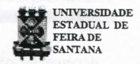

# FOLHETIM DE EDUCAÇÃO MATEMÁTICA

Folhetim Educ. Mat., Ano 8, n. 98, jan. 2001

ISSN 1415-8779

#### **OBJETIVO**

Este Folhetim é um veículo de divulgação, circulação de idéias e de estímulo ao estudo e à curiosidade intelectual. Dirige-se a todos os interessados pelos aspectos pedagógicos, filosóficos e históricos da Matemática. Pretende construir uma ponte para unir os que estão próximos e os que estão distantes.

#### **EDITORIAL**

O nosso leitor teve a oportunidade de acompanhar, desde o número 95 do Folhetim, a descrição e aplicação de diversos métodos de demonstração. Trata-se de uma importante contribuição, uma vez que, geralmente, não encontramos uma abordagem sobre métodos de demonstração em uma só obra. Assim, esperamos que esta série de Folhetins seja útil aos nossos assinantes e leitores.

Este número em especial, além de trazer uma análise geral dos métodos anteriormente descritos, dá atenção também para a questão do ensino/educação matemática.

# COMITÉ EDITORIAL

Carloman Carlos Borges (Doutor)
Inácio de Sousa Fadigas (Mestre)

## PERGUNTE QUE O NEMOC RESPONDE

Pergunta. Como aprender a <u>demonstrar</u> em matemática? (continuação).

R. Analisemos, agora, alguns tipos de demonstração mencionados acima. Comecemos com o método de Exaustão. O termo "exaustão", segundo os historiadores, aparece pela primeira vez em Grégorie de Saint-Vincent, em 1647. Deve-se observar que o método de Exaustão já parte do resultado a ser provado, donde se vê que ele não facilita a descoberta de novos resultados, apesar de tratar-se de um método rigoroso. O método de Indução Finita serve para demonstrar proposições nas quais intervenha uma variável inteira natural. Essa é uma de suas limitações apesar de Deus ter criado os números naturais... Com esse tipo de demonstração, surge o seguinte problema pedagógico: como foi construída a proposição P(n)? De onde surgiu essa proposição que agora vamos demonstrar? Penso que o professor, antes da demonstração de P(n), procurasse construí-la, empregando a chamada indução empírica (do exame de alguns casos particulares "salta-se" para P(n)). A demonstração por absurdo é fundamentada no terceiro excluído. Ela envolve idéias que devem ser discutidas. A primeira delas diz respeito ao problema de existência em Matemática, isto é, como se deve provar a existência de um objeto matemático? Claro, podemos por um lado, construí-lo por intermédio de exemplos "palpáveis" acompanhados do correspondente método que serviu para a sua construção. Por outro lado podemos construí-lo mostrando que a simples negação de sua existência conduz a uma contradição lógica (um absurdo...). A primeira prova mencionada dá-se o nome de prova construtiva e a ela se filiam eminentes matemáticos como Krönecker (1823-1891), Poincaré (1854-1912), Lebesgue (1875-1941) entre outros devendo ser mencionado o seu grande teórico o matemático holandês Luitzen Egbertus Jan Brouwer que em 1907 lança os princípios da chamada escola "instuicionista". Eis algumas de suas teses: a) rejeição pura e simples do infinito acabado, isto é, a tomada de consciência de todos os elementos

de um conjunto infinito; b) aceitação de uma "intuição primordial" (nenhumintuicionista conseguiu até o momento explicar de que trata essa "intuição primordial"; talvez ela provenha da criação dos números naturais por Deus...); c) aceitação do terceiro excluído apenas em domínios finitos. Os intuicionistas, portanto, não aceitam demonstrações baseadas no terceiro excluído como as demonstrações por absurdo. Eles colocam na origem do conhecimento matemático, a "intuição primordial", que não é "sensorial" nem "empírica", mas uma espécie de certeza imediata que se associa aos fatos da lógica, da aritmética e do cálculo combinatório. Essa intuição daria significado ao conceito de número e a outros conceitos matemáticos importantes, os quais, por construções graduais é possível construir-se a Matemática. É interessante notar que um dos conceitos fundamentais dessa corrente, qual seja, o da "intuição primordial" ainda não foi devidamente esclarecido por nenhum intuicionista, persistindo, portanto, ainda, como uma noção obscura.

O saber matemático foi certamente, o primeiro a estruturar-se num corpo ordenado de conhecimentos, com seu objeto bem definido e a sua metodologia própria. Desde a Grécia Antiga, que a matemática é uma ciência, mesmo empregando essa palavra na sua acepção moderna. Ao comparar a matemática dos gregos antigos com a dos povos que os precederam, como os babilônios e os egípcios, salta logo a vista o traço distintivo dos matemáticos gregos: a demonstração - e é isso que vai marcar para todo o sempre a sua matemática. Ainda hoje, dada uma determinada proposição, ela só poderá ser considerada como pertencente à matemática se for uma proposição demonstrada. Tal metodologia foi instituida pelo matemático grego Euclides no século III antes de Cristo. A eternidade dos resultados matemáticos - no sentido de que uma proposição matemática demonstrada o é para todo o sempre-é inquestionável.

É paradoxal que se decore uma demonstração. Mesmo assim, é o que mais presenciamos numa sala de aula. Aliás, a postura de alguns professores faz lembrar a mesma postura de Taylor, criador do taylorismo (doutrina de racionalização das produções, mediante sua fragmentação e grande especialização na execução das tarefas e que foi ironizado por Charles Chaplin em seu admirável filme Tempos Modernos) que dizia para seus empregados: "Vocês não estão aqui para pensar". Uma proposição demonstrada - e chamada pelos matemáticos de teorema - só é compreendida se soubermos utilizar seus resultados, se soubermos reconstruí-la, explicitando todos seus detalhes. Veja o que dizia o grande físico Feynman - Nobel de Física - : "Não sei o que se passa com as pessoas: não aprendem compreendendo; aprendem de qualquer outro modo - decorando ou qualquer coisa assim. O seu conhecimento é tão frágil!" Um teorema para ser bem assimilado deve, primeiramente ser lido com a preocupação sobre a compreensão de cada palavra e dos encadeamentos lógicos. Entre os fundamentos de um teorema estão aquelas proposições denominadas axiomas ou postulados. No decorrer da demonstração deve-se ter a certeza de que todas as hipóteses estão sendo utilizadas. Em seguida deve-se suprimir uma ou mais hipóteses e verificar as consequências. A Matemática é, antes de tudo, uma maneira de pensar. Além disso o seu estudo se encontra penetrado de humildade: uma verdade matemática como "a soma das medidas dos ângulos internos de um triângulo vale 180° "- só possui sentido se dentro do quadro de uma teoria. Assim, a verdade acima só vale na chamada geometria euclidiana. Há outras geometrias nas quais aquela soma pode ser inferior ou superior a 180°. Por isso, o seu estudo deve desenvolver a tolerância e servir de antídoto a qualquer espécie de dogmatismo. A matemática é altamente abstrata, tanto em seus métodos

## NEMOC - NÚCLEO DE EDUCAÇÃO MATEMÁTICA OMAR CATUNDA

Folhetim Educ. Mat., Ano 8, n. 98, jan. 2001 - Editores: Carloman e Inácio - Secretária: Josenildes Oliveira Venas Almeida - Editoração: Evandro Vaz e Nivaldo de Assis - Impressão: Imprensa Gráfica Universitária - Periodicidade: mensal - Tiragem: 1.700 exemplares - Distribuição gratuita - Endereço: Av. Universitária, s/n - km 03 - BR 116 - Campus Universitário - Telefone: (75)224-8115 - Fax: (75)224-8086 - CEP 44031-460 - Feira de Santana - Ba-BRASIL - E-mail: nemoc@uefs.br

como em seus objetos. Daí a urgente necessidade, em seu ensino, dessa peculiaridade receber um tratamento cuidadoso. Não se aprende partindo-se do geral para o particular, a não ser em níveis bem especializados. A marcha é do concreto para o abstrato, do particular para o geral. No entanto, alguns livros violam esse princípio básico da aprendizagem. Resultado dessa prática: o mal estar causado nos estudantes e, consegüentemente, seu desinteresse. Sejamos mais concretos: quem já estudou pelo conhecido livro de Adilson Goncalves. Introdução à Álgebra, raramente deixou de experimentar tais sentimentos. E quem já ensinou adotando-o como livro texto, deve ter notado nos estudantes esses mesmos sentimentos. Em nosso entendimento, a tarefa precípua de um autor de livro escolar é estabelecer correlações entre a experiência imediata e as abstrações da ciência que pretende ensinar. Basta observar as atividades humanas: geralmente partem do conhecido para o desconhecido. Porque, então, inverter essa ordem tão básica da aprendizagem? Apesar da lacuna apontada - que esperamos seja corrigida nas próximas edições - o livro mencionado tem prestado grande ajuda aos nossos estudantes. Não se deve deduzir da exposição acima que o trabalho do matemático se reduz apenas a demonstrar, pois nesse caso, a matemática seria uma grande tautologia, vez que numa demonstração procura-se explicitar o que se encontra implícito nos postulados da teoria. Alguns especialistas chegam mesmo a generalizar quando afirmam que fazer ciência é explicitar o implícito. É tarefa, também, do matemático. definir conceitos e elaborar conjecturas. Muitas vezes, do fracasso na demonstração de uma conjectura é que surgem novas linhas de pesquisa. Ouando se trata do ensino, aí então, o professor deve ser bastante cauteloso. Deve lembrar-se que nem sempre o rigor acha-se ligado à compreensão. Muitas vezes um argumento rigoroso serve apenas para obscurecer as idéias do estudante levando-o ao desânimo. Não vejo nenhuma valia. exemplificando, no empenho do professor demonstrar que o diâmetro da circunferência divide essa mesma circunferência em duas partes iguais. Quando estiver em sala de aula, não custaria nada ao professor lembrar-se do seguinte poemeto:

Uma centopéia vivia feliz
Até que um dia um sapo lhe disse, a brincar:
Com tantos pés, nunca te enganas, meu petiz?
Cheia de dúvida de tanto pensar
Caiu distraída numa vala
Sem saber como marchar.

Um dos mais eminentes matemáticos do século XX-André Weil, fundador do famoso grupo denominado de Bourbaki - escreveu: "Falar em Matemática é falar em demonstração". Não se iluda o professor perante essa frase. Dentro de uma sala de aula para jovens adolescentes a sua aplicação ao pé da letra só pode causar sérios prejuízos a jovens que jamais serão matemáticos profissionais. Aliás, quando o assunto é ensino da matemática, a influência pedagógica de Bourbaki é terrivelmente deletéria. Que é Matemática? Embora seja impossível, até agora, dar uma definição rigorosamente precisa do que seja a matemática, há uma que poderia servir de guia ao professor: a matemática é a procura dos padrões. Daí a necessidade de desenvolver na criança o hábito da observação das semelhanças e das diversidades para que ela seja colocada no caminho da procura de padrões. Poucas ciências se igualam à matemática na apresentação de situações nas quais esse exercício possa ir às últimas consequências. Não se deve transformar a matemática em simples esquemas abstratos logicamente manipuláveis e, muito menos, em simples receituário. Parece que nossos manuais escolares podem ser classificados em um dos dois grupos mencionados. Há honrosas excessões. Constituem minoria. Como a procura de padrões deve ser enfatizada, igualmente, os conceitos e as definições. Como os conceitos e as definições ainda, não são sabidos, pertencendo, portanto, ao desconhecido, deve-se chegar a eles a partir do conhecido, daquilo que é familiar ao aluno. A construção deles, a sua idealização, sua abstração deve ser feita passo a passo. Escutemos mais uma vez o físico Feynman: "Muito mais tarde acabei de descobrir um modo de testar se o que se ensinou é o conceito ou apenas uma definição. Basta dizer aos alunos: 'Sem usarem a nova palavra que acabaram de aprender tentem explicar a mesma coisa com o vosso vocabulário habitual'. Por exemplo, sem usar a palavra 'energia',

digam o que sabem agora acerca do movimento do cão. Impossível. Então, conclui-se que não se aprendeu nada da definição. Talvez isso, algumas vezes, não tenha importância; pode não haver necessidade de se aprender alguma coisa acerca da ciência logo à partida. É evidente que temos de aprender as definições. Mas, para a primeira aula, não acham que isso seja potencialmente destrutivo?" Claro que os ensinamentos contidos nesse trecho valem para o ensino de matemática. Antes de usar o termo circunferência o aluno deve ter aprendido alguma idéia, por pequena que seja, sobre ela, através de sua experiência pessoal, pois é desta que são construídas as primeiras abstrações. É importante, dada uma definição que se procure saber se o aluno conseguiu assimilá-la. Por exemplo: a simples e elegante definição de Euler: "o logaritmo de um número complexo w≠0 é um número complexo z, tal que $e^z = w''$ . O aluno deve, a partir dela chegar ao resultado conhecido:

$\log w = \log |w| + (2k\pi + \theta)i$ , para $k \in \mathbb{Z}$ sob pena de não ter compreendido essa definição.

Alguns filósofos da ciência rejeitam a concepção empirista da matemática segundo a qual o objeto matemático é uma simples abstração da experiência. apontando a imensa abstração de alguns dos conceitos mais modernos dessa ciência. Realmente, nos ramos mais modernos da matemática surgem conceitos altamente abstratos, aparentemente bem longe de qualquer intuição. Mas essa concepção é enganosa, pois os conceitos matemáticos (por exemplo o conceito de função) formam uma sequência de sucessivas abstrações e generalizações, "cada uma das quais repousa na combinação de experiências com conceitos abstratos prévios". É na vivência das experiências sensoriais de onde surgem as primeiras abstrações da matemática. Construídas estas. surgem as chamadas experiências mentais, com esses primeiros conceitos. A natureza generalizadora da ciência na qual repousa a sua imensa fecundidade é responsável por novas abstrações, fruto das experiências mentais com as abstrações que lhe são anteriores. Daí, como já escrevemos anteriormente, ser a primeira tarefa do filósofo da ciência, a de descrever a análise e as relações entre a experiência imediata e a formação das primeiras abstrações em uma determinada ciência. Assim,

repetindo, nossos manuais escolares são mal escritos pois, além de violarem princípios da aprendizagem, não mostram para o aluno a filiação histórica das diversas abstrações conceituais. Isso é tarefa do professor, argumentam alguns desses autores. Mas, perguntamos: não foi em livros semelhantes a esses que os professores estudaram?

Pergunte que o NEMOC Responde é uma coluna de autoria do prof. Dr. Carloman Carlos Borges e objetiva atingir ao público interessado em Matemática nos seus múltiplos aspectos.

Caso o leitor queira fazer alguma pergunta escreva-nos.

## NOTÍCIAS

A UEFS, através do NEMOC, vai oferecer novamente à comunidade o <u>CURSO DE ESPE-</u> <u>CIALIZAÇÃO EM EDUCAÇÃO MATEMÁTICA</u>.

### Inscrições prorrogadas:

Período: 05 a 23 de março de 2001

#### Informações:

PPPG: (75)224-8257; e-mail: pppg@uefs.br DEXA: (75)224-8086; e-mail: exa@uefs.br NEMOC: (75)224-8115; e-mail: nemoc@uefs.br

# PRÓXIMO NÚMERO

Aguardem!

# **NÚMEROS ATRASADOS**

Envie para cada folhetim um selo de postagem nacional de 1º porte. Dentro de no máximo quatro semanas, contadas a partir da data de recebimento do seu pedido, você estará recebendo os folhetins solicitados.

OBS.: É permitida a reprodução total ou parcial desse folhetim, desde que citada a fonte.
