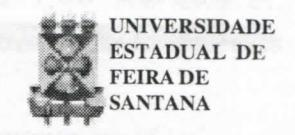

# FOLHETIM DE EDUCAÇÃO MATEMÁTICA

Folhetim Educ. Mat., Ano 8, n. 99, fev. 2001

ISSN 1415-8779

#### **OBJETIVO**

Este Folhetim é um veículo de divulgação, circulação de idéias e de estímulo ao estudo e à curiosidade intelectual. Dirige-se a todos os interessados pelos aspectos pedagógicos, filosóficos e históricos da Matemática. Pretende construir uma ponte para unir os que estão próximos e os que estão distantes.

## **EDITORIAL**

Sem dúvida os números exercem um grande fascínio sobre os homens. O Triângulo de Pascal, e sua relação com a análise combinatória mostra um aspecto desse fascínio, apontando uma maneira prática e elementar de se determinar os coeficientes no desenvolvimento do Binômio de Newton. Longe de ser apenas uma curiosidade, encontramos também a formação do Triângulo de Pascal com apoio nas potências de 11 (de forma direta até a quarta potência). É esse o assunto tratado pelo presente _Folhetim_, que traz ainda uma discussão sobre os abusos de linguagem na matemática.

# COMITÊ EDITORIAL

Carloman Carlos Borges (Doutor) Inácio de Sousa Fadigas (Mestre)

## PERGUNTE QUE O NEMOC RESPONDE

**Pergunta.** Alice P. S. da Silva, de Salvador deseja informações acerca do _Triângulo de Pascal_.

R. Vejamos, primeiro, o conceito de combinação de n objetos tomados p a p, sendo p um número natural e $p \le n$ . Chama-se combinação de n elementos de B (B sendo um conjunto não vazio com n objetos) p a p, toda parte não vazia de B tendo p elementos. As combinações de n objetos tomados

$$p \ a \ p \ \tilde{sao} \ simbolizadas \ por \ C_n^p = \binom{n}{p}$$

Exemplo: Seja B o conjunto constituído dos quatro objetos, a, b, c e d. Teremos:

$$C_4^1 = a,b,c,d$$
; $C_4^2 = ab,ac,ad,bc,bd,cd$ ;

$$C_4^3 = abc, abd, acd, bcd$$
; $C_4^4 = abcd$

Deve-se observar que cada grupo acima contém somente _p_ elementos e difere dos outros, ao menos, pela natureza de um elemento. É fácil mostrar que

$$C_n^p = \frac{n!}{p!(n-p)!}$$
sendo $n! = 1, 2, 3, ..., (n-1), n$ .

Deve-se lembrar da convenção: 0! = 1. Ao quadro abaixo, denomina-se Triângulo de Pascal, nome de um matemático e filósofo francês (1623-1662):

| \p  | 0   | 1   | 2   | 3     | 4   | 5   | 6    | 7     | 8    |                             |
| --- | --- | --- | --- | ----- | --- | --- | ---- | ----- | ---- | --------------------------- |
| n   |     |     | 176 | 16    |     |     |      | Sph ( | 480  |                             |
| 0   | 1   |     |     |       |     |     |      |       |      |                             |
| 1   | 1   | 1   |     |       |     |     |      |       |      |                             |
| 2   | 1   | 2   | 1   | THE ! |     |     | (M)  | W.D.  | 1    | $C_{n-1}^{p-1} + C_n^{p-1}$ |
| 3   | 1   | 3   | 3   | 1     |     |     |      |       | 1    |                             |
| 4   | 1   | 4   | 6   | 4     | 1   |     | to P |       | 795  | H                           |
| 5   | 1   | 5   | 10  | 10    | 5   | 1   |      |       | - 68 | $C_n^p$                     |
| 6   | 1   | 6   | 15  | 20    | 15  | 6   | 1    | 1     | -    | $C_n$                       |
| 7   | 1   | 7   | 21  | 35    | 35  | 21  | 7    | 1     |      |                             |
| 8   | 1   | 8   | 28  | 56    | 70  | 56  | 28   | 8     | 1    |                             |

Quem representa, por exemplo, no quadro acima, o elemento comum à quinta linha (n = 4) e à terceira coluna (p=2)? Este número, 6, é o número de combinações que se podem formar com quatro elementos tomados dois a dois. Quantas são as combinações de 7 elementos tomados cinco a cinco? Basta identificar o elemento comum à linha 8 com a sexta coluna. Esse elemento, é 21. Devido a essa propriedade podemos reescrever o Triângulo de Pascal da seguinte maneira:

| $C_0^0$                                         | 1             |
| ----------------------------------------------- | ------------- |
| $C_1^0 \ C_1^1$                                 | 1 1           |
| $C_2^0 \ C_2^1 \ C_2^2$                         | 1 2 1         |
| $C_3^0$ $C_3^1$ $C_3^2$ $C_3^3$                 | 1 3 3 1       |
| $C_4^0$ $C_4^1$ $C_4^2$ $C_4^3$ $C_4^4$         | 1 4 6 4 1     |
| $C_5^0$ $C_5^1$ $C_5^2$ $C_5^3$ $C_5^4$ $C_5^5$ | 1 5 10 10 5 1 |

Os termos de cada linha obedecem à seguinte lei de formação: um número qualquer desse quadro é igual, ao número colocado logo acima dele somado ao número que precede este na mesma linha. Exemplo: Como é formada a sétima linha?

Os números da sétima linha são: 1,6,15,20,15,6,1. Para formar qualquer elemento dessa linha temos que nos orientar pela linha precedente (a sexta linha). Assim, reescrevemos as sexta e sétima linhas:

e notamos que qualquer elemento da sétima linha é igual à soma do elemento que lhe fica logo acima na

sexta linha com o elemento que precede este.

Exemplificando: 20 = 10 + 10; 15 = 5 + 10 e assim, por diante. Essa lei de formação permite escrever, de uma maneira particular o seguinte:

$$C_5^2 = C_4^2 + C_4^1$$
; $C_6^5 = C_5^5 + C_5^4$ ; etc.

e, de uma maneira geral a relação:

$$C_n^p = C_{n-1}^p + C_{n-1}^{p-1}$$

denominada de Relação de Stifel (1487-1567), algebrista alemão. A sua demonstração é simples: seja X um conjunto com n elementos e selecionemos um elemento $x_0$ de X. Os $C_n^p$ subconjuntos de X, com p elementos, podem ser divididos naqueles que contém, $x_0$ e nos subconjuntos que não o contém. O número de subconjuntos que contém $x_0$ é $C_{n-1}^{p-1}$ , pois fixado $x_0$ , contamos todos os subconjuntos de p-1 elementos que podem ser formados com os n-1 elementos disponíveis. Para o número de subconjuntos que não contém $x_0$ vale $C_{n-1}^p$ , pois, agora contamos subconjuntos de p elementos formados com os n-1 disponíveis.

Logo:

$$C_n^p = C_{n-1}^{p-1} + C_{n-1}^p$$

Parafraseando o exemplo logo acima: suponhamos formadas as combinações n-árias dos elementos

$$a_1, a_2, \ldots, a_n$$
.

Separemos essas combinações em 2 grupos: aquelas nas quais não figura o elemento $a_1$ daquelas que o contém. Claramente o primeiro grupo é formado pelas combinações dos n-1 elementos $a_2$ , ..., $a_n$

# NEMOC - NÚCLEO DE EDUCAÇÃO MATEMÁTICA OMAR CATUNDA

Folhetim Educ. Mat., Ano 8, n. 99, fev. 2001 - **Editores:** Carloman e Inácio - **Secretária:** Josenildes Oliveira Venas Almeida - **Editoração:** Evandro Vaz e Nivaldo de Assis - **Impressão:** Imprensa Gráfica Universitária - **Periodicidade:** mensal - **Tiragem:** 1.700 exemplares - _Distribuição gratuita_ - **Endereço:** Av. Universitária, s/n - km 03 - BR 116 - Campus Universitário - **Telefone:** (75)224-8115 - **Fax:** (75)224-8086 - CEP 44031-460 - Feira de Santana - Ba - BRASIL - **E-mai**l: nemoc@uefs.br

tomados p a p, donde seu número ser representado por $C_{n-1}^p$ . O 2º grupo é obtido colocando-se à direita de $a_1$ as combinações dos n - l elementos seguintes p - l a p - l, donde seu número ser representado por $C_{n-1}^{p-1}$ . Daí, surge a relação de STIFEL.

Conforme a lei de formação citada se considerarmos uma linha qualquer do triângulo representada por

$1, 1+a, a+b, \ldots, b+a, a+1, 1$ (B) donde se conclui: no Triângulo de Pascal, em uma determinada linha, os termos equidistantes dos extremos são iguais. Ainda, a soma dos elementos contidos em (B) é igual ao dobro da soma dos elementos de (A). Donde

$$1 + C_n^1 + C_n^2 + \dots + C_n^n = 2^n$$
(I)  
(Lembrar que, pelo Binômio de Newton:

$$(x+a)^n = C_n^0 a^0 x^n + C_n^1 a^1 x^{n-1} + + C_n^2 a^2 x^{n-2} + \dots + C_n^n a^n x^0$$

donde para x = a = 1, decorre a expressão (I).

É curioso observar que as seguintes potências sucessivas de 11:

$$(11)^0 = 1$$

$$(11)^1 = 11$$

$$(11)^2 = 121$$

$$(11)^3 = 1331$$

$$(11)^4 = 114641$$

representam as cinco primeiras linhas do TP.

Lembrar ainda que as potências sucessivas de 11 podem ser praticamente encontradas do seguinte modo: escreve-se o algarismo das unidades e a ele soma-se o algarismo das dezenas, em seguinte o algarismo das dezenas é somado ao algarismo das centenas e, assim sucessivamente.

**Pergunta.** A mesma colega indaga se é correta a expressão "número decimal".

R. A expressão "número decimal" somente pode ser "justificada" por aquilo comumente conhecido por "abuso de linguagem" (AL). Aliás, os AL acham-se espalhados no discurso matemático. Vejamos alguns deles. Sabe-se que dados os conjuntos X, Y, uma função $f: X \to Y$ é uma regra que diz como associar a cada elemento $x \in X$ um elemento $y = f(x) \in Y$ . Contudo geralmente falamos: seja a função y = f(x) o que é um "abuso de linguagem", pois, y = f(x) é um valor particular da função f no ponto x. Quando dizemos "grau de uma função" cometemos outro AL, pois, como já explicamos, função é um conjunto de instruções, uma regra que diz como associar cada elemento do conjunto X um elemento do conjunto Y. Por exemplo: a conhecida função afim. Qual o conjunto de instruções que a define? Multiplique $x \in X$ por uma constante $\underline{a}$ e ao resultado acrescente a constante b. Esse é o seu conjunto de instruções, o qual pode ser representado analiticamente por y = ax + b, que é um polinômio do 1º grau.

Assim, quando se fala em "grau de uma função" a referência, nesse caso, é para o polinômio p = ax + b e não para a função. Quem possui grau é polinômio. Um conjunto de instruções não pode possuir grau. Cuidado, não se deve confundir a roupa com a pessoa que a veste. Outros AL: "o pé da perpendicular"; "ponto no qual a reta fura o plano"; "'número' em lugar de 'numeral'". Assim como não há "número decimal" é um abuso de linguagem falar ou escrever: adição de números decimais. Nós adicionamos números e não numerais. Como número é uma idéia altamente abstrata, procuramos torná-la mais concreta, representando-a por um sinal gráfico, que é o numeral.

A palavra número deve ser adjetivada de uma

maneira correta. Qual é essa maneira correta de adjetivação? O adjetivo há de referir-se às propriedades intrínsecas do número de que estamos tratando. Por propriedade do número entendemos aquela propriedade, exemplificando, independente de sua representação. Os adjetivos natural, racional, real, complexo identificam perfeitamente de que número se trata, em qualquer base de numeração, enquanto a expressão "número decimal" é um AL. Não se deve "amarrar" o conceito de número à base na qual estamos trabalhando. Da mesma maneira que não falamos "número quinário", não devemos escrever e nem falar "número decimal". A grande vantagem do emprego das expressões decimais é tornar o cálculo bem mais simples. O discurso matemático é cheio de abusos de linguagem. E não pode ser de outra forma. Se fossemos levar em conta apenas o rigor, ele se tornaria pedante e até inacessível ao estudante. O importante nessa questão é que tais abusos sejam conscientes, a fim de que não paire nenhuma confusão no discurso matemático. Muitos livros escrevem: seja o número $\pi = 3,14$ . Esse é um abuso a ser evitado, pois no primeiro membro temos um número irracional que é o π e no segundo membro temos um racionale, assim, se torna dificil "digerir" que um irracional é igual um a racional, mesmo em situações fora da matemática. O que se pode dizer nesse caso particular? Apenas isso: seja o número irracional π aproximado por 3,14. No ensino da Matemática um dos problemas pedagógicos cruciais é o problema da forma e do conteúdo. O principiante tende à apegar-se à forma, menosprezando o conteúdo que é representado por esta. Embora sabendo que um número é par quando é da forma $2n, n \in \mathbb{N}$ , muitas vezes ele se confunde quando afirmamos que o número 4p + 8, é par, sendo $p \in \mathbb{N}$ . Uma excelente exposição sobre o assunto pode ser encontrada em A Matemática do Ensino Médio,

volume 1, sob a responsabilidade de Elon Lages Lima, Paulo Cezar Carvalho, Eduardo Wagner e Augusto Cesar Morgado, Coleção do Professor de Matemática, Sociedade Brasileira de Matemática.

Pergunte que o NEMOC Responde é uma coluna de autoria do prof. Dr. Carloman Carlos Borges e objetiva atingir ao público interessado em Matemática nos seus múltiplos aspectos.

Caso o leitor queira fazer alguma pergunta escreva-nos.

## NOTÍCIAS

Acontecerá na UEFS no período de 02 a 06 de julho, o **IX EBEM** - Encontro Baiano de Educação Matemática / 1º Fórum do Nordeste em Educação Matemática 2001 - Uma Odisséia na Matemática.

## Informações:

- (75)224-8086 (Ana Cláudia)
- (75)224-8070 (Jaidê)

http://www.uefs.br/sbemba

Será ralizado de 19 a 23 de julho, no Rio de Janeiro, o VII ENEM - Encontro Nacional de Educação Matemática / Educação Matemática e Novas Tecnologias.

#### Informações:

**(21)590-0940**

http://www.sbem.com.br

http://www.viienem.ufrj.com.br

# PRÓXIMO NÚMERO

Aguardem!

# **NÚMEROS ATRASADOS**

Envie para cada folhetim um selo de postagem nacional de 1º porte. Dentro de no máximo quatro semanas, contadas a partir da data de recebimento do seu pedido, você estará recebendo os folhetins solicitados.

OBS.: É permitida a reprodução total ou parcial desse folhetim, desde que citada a fonte.
