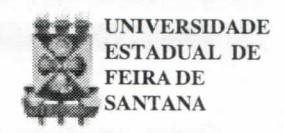

# **FOLHETIM DE EDUCAÇÃO MATEMÁTICA**

**Folhetim Educ. Mat., Ano 8, n. 100, mar. 2001**

**ISSN 1415-8779**

## **OBJETIVO**

Este _Folhetim é_ um veículo de divulgação, circulação de **ideias** e de estímulo ao estudo e **à** curiosidade intelectual. Dirige-se a todos os interessados pelos aspectos pedagógicos, filosóficos e históricos da Matemática. Pretende construir uma ponte para unir os que estão próximos e os que estão distantes.

### **EDITORIAL**

Chegamos ao número 100. E a respeito desse número, vários fatos curiosos encontramos: cem ou cento, no latim aparece como _centum,_ no grego como _hecaton.Hecatombe,_ que significa cem bois, origina a hecatombe que era o sacrifício de cem animais imolados ao poder dos deuses. Nos nossos dias, ainda encontramos certos provérbios alusivos ao cem: Ladrão que rouba ladrão tem cem anos de perdão; Cesteiro que faz um cesto, faz um cento. Essas e outras curiosidades constam do Livro _Folclore de Matemática,_ se não centenário, pelo menos do século passado, do Professor Mello e Souza, pubhcado em 1954 pela Editora Conquista.

Chegamos ao número 100. Principal veículo de comunicação do NEMOC - Núcleo de Educação Matemática Omar Catunda, o 1° Folhetim de Educação Matemática foi publicado em 01/08/93. Inicialmente com uma periodicidade semanal, nos últimos anos o estabelecemos como mensal, pelo menos até este número.

Durante o período de publicação, recebemos muitas correspondências de incentivo ao nosso

trabalho. A maioria delas endereçada ao prof. Carloman Carlos Borges, autor de quase a totalidade dos artigos pubhcados e juntamente com a equipe do NEMOC, que em seu incansável trabalho e dedicação, faz com que o _Folhetim_ aconteça. Além disso, fomos presenteados em duas oportunidades: a primeira pelo prof. Elon Lages Lima, _no Folhetim n°_ 83 (outubro/99) e a segunda pelo prof. Geraldo Ávila, no _Folhetim_ n° 92 (julho/ 2000).

Chegamos ao n° 100. E tratamos de vários assuntos nos _Folhetins;_ Teoria dos números, álgebra, combinatória, geometria, lógica, história e filosofia da matemática, jogos, dentre outros. Por essa diversidade, oferecemos ao leitor (n° 101) mais umarelação de perguntas feitas ao NEMOC, a que complementa aquela pubhcada no número 73. ^

Chegamos ao n° 100. E nossos colegas aqui da Universidade Estadual de Feira de Santana, têm algumas palavras que aqui transcrevemos.

_Desde sua criação. Resolução do Consad n° 05/92, o Professor Carloman Carlos Borges e o NEMOC (Núcleo de Educação Matemática Omar Catunda) vêm instigando intelecto de jovens e velhos amigos de matemática. Além desse salutar embate, se projeta num nível pedagógico, procurando perscrutar os conhecimentos básicos da matemática deforma pormenorizada e clara. Buscando fazer constantemente o casamento entre a ferramenta técnica e o ambiente sob a qual emergia assim como suas diferentes perspectivas._

_As notas publicadas neste Folhetim de Educação Matemática hoje já alcançam outros países (obviamente já está bastante conhecido no território nacional) como Portugal, Chile, França, México e Colômbia._

_Como frizado, sua instigante motivação tem levado os alunos do curso de Matemática da UEFS a interpretarem a matemática não como uma atividade puramente académica, mas uma construção diária e imersa na sua realidade._

_Como um dado relevante, cerca de oitenta por cento dos alunos do curso de Matemática recebem o Folhetim de Educação Matemática, assim como todos os profissionais formados por este curso e os professores do Departamento de Ciências Exatas que ministram disciplinas no curso de Matemática._

_A qualidade do Folhetim é reconhecida nacionalmente por grandes "mestres " em matemática. O desafio do Folhetim confirma e sem dúvida, e com muito trabalho, atingirá muitas gerações de futuros profissionais desta universidade._

Maria Hildete de Magalhães França - Coordenadora do Colegiado do Curso de Licenciatura em Matemática.

Cristiano Henrique de Oliveira Mascarenhas - Vice-Coordenador do Colegiado do Curso de Licenciatura em Matemática. .. .

_É com muita satisfação que acompanhamos este momento do Folhetim de Educação Matemática do NEMOC. Suas contribuições para a educação matemática são indiscutíveis como têm atestado tantos de seus leitores entre estudantes, professores epúblico em geral. Parabenizamos seus editores professores Carloman Borges e Inácio Fadigas, ao mesmo tempo que os encorajamos a prosseguir neste valioso trabalho._

Haroldo Gonçalves Benatti - Professor Doutor da Área de Fundamentos de Matemática.

# **COMITÉ EDITORIAL**

Carloman Carlos Borges (Doutor) Inácio de Sousa Fadigas (Mestre)

## **PERGUNTE QUE O NEMOC RESPONDE**

**1 " Pergunta.** O colega J. dos Santos de Almeida, de Salvador, pede para que seja demonstrada a igualdade:

$$1^{3} + 2^{3} + 3^{3} + \dots + n^{3} =$$

$$= \left[ \frac{n(n+1)}{2} \right]^{2} =$$

$$= \left[ (1+2+3+\dots+n)^{2} \right]^{2}$$

que ele viu proposta em _Introdução à História da Matemática_ de Howard Eves, Editora da Unicamp.

R. Recordemos, inicialmente, a Relação de Stifel (RS), a qual mereceu alguns comentários no Folhetim anterior:

_Cn=Cn- \ Cn~À_ c procurcmos demonstrar a fórmula:

$$C_p^p + C_{p+1}^p + \dots + C_n^p = C_{n+1}^{p+1}$$
(1)

Como resultado da aphcação RS, temos:

$$C_{n+1}^{p+1} = C_n^{p+1} + C_n^p$$

$$C_n^{p+1} = C_{n-1}^{p+1} + C_{n-1}^p$$

$$C_{n-1}^{p+1} = C_{n-2}^{p+1} + C_{n-2}^p$$

$$C_{p+1}^{p+1} = C_{p+1}^{p+1} + C_{p+1}^{p}$$

$$C_{p+1}^{p+1} = C_{p}^{p} = 1$$

### **NEMOC - NÚCLEO DE EDUCAÇÃO MATEMÁTICA OMAR CATUNDA**

Folhetim Educ. Mat., Ano 8 , n. 100, mar. 2001 - **Editores:** Carloman e Inácio - **Secretária:** Josenildes Oliveira Venas Almeida - **Editoração:** Evandro Vaz e Nivaldo de Assis - **Impressão:** Imprensa Gráfica Universitária - **Periodicidade:** mensal - **Tiragem:** 1.700 exemplares - _Distribuição gratuita -_ **Endereço:** Av. Universitária, s/n km 03 - BR 116 - Campus Universitário - **Telefone:** (75)224-8115 - **Fax:** (75)224-8086 - CEP 44031-460 - Feira de Santana - Ba - BRASIL - **E-mail:** nemoc@uefs.br

Somando membro a membro tem-se o resultado desejado.

Apliquemos, agora, esse exercício no cálculo da soma dos cubos dos _n_ primeiros números inteiros. Assim:

$$C_{n+1}^3 = \frac{(n+1) n (n-1)}{6} = \frac{n^3 - n}{6}$$

donde:

$$n^3 = 6C_{n+1}^3 + C_n^1$$

Logo:

$$(n-1)^3 = 6C_n^3 + C_{n-1}^3$$

......

$$3^3 = 6C_4^3 + C_3^1$$

$$2^3 = 6C_3^3 + C_2^1$$

$$1^3 = C_1^1$$

donde:

$$1^{3} + 2^{3} + 3^{3} + \dots + n^{3} =$$

$$= 6[C_{3}^{3} + \dots + C_{n+1}^{3}] + [C_{1}^{1} + C_{2}^{1} + \dots + C_{n}^{1}] =$$

$$= 6[C_{3}^{3} + \dots + C_{n+1}^{3}] + [C_{1}^{1} + C_{2}^{1} + \dots + C_{n}^{1}] =$$

$$= 6C_{n+2}^{4} + C_{n+1}^{2} =$$

(conforme exercício anterior)

$$= 6 \frac{(n+2)(n+1)n(n-1)}{24} + \frac{n(n+1)}{2} =$$

$$= \frac{n(n+1)}{2} \left[ \frac{(n+2)(n-1)}{2} + 1 \right] =$$

$$= \left[ \frac{n(n+1)}{2} \right]^{2} =$$

$$= \left[ 1+2+3+\ldots+n \right]^{2}$$

É útil observar que cada um dos coeficientes binomiais $\binom{n}{p}$ é um polinômio em n de grau p. Claramente, se pode considerar a relação (1) na forma:

$$\begin{pmatrix} 1 \\ p \end{pmatrix} + \begin{pmatrix} 2 \\ p \end{pmatrix} + \dots + \begin{pmatrix} n \\ p \end{pmatrix} = \begin{pmatrix} n+1 \\ p+1 \end{pmatrix} (2)$$

melhor aceita pelo alunado.

Em (2) supondo p = 1, obtemos o conhecido resultado:

$$\begin{pmatrix} 1 \\ 1 \end{pmatrix} + \begin{pmatrix} 2 \\ 1 \end{pmatrix} + \dots + \begin{pmatrix} n \\ 1 \end{pmatrix} = \begin{pmatrix} n+1 \\ 2 \end{pmatrix}$$
$$\Rightarrow 1 + 2 + 3 + \dots + n = \frac{n(n+1)}{2}$$

Para p = 2, obtém-se esse outro resultado:

$$\begin{pmatrix} 2 \\ 2 \end{pmatrix} + \begin{pmatrix} 3 \\ 2 \end{pmatrix} + \dots + \begin{pmatrix} n \\ 2 \end{pmatrix} = \begin{pmatrix} n+1 \\ 3 \end{pmatrix} =$$

$$= \frac{1}{6} (n+2) n (n-1);$$

Como
$$n^2 = \binom{n}{1} + 2 \binom{n}{1}$$
,

Vem:

$$1^{2} + 2^{2} + 3^{2} + \dots + n^{2} =$$

$$= \frac{1}{2}(n+1) n + \frac{1}{3}(n+2) n (n-1) =$$

$$= \frac{1}{6}(n+1) n (2n+1)$$

E, assim, sucessivamente.

2ª Pergunta. Recebemos o seguinte e-mail:
"Meu nome é Tertuliano Franco; sou aluno de graduação da UFBa e leio o Folhetim de Educação Matemática. Gostaria de tirar uma dúvida sobre Geometria com vocês. Quantos e quais os tipos de Geometria existem? Quais suas respectivas áreas de aplicação? Antecipadamente agradeço-lhe. Umabraço, Tertuliano. PS. Parabéns pelo trabalho competente

realizado."

R. A geometria nasceu a fim de satisfazer às necessidades do homem na sua labuta diáriapara resolver o problema da própria sobrevivência - que ainda continua sendo seu problema principal, ainda não resolvido. Quando se viu obrigado a efetuar medidas, comparar distâncias, demarcar terras, enfim quando se viu compelido a praticar aquilo hoje denominado de agrimensura, o homem criou esse modelo denominado de Geometria. De origem tão humilde, a Geometria tomou-se um dos grandes campos da matemática. De sofisticação em sofisticação, a Geometria foi definida como "o estudo das propriedades de um conjunto de qualquer número de dimensões que são invariantes respeito às transformações de um grupo dado. "Essa é a famosa definição dada pelo matemático Féhx Klein, em 1872 na sua aula inaugural na Universidade de Erlanger. Observe a grande originahdade de Klein: considerar, quando se trata de geometria, como conceitos fundamentais, o conceito de grupo e invariância. Exemplificando para tornar a exposição mais clara: a geometria euclidiana, essa que nos é famihar desde os primeiros anos escolares. •

_Geometrias (continuação no n" 102)._

_Pergunte que o NEMOC Responde é_ uma coluna de autoria do prof. Dr. Carloman Carlos Borges e objetiva atingir ao público interessado em Matemática nos seus múltiplos aspectos.

Caso o leitor queira fazer alguma pergunta escreva-nos.

# **NOTÍCIAS**

Acontecerá na UEFS no período de 02 a 06 de julho, o **IX EB E M** - Encontro Baiano de Educação Matemática / 1° Fórum do Nordeste em Educação Matemática 2001 -Uma Odisseia na Matemática.

#### _Informações:_

- **a** (75)224-8086 (Ana Cláudia)
- » (75)224-8070 (Jaidê) «

http**://www**.uefs.br/sbemba

Será ralizado de 19 a 23 de julho, no Rio de Janeiro, o **VII ENE M** - Encontro Nacional de Educação Matemática / Educação Matemática e Novas Tecnologias.

#### _Informações:_

**a** (21)590-0940

http**://www**.sbem.com.br

http**://www**.viienem.ufrj.com.br

## **PRÓXIMO NÚMERO**

_Aguardem!_

# **NÚMEROS ATRASADOS**

Envie para cada folhetim um selo de postagem nacional de 1° porte. Dentro de no máximo quatro semanas, contadas a partir da data de recebimento do seu pedido, você estará recebendo os folhetins soUcitados.

OBS.: É permitida a reprodução total ou parcial desse folhetim, desde que citada a fonte.

#### **ERRAT A**

_No Folhetim99:_

pág. 3, _Pergunte que o NEMOC Responde,_ 1" coluna, ondeselê(ll)''=l 14641, leia-se 14641. '

pág. 4, 1" coluna, onde se lê... um a racional..., leia-se ... a um racional....
