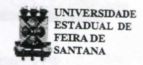

# **FOLHETIM DE EDUCAÇÃO MATEMÁTICA**

**Folhetim de Educação Matemática, Ano 8, n. 101, abr. 2001** 

**ISSN 1415-8779** 

# **OBJETIVO**

**Este** *Folhetim* **é um veículo de divulgação, circulação de ideias e de estímulo ao estudo e à curiosidade intelectual. Dirige-se a todos os interessados pelos aspectos pedagógicos, filosóficos e históricos da Matemática. Pretende construir uma ponte para unir os que estão próximos e os que estão distantes.** 

# **EDITORIAL**

**Como prometido no n°** 100, **apresentamos aos leitores mais uma relação dos temas tratados nos folhetins de** 1 **a** 100.

**Não se trata de um índice temático, nem divide em blocos de conteúdos afins, o que é desejado. Essa será nossa próxima tarefa.** 

**Uma análise rápida no texto que ora apresentamos revela um pouco de nossa caminhada durante esses oito anos de publicação. Revela também que os assuntos, principalmente nos últimos** *Folhetins,* **são tratados de forma mais extensa, ocupando, às vezes, dois até quatro deles.** 

**Outro fato a ser ressaltado é a diversidade de assuntos abordados, o que sem dúvida requer a a experiência e habilidade do prof. Carloman.** 

# **COMITÉ EDITORIAL**

**Carloman Carlos Borges (Doutor) Inácio de Sousa Fadigas (Mestre)** 

# **PERGUNTE QUE O NEMOC RESPONDE**

*Pergunte que o NEMOC Responde é* uma coluna de autoria do prof. Dr. Carloman Carlos Borges e objetiva atingir ao público interessado em Matemática nos seus múltiplos aspectos.

Caso o leitor queira fazer alguma pergunta escreva-nos.

Perguntas publicadas nos Folhetins anteriores:

N°OíAno 1.1993)- Objetivos do NEMOC.

N°l rAno 1.01.08.93) - Biografia do Prof. Omar Catunda.

N° 2 rAno 1.08.08.931 - Resolução do CONSAD.

N°3(Anol. 15.08.93')

**Pergunta.** *Existe algum ramo da Matemática no qual o conceito de número não possua importância?* 

# N°4(Ano 1.22.08.93)

**1" Pergunta.** *Você poderia aprofundar o que escreveu anteriormente sobre esse rarrw fascinante da Matemática que se chama Topologia? 2'* **Pergunta.** *A Matemática pode nos dar alguma "dica" a* 

*respeito do popular "jogo da velha"?* 

N° 5 (Ano 1.29.08.93)

**1' Pergunta.** *O número zero é um número ruitural?* 

**2\* Pergunta.** *Em alguns livros que tenho em casa,o zero ê considerado umnúmero par, erujuantoem outros o primeiro número par éo2. Onde se encontra a certeza?* 

**3" Pergunta.** A pergimta abaixo, que se desdobra em cinco outras, foi formulada pela garotinha Camila Gonçalves de Jesus, de 9 anos de idade. Ei-la: O *que é a Matemática ? Quando a Matemática foi inventada? Quantos anos a Matemática tem? Por quem a Matemáticafoi inventada? Quantos sinais existem na Matemática?*  **4" Pergunta.** *No ensino da Matemática, o que é mais* 

*importante - o rigor ou a clareza?* 

# N° 6 (Ano 1,05.09.93)

**1' Pergunta.** Uma colega de Salvador escreve-nos falando das grandes dificuldades por ela experimentadas no ensino do conceito do conjunto vazio. Seus alunos estão na faixa etária de 10 a 15 anos.

**2"PerguDta.** Um colega de Juazeiro daBahia escrevenos: Tenho um livro sobre Matemática no qual o autor escreve que "os números racionais são criações nossas e as regras que definem as operações entre eles dependem de nossa vontade". Eu pergunto: se é assim, se existe tal voluntarismo, por que não definimos a adição de duas frações desta maneira: basta somar os numeradores e os denominadores entre si; deste modo teríamos: — + — = *S-LL* g, respectivamente — + — = -— - = —.

**3 3 3** -1- **3 6 3" Pergunta.** Um colega de Feira de Santana escrevenos: "Acho que se deve possuir, em primeiro lugar, uma *compreensão exata* (o grifo é nosso) dos conceitos matemáticos para, então, em seguida, eles serem manipulados. Qual a sua opinião a respeito?"

# N°7rAno 1. 12.09.931

**Pergunta.** Claudene Ferreira Mendes, de Feira de Santana, pergunta: a) *Há um modelo para o ensino da "regra dos sinais "?b) Qual a melhor maneira de "passar" ao aluno o conceito de número primo ?* 

# N° 8 (Ano 1.19.09.93)

- **1' Pergvmta.** *A Matemática é uma ciência exata ? Porquê?* 
  - **2" Pergunta.** *Quem é Bourbaki?*
- **3" Pergunta.** *Qual foi o matemático que inventou os números naturais: 1, 2, 3, 4, 5, etc. ?*
- **4' Pergunta.** *Posso somar duas laranja com duas bananas?*

# N°9 (Ano 1.26.09.93)

- **1" Pergunta.** Um colega de Salvador indaga se *é correto afirmar que a Matemática, como ciência, foi criação dos gregos antigos.*
- *T* **Pergunta.** O mesmo colega da indagação anterior pergunta: *Há alguma relação entre a religião e a Matemática?* ( O grifo é nosso).

# N° 10 (Ano 1,04.10.93)

**1\* Pergunta.** *Em uma de suas respostas dadas anteriormente, você mostrou-se contrário ao ensino da Teoria dos Conjuntos; ora, esta vem sendo ensinada para crianças* 

*de 10/15 anos, com* êxito (o grifo é nosso). *Então, não acha melhorseguirumapráticaproveitosado queuma opinião?* 

**2\* Pergunta.** O mesmo colega da pergunta anterior, afirma indagando: *sabemos que o mundo fora da gente é contraditório;sabemos, também, seraconsistência(ausência de contradições) o critério de validade de qualquer teoria matemática. Pergunto: como pode a Matemática refletirtão bem a realidade se, ela, a Matemática, rejeita as contradições?* 

**3\* Pergimta.** *No artigo anterior, você afirma ser o homem produto biológico e do social. Acredito que você, sendo "progressista", considera prevalente o social, o adquirido; estou certo ?* 

# N° 11 (Ano 1,11.10.93)

**1' Pergunta.** Um colega de Feira de Santana indaga: *Que é a Medalha Fields?* 

**2' Pergunta.** *Como pode a Matemática criar modelos* em todas as áreas do conhecimento humano *e como esses podem* funcionar tão bem? (os grifos são nossos).

Essa pergunta foi formulada por um colega de Salvador.

# N° 12 (Ano 1,18.10.93)

- **1' Pergunta.** A professora Urânia, da cidade de Serrinha, indaga *se a raiz quadrada de um número inteiro positivo, possui dois valores.*
- **2\* Pergunta.** Um colega de Salvador pergunta afirmando: *existem condições necessárias e suficientes para umbomprofessorde matemática, quando concordamos, que a condição necessária é dominar o conteúdo matemático?*

# N°13(Ano 1.25.10.93)

- **1\* Pergxmta.** A professora Angéhca, de Terra Nova, indaga: *Que argumento deve ser usado pelo professor para que o aluno com preenda o significado das potências, evitando-se assim, que ele, o aluno, não multiplique a base pelo expoente?*
- **2'Pergunta.** Um colega de Salvador indaga: *qual o significado da palavra "algoritmo"?*
- *y* **Pergunta.** Um colega de Feira de Santana indaga: *qual a relação entre Matemática e Numerologia ?*

# N°14(Ano 1.01.11.93)

**1' Pergunta.** Um aluno da UNEB (Universidade do

# **NEMOC - NÚCLEO DE EDUCAÇÃO MATEMÁTICA OMAR CATUNDA**

FolhetimdeEducaçãoMatemática,Ano8.,n.l01, abr.2001 **-Editores:** Carloman e Inácio - **Secretária:** Josenildes | Ohveira Venas - **Editoração:** Evandro Vaz e Nivaldo de Assis - **Impressão:** Imprensa Gráfica Universitária - | **Periodicidade:** mensal - **Tiragem:** 1.200 exemplares - *Distribuição gratuita* **- Endereço:** Av. Universitária, s/n - \ km 03 - BR 116 - Campus Universitário - **Telefone:** (075)224-8115 - **Fax:** (075)224-8085 - CEP 44031-460 - Feira \ de Santana - Ba - BRASIL - **E-mail:** nemoc@uefs.br

Estado daBahia) indaga: *Como pode existir uma adição com infinitas parcelas e, mais do que isto, como pode esta soma ter como resultados um número finito?* 

*2'* **Pergunta.** Maria A. do Carmo, escreve: *quando definimos a potenciação de base* **a** *e expoente* **n,** *destacamos que* **n** *assume valores inteiros positivos a partir de 2. Como explicar, então, que a." = 1?* 

**3\* Pergunta.** AMce P. Silveira, de Salvador indaga: *a Matemática é uma criação ou uma descoberta ?* 

# - N° 15 (Ano 1.08.11.93)

**1" Pergunta.** Ubiratan Cerqueira, de Salvador, levanta as seguintes questões: *(a) qual a origem dos princípios lógicos ?* (o grifo é nosso); *(b) será que estes princípios são inatos?* 

*2'* **Pergunta.** Emihano Gonçalves de Jesus, morador no Conjunto Morada das Árvores, em Feira de Santana, indaga se 2 *mais 2 também pode ser igual a 5.* 

# N° 16 (Ano 1,15.11.93)

**Pergunta.** Sônia de Salvador, escreve: *Qual a origem da palavra* **função** *e qual o materruítico que primeiro a empregou?* 

# N° 17 (Ano 1.22.11.93)

**1» Pergunta.** Paulo L. Magalhães, de Salvador, indaga em qual época surgiu a Geometria Anahtica e qual sua importância.

**2\* Pergunta.** O mesmo colega da pergunta anterior quer saber a razão da dificuldade encontrada por nossos alunos quando se defrontam, pela primeira vez, com o estudo da Álgebra.

**3' Pergunta.** Ainda o mesmo colega das perguntas anteriores: quando surgiram os sinais de *mais* e *menos ?* E os *sinais de maior s menor?* i- ;,. v. ;

# N° 18 (Ano 1.29.11.93)

**Pergunta.** Um colega de Feira de Santana deseja saber o significado da palavra *Álgebra.* 

# N° 19 (Ano 1.06.12.93)

**1' Pergunta.** Cláudio José Souza do Nascimento, aluno do Curso de Matemática da UEFS, indaga: Como funciona a *prova dos nove?* 

**2"Pergunta.** UmcolegadeFeiradeSantanapergunta: *que é uma operação racional?* 

# N°20 (Ano 1,13.12.93)

**Pergunta.** Lucimar M. Nunes, aluno do Curso de Matemática da Faculdade de Formação de Professores, de Alagoinhas escreve: Se aceitamos aRelatividade, o que dizer do ressuscitamento do *infinitésimo ?* Que relacionamento há com a **ideia** filosófica em Matemática do *zero ?* E se fosse possível ir mais longe, que tal incrementar uma trindade com

a tão abominada *mônada ?* (Os grifos são do leitor).

# N°21 (Ano 1.20.12.93)

**1' Pergunta.** Albertram, de Salvador, indaga: (a) *qual o motivo de empregarmos a base decimal;* (b) *dentro do volumoso conhecimento materruítico dos egípcios antigos, que já conheciam o Teorema de Pitágoras, existe algum teorema por eles demonstrado ?* 

**2" Pergunta.** Um colega de Entre Rios pergunta: *que são grandezas comensuráveis e grandezas incomensuráveis ?* 

# N°22 (Ano 1.27.12.93)

*V* **Pergunta.** Jeová, de Salvador, pergunta: *quarulo devemos empregara* ponto *ou a* vírgula *para escrevernumerais ?* 

**2" Pergimta.** Nilson Silva indaga: *em um livro de Matemática li que, entre 13 pessoas existem, pelo menos duas delas que terão aniversários no mesmo mês. Como esta frase veio desacompanhada de qualquer outra explicação, pergunto: é possível justificá-la matematicamente?* 

**3" Pergunta.** José M. de Souza Guimarães, de Salvador, indaga: *Qual a explicação de a Materruítico ser considerada a Rainha das Ciências ?* 

# N°23 (Ano 1,03.01.94)

**1" Pergunta.** Edson Ramos, de São Gonçalo dos Campos e aluno da UEFS, ingada: (a) *existe alguma representação geométrica para o produto notável (a-bf?e (b) qual a justificativa dos critérios de divisibilidade ?* 

**2" Pergunta.** Um colega de Feira de Santana pergimta: *Qualquer pessoa pode aprender matemática ?* 

#### N° 24 (Ano 2. Março 1995)

**Pergunta.** Luiz P. de Carvalho pergunta: (a) *a ordem dentro da qual as palavras de um dicioruírio aparecem, tem algo a ver com a ordem estudada em Materruítico?* (b) *qual a finalidade de uma demonstração ?* (c) *ela deve ser ensinada no r ciclo?* 

#### N° 25 (Ano 2. Março 1995)

**Pergunta.** Carlos A. M. Fonseca, de Salvador, indaga: *{&) qual a razão do horário de verão eÇtí) por que a divisão por zero é proibida em Matemática.* 

#### N-26 (Ano 2, Março 1995)

**1' Pergunta.** Um grupo de alunos da UEFS e também professores do 1 ° grau, indaga: (a) *qual a definição de ângulo ? e* (b) *a diferença entre ângulos consecutivos e ângulos adjacentes?* 

**2" Pergunta.** *Umaprofessoraleu, em um de seus livros, que a expressão 1/12 deve ser lida: um doze* avos; *porém ao assistir uma palestra, o palestrante lhe assegurou que a expressão acima deve ser lida: um doze* avo. *Em dúvida, ela indaga: e agora?* 

**., 3" Perçunta.** Um colega de Feira de Santana perguntou:

*sempre escutei dizer que zero escrito à esquerda de um número, não altera este número, porém, dado o número 54, por exemplo, 0,54 é outro número bem diferente de 54.* 

**4" Pergunta.** Sônia P. Albuquerque, pergunta: quando escrevemos A = B, o que queremos, realmente, afirmar com isto?

# N°27(Ano2, Abril 1995)

**1" Pergunta.** Cláudio José do Nascimento, aluno do Curso de Matemática, da UEFS, escreve: *No Português, a disjunção "ou" representa duas coisas separadas; exemplo: Quero falar com Pedro ou João, enquanto que, a conjunção "e" significa união; exemplo: Quero falar com Pedro e João. Na Matemática, "ou" representa união de conjuntos e "e" intersecção de conjuntos. Como se processa essa relação entre a linguagem comum e a linguagem matemática?* 

**2" Pergimta.** Ronaldo, de Salvador, quer saber se, *empregando as coordenadas cartesianas ortogonais e, usando escalas diferentes nos dois eixos, a inclinação de uma reta passando pelos pontos (x^, y^) e (x^, y^) continua sendo definida como o quociente de y^ - y^ por x,- x^.* 

**3"Pergunta.** Um colega de Feira de Santana escreve: *Venho lendo, semanalmente, a sua coluna Pergunte que o NEMOC resporuie e, às vezes o que você escreve me causa muita surpresa. Por exemplo: por que você é contrário ao ensino dessa bela ciência em cursos como Enfermagem, Odontologia, etc?* 

# N°28 (Ano 2. Abril 19951

**l''Pergunta.** R. Rios,funcionáriodaUEFS, escreve: *Três pessoas, em um restaurante, gastaram R\$ 30,00, porém, o dono do mesmo somente cobrou R\$ 25,00, dando-lhes o troco de R\$ 5,00; ao garçonfoi dada uma gorjeta de R\$ 2,00, sobrando, assim, para cada pessoa um troco de R\$1,00. Como cada um dos três recebeu um troco de R\$ 1,00, eles gastaram 3.9 =27 reais, os quais somados aos R\$ 2,00 de gorjeta, perfazem um total de R\$ 29,00; falta, portanto,R\$ l,00e qual éa explicação?* 

*2'* **Pergunta.** Fábio Pereira, da Rua Marechal Deodoro n° 219, de Xique-Xique, escreve: *Em que aspecto a Matemática ajuda na compreensão do Cosmo ou seja, sobre as constelações, planetas,etc?* 

**3" Pergunta.** Um colega de Aracaju escreve: *Alguns livros de Matemática denominam a função* y = ax+b, *de função linear, enquanto outros a chamam de* função afim, *reservando a denominação de função linear para* y=ax. *Como ficamos?* 

**4" Pergunta.** O mesmo leitor da pergimta anterior escreve: *Há algum critério para o emprego das unidades de medidas? Por exemplo, comodevo abreviar quilómetro,* Km *(com* K *maiúsculo) ou* km (*com* k *minúsculo)?* 

# N°29 (Ano 2. Abril 19951

**Pergunta.** Uma colega de Feira de Santana indaga:

*Como introduzir a noção de número irracionala nível elementar?* 

#### N°3Q(Ano 2. Maio 19951

**1' Pergunta.** Uma colega de Feira de Santana indaga: *O que você acha do uso da* mnemónica *no ensino da Matemática ?* 

**2' Pergunta.** A mesma colega da pergunta anterior indaga: *Como tomar-se um bom professor de Matemática?* 

#### N°31 (Ano 2. Maio 19951

**l^Pergunta.** Fabíola de OUveiraPedreira, alunado Curso de Matemática, na UEFS, indaga: *Qual a origem da designação de ordináriasparafrações como 2/3,3/5, etc. ? Porque* ordinária.''

**2' Pergunta.** O colega Lucimar M. Nunes, do curso de Matemática da Faculdade de Formação de Professores de Alagoinhas, indaga: A divisibilidade irifinita *é possível, quer no mundo físico, quer no mundo da Matemática?* 

# N° 32 (Ano 2. Maio 19951

**Pergunta.** Lucimar M . Nunes, da Faculdade de Formação de Professores de Alagoinhas indaga: *Há outra Geometria além daquela nossa conhecida, a Geometria de Euclides ? Existe algum número que não seja nem real e nem imaginário?* 

# N°33 (Ano 2. Junho 19951

**1\* Pergunta.** Um colega de Salvador indaga: *Sabemos que x ^ 1 = . Minha pergunta é a seguinte: devido ao mencionado logo acima, eu posso, claramente, escrever que x +* **2 =** U= **-4)—** y ; *logo, posso afirmar que x + 2 foi fatorado, tendo como fatores x^ -4 e ?* 

*2'* **Pergunta.** O mesmo leitor da pergunta anterior indaga: *a expressão a:b:c possui uma significação precisa ?* 

*y* **Pergimta.** Ainda o colega das duas perguntas acima escreve: *Para amenizar o assunto tratado nas minhas duas primeiras perguntas, indago: a matemática grega antiga produziu alguma mulher matemática ? (O grifo é dele).* 

# N°34 (Ano 2. Junho 19951

**Pergunta.** Vlademir R. dos Santos, de Salvador, escreve: *Já fiz diversos cursos de reciclagem em matemática e continuo insatisfeito quanto ao ensino dessa ciência. O que pensa você?* 

# N°35 (•Ano2. Junho 19951

Pergunta. De Salvador, recebemos carta assinada por Paulo M. dos Santos: *Não entendo a razão pela qual você é contra a matemática, conderuindo, incluse, o seuensino em curso como Enfermagem, Odontologia, etc. Ademais, você critica tópicos dessa ciência que são ensinados por sugestões, emSimpósiosInternacionais, de matemáticos profissionais.* 

# N°36 (Ano 2. Junho 19951

**1"** Pergunta. Olegário P. dos Santos, de Salvador, escreve indagando: *Que é um número real? Por que real?* 

**2\*** Pergimta. *Como você encara o ensino da Lógica no 2°grau?* **, - » O** 

# N° 37 (Ano 2, Julho 1995)

Pergimta. Um colega de São Paulo, Buzohm, escreve: *como deveria ser o ensino de Lógica no 2° grau ou mesmo na Universidade, no chamado ciclo básico?* 

#### N°38 (Ano 2. Julho 19951

Pergunta. Ana Paula, pedagoga, do Rio de Janeiro, indaga *se a* reta *pode ser considerada como uma curva.* 

# N°39 (Ano 3, Agosto 1995)

Perçunta. O colega Américo, de Alagoinhas, pede que eu mencione algumas *regras que o ajudem a tomar-se um bom professor de matemática.* 

#### N° 40 (Ano 3. Agosto 1995)

Pergunta. Luis Francisco, residente na Rua Cláudio Manoel, 878, apt° 301, Belo Horizonte, escreve: *Você critica bastante a Matemática que eu gostaria (a) de saber, finalmente e de maneira definitiva qual a sua opinião sobre ela ?(b) como você encara o vínculo entre ela e o computador?* 

#### N°41 (Ano 3. Agosto 1995)

**1'** Pergimta. José Nilson da Silva, morador na Avenida Princesa Leolpodina, 56 bairro da Graça em Salvador apresenta algumas dúvidas: (a) uma grandeza física que tenha *direção, sentido e um tamanho,* é uma grandeza vetorial? (b) há diferença entre *circunferência e círculo ?* 

*2'* Pergunta. O mesmo leitor da questão anterior quer saber a razão peia qual *a.forma circular é* considerada perfeita. • -,.i.\*;^-;«'v **IW-** T U

# N^42 (Ano 3. Setembro 1995)

Pergunta. *Diversos professores de várias regiões do País têm nos solicitado a indicação de alguns livros para composição de uma pequena biblioteca.* 

#### N°43 (Ano 3, Oumbro 1995)

Pergimta. *Diversos professores de várias regiões do País têm nos solicitado a indicação de alguns livros para composição de uma pequena biblioteca* (Continuação).

#### N°44 (Ano 3, Novembro 1995)

Pergunta.Diverjoj*professores de várias regiões do País têm nos solicitado a indicação de alguns livros para composição de umapequerux biblioteca* (Continuação).

#### N°45 (Ano 3, Dezembro 1995)

Pergunta. O Ensino da Matemática.

# N-°46 (Ano 3, Janeiro 1996)

Pergunta. Marcelo da Rua Timóteo da Costa, 1033, Rio de Janeiro, pergunta: *a) como calcular a expressão:*  **^20** + 14V2" + **V20** - 14V2" 9"^^ « *natureza do número? c) como efetuaras suas extensões, a partir dos naturais até chegar aos complexos ?* 

#### N°47 (Ano 3. Fevereiro 1996)

Pergunta. Ronaldo M. Martins da Silva, residente no bairro Santana, São Paulo, escreve: *Como sabemos, os argumentos são divididos em dois tipos: dedutivos e indutivos.*  No primeiro tipo o raciocínio vai do geral para o particular ou para o menos geral e neste o raciocírúo parte do particular para o geral. *Isto posto, pergunto: a) a Indução Matemática é um método dedutivo ou indutivo ?b) poderia dar um exemplo de uma proposição verdadeira para os números naturais e que não possa ser demonstrada por esse método ? Agora, uma pergunta diferente: como vocês,matemáticos, encaram a continuidade do movimento ?* 

#### N°48 (Ano 3, Março 1996)

Pergunta. Luiz Francisco, residente à Rua **Cláudio**  Manoel, 878, apt°301, Belo Horizonte, escreve: *a) que éuma estrutura matemática ?b)porque a descoberta dos irracionais, na Grécia Antiga, provocou tanto alvoroço ? c) você concorda que não se deve ensinar Matemática divorciada de sua História? d) qual o exato significado de, exemplificando* 

#### N°49 (Ano 3. Abril 1996)

Pergxmta. Nivaldo G. da Silva, de Aracaju - SE, escreve: *a) por que a raiz quadrada de um número positivo não tem dois valores ? Exemplificando: a raiz quadrada de 4 poderia muito bem ter os dois valores: menos 2 e mais 2, pois ambos elevados ao quadrado reproduzem o número 4.* 

#### N° 50 (Ano 3. Maio 1996)

*•' b d b + d* 

**1"** Pergimta. *Alguns colegas nos indagam se é possível a existência de intervalos no conjunto dos ruiturais.* 

**2"** Pergunta.Um leitor de São Paulo, que não quis

identificar-se, escreve: *Quando estudamos frações aprende-*

*a c ad ~- bc ^ mos que: — + — = —— . Ora, não seria muito mais o d bd CL c a + c fácil somar assim:* — -\*-—= ": r *? Estarei errado em* 

# N°51 (Ano 3. Junho 19961

**1\* Pergunta.** Ao *dividirmos um segmento AB em 10 outros do mesmo comprimento, podemos afirmar que eles são iguais, isto é, que o segmento AB ficou dividido em 10 segmentos iguais?* 

*T* **Pergunta.** Muitos colegas estão, cada vez mais perplexos ante aquilo que eles chamam de eme *na Matemática*  e desejam minha opinião a respeito.

#### N° 52 ÍAno 3. Julho 19961

**Pergunta.** Mariângela H. Silva, de Curitiba nos pergunta: *Qual a sua opinião a respeito da demonstração seguinte de que qualquer número real a elevado a zero igual a 1? a" :* a" = *1 (divisão comum) (I); cT : a"" =* a""" = *cfi (divisão de potência de mesma base) (11). Ora, de (I) e (II) é fácil concluir que cP - 1. Peço-lhe sua opinião porque um colega daqui - sem me convencer - diz que se trata de uma demonstração errada.* 

# N°53 (Ano 4. Agosto-Dezembro 19961

**Pergunta.** Abaixo a transcrição de um trecho da carta enviada por Marta R. L. Borges, residente na Tijuca, Rio de Janeiro: *Sendo a Matemática basicamente uma linguagem, acho que os pedagogos modernos estão com razão quando afirmam que em seu ensino (isto vale, também, para outros campos) deve prevalecer o diálogo. Aulas dialogadas em lugar de aulas exposi tivas. Outra lição: o ensino deve ser mais* formativo *do que* informativo. *O que pensa você disto tudo?* 

#### N° 54 (Ano 4. Janeiro-Maio 19971

**Pergunta.** Muitos colegas têm indagado: mflj, *que é mesmo Educação Matemática?* 

# N° 55 (Ano 4. Junho 19971

**Pergunta.** Recebemos diversas cartas nas quais os leitores pedem nossa opinião a respeito do Construtivismo e a Matemática.

#### N°56 (Ano 4, Julho 1997)

**Pergunta.** Muitos colegas estão interessados em saber o significado da palavra *problema.* 

#### N°57 (Ano 5. Agosto 19971

**Pergunta.** Solange Garibalde A. de Menezes, do Rio Grande do Sul, indaga: *Como se verifica a criatividade matemática?* 

# N° 58 (Ano 5. Setembro 19971

**Pergunta.** Clarisse A. S. dos Santos, de Recife, escreve: *É verdade que o raio não cai duas vezes no mesmo lugar? Caso afirmativo, o lugar mais seguro para a gente resguardar-se de um raio é permanecer emalgum lugar onde a pouco tempo caiu um raio ? Há uma maneira matemática*  *de abordar o assunto?* 

# N°59 (Ano 5, Oumbro 1997)

**Pergunta.** Flávia C. de Souza, de Belo Horizonte, escreve: *Você não acha a hora de mudara estrutura curricular ru) que diz respeito ao ensino de Matemática?* 

# N°60 (Ano 5, Novembro 1997)

**Pergunta.** Ainda continuamos recebendo cartas de leitores interessados em saber mais detalhes sobre o Construtivismo.

# N° 61 (Ano 5. Dezembro 1997)

**Pergunta.** Muitos colegas continuam indagando sobre a utilidade de uma nova discipHna no currículo de matemática, qual seja a de Modelagem Matemática.

# N°62 (Ano 5, Janeiro 1998)

**Pergunta.** *Alguns modelos e sua fecundidade (continuação).* 

# N°63 (Ano 5, Fevereiro 1998)

**Pergunta.** Retomando a discussão do número anterior, *quais as três ideias básicas no Ensino da Matemática?* 

#### N° 64 (Ano 5. Março 1998)

**Pergunta.** Gertrudes A. dos Santos de Natal, Rio Grande do Norte, escreve: Adorana *receber mais informações sobre a vida do matemático francês Evariste Galois.* 

#### N°65 (Ano 5, Abril 1998)

**Pergunta.** Elizângela Maria de Lucena, for manda do Curso de Pedagogia desta Universidade, escreve: *Gostaria de saberá respeito de algumas diferenças básicas entre a linguagem natural e a linguagem matemática.* 

#### N°66 (Ano 5. Maio 1998)

**Pergunta.** *Quais as diferenças básicas entre a linguagem natural e a linguagem matemática ? (continuação).* 

#### N°67 (Ano5.Junhol998)

**Pergunta.** Temos recebido algumas cartas nas quais são postas questões assim apresentadas: *Qual o significado do Teorema de Gõdel? Que pensam os matemáticos sobre ele?* 

# N°68 (Ano 5. Julho 1998)

**Pergunta.** *Em que consiste a Prova de Gõdel? (Continuação).* 

# N°69 (Ano 6, Agosto 1998)

**Pergunta.** *A prova de Gõdel (Continuação).* 

# N° 70 (Ano 6. Setembro 1998)

**... . Pergunta.** Muitos colegas perguntam: *Qual a* 

matemática que deve ser ensinada para todos os cidadãos?

# Nº 71 (Ano 6, Outubro 1998)

1ª Pergunta. J. N. Brito de Sousa, de Maceió indaga sobre a possibilidade do cálculo da área da elipse por processos elementares, partindo da área do círculo.

2ª Pergunta. Por diversas vezes, os alunos nos perguntam qual a diferença entre o gráfico de movimento e a trajetória.

#### Nº 72 (Ano 6, Novembro 1998)

1ª **Pergunta**. Muitos colegas nos escrevem: *Qual a* "melhor" definição de função?

2ª Pergunta. Alice B. P. dos Santos, de Belo Horizonte indaga: pode uma equação algébrica de grau n, possuir um número de raízes superior a n?

### Nº 73 (Ano 6, Dezembro 1998)

Relação das perguntas dos Folhetins de 1 a 72.

#### Nº 74 (Ano 6, Janeiro 1999)

 $1^a$  Pergunta. Muitos leitores perguntam o "porquê" de certas "convenções" em matemática. Por exemplo: eles querem saber, por que 0! = 1 (fatorial de zero igual a 1). Pela lógica, segundo eles, deveria ser 0! = 0. Outros perguntam a razão da famosa "regra dos sinais" e assim por diante.

#### Nº 75 (Ano 6, Fevereiro 1999)

1ª Pergunta. As convenções matemáticas (continuação).

 $2^n$  Pergunta: Acácia Lima Borges, da rua Cláudio Manoel de Belo Horizonte escreve: "Tenho duas questões que me provocaram dúvidas: a) em livro de exercícios deparei-me com o seguinte: Seja a matriz  $A = \begin{pmatrix} 1 & 1 \\ 0 & 1 \end{pmatrix}$ . Calcular  $A^n$  ( n inteiro superior ou igual a 2). Os autores apresentam a seguinte resolução:

Considerem a matriz  $B = \begin{pmatrix} 0 & 1 \\ 0 & 0 \end{pmatrix}$ . Têm-se: A = I + B, onde I designa a matriz unidade. Daí:  $A^n = (I + B)^n = I + \begin{pmatrix} n \\ 1 \end{pmatrix} B + \begin{pmatrix} n \\ 2 \end{pmatrix} B^2 + ... + \begin{pmatrix} n \\ n \end{pmatrix} B^n ;$  ora:  $B^2 = \begin{pmatrix} 0 & 1 \\ 0 & 0 \end{pmatrix} \begin{pmatrix} 0 & 1 \\ 0 & 0 \end{pmatrix} = \begin{pmatrix} 0 & 0 \\ 0 & 0 \end{pmatrix}$ , donde  $B^n = \begin{pmatrix} 0 & 0 \\ 0 & 0 \end{pmatrix}, \forall n \geq 2 \text{ e, consequentemente:}$   $A^n = I + \begin{pmatrix} n \\ 1 \end{pmatrix} B = \begin{pmatrix} 1 & 0 \\ 0 & 1 \end{pmatrix} + n \begin{pmatrix} 0 & 1 \\ 0 & 0 \end{pmatrix} = \begin{pmatrix} 1 & n \\ 0 & 1 \end{pmatrix}.$ 

Minha dúvida: pode-se aplicar o Binômio de Newton sobre estruturas matemáticas (no caso as Matrizes) não comutativas? b) Como calcular os limites: i)  $\frac{1}{2} \left\{ \mathbb{E} \left( \frac{b}{N} \right) \right\}$ ;

ii) x+x+...x, com o número de parcelas igual a  $\left[\frac{1}{x}\right]$ ? Em ambos os limites, a variável x tende a zero. Em (i), (a,b)  $\in \Re^*x\Re$ .

# Nº 76 (Ano 6, Março 1999)

**Pergunta.** Muitos leitores escrevem: como épossível o ponto não possuir dimensão. Ainda: gerar um ente, no caso a reta, unidimensional? De onde vem tal dimensão?

# Nº 77 (Ano 6, Abril 1999)

1ª Pergunta. Paradoxos de Zenão (continuação).

2ª Pergunta. Um leitor de Alagoinhas, nos envia a seguinte pergunta: Quais as condições que devem ser estabelecidas sobre o número

$$\frac{ax+b}{a'x+b'}=r \quad (1)$$

para que ele seja racional, considerando que a, b, a' e b' são números racionais e x é um número irracional?

3ª Pergunta. Onofre A. L. dos Santos, de Belém do Pará, indaga: como calcular a área de uma elipse por processos elementares?

# Nº 78 (Ano 6, Maio 1999)

**Pergunta.** Muitos colegas se mostram curiosos a respeito dos famosos *quadrados mágicos*.

#### Nº 79 (Ano 6, Junho 1999)

Pergunta. Quadrados mágicos (Continuação).

#### Nº 80 (Ano 6, Julho 1999)

1ª Pergunta. Muitos alunos querem saber: O que a Álgebra estuda e o que é uma Álgebra? Eles ficam confusos quando encontram expressões tais como: a álgebra das proposições, a álgebra das matrizes, etc.

#### Nº 81 (Ano 6, Agosto 1999)

Pergunta. A colega Acácia R. Borges do Carmo, moradora na Rua Cláudio Manoel, 878, ap. 301, Belo Horizonte, quer maiores explicações sobre "função característica" de um conjunto A.

#### Nº 82 (Ano 7, Setembro 1999)

Pergunta. Inês Trombini Scheid, Rua Padre Agostinho Gastaldo, 1054, Bairro Ana Rech, Caxias do Sul - RS através de e-mail escreve - "Sou estudante do curso de Matemática na Universidade de Caxias do Sul e no primeiro semestre de 1999 cursei a disciplina Fundamentos de Matemática. Na disciplina, a professora incentivava as demonstrações matemáticas e apresentou o seguinte problema: demonstre que se né um inteiro positivo que não é quadrado perfeito, então, a raiz quadrada de né um número irracional. Gostaria de ajuda na demonstração do problema acima".

Nº 83 (Ano 7, Outubro 1999)

A atualização do Ensino da Matemática, por Elon Lages Lima

Nº 84 (Ano 7, Novembro 1999)

1º Pergunta. Max Denis de L. Santos, Conjunto Rui Palmeira, Bl-2A, Aptº 404, Maceió (Serraria), escreve: "certa vez, lendo um livro de matemática, vi uma maneira muito interessante de resolver uma equação do 1º grau com uma incógnita. Acho fantástico esse método e peço uma explicação".

 $2^a$  Pergunta. O mesmo missivista Denis escreve: "gostaria que os senhores tentassem encontrar a  $3^a$  raiz da equação  $x^2 = 2^x$ , pois as duas primeiras raízes eu consegui encontrar. Verificando o gráfico de  $f(x) = x^2$  e  $g(x) = 2^x$ , notamos que existe uma terceira raiz para x. Como encontrá-la?"

N° 85 (Ano 7, Dezembro 1999)

1ª Pergunta. Cristovão P. dos Santos, de São Paulo, indaga: "qual o valor que deve ser atribuído a 10π?"

2ª Pergunta. O mesmo leitor quer saber o significado da frase: "Deus criou os números naturais. O resto é obra dos homens."

Nº 86 (Ano 7, Janeiro 2000)

Pergunta. Muitos colegas de outros Estados perguntam como é o ensino da Matemática na Bahia.

Nº 87 (Ano 7, Fevereiro 2000)

Pergunta. Muitos colegas ainda perguntam: porque a Matemática Moderna fracassou? A culpa foi dos professores?

Nº 88 (Ano 7, Março 2000)

Pergunta. Neusa da Silva Peçanha A. dos Santos, de Uberlândia, deseja maiores explicações sobre os três problemas clássicos.

Nº 89 (Ano 7, Abril 2000)

Pergunta. Os três problemas clássicos (continuação).

Nº 90 (Ano 7, Maio 2000)

**Pergunta.** Aline B. S. de Souza, de Aracajú, deseja maiores informações acerca da *equação do 2º grau*, inclusive detalhes acerca da "fórmula de Báskara", tão badalada em nossos manuais escolares.

Nº 91 (Ano 7, Junho 2000)

Pergunta. A equação do 2º grau (continuação).

Nº 92 (Ano 7, Julho 2000)

A Eficácia da Matemática, por Geraldo Ávila

Nº 93 (Ano 8, Agosto 2000)

Pergunta. Josenildes Oliveira Venas Almeida,

Av. João Durval Carneiro nº 150, Condomínio Parque Cajueiro, Bl. 05, Aptº 202, Bairro Eucaliptos, Feira de Santana - Ba, indaga: Em que consistem o Último Teorema de Fermat e a sua demonstração?

Nº 94 (Ano 8, Setembro 2000)

Pergunta. Último Teorema de Fermat (continuação)

Nº 95 (Ano 8, Outubro 2000)

**Pergunta.** Carlos Moreira S. da Silva, de Alagoinhas e muitos estudantes do curso de Licenciatura em Matemática nos indagam: Como aprender a <u>demonstrar</u> em matemática?

Nº 96 (Ano 8, Novembro 2000)

Pergunta. Como aprender a <u>demonstrar</u> em matemática? (continuação).

Nº 97 (Ano 8, Dezembro 2000)

Pergunta. Como aprender a <u>demonstrar</u> em matemática? (continuação).

Nº 98 (Ano 8, Janeiro 2001)

Pergunta. Como aprender a demonstrar em matemática? (continuação).

Nº 99 (Ano 8, Fevereiro 2001)

Pergunta. Alice P. S. da Silva, de Salvador deseja informações acerca do *Triângulo de Pascal* 

Nº 100 (Ano 8, Marco 2001).

1ª Pergunta. O colega J. dos Santos de Almeida, de Salvador, pede para que seja demonstrada a igualdade:

$$1^{3} + 2^{3} + 3^{3} + \dots + n^{3} =$$

$$= \left[ \frac{n(n+1)}{2} \right]^{2} =$$

$$= (1 + 2 + 3 + \dots + n)^{2}$$

que ele viu proposta em Introdução à História da Matemática de Howard Eves, Editora da Unicamp.

2ª Pergunta. Recebemos o seguinte e-mail: "Meu nome é Tertuliano Franco; sou aluno de graduação da UFBae leio o Folhetim de Educação Matemática. Gostaria de tirar uma dúvida sobre Geometria com vocês. Quantos e quais os tipos de Geometria existem? Quais suas respectivas áreas de aplicação? Antecipadamente agradeço-lhe. Um abraço, Tertuliano. PS. Parabéns pelo trabalho competente realizado."

# **NÚMEROS ATRASADOS**

Envie para cada folhetim um selo de postagem nacional de 1º porte. Dentro de no máximo quatro semanas, contadas a partir da data de recebimento do seu pedido, você estará recebendo os folhetins solicitados.

OBS.: É permitida a reprodução total ou parcial desse folhetim, desde que citada a fonte.