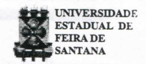
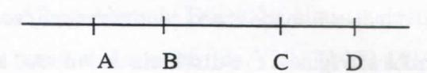
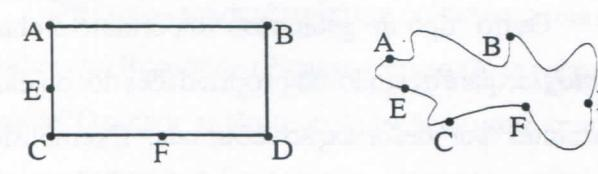

# FOLHETIM DE EDUCAÇÃO MATEMÁTICA

Folhetim Educ. Mat., Ano 8, n. 102, majo e jun. 2001

ISSN 1415-8779

#### **OBJETIVO**

Este Folhetim é um veículo de divulgação, circulação de idéias e de estímulo ao estudo e à curiosidade intelectual. Dirige-se a todos os interessados pelos aspectos pedagógicos, filosóficos e históricos da Matemática. Pretende construir uma ponte para unir os que estão próximos e os que estão distantes.

#### **EDITORIAL**

Este Folhetim dá sequência à abordagem sobre as geometrias. Campo vasto de investigações, no presente texto um recorte da topologia, geometria projetiva e afim é feito.

Como anunciado no número anterior, a partir do número 102 estaremos com a periodicidade alterada para bimestral, o que nos permitirá tratar dos assuntos com mais vigor, enriquecendo o nosso *Folhetim*.

# COMITÉ EDITORIAL

Carloman Carlos Borges (Doutor) Inácio de Sousa Fadigas (Mestre)

### PERGUNTE QUE O NEMOC RESPONDE

Pergunta. Geometrias (Continuação).

R. Mas, que é razão anarmônica de quatro pontos? Consideremos os pontos A, B, C, D

Sejam as razões CA/CB e DA/DB, então, a razão CA : DA CB : DB

é a razão anarmônica dos quatros pontos dados naquela ordem. Essa razão anarmônica é um notável invariante sob projeção: se A, B, C, D e A', B', C', D' são pontos sobre duas retas - os últimos quatro pontos sendo as respectivas projeções dos quatro primeiros pontos -, então  $\frac{CA}{CB}: \frac{DA}{DB} = \frac{C'A'}{C'B'}: \frac{D'A'}{D'B'}$ .

Outro tipo de geometria importante é chamado de Topologia, que é o estudo das propriedades dos objetos que são invariantes por deformação contínua. Exemplificando: a conexidade é uma propriedade topológica (ela é responsável pelo fato do objeto ser "inteiriço"). Numa transformação topológica não pode haver nem fusões, nem rupturas. Assim, de um mesmo pedaço de arame posso fazer essas duas transformações: a) enrolo-o, transformando-o em um círculo ou corto-o em dois outros pedaços. Nenhuma dessas duas transformações são topológicas, pois, na primeira há fusão de pontos e na segunda, ruptura. Noções de vizinhança, fora, dentro, interior-exterior, aberto-fechado, longe-perto, separado-unido, contínuo-descontínuo, alto-baixo, são noções topológicas. Claramente, essas noções costumam vir associadas

a outras tais como: adjacência (proximidade), ordem, etc., as quais, igualmente, se incluem no rol das noções topológicas. Quando digo: estou junto de você, emprego, por assim dizer, uma linguagem topológica (observar a presença do adjetivo junto...). Considere o quadrado abaixo.

 $A \cap B \cap B$ 

Rotulemos algumas propriedades dessa figura:

a) o lado AB mede cinco centímetros; b) seus quatro lados são iguais; c) a distância do lado AC à margem esquerda mede 5,5 cm; d) todos os seus ângulos são iguais; e) a figura divide o plano em três conjuntos de pontos: os pontos que estão dentro dela, os pontos que estão sobre as suas quatro linhas e os pontos que estão fora dela. A propriedade assinalada por último éestudada pela Topologia e observe que ela refere-se à "qualidade" e não à "quantidade". Veja, ainda as duas figuras abaixo:

Qualquer pessoa de "bom senso" dirá imediatamente: nada existe de comum entre essas duas figuras, pois a segunda é uma deformação da primeira e pode lembrar tudo menos o retângulo da esquerda que é uma "figura certinha". No entanto, examinando mais

atentamente essas duas figuras, pelo menos uma propriedade permaneceu invariante após a deformação: os pontos E, D e F permanecem, respectivamente, entre os pontos A e C, B e F, C e D. Apesar de toda deformação, a figura da direita conserva, para os pontos citados a mesma ordem dentro da qual eles se aparesentam na figura à sua esquerda. Aqui, estamos na presença de uma transformação topológica, pois ela conservou a ordem dos pontos citados, embora não tenha conservado a retidão dos lados e os ângulos tenham sofrido alterações profundas. Claramente, pela definição de geometria, não é difícil imaginar muitas outras geometrias: as geometrias não euclidianas, a geometria analítica, a geometria diferencial, geometria algébrica, etc.. O notável em tudo isso, é a extraordinaria fecundidade do Programa de Erlanger de Félix Klein, onde o papel unificador dos conceitos de grupo e invariância jogam um papel decisivo. A teoria dos Grupos não pode ser subsestimada como unificadora tanto na matemática como na física. A idéia de invariância é extremamente sugestiva. Ela parece ser o grande eixo em torno do qual são organizadas várias teorias científicas.

Considere as transformações rígidas do plano. Como sabemos elas formam um Grupo. As propriedades geométricas estudadas na *geometria euclidiana* são aquelas que não alteram-se pela ação desse grupo, como

#### NEMOC - NÚCLEO DE EDUCAÇÃO MATEMÁTICA OMAR CATUNDA

Folhetim Educ. Mat., Ano 8, n. 102, maio e jun. 2001 - Editores: Carloman e Inácio - Secretária: Josenildes Oliveira Venas Almeida - Editoração: Evandro Vaz e Nivaldo de Assis - Impressão: Imprensa Gráfica Universitária - Periodicidade: bimestral - Tiragem: 1.700 exemplares - Distribuição gratuita - Endereço: Av. Universitária, s/n - km 03 - BR 116 - Campus Universitário - Telefone: (75)224-8115 - Fax: (75)224-8086 - CEP 44031-460 - Feira de Santana - Ba - BRASIL - E-mail: nemoc@uefs.br

acontece com os comprimentos e os ângulos. De um modo mais sofisticado: em qualquer Geometria há dois elementos fundamentais: o espaço E e o grupo G das transformações operando nesse espaço. Pode-se definir a geometria euclidiana como o estudo de um espaco pontual sobre o qual opera o grupo das isometrias. Considere a transformação conhecida como deslocamento: ela conserva as distâncias e os ângulos orientados. Exemplos de deslocamento: a identidade, as translações, as rotações; uma reflexão não é um deslocamento pois ela transforma um ângulo orientado em seu oposto. As isometrias são transformações que conservam a distância. Os deslocamentos são isometrias e as reflexões também o são, embora não sejam deslocamentos. Outro tipo de geometria é a chamada Geometria Afim, isto é, o estudo do espaço E sobre o qual opera o grupo T das translações e as propriedades daí decorrentes. Um rápido parêntese: se Eé um conjunto qualquer, sabe-se que uma permutação de E é uma bijeção de E sobre si mesmo. Chamamos de P(E) o conjunto das permutações de E; então, um subgrupo importante de P(E) é o subgrupo I das isometrias, o qual admite como subgrupos notáveis: a) o subgrupo D dos deslocamentos; b) o subgrupo comutativo Rodas rotações de centro 0 (para todo ponto 0); c) o subgrupo comuntativo das translações. Ainda, Ro e T são subgrupos de D. Algumas propriedades de uma transformação afim: a) conserva o paralelismo de retas e igualmente há a conservação da relação de distâncias entre pontos situados sobre uma mesma reta. Passemos, agora a Geometria Projetiva que é o estudo das propriedades geométricas invariantes pela "projeção central". Quem estudou

geometria descritiva, sabe que ela estuda claramente a representação sobre um plano dos objetos observados por um observador. A perspectiva é uma projeção central cujo centro é o olho humano do observador. Ora o olho humano quando parado abarca apenas um máximo de 60°, o que claramente vai influenciar na representação dos objetos observados. O estudo mais detalhado dessas propriedades, objeto da Geometria Projetiva, encontrase ligado à pintura, desde os tempos de Leonardo da Vinci e Albert Albrecht Dürer. Os pintores da idade média, antes de Leonardo da Vinci (1452-1519) e Albrecht Dürer (1472-1528) ajustavam os tamanhos das figuras e objetos para realçar a sua importância na tela, enquanto que os dois pintores citados empregavam a perspectiva a fim de que as imagens planas se apresentassem aos observadores como cenas tridimensionais, com aquela profundidade que todos nós conhecemos. Anos mais tarde Girard Desargues (1593-1662) e Blaise Pascal (1623-1662) fizeram um primeiro estudo sobre a perspecitva e daí em diante surge a Geometria Projetiva.

Um exemplo desse tipo de projeção vem à mente quando olhamos um retrato, digamos três por quatro. Apesar das grandes deformações angulares e métricas, somos capazes de reconhecer no retrato a figura de uma pessoa amiga. Como isso acontece? A pintura de uma pessoa pode ser considerada como a projeção do original sobre uma tela, porém, a partir do centro de projeção, no caso o olho do pintor. No caso do retrato, deve ser considerada a máquina fotográfica como o olho do observador. O reconhecimento da pessoa amada em um simples retrato três por quatro - tão deformado, repita-

se - deve-se ao fato da existência de propriedades geométricas invariantes sob essa projeção. O estudo desses invariantes pertence à *Geometria Projetiva*. Outro exemplo que pode servir de ilustração da projeção central é a projeção de um círculo sobre uma tela: dependendo da posição da tela, o círculo se projeta em uma elipse (isso acontece quando o plano da tela não é paralelo ao plano da fonte luminosa) ou o círculo se projeta sobre um círculo homotético (caso no qual o plano da tela é paralelo, à fonte luminosa).

Essas duas representações podem ser alcançadas, igualmente, com a variação da posição da fonte luminosa. A propósito, vale a pena, talvez, recordar uma história que o célebre pintor Picasso gostava de narrar aos seus amigos: ele dizia que certa vez, ao viajar no metrô de Paris, um homem sentou-se ao seu lado e ao reconhecêlo como o pintor que pintava sempre "deformando" as pessoas, travou com ele o seguinte diálogo:

- Por que o senhor não pinta as coisas como elas são realmente? Respondeu Picasso: e como são as coisas realmente? O senhor, então, tirou de seu bolso um retrato de sua jovem esposa e disse: assim, como esse retrato. Picasso replicou: o senhor não acha que sua esposa está muito pequena e muito chata?

Convém ressaltar que todos os invariantes projetivos são também invariantes do grupo afim. A recíproca não é verdadeira: existem invariantes afins que não são invariantes projetivos. O principal invariante afim é a relação simples de três pontos pertencentes a uma mesma reta. Na Geometria Projetiva, a projeção de três pontos A, B, C contidos em uma mesma reta não é um invariante; em geral, essa projeção alterará as distâncias

AB e BC e, igualmente, a razão AB/BC. Agora, para quatro pontos A, B, C, D sobre uma reta e suas projeções A', B', C', D' sobre outra reta, existirá um notável invariante denominado de *razão anarmônica* dos quatro pontos.

Pergunte que o NEMOC Responde é uma coluna de autoria do prof. Dr. Carloman Carlos Borges e objetiva atingir ao público interessado em Matemática nos seus múltiplos aspectos.

Caso o leitor queira fazer alguma pergunta escreva-nos.

## NOTÍCIAS

Será ralizado de 19 a 23 de julho, no Rio de Janeiro, o VII ENEM - Encontro Nacional de Educação Matemática / Educação Matemática e Novas Tecnologias.

## Informações:

(21)590-0940 http://www.sbem.com.br http://www.viienem.ufrj.com.br

# PRÓXIMO NÚMERO

Geometrias (Continuação). Aguardem!

# **NÚMEROS ATRASADOS**

Envie para cada folhetim um selo de postagem nacional de 1º porte. Dentro de no máximo quatro semanas, contadas a partir da data de recebimento do seu pedido, você estará recebendo os folhetins solicitados.

OBS.: É permitida a reprodução total ou parcial desse folhetim, desde que citada a fonte.