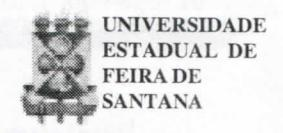
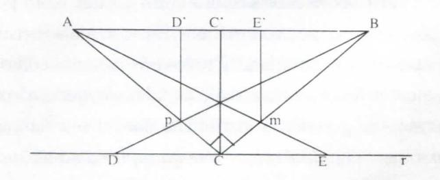

# **FOLHETIM DE EDUCAÇÃO MATEMÁTICA**

**FolhetimEduc.Mat., Ano 8 / 9, n. 103, jul. / ago. 2001**

**ISSN 1415-8779**

#### **OBJETIVO**

Este _Folhetim é_ um veículo de divulgação, circulação de ideias e de estímulo ao estudo e à curiosidade intelectual. Dirige-se a todos os interessados pelos aspectos pedagógicos, filosóficos e históricos da Matemática. Pretende construir uma ponte para unir os que estão próximos e os que estão distantes.

#### **EDITORIAL**

No mês de agosto, completamos mais um ano de pubUcação do Folhetim de Educação Matemática. Já se passaram 8 anos desde o primeiro número, o que para nós é, sem dúvida, uma vitória, sobretudo pelo reconhecimento e aceitação do _Folhetim._

Nesse número, concluímos a abordagem sobre a Geometria, iniciada no número 102.

A partir do questionamento de vários alunos, a coluna _Pergunte que o NEMOC Responde_ trata dos paradoxos, em particular daqueles tipos que suscitaram investigações de caráter matemático/filosófico. Vale a pena a leitura, principalmente pela clareza como o assunto é tratado.

# **COMITÉ EDITORIAL**

Carloman Carlos Borges (Doutor) Inácio de Sousa Fadigas (Mestre)

#### **PERGUNTE QUE O NEMOC RESPONDE**

**Pergunta.** _Geometrias (Continuação)._

R. O duplo caráter de transformação e invariância contido no conceito de grupo, transforma-o em um instrumento extraordinário de construtividade e consequentemente de fecundidade. Vej a o que o grande psicólogo Jean Piaget escreveu em seu livrinho (apenas 125 _páginas) O Estruturalismo:_ "...É assim _que o grupo dos deslocamentos_ deixa invariantes, além das dimensões das figuras deslocadas (portanto distâncias), os seus ângulos, paralelas, retas, etc. Pode-se então variar as dimensões mas conservando todo o resto, e obtém-se um grupo mais geral de que o grupo dos deslocamentos, que se toma um subgrupo: _éodas similitudes,_ que permite aumentar umafigura sem Lhe modificar a forma. Pode-se depois modificar os ângulos, mas conservando as paralelas e as retas, etc; obtém-se, assim, um grupo ainda mais geral do qual o das similitudes se torna _fiuhgrupo-.éodugeometriaafim..._ Continuar-se-á modificando as paralelas mas conservando as retas: chega-se, então, _-àogrupo projetivo_ (perspectiva, etc.) do qual os precedentes se tornam subgrupos encaixados. Finalmente,pode-senãoconservarjáas próprias retas e considerar figuras de certo modo elásticas de que só são mantidas as correspondências biunívocas e bicontínuas entre os seus pontos e será este o grupo mais geral ou _grupo dos "homeomorfismos ",_ próprio da _Topologia._ Assim, as diferentes geometrias, que pareciam constituir o modelo de descrições estáticas, puramente figurativas e repartidas por capítulos disjuntos, não formam já, utilizando a estrutura de grupo, senão uma vasta construção cujas transformações permitem, pelo encaixe de subgrupos, passar de uma estrutura a outra (sem falar na métrica geral que podemos apoiar na topologia para daí tirar as métricas particulares, não euclidianas ou euclidianas, e voltar por aí ao grupodos deslocamentos)." .

Essa interessante citação do grande psicólogo é pertinente, pois ele sustenta uma tese bastante repetida pelos educadores que lhe seguem os passos. Qual é essa tese? Para Piaget, a criança adquire, primeiro, as noções topológicas e, em seguida, as métricas.

Inicialmente (dos três aos sete anos, aproximadamente) a criança experimenta ausência dos princípios de invariância com relação às dimensões dos objetos quando eles sofrem deslocamentos. Nesse estágio de _representação topológica,_ como é denominado por alguns psicólogos, a criança, exemplificando, faz "confusão" entre um losango e um quadrado. Supondo verdadeira essa tese, suas implicações no ensino da matemática são importantes. A primeira delas e talvez a mais importante é a seguinte: noções que os matemáticos consideram como elementares como a de número, por exemplo, precisaria de um longo período para ser construída pela criança. Tal observação é válida para outras noções euchdianas, consideradas elementares: conservação e distâncias, dimensões, etc. Isso aliás é intuido pormuitas mães pobres, asquais para "enganarem" seus filhos na faixa etária mencionada (dos três aos sete anos aproximadamente), costumam espalhar a comida (que é muito pouca) no prato, dando-lhes a ilusão de mais comida. Com essa última observação, bastante dolorosa, porque verdadeira, encerramos nossa resposta ao colega J. dos Santos Almeida de Salvador, que nos previlegiou com a sua pergunta.»

**Pergunta.** Muitos alunos perguntam _qual o significado da palavra paradoxo e qual a relação dela com a matemática._

R. A palavra _paradoxo_ está muito relacionada com a matemática, a lógica e até mesmo com a filosofia. Isso é compreensível, pois ela gravita em tomo de uma **ideia** bastante perturbadora e criadora de problemas, alguns dos quais até hoje insolúveis: a **ideia** de _infinito._ Nesta exposição teremos oportunidade de abeirarmos não só dessas **ideias** como de outras, de certa forma pertencentes ao mesmo campo semântico das **ideias** de _paradoxo_ e _infinito. A_ palavra _paradoxo_ não possui um significado unívoco. De acordo com a sua raiz etimológica significa um enunciado à margem da opinião aceita. É aquilo que choca o senso comum. Exemplificando: o seguinte enunciado é paradoxal: "Carlos atingiu 23 anos, passando por apenas cinco aniversários". Para desfazero "absurdo" acima basta recordar, que, enquanto **a** idade de uma pessoa é medida pelo tempo decorrido, os aniversários coincidem com o dia do nascimento. Logo concluímos que Carlos nasceu em 29 de fevereiro; desfaz-se assim, o "mistério". Dentro desse mesmo significado pode-se considerar paradoxal a afirmativa de que há o mesmo número de número pares e ímpares. Com outro significado, ficamos chocados quando um argumento legítimo nos conduz a uma conclusão inteiramente falsa. Aqui, incluímos os famosos paradoxos de Zenão no seu empenho em mostrar a incompreensibilidade do movimento (Vide Folhetins 76 e 77). Existe, ainda, um outro significado para a _palavraparadoxo:_ quando, aparentemente, de maneira legítima, mostra-seque alguma coisa pode serverdadeira ou falsa, ao mesmo tempo. Alguns autores chamam esse tipo de paradoxo de _antinomia._

Um exemplo histórico dessa situação é dada

#### **NEMOC - NÚCLEO DE EDUCAÇÃO MATEMÁTICA OMAR CATUNDA**

FolhetimEduc.Mat.,Ano8/9,n. 103, jul./ago.2001 **-Editores:** Carloman e Inácio - **Secretária:** Josenildes Oliveira Venas Almeida - **Editoração:** Evandro Vaz e Nivaldo de Assis - **Impressão:** Imprensa Gráfica Universitária - **Periodicidade:** bimestral - **Tiragem:** 1.500 exemplares - _Distribuição gratuita -_ **Endereço:** Av. Universitária, s/n - km 03 - BR 116 - Campus Universitário - **Telefone:** (075)224-8115 - **Fax:** (075)224-8086 - **CEP:** 44031-460 - Feira de Santana - Ba - BRASIL - **E-mail:** nemoc@uefs.br

pelo paradoxo de Epimênides, cretense, que afirmava: _todos os cretenses são mentirosos._ Ora, afirmar que todos os cretenses mentem, ele, Epimênides, também cretense, mente ou fala a verdade? Suponha, primeiro, que Epimênides fala a verdade; logo, sua afirmativa é falsa. Suponha, agora, que ele é mentiroso; logo, ele falou a verdade. É uma situação complicada: a assertiva de Epimênides parece ser verdadeira c falsa, ao mesmo tempo. Outra situação paradoxal c afim com essaé dada pelo _paradoxo do barbeiro: nunni aldeia A e.xiste um barbeiro que faz. a barba de todos os homens de A que não se barbeiam a si mesmos._ Veja que situação absurda naqual foi colocado o **pobre** _úo_ barbeiro: ele não podebarbear-see, igualmente, não **pode** deixar de fazer asuaprópriabarba.Emqualquerdessasduasaltemativas, adecisãoqueobarbeirotomariiácuntraadcfiniçãoque lhe foi dada: _fazer a barba de todos os homens de A que não se barbeiam a si mesmos._ Sc cie se barbeia, não mais faz parte dos homens que não se barbeiam a si mesmos, e esses são os únicos **homens** que ele pode barbciar. Se cie não se **barbeia, enião .** pertence ao **CDiíJLiiiUi** de **pessoas** que ele **precis a** harbciar, isto é, **ii**.i(.|uek's que se barbeiam so**/mlH**>s. I- **então :** ele se **barbeia** ou não'.'... Paradoxos **desse** i ipo **sã o** bem antigos e serviam até de gracejos na **idade media.** Os lógicos não os olhavam com a seriedade de\a e **foi** preciso o desabrochar do século XX. quaiuh' e le^ retornaram a cena, "pipocando" naTeoria **dos** Co n i **iinios.** elaborada por Cantor, para que seu estudo **assumiss e** o destaque merecido, embora os problemas **por** eles levantados ainda continuem sem uma solução consensual da comunidade matemática. "

Como dissemos, a Teoria dos Conjuntos, elaborada por Cantor, o foi de maneira ingénua e intuitiva. Vejacomoele "define" conjunto: _"Porconjunto compreendemos uma coleção C, de determinados objetos c, bem distintos, de nossa concepção ou pensamento - chamados de elementos deC- dentro de uma totalidade."_ Claramente, isso não é uma definição pois permite a construção dos mais extravagantes monstrinhos...Nessa mesma linha de ideias,encontra-se a definição de conjunto dada por Dedekind. São "definições" que fazem lembrar as do ponto e reta dados por Euclides: inúteis, porque obscuras e sem nenhuma operacionahdade. Dedekind chega mesmo a _"provara existência de conjuntos infinitos"_ ao considerar o _"conjunto dos pensamentos"._ Veja o início dessa "demonstração": "O mundo das minhas ideias, isto é, a totalidade, S, de todas as coisas que podem ser objeto do meu pensamento, é infinito. Pois, se **5** é um elemento de S, então o pensamento **5**', digamos, de que **Í** pode ser obj eto do meu pensamento, é ele mesmo um elemento de S...". Essa "demonstração" foge a qualquer padrão demonstrativo e, pela sua densidade subjetiva, não pode ser considerada como uma demonstração, mas, sim, como uma construção barroca sem nenhum suporte lógico. Ante o exposto, não é de se estranhar a "construção"dos mais bizarros conjuntos. O primeiro paradoxo publicado modernamente foi o do matemático italiano Cesar Burah-Forti. Vejamos ele mais de perto. Seja a sequência de números naturais: 0,1,2,3,4,5,6, 7, 8, 9, 10, 11. O ordinal 11 (décimo segundo da sequência) representa o último elemento desse conjunto. Assim, considerando a sequência 0,1,2,3,4,5,6,... de todos os naturais, corresponderia ao último elemento _m_ dessa sequência o ordinal _m+_ 1, donde se conclui que m não é o último, o que levou o matemático italiano a escrever: "O conceito de todos os números ordinais é um conceito em si mesmo contraditório, pois o último ordinal da série (começando com zero) é sempre maior que o último elemento". Nessa mesma Unha há o "paradoxo de Cantor". Ele diz respeito ao _conjunto de todos os números cardinais, finitos e infinitos._ Esse conjunto possui um número cardinal ou não? Como na Teoria dos Conjuntos Cantoriana, cada conjunto devia possuir um número cardinal, então, o conj unto mencionado o possui. Ora, tal resposta leva à seguinte situação: o número correspondente a _todos_ os cardinais deve ser maior do

que qualquer cardinal. Ainda, nessa mesma linha de raciocínio há a famosa _"antinomia russeliana"_ devida ao grande filosofo, lógico e matemático inglês Bertrand Russell e constante de uma carta dirigida por Russell ao outro notávelFrege, em 1902.Essa antinomia diz respeito ao conceito: _"conjunto de todos os conjuntos"o_ qual leva a sérias contradições. Segundo a nebulosa definição de conjunto dada por Cantor, temos uma grande liberdade de criar diversos tipos de conjunto. Por exemplo: _um conjunto composto exatamente de todos aqueles conjuntos que não contém a si mesmos como elementos. A_ propósito, Russel formulou a seguinte questão: _"Será que este conjunto de todos os conjuntos, que não contém a si mesmos como elementos, contém a si mesmo como elemento ou não"!_ Procuremos aclarar melhor essa "confusão". Nossa imaginação pode ser conduzida a dois tipos de conjuntos: aqueles que sej am elementos de si mesmos e aqueles que não o sej am. Exemplificando: o conjunto de todas as árvores, não é uma árvore. Logo, ele serve para ilustrai o segundo tipo acima. Quanto ao primeiro tipo, ele pode ser ilustrado pelo conj unto de todos os nossos pensamentos'', pois ele mesmo, é um pensamento.

Retomemos à pergunta formulada por Russell: _"Será que este conjunto de todos os conjuntos, que não contém a si mesmos como elementos, contém a si mesmo como elemento, ou nãol_ "Qualquer que seja a resposta, entramos num beco sem saída, isto é, nos batemos com uma contradição, pois, se esse conjunto contém a si mesmo como elemento, então ele entra em choque com a sua definição de conjunto de todos os conj untos que não contém a si próprios como elementos. Aqui, há, portanto uma contradição. Logo ele não contém a si próprio como elemento.

Mas, se ele não contém a si mesmo como elemento, então (como conjunto que não é elemento de si mesmo) ele deve ser elemento dele mesmo. Entramos, assim, naquilo que é designado pelos lógicos de _"círculo vicioso"_ ou raciocínio circular. Para firmar meUior o entendimento dessa questão, compare-a com o paradoxo possa aclarar ainda mais aantinomiarusselliana...Seja _R o_ "conjunto de todos os conjuntos que não pertencem a si mesmos". Como _R_ é um conjunto, se ele pertence a si mesmo, isto é, se **G** /?, então ele não é elemento de /?, ou seja /? g/?. Da mesma forma, _seR^R,_ então*R eR* (tenha sempre em mente a definição de _R)._ Podemos resumir: _ReRste_ somente _sc R^R,_ isto é, _alguma coisa é verdadeira se e somente se não for verdadeira.Farece_ que o surgimento desse tipo de paradoxo se acha ligado ao emprego - sem maiores cuidados - da palavra _todos, o_ que nos leva, naturalmente a outro conceito, o do infinito, objeto da Teoria dos Conjuntos, pelo que vale a pena escrever algo acerca dessa extraordinária teoria. Desde o antigo ginásio estamos acostumados com o axioma eucUdiano: _"o todo é maior que a parte"_ considerado evidente por si mesmo... Antes de mais nada vej amos a diferença entre dois tipos de infinitos: _o infinito potencial e o infinito acabado. O infinito potencial_ está ligado à possibihdade de repetição ilimitada, mentalmente, de uma mesma operação. Exemplificando: dado um número natural por maior que seja, temos a possibilidade de ultrapassá-lo através da operação de _"sempre juntar-lhe mais um"._ O _infinito atual_ ou _infinito acabado é_ a tomada de consciência de todos os elementos de um conjunto infinito. Exemplificando: a totahdade dos números naturais, a totalidade dos números reais, etc. É como se seus elementos (uma infinidade) fossem dados simultaneamente, enquanto, no infinito potencial, seus elementos são dados sucessivamente. Neste infinito temos o _devir,_ a série infinita de mudanças, em oposição ao ser imutável, que seria o infinito acabado, atualizado. ~ =

do barbeiro. Agora, talvez, um pouco de formalização

A existência do infinito acabado sofre contestações desde a antiguidade. Aristóteles, por exemplo, admitiaapenas a existência do infmito potencial e mais perto de nós, Gauss, em 1831, escreveu: "sou contra o emprego de uma grandeza infinita como algo j á realizado, o que nunca é permitido em Matemática. O infinito é apenas uma maneira de falar _(unefaçon de_

_parler)._ Na realidade, falam de limites, aos quais podem aproximar-se certas quantidades, na medida que se desejar, ao passo que outros têm permissão de _crescer sem barrreiras."_ Enquanto isso. Cantor, com a sua extraordinária coragem intelectual, a qual talvez tenha faltado ao notável Gauss no caso das geometrias não euclidianas, escreveu: **"Fui** forçado, no decurso de muitos anos de esforços e experiências científicas, quase contra a minha vontade, pois contraria as tradições que me são valiosas, apensar matematicamente em termos de números de grandezas infinitas, não só na forma do crescente ilimitado, como também na forma determinada do infinito acabado". Para se ter uma **ideia** da coragem intelectual de Cantor, é pertinente lembrar que as **ideias** de Gauss sobre esse assunto eram aceitas tanto por filósofos como por matemáticos. Em tomo delas existia quase uma unanimidade. E todos nós sabemos como é penoso investir contra a tradição. Ademais, quem não se lembra da geometria euchdiana com o seu famoso axioma: _"O todo é maior que qualquer uma de suas partes"? Claro,_ que partes próprias! **O** rompimento de Cantor contra toda a tradição filosófica e matemática ao tratar o infinito, causou-lhe dolorosos sofrimentos, como é sabido por toaos. Quem pxxieriaimaginar uma totalidade equivalente a uma de suas parte.;? A não ser que uma dessas partes fosse a própria totalidade. **O** axioma euclidiano estava acima de qualquer discussão! E, repetindo, durante séculos, em todas as escolas do mundo inteiro, como uma verdade _"evidente por si mesma"._ Hoje, sua validade se restringe apenas quando a totahdade representa um conjunto finito. Quando ela representa uma infinidade acabada, o evidente é que ela pode ser equivalente a uma de suas partes. Pelo menos nós, assim, o aceitamos, embora sem deixar de experimentar um sentimento de espanto envolvido em grande fascinação. Cantor retoma uma das **ideias** mais simples e humilde da humanidade, _a ideia de correspondência -_ como associação mental entre dois entes - e mostra que em conjuntos infinitos, o todo pode

ser equivalente a uma de suas partes. Vai mais além e define: _"um conjunto é infinito sempre que for equivalente a um subconjunto próprio de si mesmo. Caso contrário, o conjunto é finito"._ Hoje, o estudante de graduação em matemática sabe estabelecer uma correspondência biunívoca entre a totalidade dos números naturais (como infinito acabado) e a totalidade dos números pares - que é uma parte dos números naturais:

$$\begin{array}{cccccccccccccccccccccccccccccccccccc$$

De uma só vez, esse eminente matemático questiona o célebre axioma euclidiano e postula a existência do infinito acabado. Enveredando decididamente por novos caminhos, ele generaliza o conceito de cardinalidade de conjuntos finitos; agora, esse conceito é estendido para conjuntos infinitos. **O** primeiro cardinal passa a ser o do conjunto dos números naturais, designado por Kj, _{aleph-zeropúmára_ letra do alfabeto hebraico). Enquanto a cardinalidade de um conjunto com um número finito de elementos é representado simplesmente por um número natural, a cardinalidade de um conjunto infinito é representado por _umnúmero transfinito._ Assim, o primeiro transfinito é o aleph-zero e, doravante qualquer conj unto que possa ser colocado em correpondência biunívoca com os números naturais é chamado de _conjunto enumeravel_ e de mesma potência (mesma cardinalidade) do conj unto dos naturais. Enumerar, contar os elementos de uma coleção, é colocá-los em correpondência bium'voca com uma parte ou com a totalidade dos números naturais. Cantor demonstrou serem os conjuntos dos números pares, dos números ímpares, dos números racionais, da mesma grandeza, da mesma potência dos naturais. Todos eles são enumeráveis infinitos. Eo conjunto dos números reais? Ele é enumeravel? Seus elementos podem ser

postos em correspondência biunívoca com os números naturais? Essas duas totalidades infinitas possuem a mesma potência? Tentemos comparar as propriedades dos números racionais com as propriedades dos números reais.

I) O conjunto dos pontos de uma reta (isto é, o que é o mesmo, em certo sentido, o conjunto dos números reais) é infinito; o dos racionais também o é.

**n)** Ambos o s conj untos são ordenados: dado um ponto P da reta e outro ponto A, este precede àquele se estiver a sua esquerda; dados dois racionais _x e.y, x_ precede y quando _x_ for menor que _y._

III) Dados dois racionais distintos quaisquer entre eles há uma infinidade de outros racionais; o mesmo acontece com dois reais distintos quaisquer. Conjuntos com essa propriedade são chamados de _densos._ Mais formalmente um conjunto C é denso se nele existe uma relação de ordem _3^_ com a seguinte característica: sempre que _x?Áz_ (supondo _x ^ z),_ existe um **y** tal que _x :¥lyQ y PÂ Z ,_ ou seja, dados dois elementos distintos, **X** e z, de C, há um elemento >• entre eles. Apesar de ambos possuírem essas três propriedades, seus elementos não podem ser postos em correspondência biunívoca. O conjunto dos pontos da reta ou o conjunto dos reais, não é enumeravel. A potência dos reais é de outro tipo. A cardinaUdade dos reais é maior que a cardinalidade dos naturais. Na realidade, chamando de ç a cardinalidade dos reais, demonstra-se que:

c=2''"

Mas, o que impede a correspondência biumVoca entre os dois conjuntos? A resposta é dada pela notável propriedade dos reais: a _continuidade,_ propriedade inexistente tanto nos naturais como nos racionais. Como se não bastasse tantos resultados admiráveis, essa teoria nos surpreende com este: pode-se estabelecer uma correspondência bium'voca entre os pontos de uma reta e os pontos de um segmento. Seja AB um segmento e _r_ uma reta qualquer paralela à AB. Liguemos A e B ao ponto C, da reta _r,_ de tal maneira que o ângulo ACB sej a reto. A projeção C sobre AB é C. Seja D um ponto _qualquer dera_ esquerda de C e o liguemos ao ponto B. Sobre o segmento AC, temos o ponto*p,* cuja projeção sobre AB, será D'. Do exposto se conclui: a qualquer ponto D (à esquerda de C) corresponde outro ponto D' àesquedadeC. Analogamente, _seiaumponto qualquer_ E de r à direita de C e o liguemos ao ponto A. Sobre o segmento BC determinamos o ponto _m_ cuja projeção sobre AB c E'. Logo: a qualquer ponto (à direita de C) correponde o ponto E' à direita de C. De uma maneira inteiramente análoga, o que acabamos de fazer pode ser estendido para todos os pontos da reta _r,_ ficando, desta forma, estabelecida uma correspondência biunívocaentre os pontos da reta r e o segmento AB. •

_^^••^uiiic que o NEMOC Responde_ é uma coluna **dc** autoria do prof. Dr. Carloman Carlos Borges c objeliva atingir ao público interessado em Matemática nos seus múltiplos aspectos.

Caso o leitor queira fazer alguma pergunta escreva-nos.

## **PRÓXIMO NÚMERO**

_Aguardem!_

## **NÚMEROS ATRASADOS**

Envie para cada folhetim um selo de postagem nacional de 1° porte. Dentro de no máximo quatro semanas, contadas a partir da data de recebimento do seu pedido, você estará recebendo os folhetins soUcitados.

OBS.: É permitida a reprodução total ou parcial desse folhetim, desde que citada a fonte.
