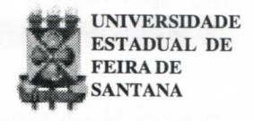

# FOLHETIM DE EDUCAÇÃO MATEMÁTICA

Folhetim Educ. Mat., Ano 9, n. 104, set. / out. 2001

ISSN 1415-8779

#### **OBJETIVO**

Este Folhetim é um veículo de divulgação, circulação de idéias e de estímulo ao estudo e à curiosidade intelectual. Dirige-se a todos os interessados pelos aspectos pedagógicos, filosóficos e históricos da Matemática. Pretende construir uma ponte para unir os que estão próximos e os que estão distantes.

#### **EDITORIAL**

Desde o _Folhetim_ de nº 100, sem dúvida um marco para nós, nesse desafio de escrever com qualidade sobre Educação Matemática, estamos recebendo várias correspondências de pessoas nacionalmente conhecidas na área, parabenizando-nos pelo trabalho. É com grande satisfação que recebemos tais apoios, o que nos incentiva a continuar produzindo os _Folhetins_.

E, para dar continuidade ao trabalho, o presente _Folhetim_ traz a seqüência do tema apresentado no número anterior, sobre o significado de _paradoxo_. Algumas propriedades dos transfinitos são apresentadas, para dar embasamento a questões ligadas a paradoxos.

## COMITÉ EDITORIAL

Carloman Carlos Borges (Doutor) Inácio de Sousa Fadigas (Mestre)

### PERGUNTE QUE O NEMOC RESPONDE

**Pergunta.** Muitos alunos perguntam qual o significado da palavra paradoxo e qual a relação dela com a matemática (continuação).

R. Do que foi exposto, concluímos que o conjunto Y é equipotente ao conjunto X, se existe uma bijeção f de X sobre Y. Assim, podemos falar sobre o novo objeto matemático, simbolizado por card(X) ou #(X), escrevendo:

$$card(X) = card(Y) \iff X eq Y$$

Ainda, $card(\emptyset)=0$ , número cardinal zero; $card(\{a\})=1$ , número cardinal 1. (Observar que, então $0 \neq 1$ , pois não existe bijeção de $\emptyset$ sobre ( $\{a\}$ ). Nas linhas acima já assinalamos a antinomia ligada à existência do _conjunto de todos os conjuntos_. Por isso, não devemos considerar que os números cardinais constituem um conjunto. O emprego feito por alguns autores da identificação de $\mathbb N$ ao conjunto dos cardinais finitos deve levar em consideração essa observação. Para dois conjuntos A e B, pode acontecer que:

1. A seja equivalente a uma parte de B; 2) B seja equivalente a uma parte de A; 3) ambos os casos anteriores; 4) nenhum dos casos anteriores. O caso (3) acima, em alguns livros aprece com a redação: A equivalente a B. Nesse caso, admite-se o teorema de Bernstein: "Se A é um conjunto equivalente a uma parte de B, e B é equivalente a uma parte de A, então, A é equivalente a B". Vejamos, agora, algumas relações nas quais há predominância dos transfinitos.

I) Seja A = $\{1, 2, 3, \ldots, n\}$ um conjunto finito. Logo A $\subset$ N. Por (1), tem-se: $n \leq \aleph_0$ . Igualmente, $\{1, 2, 3, \ldots, n, n+1\}$ está contido em $\{1, 2, 3, \ldots\}$ , donde $n+1 \le \aleph_0$ . A possibilidade de ser $n \ge \aleph_0$ , levaria a $n+1 \ge \aleph_0$ , o que é absurdo. Logo:

II) $\aleph_0$ mais qualquer cardinal finito, permanece sempre $\aleph_0$ . Realmente:

$$\{1, 2, 3, \dots, n\} \cup \{n+1, n+2, n+3, \dots\} =$$

$$\text{conjunto finito} \qquad \text{conjunto infinito}$$

$$= \{1, 2, 3, \dots, n, n+1, n+2, n+3, \dots\}$$

$$\text{conjunto infinito}$$

donde:
$$n + \aleph_0 = \aleph_0$$

III ) Provemos que $\aleph_0 + \aleph_0 = \aleph_0$ . Ora, isso é evidente, pois, o conjunto dos inteiros naturais ímpares reunido ao conjunto dos inteiros naturais pares é igual ao conjunto dos inteiros naturais, isto é, $\{1, 3, 5, ...\} \cup \{2, 4, 6, ...\} = \{1, 2, 3, 4, 5, ...\}$ . Resumindo,

$$\begin{split} \aleph_0 + 1 &= \aleph_0 \\ \aleph_0 + \mathbf{n} &= \aleph_0 \\ \aleph_0 + \aleph_0 &= \aleph_0 \\ \text{A tabela para a multiplicação:} \\ \aleph_0 \times 1 &= \aleph_0 \\ \aleph_0 \times \mathbf{n} &= \aleph_0 \\ (\aleph_0)^2 &= \aleph_0 \times \aleph_0 = \aleph_0 \\ (\aleph_0)^{\mathbf{n}} &= \aleph_0, \text{ onde n representa um inteiro finito.} \\ \text{Retornemos, agora, aos paradoxos mencionados.} \end{split}$$

O Paradoxo de Burali-Forti: ele diz respeito tanto à cardinalidade como à ordinalidade. Consideremos a seguinte lista dos naturais:

Éfácil ver que (1) possui o ordinal 6, vez que seu último elemento é 6 a partir do zero. E a sua cardinalidade? Pelo quadro abaixo:

$$\begin{array}{cccccccccccccccccccccccccccccccccccc$$

Vemos que a cardinalidade de (1) é 7 (o último elmento da correspondência). Ao aumentarmos uma unidade à (1) teremos claramente:

cardinalidade
$$\rightarrow$$
8 ordinalidade $\rightarrow$ 7

e, assim, sucessivamente. Ao prosseguirmos nesse caminho, isto é, de acrescentar sempre um elemento à (1), a diferença entre o número cardinal e o ordinal é "um". Generalizando, pode-se concluir, então, que para a ordinalidade $\aleph_0$ tem-se $\aleph_0 + 1$ , isto é, $\aleph_0$ não pode ser considerado como o número que fornece a totalidade dos inteiros naturais. Nesse raciocínio, que é de Burali-Forti, há um pequeno (?) "pecado". Qual é esse "pecado"? Ele simplesmente postulou que propriedades válidas no domínio do finito permanecem igualmente válidas no domínio do infinito. Trata-se de uma postulação incorreta e, até mesmo, ingênua. Mas, apenas como um simples

## NEMOC - NÚCLEO DE EDUCAÇÃO MATEMÁTICA OMAR CATUNDA

Folhetim Educ. Mat., Ano 9, n. 104, set./out. 2001 - Editores: Carloman e Inácio - Secretária: Josenildes Oliveira Venas Almeida - Editoração: Evandro Vaz e Nivaldo de Assis - Impressão: Imprensa Gráfica Universitária - Periodicidade: bimestral - Tiragem: 1.800 exemplares - Distribuição gratuita - Endereço: Av. Universitária, s/n - km 03 - BR 116 - Campus Universitário - Telefone: (75)224-8115 - Fax: (75)224-8086 - CEP 44031-460 - Feira de Santana - Ba - BRASIL - E-mail: nemoc@uefs.br

exercício do emprego da aritmética do transfinito, vamos considerar a postulação correta. Mesmo assim o paradoxo deixa de existir quando sabemos que (como já vimos)

$$\aleph_0 + 1 = \aleph_0$$

O paradoxo de Burali-Forti só seria verdadeiro caso a aritmética do finito fosse igual à aritmética do transfinito. Postular que propriedades válidas em um domínio matemático permanecem válidas em outro domínio matemático que seja mais geral que o anterior se constituiu em um princípio muito valioso em matemática. O desenvolvimento inicial da aritmética nota-se claramente a presença desse princípio. Somente quando a matemática atingiu estágios bem mais elevados ele foi abandonado e hoje é uma página virada da história dessa ciência. De passagem, basta lembrar que os antigos gregos sabedores de que um polígono regular pode ser facilmente quadrável, isto é pode ser encontrado um quadrado de área equivalente a ele (o quadrado), imaginavam o círculo também quadrável, pois este não é o limite de um polígono de n lados quando n cresce indefinidamente? Bento de Jesus Caraça, em seu belo livro Conceitos Fundamentais da Matemática escreve "ainda no final do século XVIII encontramos numa obra de Simon L'Huilier, Exposition élémmentaire des principes descallculs sepérieure esta passagem: Se uma quantidade variável, susceptível de limite, goza constantemente duma certa propriedade, o seu limite goza constantemente da mesma propriedade". E aquele autor acrescenta: "L'Huilier ganhou com essa sua obra um concurso aberto pela Academia de Berlim em 1784 para se obter 'uma teoria clara e precisa daquilo que se chama infinito em Matemática' ". Como já mencionamos, a existência do "conjunto de todos os conjuntos" leva à sérias contradições. De fato, seja U o conjunto de todos os conjuntos e P(U) o conjunto formado pelas partes de U. Logo, pode-se assegurar que # $P(U) \le \# U$ pois, sendo P(U) um conjunto, ele é um elemento de U.

Mas, segundo um conhecido resultado de Cantor #U<#P(U); existe, aí, uma flagrante contradição. Como se procurava fundamentar a Matemática na Teoria dos Conjuntos, o surgimento de paradoxos nessa teoria provocou uma séria crise entre os matemáticos, surgindo, daí, diversas tentativas com vistas a expurgar esses paradoxos. A idéia de que a matemática pudesse fundar--se a si mesma, inclusive com os recursos da lógica, perseguiu os matemáticos durante muito tempo. Essa proeza, se fosse conseguida, colocaria a matemática numa posição invejável, como a única ciência a fundamentar-se em si própria. O grande matemático David Hilbert alimentava tal ilusão. Num congresso em Munster em 1925 disse: "Se existe um problema, ache a solução; você pode encontrar apenas pensando, pois não há ignorabimus em matemática". O projeto de Hilberte de seus seguidores não era nada modesto: a) formalização de todo o saber matemático. Com tal formalização seria possível solucionar todo problema matemático: b) empregando recursos estritamente finitários, mostrar que a axiomática implícita em (a) é consistente. Segundo Walter A. Carnielli e Michael Rathjen (vide Combinatória e Indemonstrabilidade, ou o 13° Trabalho de Hércules, Revista Universitária, nº 12, dezembro de 1990, 23-41). por meios estritamente finitários, deve-se entender meios "computáveis" ou "recursos no sentido das funções recursivas, tratadas em qualquer texto básico em ciências da computação". Vejamos, novamente, o paradoxo do barbeiro. Uma rápida aproximação dele, mostra-nos que ele, o barbeiro, envolve uma totalidade. represenatada pelos habitantes da aldeia A. Ele faz mesmo parte dessa totalidade. Lembre-se que ele faz a barba de todas as pessoas de A que não se barbeiam a

si mesmas. Temos, aí, então, um conceito impredicativo, que é aquele conceito que exibe em sua definição o emprego de uma totalidade à qual ele, o conceito faz parte. Outro exemplo de conceito impredicativo é o de supremo de um conjunto de números reais como o menor dos majorantes. Veja que, o supremo é definido a partir da totalidade à qual ele pertence e, portanto, é um onceito impredicativo. Pois bem, os lógicos olham para os conceitos impredicativos com desconfiança pois eles levam a paradoxos que conduzem à contradições como o Paradoxo do barbeiro e seu similar o Paradoxo de Russel. Felizmente, até agora, o conceito de supremo como mencionado acima, embora impredicativo, não provocou nenhuma contradição. Constitue um problema de grande importância nos Fundamentos da Matemática demarcar com rigor quais os conceitos impredicativos suscetíveis de gerarem contradições. O problema desses paradoxos pertencem aos Fundamentos da Matemática e daí a grande importância de que ele se reveste. Um dos problemas fundamentais dessa ciência continua sendo o de procurar uma definição unívoca para cada um de seus conceitos. Não se pode negar que a crise provocada pelo aparecimento dos paradoxos não tenha sido fecunda e altamente positiva ao desenvolvimento dessa ciência. Até o momento, devido aos esforços de lógicos e matemáticos, parece não terem surgidos novos paradoxos, porém, quem nos assegura, que no futuro não surjam novas antinomias? Como eles estão ligados ao problema de consistência da axiomática, vale a pena encerrar essas palavras com a seguinte frase do eminente matemático francês Poincaré, sobre esse último problema (o da consistência): "Não é suficiente para preservá-lo dos lobos, encerrar o rebanho no curral; há de se estar seguros, além disso de que dentro do curral não se encontra lobo algum". •

Pergunte que o NEMOC Responde é uma coluna de autoria do prof. Dr. Carloman Carlos Borges e objetiva atingir ao público interessado em Matemática nos seus múltiplos aspectos.

Caso o leitor queira fazer alguma pergunta escreva-nos.

## **NOTÍCIAS**

Será ralizado de 03 a 07 de dezembro, na UEFS, a IV SEMANA DE MATEMÁTICA - RACIOCÍNIO MATEMÁTICO: UMA QUESTÃO DE ESTÍMULO.

#### Promoção:

D.A. de Matemática

Colegiado do Curso de Lic. em Matemática

#### Informações:

**(75)224-8233**

e-mail: colmat@uefs.br

## PRÓXIMO NÚMERO

Aguardem!

## **NÚMEROS ATRASADOS**

Envie para cada folhetim um selo de postagem nacional de 1º porte. Dentro de no máximo quatro semanas, contadas a partir da data de recebimento do seu pedido, você estará recebendo os folhetins solicitados.

OBS.: É permitida a reprodução total ou parcial desse folhetim, desde que citada a fonte.

#### **ERRATA**

No Folhetim 103:

pág. 2, _Pergunte que o NEMOC Responde_, 1ª coluna, linha 27 - onde se lê previlégio, leia-se privilégio.
