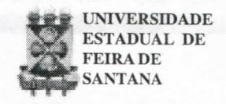

# **FOLHETIM DE EDUCAÇÃO MATEMÁTICA**

**Folhetim Educ .** _Mal._ **Ano 9, n. 105, nov. / dez . 2001 ISSN 1415-8779**

#### **OBJETIVO**

Este _Folhetim é_ um veículo de divulgação, circulação de ideias e de estímulo ao estudo e à curiosidade intelectual. Dirige-se a todos os interessados pelos aspectos pedagógicos, filosóficos e históricos da Matemática. Pretende construir uma ponte para unir os que estão próximos e os que estão distantes.

#### **EDITORIAL**

Estamos encerrando mais um ano do calendário civil ocidental, caracterizado por ser o primeiro do século XXI, o primeiro do terceiro milénio.

Mas o ano 2002, (pelo menos o número) tem também a sua curiosidade: é o primeiro niimero capicua do século XXI e do terceiro milénio, e a propósito, como todo capicua de quatro algarismos, é divisível por 11.

Vamos deixar um pouco a matemática, para desejar aos nossos assinantes um feliz ano novo, com os nossos agradecimentos pela receptividade dada à nossa publicação.

# **COMITÉ EDITORIAL**

Carioman Carlos Borges (Doutor) Inácio de Sousa Fadigas (Mestre)

#### **PERGUNTE QUE O NEMOC RESPONDE**

**Pergunta.** Uma pergunta quase nunca esquecida: _Como você vê o ensino da Geometria?_

R. Penso não ser exagero escrever que durante quase todo o século XX este assunto foi um dos mais debatidos nos Congressos Internacionais sobre o ensino da matemática. E, também, nas reuniões realizadas, aqui, no Brasil. Essencialmente nessas discussões, se defrontam duas tendências: de um lado há os partidários da geometria sintética axiomática de Euclides com os aperfeiçoamentos modernos, como sugeridos pelo eminente matemático A. V. Pogorelov; do outro lado, há os partidários das transformações geométricas. No momento prevalece a primeira tendência, pois, pesquisas importantes mostram que o "uso sistemático das transformações geométricas como enfoque básico exige um nível de abstração que está acima da maturidade de compreensão dos alunos em geral, embora se reconheça que o emprego ocasional dessas transformações contribui para enriquecer o conhecimento geométrico e simplificar algumas transformações." (Veja _Folhetim de Educação Matemática,_ Número Especial p.3, outubro de 1999, dedicado ao Prof. Elon Lages Lima). Apesar de tantos esforços dirigidos para a melhoria do ensino dessa discipUna, ela continua sendo rejeitada pelos alunos e o seu ensino relegado a segundo plano. Minhas reflexões sobre o assunto são as seguintes. Como é consabido, o mundo não se apresenta a nós, pobres mortais, de um modo despido, _des-velado._ Aquilo que nós denominamos de reaUdade parece esconder-se atrás daquilo que os especiaUstas chamam de

_fenómeno._ Assim, nosso contato imediato com ela é sensorial, resultando daí uma _representação,_ a qual, trabalhada, intelectualmente, produz o _conceito_ que nada mais é do que uma classe de equivalência. Para nos ajustarmos ao nosso entorno temos de criar os chamados _modelos,_ palavra hoje na ordem do dia de todo pesquisador. Historicamente a geometria tem por fim explicar o espaço físico. Veja bem: temos nosso entorno, um recorte da _realidade_ que é o espaço físico, algo bem concreto e familiar e, partindo daí, uma construção intelectual, um _modelo_ cujo o estudo é a teoriamatemática denominada _geometria._ Na ciência, os homens e as mulheres lidam com reaUdades, modelos e teorias. A ciência não constitui um mundo à parte como desejam alguns positivistas; suas raízes se fundam na cultura do povo. Querem um exemplo? A lógica. Ela não surgiu "pronta" da cabeça de Aristóteles. Precedendo-a já existiam a retórica e as artes gregas antigas. A geometria de que estamos tratando foi a primeira disciplina matemática a ser axiomatizada, isto é, a ser organizada segundo um determinado padrão. Qual é esse padrão? Ele pode ser representado por um conjunto, cujos elementos são os _termos primitivos,_ os _axiomas,_ as _definições,_ as *inferências*e _argumentos_ e os _teoremas._ Complicado não? Dos axiomas ou postulados que são enunciados supostos verdadeiros são deduzidos, pelas leis da lógica, outras verdades, denominadas de teoremas.

Veja que a dedução, um tipo de raciocínio, é muito importante nesse tipo de teoria (no caso a geometria). Por isso chamamo-la de geometria dedutiva. O mesmo não aconteceu com a aritmética e a álgebra - organizadas axiomaticamente bem depois da geometria. Esse "bem depois" significa vários séculos. Ao olharmos os manuais escolares de geometria constatamos: são organizados axiomaticamente, istoé, dedutivamente. Em um conhecido manual de Geometria Plana, seu autor, um matemático bem conhecido aqui no Brasil escreve: "Geometria, como qualquer sistema dedutivo, é muito parecido com um jogo: partimos com um certo conjunto de elementos (pontos, retas, planos) e é necessário aceitar algumas regras básicas sobre as relações que satisfazem os elementos, as quais são chamados de axiomas. O objetivo final desse jogo é o de determinar as propriedades características das figuras planas e dos sólidos no espaço. Tais propriedades, chamadas de Teoremas ou Proposições devem ser deduzidas somente através de raciocínio lógico a partir dos axiomas fixados ou a partir de outras propriedades jáestabelecidas". Para responder a esse pequeno discurso, nada melhor do que a transcrição das palavras abaixo extraídas do prefácio do famoso livro _O que é a Matemática?_ escrito por Richard Courant e Herbert Robbins: "Uma grave ameaça à própria vida da Ciência está impKcita na asserção de que a Matemática é nada mais do que um sistema de

### **NEMOC - NÚCLEO DE EDUCAÇÃO MATEMÁTICA OMAR CATUNDA**

Folhetim Educ. Mat., Ano 9, n. 105, nov./dez. 2001 **-Editores:** Carloman e Inácio - **Secretária:** Josenildes Oliveira Venas Almeida - **Editoração:** Evandro Vaz e Nivaldo de Assis - **Impressão:** Imprensa Gráfica Universitária - **Periodicidade:** bimestral - **Tiragem:** 1.900 exemplares - _Distribuição gratuita -_ **Endereço:** Av. Universitária, s/n - km 03 - BR 116 - Campus Universitário - **Telefone:** (075)224-8115 - **Fax:** (075)224-8086 - **CEP:** 44031-460 - Feira de Santana - Ba - BRASIL - **E-mail:** nemoc@uefs.br

**conclusões extraídas de definições e postulados que devem ser consistentes, mas que sob outros aspectos podem ser criados pela livre vontade dos matemáticos. Se essa descrição fosse exata, a Matemática não poderia atrair qualquer pessoa inteligente. Seria um jogo com definições, regras e silogismos, semmotivoou meta. A noção de que o intelecto pode, por seu capricho, criar sistemas postulacionais com significado é uma meia verdade. Somente sob a disciplina da responsabilidade com o todo orgânico, somente guiado, pela necessidade intrínseca, pode a mente livre alcançar resultados de valor científico". Os dois trechos acimamerecem, ainda, algumas considerações pessoais. Quanto ao primeiro: nenhuma ciência pode ser encarada como vun simples jogo com suas regras bem determinadas. Qualquer ciência é uma criação humana na tentativa às vezes desesperada, de conqjreender omundo.Nocasodageometriaeuclidiana, o mundo é o espaço físico. O compromisso maior da ciência é com o** _conhecimento_ **e, consequentemente com a** _verdade._ **A** _verdade_ **como correspondência, que é a concepção mais conhecida. Veja, exemplificando, a física de Aristóteles: do ponto de vista da coerência, da lógica, impecável, porém, doponto de vista de ^licações práticas um verdadeiro fiasco e foi devido a isso o seu firacasso. A geometria euclidiana é o resultado, a generalização de experiências humanas din^te alguns milhares de anos. Quando se trata de seu ensino para crianças do ensino fundamental e médio, o "jogo axiomático" deve ser mencionado com parcimôma,não devendo ser o principal princípio orientador.**

**Quanto ao segundo trecho mencionado acrescentamos: a apresentação axiomática da geometria é uma grave ameaça ao ensino dessa ciência, pois a**

**criança aindanãopossuiamaturidade intelectual suficiente para compreeender o raciocínio dedutivo. Pesquisas cognitivas nessa direção, entre elas as dos van Hiele, sobre as quais retomaremos ainda neste trabalho, confirmam essa tese. As grandes transformações experimentadas pelamatemáticadurante os séculos XIX e XX sem dúvida algimia af etaram o ensino da geometria em particular e em todo o ensino em geral. Quais foram essas transformações? A criação de novos sistemas cognitivos em função das concepções de verdade e de lógicas alternativas. Alguns desses sistemas são conhecidos** _geometrias não euclidianas,_ **por lógicas** _paraconsistentes:Juzzy,_ **e muitas outras; mnnovo sistema cognitivo perturbardor é a Teoria Cantoriana dos Conjuntos, cujo principal objeto é o estudo do infinito. A postulação ousada da existência do** _infinito acabado, atualizado,_ **como vuna totalidade dada, levou o grande matemático Cantor para além do infinito... Antes de Cantor e dos outros sistemas cognitivos prevalecia a evidência. Paraissobastarecordaros axiomas deEuclides:**

**1) Duas coisas iguais a uma terceira são iguais entre si. 2) Se parcelas iguais forem adicionadas aquantias iguais, os resultados continuarão sendo iguais. 3) Se quantias iguais forem subtraídas das mesmas quantias, os restos serão iguais. 4) Coisas que coincidem uma com a outra são iguais. 5) O todo é maior do que a parte. Existem enunciados mais evidentes do que estes? Veja o quinto: Como pode uma régua e um pedaço dela possuirem o mesmo tamanho? Esses novos sistemas cognitivos salientam que tal tipo de evidência deve ser olhada com precauções e que algumas proposições como, exemplificando," a soma dos ângulos internos de um triângulo mede 180° ", não é uma verdade absoluta.**

**As geometrias nãoeuclidianasmostraramquehátriângulos e triângulos... isto é, há triângulos nos quais a soma de seus três ângulos internos pode medir mais que 180° graus ou menos.**

**O surgimento de novos sistemas algébricos, como a** _álgebra matricial,_ **mostra que uma propriedade como a comutatividade, deixa de existir. Enfim, todo esse progresso era efetuado em uma direção que não era apontada pela evidência. Assim o velho princípio metodológico cartesianoparecia sepultado para sempre. E como tudo isso não bastasse, eis a Física Quântica, para muitos a pá de cal que faltava no sepultamento da evidência como critério de verdade. Como não poderia deixar de acontecer, esse estupendo progresso científico afetou amaneira de ensinar algumas disciplinas, em nosso caso, a geometria. Aqui, há uma evidente confusão entre ensino e pesquisa. Naquela, o fundamental é a atividade e a construção de significados. Não se aprende a andar de bicicleta com o estudo das leis da mecânica de Newton e sim "tomando" várias quedas e aprendendo os significados de suas várias componentes. E se, mais tarde, alguém desejar ser mn projetista de bicicletas, então, é conveniente conhecer as leis da mecânica. A maioria dos estudantes obrigada a estudar geometrianão vai ser matemático profissional e sequer professor da disciplina. O assim chamado raciocínio geométrico é muito pouco empregado no diaadia,poréméimportante na formação intelectual. Mas ele pode ser desenvolvido através de situações práticas que chamem a atenção, sempre explorando o espaço físico que o cerca. Olhemos os tais problemas constantes dos manuais escolares. Quase todos começa com a palavra "prove ..." Em seguida aparecem situações intrínsecas. Dificilmente, nas faixas etárias das quais estamos tratando, tal tipo de**

**motivação funciona. É preciso sair da geometria e, através da exploração do espaço físico, de onde nasceu essa disciplina, atingir as proposições geométricas. O que se vê é precisamente o inverso: parte-se do** _global_ **(que é a geometria) para o** _local,_ **que é a experiência do aluno. Ora, nenhuma criança aprende desse modo: da abstração, da idealização para o concreto e familiar. Aí se encontra, em nosso entendimento, o ponto crucial no ensino da matemática pelo método axiomático. Deixemos aos alunos, com a nossa orientação bem discreta, a tarefa de organizar suas experiências físicas, espaciais, locais para, em seguida, atingirpelaabstração uma organização maior, uma compreensão mais profunda que é dada pelo método axiomático. E a tal da história: colocar os bois atrás da carroça. Neste assunto um gma esclarecedor é a história da matemática: Aorganizaçãodageometriaefetuada por Euclides no século HE a. C. foi precedida de alguns milhares de anos de tentativas para a compreensão através das quais os seres humanos buscavam organizar suas experiências. Essa terrível inversão, global-local verifica-se não ^na s em geometria e é responsávelpela rejeição, por parte do aluno, àquilo que o professor tenta "ensinar". Comoenfatizamosnas linhas acima,o realnão se entrega despido, des-velado a nós; ele se esconde atrás do fenómeno que nos atinge sensorialmente. Para atingir a essência do real damos um** _détourem_ **tomo do fenómeno. Por que, então, no ensino da matemática, queremos começaro seu ensinopelas definições, axiomas, etc.? Por que começar o ensino da função afim, exemplificando, pela fórmula:** _y = ax + bc_ **não pelo concreto: uma corrida de táxi? Nesta, a bandeirada pode ser matematizada por** _b,_ **os quilómetros andados por J : e o preço de cada quilómetro rodado por** _a:_ **logo o preço total pode ser representado por y=preço total\***=ax + b.\*

Naturalmente, o ensino hoje em dia, não pode ser desvinculado do que aconte em outras áreas, como a psicologia, as teorias sobre os processos cognitivos, etc. Criticamos é a adesão a-crítica a tais teorias, pois os maiores absurdos dessas são defendidos pelos adeptos através de dogmatismo ferrenho com funestas consequências quando aplicadas em salas de aula. Acho ser preciso resgatar a importância da evidência como princípio metodológico orientador nas atividades de ensino. No final das contas, qual a finalidade de uma demonstração? Parece que ela possui uma dupla finalidade:a) psicológica, b) organizadora. AfinaUdade psicológica se constitui em convencer o outro sobre a verdade de algumas proposições. Esse convencimento é alcançado porque a demonstração produz a evidência. Se o aluno acha evidente uma proposição como: _o diâmetro divide o círculo em duas partes iguais,_ qual o sentido de uma demonstração? Muitas vezes nessas demonstrações emprega-se princípios mais complicados do que a propriedade que se quer demonstrar. A régua e o compasso devem fazer parte do ensino da geometria e o emprego de área toma muitas demonstrações bem mais evidentes além de completas. (Veja RPM - 21, As coisasque ensinamos, Usando Áreas,Eduardo Wagner). E se ainda restar dúvidas procure demonstrar o conhecido teoremas das paralelas de Tales, sem o recurso às áreas e com recurso à elas. Um teorema de geometria, nas faixas etárias em apreço - ensino fundamental e médio quando evidente, ainda deve ser tratado como uma verdade experimental, sem necessidade de demonstração. Muitas vezes é mais conveniente mostrar em lugar de demonstrar, como, ahás, o próprio EucUdes o faz em sua primeira proposição: Constmir um triânguloequilátero

sobre um segmento de reta dado AB. Basta constmir duas circunferências com raio AB, uma com centro em A e a outra com centro em B: o ponto de encontro M das duas figuras, cuja distância a A ou a B é igual ao raio AB, poderá ser o terceiro vértice procurado. Observem a importância que EucUdes dava às figuras pois, sem elas, esta e muitas outras demonstrações de Euclides não produzem nenhuma evidência. No caso em tela, a existência do ponto M (encontro das duas circunferências) foi simplesmente mostrado e não demonstrado. Nas demonstrações matemáticas, o recurso às figuras aumenta a clareza, porém diminui o rigor. Pedagogicamente, esse é um princípio sempre bem-vindo. Em décadas passadas, mais precisamente, décadas de 60 e 70, quando o livro de Cálculo Diferencial e Integral do N. Psikunov era usado em salas de aulas, a construção de figuras nas demonstrações assumia umpapel relevante.

Quem ainda possuir dúvidas a esse respeito, aconselho a leitura do livro Álgebra Linear e Geometria Elementar, escrito pelo erudito matemático fiancês J. Dieudnné pois, propositadamente, o autor, bourbakista ferrenho, não apresenta qualquer figura. Tentem estudálo sem, igualmente, rabiscar qualquer figurinha... Os adeptos do método axiomático pensam, equivocadamente, que uma demonstração é a via preferencial para alguém aprender o raciocínio correto. Na prática, nas salas de aula, até mesmo o ensino da chamada lógica matemática, é feito por intermédio de regras mecânicas, sem nenhumajustificati va. Pergunte a um aluno, mesmo de graduação em matemática, a justificativa da "demonstração por absurdo". Poucos para não dizer nenhum serão capazes de responder ' corretamente. Quando se passa da aritmética para a

álgebra, todos nós experimentamos dificuldades: naquela estávamos no particular e nesta, no geral. Porém, ao enfrentarmos a geometria as dificuldades são bem maiores: a abstração exagerada com a qual ela é ensinada, o primeiro contato com a dedução, despreparo dos professores e muitas outras. Do nosso ponto de vista, a questão não deve resumir-se apenas nisso. É preciso acrescentar muitas outras questões ligadas aos processos cognitivos da criança. Uma pergunta fundamental: _Como são adquiridos os conceitos geométricos? A sua formação será antecipada, desde que se empregue procedimentos pedagógicos corretos ?_ O difícil, aqui, é identificar os "procedimentos pedagógicos corretos". Quais seriam eles? Trata-se de uma questão ainda em aberto. É um terreno bastante movediço e pleno de especulações além de muito dogmatismo por parte de seus adeptos. Assim um piageteano conhecido escreve em um de seus hvros: "aqueles que criticam Piaget, certamente não foram capazes de compreendê-lo..." Piaget, em seu artigo _Observações Sobre a Educação Matemática,_ escreve: "a partir do nível das operações concretas dos 7-8 anos, encontramos um equivalente das três Estruturas mães de Bourbaki, o que põe de manifesto o caráter 'natural' destas estruturas." Para esse eminente pesquisador, inicialmente surgem as estruturas do _tipo algébrico_ em seguidas as _estruturas de ordem_ e, finalmente, as _estruturas topológicas._ Para ele o fracasso da chamada "matemática moderna" não reside no caráter moderno do programa e sim no arcaísmo da psicologia e da pedagogia empregadas nessas situações.»

_Pergunte que o NEMOC Responde é_ uma coluna de autoria do prof. Dr. Carloman Carlos Borges e objetiva atingir ao piíbhco interessado em Matemática nos seus múltiplos aspectos.

Caso o leitor queira fazer alguma pergunta escreva-nos.

#### **NOTÍCIAS**

Será ralizado de 03 a 07 de dezembro, na UEFS, a **IV SEMANA DE MATEMÁTICA -** _RACIOCÍNIO MATEMÁTICO: UMA QUESTÃO DE ESTÍMULO._

#### _Promoção:_

D. A. de Matemática

Colegiado do Curso de Lie. em Matemática

#### _Informações:_

«(75)224-823 3

e-mail: colmat@uefs.br

# **PRÓXIMO NÚMERO**

_Como você vê o ensino da Geometria? (continuação)_

_Aguardem!_

# **NÚMEROS ATRASADOS**

Envie para cada folhetim um selo de postagem nacional de 1° porte. Dentro de no máximo quatro semanas, contadas a partir da data de recebimento do seu pedido, você estará recebendo os folhetins solicitados.

OBS.: É permitida a reprodução total ou parcial desse folhetim, desde que citada a fonte.
