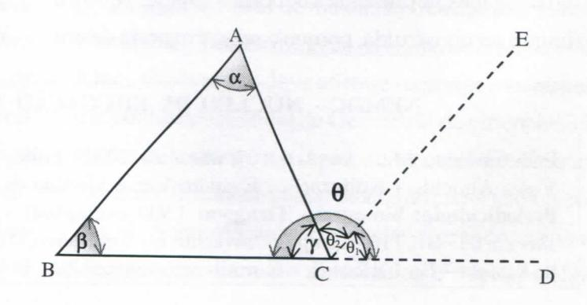

# **FOLHETIM DE EDUCAÇÃO MATEMÁTICA**

**UNIVERSroADE ESTADUAL DE FEIRA DE SANTANA**

**Folhetim Educ. Mot., Ano 9, n. 107, mar. / abr. 2002**

**ISSN 1415-8779**

#### **OBJETIVO**

Este _Folhetim é_ um veículo de divulgação, circulação de ideias e de estímulo ao estudo e à curiosidade intelectual. Dirige-se a todos os interessados pelos aspectos pedagógicos, filosóficos e históricos da Matemática. Pretende construir uma ponte para unir os que estão próximos e os que estão distantes.

### **EDITORIAL**

Nos dois últimos _Folhetins_ a questão do ensino da geometria esteve em foco. De início _(Folhetim n°_ 105), são apresentadas as tendências do ensino da geometria, a abordagem axiomática sintética, via tratamento métrico, e a abordagem a partir das transformações geométricas. Em seguida, Prof. Carloman apresenta suas reflexões sobre o ensino da geometria, criticando a postura dos que vêm a geometria como um jogo, com definições, regras, bem como a apresentação daquela ciência de forma axiomática para crianças que não possuem ainda maturidade para o raciocínio dedutivo. No _Folhetim_ n° 106, ainda sobre o ensino de geometria, destaque é dado às contribuições dos Van Hiele e o confronto entre as ideias de Piaget e Hans Freudenthal. No presente _Folhetim,_ encerra o tema, fazendo considerações sobre a intuição e o rigor no ensino da geometria.

# **COMITÊ EDITORIAL**

Carloman Carlos Borges (Doutor) Inácio de Sousa Fadigas (Mestre)

## **PERGUNTE QUE O NEMOC RESPONDE**

**Pergunta.** Uma pergunta quase nunca esquecida: _Como você vê o ensino da Geometria? (Continuação)_

R. No ensino da Geometria nas primeiras séries muito podemos aprender ainda com EucHdes, desde que se tenha clareza sobre o método euclidiano. Muita gente o identifica com o método axiomático. Assim, falar de Euclides é falar em Axiomática. Os historiadores falam que Euclides foi o primeiro a organizar o saber matemático de forma postulacional - o que não deixa de ser verdadeiro. Seria, porém esclarecedor acrescentar que a "pureza" desse método axiomático se funda na intuição e experiência. Suas demonstrações são sempre acompanhadas de figuras (apelo à intuição sensível) e operações gráficas em tais figuras. Não sabemos se de maneira proposital ou não, mas EucUdes leva-nos a pensar no primado das figuras sobre o das relações. O primado das "coisas" - característica genuinamente metafísica daquela época. Leva-nos a pensar que é através das figuras que descobrimos as relações fundamentais. Para ilustrar nossas palavras, vejamos sua demonstração da Proposição XXXII do Livro I (segunda parte) quando ele demonstra que a soma dos ângulos internos de triângulo é igual a dois retos, isto é 180°. Iniciabnente, traça o triângulo ABC. Prolonga o lado BC até D e por C constrói a paralela CE ao lado BA.

Se nos lembrarmos que o ângulo 6 mede 180°, todos os demais ingredientes estão à vista, para a demonstração desejada, pois, uma simples inspeção visual, isto é, umrecurso sensível (o da visão) nos conduz aos resultados parciais: a) os ângulos (3 e 6j são correspondentes e, conseqiientemente, iguais; b) os ângulos a e 6^ são alternos internos (a transversal AC "corta" as paralelas AB e CE), logo os ângulos ae 0^ são iguais; c) o resultado final: a + P + Y= 180° salta à vista. Qual a primeira impressão produzida por essa demonstração? O primado da figura sobre as relações. A partir da construção inicial do triângulo ABC (a escolha de uma determinada figura para iniciar o processo demonstrativo não fica bem claro) outras construções são levadas a efeito como a paralela CE ao lado AB e o prolongamento de BC até D. Ao término dessas construções e pela inspeção destas, chega aos resultados parciais apontados acima em (a) e (b). Uma análise mais apurada nos conduz ao ceme da questão: é inaceitável que EucUdes, antes de qualquer construção gráfica, não tivesse clareza sobre as relações suficientes a sua demonstração; não chega a elas - como parece à primeira vista - por intermédio de uma simples inspeção visual dessas construções gráficas. Ele já possui um conhecimento prévio dessas relações, bem antes de qualquer construção. A esse respeito transcrevemos as palavras de Caio Prado Jr. em _Dialética do Conhecimento,_ Editora Brasiliense: "Na aprendizagem da Geometria construtiva ou euclidiana, os estudantes são obrigados geralmente a decorar a solução (que é a figura a ser construída, porque o resto é matéria de um

pouco de prática apenas) sem que se dê previamente a eles a menor informação do porquê dessa figura e das operações mentais que levaram a ela. Isso eles só poderão verificar no fim da demonstração pelo resultado acertado a que conduziu. Mas é uma verificação dogmática que não informa outra coisa senão o acerto da figura escolhida, e não sobre o porquê desse acerto. EUmina-se assim no ensino o essencial, que é a aprendizagem do raciocínio matemático que os estudantes terão de fazer por si ao acaso, se é que chegam a fazê-lo. o que certamente não ocorre na grande maioria e quase totahdade deles". Essas palavras sãoatuaUssimas e sábias. Observe um professor comum - representante da maioria dos professores de matemática - demonstrando alguma proposição. Do ponto de vista do aluno - na sua maioria é uma pura magia. Em lugar de produzir evidências lógicas ela produz enorme confusão na cabeça de nossos alunos e, como na sua avaliação, o aluno deve reproduzí-la, acaba-se nesse trágico resultado: o aluno memoriza a demonstração! Perde-se, assim, o papel formativo do ensino da matemática.

Em lugar da tão festejada autonomia intelectual, o ensino dessa ciência vem produzindo autómatos inseguros em sesus próprios automatismos. Em um belo artigo intitulado O Ensino da Matemática - Conceito e Caricatura, o saudoso mestre Omar Catunda levantava o problema das várias ideias falsas possuídas pelo aluno em relação amatemática para chegar à conclusão melancólica que tais ideias eram, inicialmente impostas pelos próprios professores nas salas de aula, através de um ensino desarticulado sem qualquer unidade metodológica. Do

#### **NEMOC - NÚCLEO DE EDUCAÇÃO MATEMÁTICA OMAR CATUNDA**

Folhetim Educ. Mat., Ano 9, n. 107, mar. / abr. 2002 - **Editores:** Carloman e Inácio - **Secretária:** Josenildes Oliveira Venas Almeida - **Editoração:** Evandro Vaz e Nivaldo de Assis - **Impressão:** Imprensa Gráfica Universitária - **Periodicidade:** bimestral - **Tiragem:** 1.900 exemplares - _Distribuição gratuita -_ **Endereço:** Av. Universitária, s/n - km 03 - BR 116 - Campus Universitário - **Telefone:** (75)224-8115 - **Fax:** (75)224-8086 - CEP 44031 -460 - Feira de Santana - Ba - BRASIL - **E-mail:** nemoc@uefs.br

modelo dos van Hiele pode-se concluir muitos ensinamentos. A aprendizagem é um processo que se desenvolve através de "níveis". Assim, porexemplo, no ensino da Geometria, o primeiro nível seria a ati vidade do aluno com o espaço físico. Experiências espaciais devem ser o ponto de partida. Se estivéssemos falando de Álgebra, diríamos que a aprensentação da Axiomática de Peano, como aparece em diversos manuais escolares como ponto de partida se constitui naquilo denominado por um eminente educador de "inversão antididática". O início, aqui, deve ser a atividade da criança com os números naturais; essas atividades, se bem dirigidas, levariam a criança àqueles axiomas de um modo inteiramente natural. Parece haverumaverdadeirabatalha entre intuição e rigor com muitos professores privilegiando este em detrimento daquele. Para esses mestres "rigorosos" lembramos que o verbo RIGEO, -ES, -UT, -ERE sigrúfica SER INFLEXÍVEL, RÍGIDO. Daí, vem a derivação através do substantivo RIGOR, ORIS para significar "dureza, rigidez" e, de maneira figurativa, "severidade, inflexibilidade". Resumindo, SER RIGOROSO é ser inflexível, orientadopor um padrão, inflexivelmente. Como a categoria RIGOR é uma categoria histórica e, ainda, como o padrão grego de rigor era a Lógica de Aristóteles e, finalmente considerando que Euclides seguiu fielmente esse padrão, deduz-se que esse matemático foi rigoroso, apesar de também ser intuitivo. Assim, frases como esta: "Euclides pecou por falta de rigor" é desprovida de significado, embora esteja em vários escritos acerca da matemática grega da Escola de Alexandria, durante o século **ni** a.C.. Os van Hiele são pioneiros ao destacarem que o processo de aprendizagem é um processo de reinvenção, sempre de níveis inferiores para níveis superiores. Infelizmente, muitos de nossos manuais escolares invertem o processo e, em lugar de respeitarem aquela "subida" (m'velinferiorparamvel superior) começam suas explanações "descendo", isto é, partindo do nível

superior ao inferior (vide a chamada "matemática modema...").

Qualquer axiomática se encontra no plano lingiiístico e, conforme mostraram os van Hiele, aprendese não a partir do nível Unguístico e sim a partir da atividade voltada para a reinvenção.

Ademais qual seria uma definição rigorosa de rigor, levando em consideração a sua historicidade? Claramente, os Elementos de Euclides possuem uma grande dose de intuição, porém rejeitá-la em nome de um pretenso rigor é, em nosso entendimento, pedagogicamente incorreto. E na intuição que os grandes matemáticos têm os seus grandes momentos criadores. A Lógica - pelo menos como se encontra nos vários manuais escolares - é um conjunto de regras normativas. Aprendê-la, assim, é pensar mecanicamente. Tais procedimentos mecânicos ou algoritmos ficam mais adequados para uma máquina (um computador) do que para o cérebro humano. Quando alguns matemáticos começam a falar sobre o ensino da matemática, podemos nos preparar para ouvir tolices pois, a sua especiaUdade não é o ensino dessa ciência e sim a produção dela. Fehzes aqueles matemáticos que sabem conciliar aprática pedagógica e a criação. A conciliação da prática pedagógica com a criação matemática é reservada a uns poucos matemáticos. A intuição geométrica, iniciada no contato com o espaço físico pode e deve ser estendida a outros espaços, como o plano cartesiano. Dessa forma, a intuição vai se refinando, tomando-se uma intuição prolongada, no dizer do matemático e educador francês Bouligand ou numa intuição refinada, no dizer de Félix Klein. O que não se deve afirmar - como se encontra em um conhecido manual de Geometria de um conhecido geometra brasileiro, éo seguinte: "o ensino da Geometria tem como finahdade iniciar o aluno no raciocínio lógico".

Sobre algumas tendências acerca do ensino da Geometria escreveu o matemático e educador Hans Freudenthal em "Geometry between the devil and the deep sea", Educ. Stud. in Nathy. 3 (1971), citação mencionada em La ensenanza de Ias matemáticas modernas, Alianza Uni versidad: "Minha objeção a um sistema axiomático global da geometria, não é tanto por sua complexidade, como pela maneira como é apresentada aos alunos. Em geral, eles são ensinados a empregar o sistema a fim de fazerem deduções mecanicamente, atividade que o autor honestamente repele, por considerar que não tem qualquer valor.

O valor essencial de um sistema axiomático é, para o próprio autor, o de reorganizar primeiro o material que se trata de axiomatizar, desprender-se logo das conexões entre o sistema axiomático e o dito material geométrico, para volver finalmente a essas conexões ao seguir no desenvolvimento do sistema. Se o aluno não realiza todas essas atividades, a aprendizagem de um sistema axiomático carece de significado. Sem embargo, é pouco frequente que sej a ensinado aos alunos a partir desse ponto de vista, sej a porque o professor considera a axiomatização deve reservar-se para matemáticos já formados, seja porque, recordando sua própria experiência, o julgue demasiado difícil. Com efeito, o aluno que não haja tentadoorganizar alguns materiais que aparecem a m'vel local, não pode saber como atuar a m'vel global.

Os sistemas axiomáticos pré-fabricados possuem suas vantagens, e constituem um tema de estudo aceitável para quem já possui certa experiência em axiomática. Se o aluno aprende a axiomatizar algum sistema simples, ao enfrentar-se com um sistema complicado encontrará certas analogias que o permitirão decifrá-lo e compreendê-lo, como se o mesmo houvesse construído. Porém se o aluno nunca conseguir tentar axiomatizar por sua conta, todo o sistema axiomático da geometria Lhe parecerá um conjunto de enunciados impossível de ser digerido".»

_Pergunte que o NEMOC Responde é_ uma coluna de autoria do prof. Dr. Carloman Carlos Borges e objetiva atingir ao público interessado em Matemática nos seus múltiplos aspectos.

Caso o leitor queira fazer alguma pergunta escreva-nos.

#### **NOTÍCIAS**

De seus organizadores. .Alexandre Medeiros & Cleide Farias de Medeiros, ambos com PhD em Educação em Ciências. Univcrsity _o(_ Lceds - Inglaterra e atualmente, professores da U FRPE. recebemos o Uvro: _O Concreto - Abstraio nci Editíução em Física e em Matemática._

O livro contém **S** ensaios escritos não só pelos organizadorescomoporoutroscspccialistas. Eles tratam de assuntos pertinentes **ao ensino** daquelas duas disciplinas.

Sua leitura ajudará **o** iciior-professor em sua prática pedagógica.

Parabenizamos seus opiíani/.adores por essa iniciativa

### **PRÓXIMO NÚMERO**

_Como começou o cálí ulo.' Aguardem!_

#### **NÚMEROS ATRASADOS**

Envie para cada folhetim um selo de postagem nacional de 1° porte. Dentro de no máximo quatro semanas, contadas a partir da data de recebimento do seu pedido, você estará recebendo os folhetins soUcitados.

OBS.: É permitida a reprodução total ou parcial desse folhetim, desde que citada a fonte.

#### **ERRATA**

_No Folhetim \06:_

**pág. 2,** _PERGUNTE QUE O NEMOC RESPONDE, 2'_ **coluna, 25\***"\* **linha, onde se lê surgue, leia-se surge.**

**pág. 6, NOr/CM5,2'coluna, r linha, onde se lê bahiana, leia-se baiana.**
