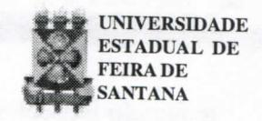
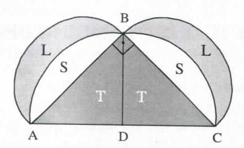
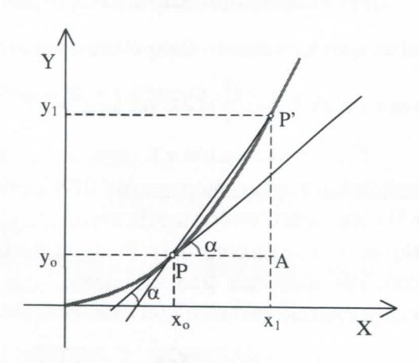

# FOLHETIM DE EDUCAÇÃO MATEMÁTICA

Folhetim Educ. Mat., Ano 9, n. 108, maio / jun. 2002

ISSN 1415-8779

#### **OBJETIVO**

Este Folhetim é um veículo de divulgação, circulação de idéias e de estímulo ao estudo e à curiosidade intelectual. Dirige-se a todos os interessados pelos aspectos pedagógicos, filosóficos e históricos da Matemática. Pretende construir uma ponte para unir os que estão próximos e os que estão distantes.

#### **EDITORIAL**

Após trilharmos os caminhos da geometria, a partir desse número do _Folhetim_ faremos um passeio pelo Cálculo, poderoso instrumento do qual a Matemática não pode prescindir.

Queremos também aproveitar este espaço para informar aos nossos leitores que iremos fazer uma pesquisa de satisfação com os nossos leitores, e desde já gostaríamos de contar com a colaboração de cada um. Nos próximos folhetins daremos mais detalhes. Por enquanto, fiquem com um pouco da história do cálculo na coluna Pergunte que o NEMOC Responde.

## COMITÉ EDITORIAL

Carloman Carlos Borges (Doutor) Inácio de Sousa Fadigas (Mestre)

# PERGUNTE QUE O NEMOC RESPONDE

Pergunta. Como começou o cálculo?

R. Muitos alunos nos perguntam sobre os primórdios dessa criação, considerada por muitos como a maior criação matemática de todos os tempos. Podemos identificá-los na Grécia Antiga, com Eudoxo e Arquimedes. O conhecido Método de Exaustão (veja Folhetim nº 97), atribuído ao primeiro, contém já os germens do cálculo, quando se trata da "quadratura" de figuras. A idéia básica desse método é "espremer" a quantidade que se procura - quer se ja um volume ou uma superfície entre duas outras que podem ser calculadas. É indispensável que essas duas grandezas possam se aproximar uma da outra indefinidamente. Assim, se desejarmos calcular a área de um determinado círculo, pode-se inscrever nele um quadrado, inicialmente, e mostrar que foi subtraída da área do círculo uma área (que é a do quadrado) maior que a metade da área do círculo. Agora, basta duplicar os lados do quadrado suficientemente para chegar ao resultado desejado...Os trabalhos dos cientistas da Grécia Antiga-livres de maiores preocupações econômicas, pois a sociedade de então era baseada no trabalho escravo-dignificavam a espécie humana. Entre eles, para os nossos propósitos, destacamos a figura ímpar de Arquimedes, que, com sua grande liberdade interior criou uma matemática que é um prolongamento da geometria euclidiana. Ademais, ela desembocou no cálculo integral. As obras desse eminente matemático chegadas até nós têm como objetivo primordial a demonstração de teoremas relativos à áreas e volumes de figuras limitadas por curvas e superfícies. Nesse grupo são incluídos trabalhos sobre: a) quadratura da parábola; b) sobre a esfera e o cilindro; c) sobre espirais; d) sobre os conóides e esferóides; e) sobre a medida do círculo. Deixamos de lado outras reflexões desse grande sábio como aquelas relativas aos problemas de estática e hidrostática. De passagem, pode-se mencionar as famosas lúnulas de Hipócrates de Chió, provavelmente, o primeiro caso de "quadratura" de "figuras curvilíneas" por processos elementares etalvez a primeira sugestão para se pensar na "quadratura" do círculo. Vejamos apenas um exemplo das lúnulas de Hipócrates: Seja ABC um triângulo

retângulo isósceles inscrito em um semicírculo com diâmetro AC. Tracemos outros semicírculos com diâmetros AB e BC. Mostremos que a área L da lúnula é igual à área T do triângulo ABD

De acordo com o teorema de Pitágoras, em seu caso particular e conhecido a área construída sobre o cateto AB somada à área construída sobre o cateto BC é igual à área construída sobre a hipotenusa AC. Dessa forma, temos:

2(S+L)=2(S+T), donde, L=T, isto é, a lúnula L é "quadrável" e sua área é igual à área T do triângulo ABD.

Para simplificar a exposição vamos "pular" para o século XVII, o século que viu florescer os conceitos de função, Geometria Analítica e Cálculo Infinitesimal. Essas três invenções caracterizam a matemática das grandezas variáveis. O predomínio da matemática das grandezas constantes termina aqui. A sociedade coloca novos problemas, entre eles, o problema do movimento. A força não é mais proporcional à velocidade, como na física de Aristóteles e sim proporcional à aceleração. É a derrocada do movimento circular uniforme, e, por isso mesmo, o movimento perfeito que estava de acordo com a mentalidade finitista dos gregos antigos. Esse movimento que dominou todas as Cosmologias, de Platão até Copérnico, recebendo sua primeira contestação nas leis de Kepler, passa a ser, agora, um mero movimento sem qualquer privilégio. Essa nova concepção do

movimento como a solidariedade do ser e do não ser, da permanência e da impermanência fica bem caracterizada no conceito de variável. A história do Cálculo é uma grande lição para os dogmáticos do rigor e inimigos da intuição e mostra, também, a poderosa influência de aspectos sociais no desenvolvimento da ciência. Primeiro os grandes movimentos das navegações visando à descoberta de "novos mundos", o desenvolvimento do comércio e da indústria como suportes do triunfo de uma nova classe dominante, a burguesia; em seguida, a abstração desses movimentos geográficos: a criação do Cálculo Infinitesimal com suas soluções para problemas relativos à balística, movimentos não uniformes, etc. Vale a pena transcrever as palavras de Engels no seu conhecido livro Anti-During: "A introdução de grandezas variáveis e a extensão de sua variabilidade até ao infinitamente pequeno e ao infinitamente grande, têm feito cometer a matemática, normalmente tão austera, o pecado original. A matemática comeu a maçã do conhecimento, que a fez entrar na carreira dos sucessos gigantescos, mas também nos erros. O estado virgem da validade absoluta e das demonstrações incontestáveis de toda a matemática, ficou para sempre perdido; abriu-se o reino das controvérsias, e ao ponto em que chegamos, a maioria das pessoas diferencia e integra, não por compreender o que fazem mas apenas por um mero ato de fé, porque até agora obtiveram sempre resultados corretos. (O grifo é nosso). Quem não se lembra das palavras de D'Alembert ao praticar o cálculo: "Avante, que a fé nos guiará? "A compreensão do infinitamente pequeno ou infinitesimal e do infinitamente grande somente recebeu clareza suficiente no século XX nos trabalhos de A. Robinson, físico, lógico e matemático americano criador da Análise Não-Standard, à qual voltaremos ainda neste trabalho. Os gregos antigos sabiam traçar, por um ponto dado numa curva, a tangente a essa curva quando esta era representada, por exemplo, pela circunferência. Esse

# NEMOC - NÚCLEO DE EDUCAÇÃO MATEMÁTICA OMAR CATUNDA

Folhetim Educ. Mat., Ano 9, n. 108, maio/jun. 2002 - Editores: Carloman e Inácio - Secretária: Josenildes Oliveira Venas Almeida - Editoração: Evandro Vaz e Nivaldo de Assis - Impressão: Imprensa Gráfica Universitária - Periodicidade: bimestral - Tiragem: 1.900 exemplares - Distribuição gratuita - Endereço: Av. Universitária, s/n - km 03 - BR 116 - Campus Universitário - Telefone: (75)224-8115 - Fax: (75)224-8086 - CEP 44031-460 - Feira de Santana - Ba - BRASIL - E-mail: nemoc@uefs.br

conhecimento era limitado apenas àquelas poucas curvas conhecidas deles. Ocálculo diferencial resolveu o problema geral: dada uma curva e um ponto P sobre ela, define-se a inclinação da curva e da reta tangente à curva nesse ponto. Leibniz resolve o problema da seguinte forma: Seja P' um ponto sobre a curva, muito perto de P. Dessa forma, a secante PP' está próxima da reta tangente em P. Conseqüentemente a inclinação da secante PP'está bem próxima da inclinação da reta tangente em P. Vinha então o seguinte raciocínio: "Seja P' um ponto 'infinitamente próximo' de P. Então a secante PP' coincide com a reta tangente em Pe a inclinação da reta tangente em Péigual à inclinação da secante PP' ". (Os grifos são nossos).

Agora basta calcular a inclinação da secante PP'. Como ela, segundo a última observação acima "coincide" com a reta tangente em P, então a inclinação desta é igual à inclinação daquela. Logo,

$$tg \alpha = \text{tangente da secante} = \frac{|P'A|}{|PA|}$$

é igual à diferença <u>infinitamente pequena</u> entre $y_1$ e $y_0$ , sendo, por isso mesmo, denominado por Leibniz de "diferencial de y", simbolizado por dy. Igualmente, a diferença entre $x_1$ e $x_0$ é denominada de "diferencial de x", isto é, dx. Resumindo:

$$tg \alpha = \text{tangente da secante} = \frac{|y_1 - y_0|}{|x_1 - x_0|} = \frac{dy}{dx}$$

A fim de ilustrar a situação, consideremos a função $y = x^2$ e calculemos o quociente daqueles dois "infinitamente pequenos", $dy \in dx$ . Vem:

$$y_1 = x_1^2 = (x_0 + dx)^2 = x_0^2 + 2x_0 \cdot dx + (dx)^2$$
(I)

$$y_1 - y_0 = 2x_0 dx + (dx)^2$$
(II)

dividindo (II) por $x_1 - x_0 = dx$ , vem:

$$\frac{dy}{dx} = \frac{y_1 - y_0}{x_1 - x_0} = 2x_0 + dx \quad (III)$$

Suprimindo dx à direita de (III), vem:

$$\frac{dy}{dx} = 2x_0$$
(IV)

Como, nesse caso, a função é sempre derivável, tem-se o resultado final;

$$\frac{dy}{dx} = 2x$$

Qualquer estudante de Cálculo, hoje em dia, sabe perfeitamente, que o resultado obtido é verdadeiro, porém, o método empregado a fim de obtê-lo merece reparos, principalmente quanto ao rigor. Como vimos o ponto de partida de Leibniz foi $x_1 = x_0 + dx$ predominantemente intuitivo. Da expressão (II) para a número (III) "o infinitamente pequeno" é considerado diferente de zero, enquanto da expressão (III) para (IV) ele é considerado igual a zero. É estranho que Leibniz tão admirador da Lógica - nessa operação - dx ora é diferente de zero e dx ora é igual a zero - não tenha observado uma flagrante violação do Princípio da Contradição, tão caro à Lógica Clássica.

Ora, se em(I)dx fosse considerado como igual a zero, ter-se-ia:

$$y_1 = (x_1)^2 = (x_0 + dx)^2 = (x_0 + 0)^2 = (x_0)^2$$
e  
 $dy = y_1 - y_0 = (x_1)^2 - (x_0)^2 = 0$  
donde, $\frac{dy}{dx} = \frac{0}{0}$

umresultadoinútil, porque incompreensível naquela época, quando a burguesia estava impetuosamente se desenvolvendo e muitos matemáticos levantavam bandeiras progressistas e eram até mesmo materialistas. Devido a isso, o bispo irlandês George Berkeley (1685 -1753) escreve um contundente panfleto: "O Analista, ou Discurso Dirigido a um Matemático Infiel, Donde são Examinados se os objetos, Princípios e Inferências da Análise Moderna estão Formulados de Maneira mais Clara, ou deduzidos de Maneira mais Evidente que os

Mistérios Religiosos e os Assuntos de Fé". Às quantidades "infinitamente pequenas" que ora são diferentes de zero e ora são iguais a zero, Berkeley, que além de sacerdote foi um conhecido filósofo, ele as denominam de "fantasmas das quantidades desaparecidas" pois, segundo ele: "não são nem quantidades finitas, nem quantidades infinitamente pequenas sem ser tampouco um simples nada". Quanto ao êxito obtido pelas aplicações do Cálculo, Berkeley o explicava por meio de uma compensação de erros, implícita na aplicação das regras do Cálculo: inicialmente fala-se numa estranha "coincidência" entre a secante PP'com a reta tangente em P, considerando a inclinação da reta tangente igual à inclinação da secante PP'; em seguida, no cálculo da razão dy/dx, é introduzido novo erro, pois dx ora é considerado diferente de zero ora é considerado igual a zero. Esses erros, segundo ele, são compensados um com outro, logo o Cálculo não pode "chamar-se de Ciência, pois se procede às cegas e se chega a verdade não sabendo como nem por quais meios". Finalmente, Berkeley decreta a sua sentença: "quem acredita nesse cálculo diferencial misterioso, não tem nenhuma razão para não acreditar em Deus..." A alusão à compensação de erros é bem conhecida na história da ciência. Um dos exemplos mais citados referese a Kepler com a sua segunda lei: "Oraio - vetor de um planeta varre áreas iguais em tempos iguais". Veja o que a esse respeito escreveu Pierre Lucie, em A Gênese do Método Científico, Editora Campus. "Nessa incrível comédia de erros e por uma não menos fantástica coincidência que erros se cancelassem no final, Kepler acabava de descobrir uma lei correta, que ia ser conhecida como a 2ª lei (de Kepler), embora a tivesse descoberto antes da 1ª. As críticas de Berkeley não são apenas contundentes; elas são procedentes e é de causar admiração que uma questão tão importante como essa, porque é ligada aos próprios fundamentos da matemática tenha sido primeiro levantada por um leigo. Quanto a Newton, suas idéias básicas foram as mesmas empregadas por Leibniz, excetuando sua linguagem rebuscada. Vejamos como ele procede para encontrar o Fluxo-isto é, a derivada - de $y = x^2$ . A quantidade x era considerada como uma Quantidade Fluente, variando com o tempo. Dizia Newton: "Deixemos que x flua por um tempo pequeno, de maneira que se chega a tornar-se x + dx,

onde dx é um <u>acréscimo evanescente</u> ou <u>infinitesimal</u> de x. Temos então: $(x + dx)^2 = x^2 + 2x \cdot dx + (dx)^2$ , sendo o acréscimo de y igual a $2x \cdot dx + (dx)^2$ . A razão entre os

acréscimos ou incrementos é: $\frac{2x dx + (dx)^2}{dx} = 2x + dx$ .

Deixando dx desaparecer, a razão se torna 2x". (Os grifos são nossos). Logo, a derivada de $y = x^2 é 2x$ . Newton escrevia:

- $\dot{x}$ = fluxo de x (isto é, a velocidade de x)
- $\dot{y}$ = fluxo de y (isto é, a velocidade de y)

Ele afirmava que a razão entre os fluxos $\frac{\dot{y}}{\dot{x}}$ é a mesma que há entre os incrementos ou acréscimos evanescentes. Logo $\frac{\dot{y}}{\dot{x}} = 2x$ ou seja $\dot{y} = 2x \cdot \dot{x}$ .

Enquanto Newton e Leibniz se apoiavam em "quantidades infinitamente pequenas", D'Alembert (1717-1783) considera o acréscimo Δx um incremento finito qualquer. Com essa consideração, as regras do cálculo podem ser aplicadas tranqüilamente, sem maiores preocupações. •

Pergunte que o NEMOC Responde é uma coluna de autoria do prof. Dr. Carloman Carlos Borges e objetiva atingir ao público interessado em Matemática nos seus múltiplos aspectos.

Caso o leitor queira fazer alguma pergunta escreva-nos.

### PRÓXIMO NÚMERO

Como começou o cálculo? (Continuação) Aguardem!

## **NÚMEROS ATRASADOS**

Envie para cada folhetim um selo de postagem nacional de 1º porte. Dentro de no máximo quatro semanas, contadas a partir da data de recebimento do seu pedido, você estará recebendo os folhetins solicitados.

OBS.: É permitida a reprodução total ou parcial deste folhetim, desde que citada a fonte.
