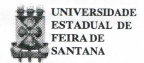
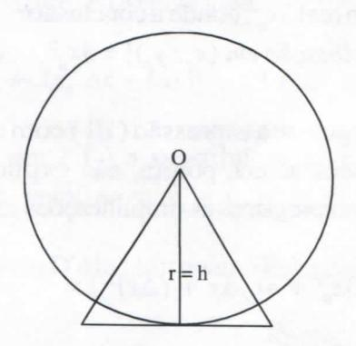

# FOLHETIM DE EDUCAÇÃO MATEMÁTICA

Folhetim Educ. Mat., Ano 9 / 10, n. 109, jul. / ago. 2002

ISSN 1415-8779

## **OBJETIVO**

Este Folhetim é um veículo de divulgação, circulação de idéias e de estímulo ao estudo e à curiosidade intelectual. Dirige-se a todos os interessados pelos aspectos pedagógicos, filosóficos e históricos da Matemática. Pretende construir uma ponte para unir os que estão próximos e os que estão distantes.

#### **EDITORIAL**

Ainda sobre o cálculo, destacamos neste Folhetim um recente avanço na formalização dele, principalmente no que diz respeito à questão dos "infinitamente pequenos", um dos objetos da Análise Não Standard. Vale acrescentar também que o texto traz a visão de Karl Marx num campo que não é o socialismo.

Conforme anunciado no Folhetim anterior, a nossa pesquisa de satisfação consistirá em um questionário (breve e objetivo) que acompanhará o Folhetim de número 111. Esse questionário deverá ser respondido e devolvido à nossa secretaria, confirmando assim o desejo do leitor em continuar fazendo parte do grupo de leitores do Folhetim. Aguardem.

# COMITÊ EDITORIAL

Carloman Carlos Borges (Doutor) Inácio de Sousa Fadigas (Mestre)

## PERGUNTE QUE O NEMOC RESPONDE

**Pergunta.** Como começou o cálculo? (Continuação) R. Vejamos concretamente o procedimento de D'Alembert. Seja a função $y = x^3$ . Ele fez $x_1 = x_0 + \Delta x$ , $\Delta x$ um acréscimo finito arbitrário.

Essa hipótese assegura, de antemão, o emprego das regras operatórias da álgebra ordinária, em particular, do binômio de Newton. Assim:

$$y_1 = (x_1)^3 = (x_0 + \Delta x)^3 = (x_0)^3 + 3(x_0)^2 \cdot \Delta x + 3(x_0) \cdot (\Delta x)^2 + (\Delta x)^3,$$

$$e \Delta y = y_1 - y_0 = [(x_0)^3 + 3(x_0)^2 \cdot \Delta x + 3x_0 \cdot (\Delta x)^2 + (\Delta x)^3] - (x_0)^3 =$$

$$= 3(x_0)^2 \cdot \Delta x + 3x_0 \cdot (\Delta x)^2 + (\Delta x)^3, \text{ donde}$$

$$\frac{\Delta y}{\Delta x} = 3(x_0)^2 + 3x_0 \cdot \Delta x + (\Delta x)^2 \quad (I)$$

Efetuando em ( I ) a substituição
$$x_1 = x_0$$
, isto é, $\Delta x = x_1 - x_0 = 0$ , vem: $\Delta x = y_1 - y_0 = (x_1)^3 - (x_0)^3 = 0$ . Logo, $\frac{0}{0} = 3(x_0)^2$ . Tanto D'Alembert quanto Euler, substituem $\frac{0}{0}$ por $\frac{dy}{dx}$ chegando ao resultado correto: $\frac{dy}{dx} = 3(x_0)^2$ .

Sobre a divisão por zero, Euler, em seu livro Cálculo Diferencial, de 1755, escreveu: "Existe uma infinidade de ordens de grandezas <u>infinitamente pequenas</u>, (o grifo é nosso), <u>que embora sejam todas iguais a zero, devem ser distinguidas entre si,</u> quando olhamos para a sua proporção mútua, o que se explica por uma razão geométrica". (Veja _Karl Marx: Arrancar o Véu_, autor: Paulus Gerdes, Editor: Departamento de Matemática e Física, Faculdade de Educação, Universidade Eduardo M., República Popular de Moçambique). Não deixa de ser interessante esse trecho de Euler. Ele fala sobre grandezas infinitamente pequenas todas iguais a zero, porém, diferentes entre si. Aqui, mais uma vez, o Princípio da Não Contradição é arranhado. A justificativa é mais interessante: aritmeticamente não se pode dividir por zero porém, geometricamente, dar-se um jeitinho... o

que mostra que em questões de dar um jeitinho o brasileiro não étão assimoriginal. Em seu livro Teoria das Funções Analíticas o matemático francês Lagrange introduz algumas modificações porém faz postulação descabida: cada função pode ser expandida em série de potências. Nas lições ministradas por Cauchy na Escola Politécnica de Paris, Cauchy critica tal postulação - basta observar, exemplificando, a função exp(-1/x) e todas as suas derivadas no ponto x = 0; isso mostra que ela não admite desenvolvimento em série de Taylor nesse ponto. E o grande pensador Karl Marx como procedia sobre essa questão? A tal propósito recomendo a leitura de Les Manuscrits Mathematiques de Marx, apresentação de Alain Alcouffe, editora Econômica, 49, rue Héricart, 75015 Paris. Logo no seu início o livro apresenta três cartas: as duas primeiras de Engels a Marx, onde se

discute a igualdade $\frac{dy}{dx} = \frac{0}{0}$ . Engel felicita seu companheiro pelas reflexões contidas naqueles manuscritos jámencionados. Em seguida, Marx responde criticando o misticismo de Newton e de Leibnize faz um balanço sobre o método racionalista de D'Alembert e Euler. Vejamos como procede esse pensador que tanta influência (não no que diz respeito à matemática) causou, principalmente nos movimentos sociais desses últimos séculos. Ainda considerando a função $y = x^3$ . Ele procede da seguinte maneira: a uma variação de $x_0$ para $x_1$ , corresponda, naturalmente, outra variação de $y_0$ para $y_1$ .

Assim, temos: $\frac{\Delta y}{\Delta x} = \frac{y_1 - y_0}{x_1 - x_0} = \frac{(x_1)^3 - (x_0)^3}{x_1 - x_0}$ , expressão que, após simplificada torna-se

$$\frac{\Delta y}{\Delta x} = (x_1)^2 + x_1 \cdot x_2 + (x_0)^2 \quad (\text{II})$$

quando a variável x1 retorna a x0 (veja o citado livro de Paulus Gerdes) temos:

a) à direita: como $(x_1)^2$ "vai" para $(x_0)^2$ e $x_1.x_0$ para $x_0.x_0$ , a parte direita de ( II ) fica $(x_0)^2 + (x_0)^2 + (x_0)^2$ que é igual a $3(x_0)^2$ .

Marx chama a expressão à direita em ( II ): $(x_1)^2 + x_1 \cdot x_0 + (x_0)^2$ de <u>derivada provisória</u> e, a expressão $3(x_0)^2$ de <u>derivada definitiva</u>. Marx escreve em seus _Manuscritos_ sobre a derivada definitiva: "é a derivada provisória reduzida ao seu valor mínimo". Neste ponto surge a pergunta: após tantas mudanças, como fica o primeiro membro de ( II )?

b) <u>à esquerda</u>: como $x = x_0$ , vem $x_1 - x_0 = 0$ , donde, $\Delta x = x_1 - x_0 = 0$ e como $\Delta y = y_1 - y_0 \equiv (x_1)^3 - (x_0)^3$ , tem-se para $x_1 = x_0$ : $(x_1)^3 = (x_0)^3$ , donde: $\Delta y = 0$ .

Finalmente, para o membro à esquerda tem-se: $\frac{0}{0} = \frac{\Delta y}{\Delta x}$ .

Mas, $\frac{0}{0}$ novamente? O"velho" Marx que não era homem para dar-se por vencido ante uma "tolice" como $\frac{0}{0}$ a justificou: "... a <u>desgraça simbólica</u> verifica-se somente no lado esquerdo, mas já não causa susto, porque aparece agora apenas como expressão dum processo, que já comprovou o seu conteúdo verdadeiro no lado direito". Hein? Será que não ocorreu ao "velho" Marx que, no mínimo, ao elaborar tal justificativa, ele estava violando grosseiramente o Princípio da Identidade que postula A = A? É bem verdade que na Lógica Dialética esse Princípio sofre sérias restrições, porém, aqui se trata de uma questão da matemática clássica baseada na Lógica Clássica.

Somente com os trabalhos de Bolzano e Cauchy e, principalmente Weierstrass, essas questões tomaram um enfoque suficientemente rigoroso para serem aceitas pela

# NEMOC - NÚCLEO DE EDUCAÇÃO MATEMÁTICA OMAR CATUNDA

Folhetim Educ. Mat., Ano 9 / 10, n. 109, jul. / ago. 2002 - Editores: Carloman e Inácio - Secretária: Josenildes Oliveira Venas Almeida - Editoração: Evandro Vaz e Nivaldo de Assis - Impressão: Imprensa Gráfica Universitária - Periodicidade: bimestral - Tiragem: 1.900 exemplares - Distribuição gratuita - Endereço: Av. Universitária, s/n - km 03 - BR 116 - Campus Universitário - Telefone: (75)224-8115 - Fax: (75)224-8086 - CEP 44031-460 - Feira de Santana - Ba - BRASIL - E-mail: nemoc@uefs.br

comunidade matemática... Tudo parecia mostrar, então, que "as nefastas quantidades infinitamente pequenas ou infinitesimais" ligadas à associações místicas tinham sido expulsas definitivamente da matemática - segundo um apreciado autor de excelentes livros de divulgação dessa ciência, Richard Courant. Puro engano. Não se abandona um instrumento (grandezas infinitamente pequenas) por falta de rigor, tendo o seu emprego mostrado grande funcionalidade e simplicidade juntamente com a produção de resultados corretos. Os físicos simplesmente continuaram a usá-lo, apesar dos trabalhos de Weierstrass e Dedekind. A partir de 1960 começou a fundamentação rigorosa do conceito de infinitesimal e outros a ele ligados. Essa fundamentação foi efetuada pelo matemático, físico e lógico americano Abraham Robinson.

Robinson, Abraham 1918 – Waldenburg – Alemanha 1974 – New Haven - EEUU

Ele elabora a construção de um sistema numérico, no qual além dos reais, cabem também os infinitesimais. Ele e seus colaboradores criaram a Análise Não Standard, teoria plenamente aceita pela comunidade matemática. Com essa criação, ficam solucionados os dois problemas levan-

tados pelo Berkeley: a) existem os infinitesimais? b) firmada a sua existência, como operar com eles de maneira consistente? Assim, aos números reais foram acrescentados novos números, os infinitesimais e os números infinitos. Não entraremos em maiores detalhes sobre a Análise Não Standard, porém, apresentaremos algumas definições, o enunciado do Teorema da Parte Não Standard e algumas aplicações a fim de que o leitor possa vislumbrar a consistência dessa notável criação. Inicialmente, a definição de infinitesimal - é um infinitamente pequeno: a é um infinitamente pequeno ou infinitesimal se $-a < \alpha < a$ , para cada número real positivo. De passagem, o leitor pode observar que o único real que é igualmente infinitesimal é o zero. Com a introdução desses novos números (os infinitesimais e os números infinitos) a reta real passa a ser um subconjunto da reta hiper-real. O autor norte americano H. Jerome Keisler, em seu curso Elementary Calculus, An Infinitesimal Approach, Second Edition, Prindle, Weber & Schmidt, Boston, Massachusetts, desenvolve o seu curso fundamentadoemtrês Princípios: o Princípio da Extensão, o Princípio da Transferência e o Princípio da Parte Padrão. Não os descreveremos aqui, porém, faremos aplicações dos seguintes resultados:

<u>Definição</u>: Dizemos que $x \approx y$ (xestá<u>infinitamente</u> <u>próximo</u> de y) se x - y for infinitesimal.

Teorema da Parte Sandard: se x for um hiper-real finito, existirá um número real univo camente definido r, com $x \approx r$ . Esse único r é a Parte Standard de x; escreve-se r = st(x).

Aplicações. Inicialmente, um resultado já conhecido de Arquimedes: a área de um polígono regular com centro O, perímetro Q e apótema h = r é S = 1/2. r. Q

Calculemos, agora, empregando a definição e o teorema acima da Análise Não Standard, a área de um círculo. Circunscrevemos o círculo com um polígono de Q lados, Q infinito, cada um de comprimento infinitesimal. Sabemos que:

- (a) A (área do círculo) ≈ área do polígono
- (b) C (comprimento da circunferência) $\approx \alpha Q$

De(a)e(b) concluímos:

$$S = \frac{st(r \alpha Q)}{2} = \frac{r.st(\alpha Q)}{2} = \frac{rC}{2} = \frac{r2\pi r}{2} = \pi r^{2}$$

Uma segunda aplicação:

Seja, ainda, $y = x^3$ e $(x_0, y_0)$ um ponto qualquer de $y = x^3$ e seja $\Delta x$ um infinitesimal positivo ou negativo.

Considere $\Delta y$ o acréscimo correspondente em "y" ao longo da curva. Define-se a inclinação da curva no ponto $(x_0, y_0)$ :

inclinação em $(x_0, y_0)$ = (o número infinitamente próximo a $\frac{\Delta y}{\Delta x}$ ).

Logo:
$$y_0 = x_0^3$$
; $y_0 + \Delta y = (x_0 + \Delta x)^3$ ;  
 $\Delta y = (x_0 + \Delta x)^3 - x_0^3$ ;

$$\frac{\Delta y}{\Delta x} = \frac{(x_0 + \Delta x)^3 - x_0^3}{\Delta x} = \frac{x_0^3 + 3x_0^2 \Delta x + 3x_0 (\Delta x)^2 + (\Delta x)^3 - x_0^3}{\Delta x} = \frac{3x_0^2 \Delta x + 3x_0 (\Delta x)^2 + (\Delta x)^3}{\Delta x} = 3x_0^2 + 3x_0 \Delta x + (\Delta x)^2$$

Mostra-se que desde que $\Delta x$ é infinitesimal, $3x_0^2 + 3x_0^2 \Delta x + (\Delta x)^2$ também o é. Portanto, o número hiper-real $3x_0^2 + 3x_0^2 \Delta x + (\Delta x)^2$ é infinitamente próximo ao número real $3x_0^2$ , donde a conclusão:

[inclinação em
$$(x_0, y_0)$$
] = $3x_0^2$ (III);

Chegou-se a expressão (III) com os Princípios mencionados acima, porém, não explicitados aqui. Ademais, empregamos as simplificações seguintes:

$$st (3x_0^2 + 3x_0 \cdot \Delta x + (\Delta x)^2) =$$

$$= st (3x_0)^2 + st (3x_0 \cdot \Delta x) + st (\Delta x)^2 =$$

$$= 3x_0^2 + st(3x_0) \cdot st \Delta x + st(\Delta x)^2 =$$

$$= 3x_0^2 + 3x_0^2 + 0^2 = 3x_0^2 \cdot \bullet$$

Pergunte que o NEMOC Responde é uma coluna de autoria do prof. Dr. Carloman Carlos Borges e objetiva atingir ao público interessado em Matemática nos seus múltiplos aspectos.

Caso o leitor queira fazer alguma pergunta escreva-nos.

## NOTÍCIAS

A SBM, Sociedade Brasileira de Matemática, lançou recentemente várias publicações:

- \* Episódios da História Antiga da Matemática
- \* Análise no Rn
- \* Sistemas Gráficos 3D
- \* Introdução à Inferência Estatística

Essas e outras publicações da SBM encontram-se em nosso Núcleo (ver endereço na página 2).

Será ralizado de 21 a 25 de outubro, na UEFS, a V SEMANA DE MATEMÁTICA.

### Promoção:

D.A. de Matemática

#### Apoio:

Departamento de Ciências Exatas Colegiado do Curso de Lic. em Matemática

#### Informações:

≈ (75)224-8233 (COLMAT)

e-mail: damat@uefs.br

# PRÓXIMO NÚMERO

Como começou o cálculo? (Continuação) Aguardem!

# **NÚMEROS ATRASADOS**

Envie para cada folhetim um selo de postagem nacional de 1º porte. Dentro de no máximo quatro semanas, contadas a partir da data de recebimento do seu pedido, você estará recebendo os folhetins solicitados.

OBS.: É permitida a reprodução total ou parcial deste folhetim, desde que citada a fonte.
