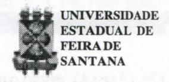
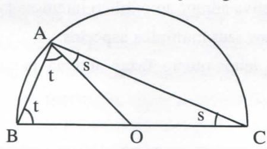
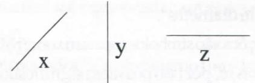

# FOLHETIM DE EDUCAÇÃO MATEMÁTICA

Folhetim Educ. Mat., Ano 10, n. 110, set. / out. 2002

ISSN 1415-8779

#### **OBJETIVO**

Este Folhetim é um veículo de divulgação, circulação de idéias e de estímulo ao estudo e à curiosidade intelectual. Dirige-se a todos os interessados pelos aspectos pedagógicos, filosóficos e históricos da Matemática. Pretende construir uma ponte para unir os que estão próximos e os que estão distantes.

### **EDITORIAL**

A maioria dos livros, em particular os de geometria, usa com bastante freqüência enunciados bicondicionais e definições empregando "se", porém não trazem explicações (com algumas exceções) dos seus significados nos contextos citados. É oportuna e exclarecedora a coluna deste *Folhetim*, e esperamos que a partir dela o leitor tenha um outro olhar sobre teoremas e definições, relacionados ao emprego do "se, e somente se". O tema não está finalizado, e no próximo número outras informações e discussões serão feitas.

A propósito, o próximo *Folhetim* (111) será acompanhado do questionário de satisfação do leitor a ser respondido e enviado, para que possamos implementar ações que visem a melhorar nossa publicação.

# COMITÉ EDITORIAL

Carloman Carlos Borges (Doutor) Inácio de Sousa Fadigas (Mestre)

## PERGUNTE QUE O NEMOC RESPONDE

Pergunta. Muitos alunos nos perguntam sobre o emprego correto da expressão "se, e somente se"; outros desejam saber como são elaboradas as definições matemáticas. Enfim, coisas elementares de Matemática provocam dúvidas no alunado. A finalidade deste Folhetim é tentar esclarecer tais dúvidas.

R. Comecemos com a expressão "se, e somente se". Ela é freqüentemente empregada e falada sem a conjunção "e": "se somente se". Alguns livros trazem a abreviatura dessa expressão assim: "sse". Procuremos o esclarecimento dessa questão. Enunciados formados com a expressão "se, e somente se" são denominados de enunciados bicondicionais, isto é, a conjunção de dois enunciados condicionais. Para uma visão melhor veja o seguinte teorema da Teoria dos Números: "Um terno (a,b,c) é um terno pitagórico se e somente se existem inteiros u e v que verifiquem as seguintes condições:

- (1) u, v > 0;
- (2)  $u \equiv v \pmod{2}$  (isto é u e v possuem a mesma paridade);
  - (3) u.v é um quadrado perfeito e

(4) 
$$a = \sqrt{uv}$$
,  $b = \frac{u - v}{2}$  e  $c = \frac{u + v}{2}$ 

Claramente, podemos reescrever o teorema acima na seguinte variante:

- (I) "O terno (a, b, c) é pitagórico se existem inteiros u e v que verifiquem as condições (1), (2), (3) e (4) e
- (II) oterno (a,b,c) épitagórico somente se existem inteiros u e v que satisfaçam as condições (1), (2), (3) e (4).
  - (I) e (II) podem ser reescritas desta outra forma:
  - (III) Se existem inteiros u e v que satisfaçam às condições

(1), (2), (3) e (4), então o terno (a, b, c) é pitagórico e (IV) o terno (a, b, c) é pitagórico somente se existem inteiros u e v que satisfaçam as condições (1), (2), (3) e (4).

Na expressão (IV) substituamos provisoriamente, a frase "o terno (a, b, c) é pitagórico "pela letra Pe a frase "existem inteiros u e v que satisfaçam, às condições (1), (2), (3) e (4)" pela letra Q. Agora, que significa a expressão "Psomente se Q"? "Somente se" é uma outra maneira de expressar um condicional. Assim, enunciados da forma "P somente se Q" significam "Se P, então, Q". Quando falamos "Existe fogo somente se existir oxigênio". significa expressar o condicional "Se existir fogo, então, existe oxigênio". Logo (IV) acima se reescreve: "Se o terno (a, b, c) é pitagórico, então existem inteiros u e v que satisfazem às condições (1), (2), (3) e (4)". Finalmente, o teorema inicialmente citado assume a forma: "Se existem inteiros u e v que satisfaçam às condições (1), (2), (3) e (4), então o terno (a, b, c) é pitagórico e se o terno (a, b, c) é pitagórico, então existem inteiros u e v que satisfazem as condições (1), (2), (3) e (4)". Vejamos mais um exemplo: "T é um triângulo se e somente se T é um polígono de três lados". Seguindo os mesmos procedimentos explicados acima, teremos: "Se Té um polígono de três lados, então Té um triângulo e Té um triângulo somente se T é um polígono de três lados". Finalmente, teríamos: "Se Té um polígono de três lados, então, Té um triângulo, e se Té um triângulo então Té um polígono de três lados".

Vejamos, agora, a questão relativa às definições. Seja a relação de divisibilidade em Z (conjunto dos

inteiros). Definição: Sejam a e b dois inteiros com  $a \neq 0$ . Diz-se que a divide b se existe um inteiro q tal que b = aq. O "se" que aparece nesse definição e em outras definições matemáticas, deve ser entendido como "se, e somente se". Apenas por uma questão de convenção "se, e somente se" não é usado a não ser nos teoremas. Não esqueçam: Numa definição, na qual duas afirmações são ligadas por "se", isso significa que as afirmações são equivalentes e, a rigor, deveria ser empregado o "se, e somente se", que é reservado mais para teoremas do que para definições. Vejam esta definição: "Bestá entre A e C se (1) A, B e C são pontos distintos de uma reta e (2)  $\overline{AB} + \overline{BC} = \overline{AC}$ ". Como o "se" numa definição significa "se, e somente se" e de acordo com o explicado acima, esta definição deve ser entendida como: "Se(1)e(2) são satisfeitas, então, B está entre A e C e se B está entre A e C, então (1) e (2) são satisfeitas". Só que não é usado o "se, e somente se"nas definições. Assim, aplica-se a palavra definição ao enunciado de uma equivalência entre um termo definido e um conjunto de termos constituintes da definição. A definição deve caracterizar, sem ambigüidade, a compreensão do novo conceito por ela introduzido na teoria T. Ela possui duas partes: o definido e o definidor. Vejam a definição de determinante nulo (o definido). Um determinante é nulo (definido) se suas fileiras ou colunas são linearmente dependentes (definidor). Mais uma vez chamamos a atenção para o significado da partícula "se" empregado nessa definição: ela significa "se, e somente se". Mais uma definição: um número par (definido) é um número divisível por dois (definidor). Pede-se ao aluno colocá-la numa forma empregando o

# NEMOC - NÚCLEO DE EDUCAÇÃO MATEMÁTICA OMAR CATUNDA

Folhetim Educ. Mat., Ano 10, n. 110, set./out. 2002 - Editores: Carloman e Inácio - Secretária: Josenildes Oliveira Venas Almeida - Editoração: Evandro Vaz e Nivaldo de Assis - Impressão: Imprensa Gráfica Universitária - Periodicidade: bimestral - Tiragem: 1.900 exemplares - Distribuição gratuita - Endereço: Av. Universitária, s/n - km 03 - BR 116 - Campus Universitário - Telefone: (75)224-8115 - Fax: (75)224-8086 - CEP 44031-460 - Feira de Santana - Ba - BRASIL - E-mail: nemoc@uefs.br

"se". Como o definidor tem por objeto fazer compreender o definido, ele deve ser formado por termos cuja clareza não seja colocada em dúvida, pelo menos dentro da teoria em questão. Vejam os axiomas de Peano. Em certo sentido e, alguns lógicos concordam com isto: eles são definições implícitas dos termos primitivos (aqueles termos de T que não se definem) da teoria T. As definições matemáticas são criativas, pois introduzem termos novos que são os definidos. Do que ficou dito conclui-se uma nota importante: a definição opera sobre palavras e não sobre coisas. Vale a pena salientar a importância das definições nas demonstrações matemáticas. Aqui, é conveniente recordar o princípio lógico de Pascal: "Substituir o definido pelo definidor". Exemplificando: seja o teorema euclidiano: "um ângulo inscrito num semicírculo é um ângulo reto". Veja a figura

Seja o semicírculo com centro em O e diâmetro BC, conforme figura. Seja A um ponto qualquer da circunferência. O teorema afirma que o ângulo BAC é um ângulo reto. Vamos substituir o definido (a circunferência) pelo definidor: conjunto de todos os pontos do plano cuja distância a O é igual a r (raio). Para isso, desenhamos o raio AO e definimos BÂO = t, CÂO = s. Como AO e BO são raios da circunferência o triângulo ABO é isós celes, donde os ângulos da base são iguais, AÂO = BÂO = t. Igualmente, o triângulo AOC é isós-celes e por isso, AĈO = CÂO = s. Em virtude da soma dos ângulos internos de um triângulo ser igual a 180 graus, temos para o triângulo ABC:

$$t + s + (t + s) = 180^{\circ}$$
, donde,  $t + s = 90^{\circ}$ 

Seguindo o mesmo princípio lógico, o leitor pode

demonstrar o teorema: "Uma corda AB de uma circunferência que não seja um diâmetro, é sempre menor do que um diâmetro".

As definições são símbolos (operam sobre palavras e não sobre coisas) e, por isso possuem significados que são explicados por elas. Como uma mesa é uma coisa, não podemos definí-la em si mesma. Ela não é um símbolo que possua um significado a ser explicitado. Há diversos tipos de definições. Considere a definição: "O Brasil faz fronteiras com o Uruguai, a Argentina, etc.". Com essa frase definimos algo já existente: as fronteiras do Brasil. Logo, ela não introduz no vocabulário de uma teoria T qualquer termo novo, pois, apenas menciona coisas reais; definições desse tipo são designadas de <u>definições reais</u> e não são empregadas em matemática. As definições mais usuais em Matemática são:

- a) definições nominais ou explícitas;
- b) definições por abstração;
- c) definições por recorrência;

Todos os três tipos possuem uma característica: introduzem no vocabulário da teoria T, termos novos e, por isso, são denominadas de definições criadoras. As definições jámencionadas (de circunferência, determinante nulo) são definições nominais ou explícitas. As definições por abstração são fundamentadas em relações de equivalência. A definição de direção é um exemplo de uma definição por abastração. Seja a relação de paralelismo conhecida desde os primeiros anos escolares; trata-se de uma relação de equivalência no conjunto das retas do plano euclidiano P (o mesmo não acontece com o perpendicularismo); então, o seu conjunto quociente é uma partição em IR. Sabemos que, numa relação de equivalência, dois elementos são equivalentes se, e somente se, eles determinam a mesma classe de equivalência; (Será que aqui podemos empregar apenas um "se"?) logo, o que duas retas paralelas têm em comumé a classe de equivalência. Portanto, define-se a direção de uma

<u>reta x</u> como sendo sua classe de equivalência x em IR. Assim, sejam as retas:

Em uma classe coloquemos todas as retas paralelas à reta x; teremos, então, a primeira classe de equivalência em IR; em outra classe estão todas as retas paralelas à reta dada y: teremos a segunda classe de equivalência. Assim procedendo, teremos as diversas classes de equivalência da partição associada a relação de paralelismo. A "visualização" de algumas dessas classes:

$$\overline{x} = { /// ... }; \overline{y} = { | | | | ... }; \overline{z} = { \overline{\underline{}}}$$

Observemos que a direção de uma reta é um conjunto, o qual é a sua correspondente classe de equivalência. Outro exemplo de definição por abstração é a definição de forma de uma figura. Como chegamos ao conceito de forma? Ele resulta, claramente, quando de uma figura fazemos abstração de sua posição e tamanho. Assim, eliminamos de uma figura, através da operação mental denominada abstração, sua posição e seu tamanho, formando o conceito de forma dessa figura, pois a similaridade de figuras geométricas é uma equivalência. E a idéia de número cardinal? Como chegamos a ela? Da mesma maneira: por abstração. Para isso, basta estabelecer entre os elementos de dois conjuntos A e B, uma correspondência biunívoca. Quando talé possível, dizemos que o conjunto A é equivalente ao conjunto B. Assim, todo conjunto determina um número cardinal; dois conjuntos determinam o mesmo número se, e somente se, são numericamente equivalentes. Isso significa: o que há de comum entre dois conjuntos A e B cujos elementos de A estão em correspondência biunívoca com os elementos de B, é eles possuirem o mesmo número cardinal. Observar que na elaboração do conceito de número não levamos "em conta" a <u>natureza</u> dos elementos do conjunto. Esse é mais um exemplo de que a ciência não se preocupa com a "coisa em si" kantiana e sim com relações. Outro exemplo de definição empregada em Matemática é a <u>definição por recorrência</u>. Esta é fundamentada na seguinte propriedade dos números naturais: Suponhamos que 1 goza da propriedade P; se, do fato de um número n gozar da propriedade P, for possível concluir que o número n+1 goza, também, da propriedade P, então, <u>todos</u> os números naturais gozam dessa mesma propriedade P. •

Pergunte que o NEMOC Responde é uma coluna de autoria do prof. Dr. Carloman Carlos Borges e objetiva atingir ao público interessado em Matemática nos seus múltiplos aspectos.

Caso o leitor queira fazer alguma pergunta escreva-nos.

# PRÓXIMO NÚMERO

Coisas elementares de Matemática provocam dúvidas no alunado (continuação).

Aguardem!

# **NÚMEROS ATRASADOS**

Envie para cada folhetim um selo de postagem nacional de 1º porte. Dentro de no máximo quatro semanas, contadas a partir da data de recebimento do seu pedido, você estará recebendo os folhetins solicitados.

OBS.: É permitida a reprodução total ou parcial deste folhetim, desde que citada a fonte.