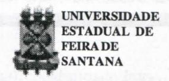
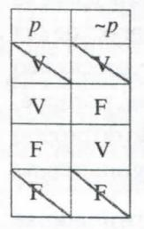

# **FOLHETIM DE EDUCAÇÃO MATEMÁTICA**

**Folhetim Educ. Mat., Ano 10, n.** n **1, nov. / dez. 2002 ISSN 1415-8779**

#### **OBJETIVO**

Este _Folhetim_ é um veículo de divulgação, circulação de **ideias** e de estímulo ao estudo e à curiosidade intelectual. Dirige-se a todos os interessados pelos aspectos pedagógicos, filosóficos e históricos da Matemática. Pretende construir uma ponte para unir os que estão próximos e os que estão distantes.

#### **EDITORIAL**

Conforme divulgado em Folhetins anteriores, encaminhamos a todos os leitores umquestionário de satisfação do leitor, cujo objetivo é avaliar nossa proposta de trabalho. A publicação do Folhetim, que começou modesta (e ainda é, para outros padrões) cresceu bastante em número de assinantes, e por ser totalmente gratuita, alguns problemas técnicos têm às vezes dificultado a pontualidade na distribuição, uma vez que nosso Núcleo não dispõem da estrutura de uma editora distribuidora.

Contamos pois com a colaboração do leitor, no sentido de dispor de 5 a 10 minutos do seu tempo para responder e nos enviar a ficha em anexo. Apartir do número 114daremos prioridade àqueles leitores que nos enviarem a ficha.

Aproveitamos a oprtunidade para desejar a todos um Feliz Natal, e que o ano de 2003 possa ser um ano realmente de mudanças (para melhor).

## **COMITÊ EDITORIAL**

Carloman Carlos Borges (Doutor) Inácio de Sousa Fadigas (Mestre)

#### **PERGUNTE QUE O NEMOC RESPONDE**

**Pergunta.** _Coisas elementares de Matemática provocam dúvidas no alunado (continuação)._

R.Veja a definição de _a":_

$$a^{l} = a$$
$$a^{n+l} = a^{n} \cdot a$$

Note a "economia" que se faz em usar, exempUficando _a'"_ em lugar de _a.a.a.a.a.a.a.a.a.a ._

Outro conceito apresentado em nossos manuais escolares de forma ambigua é o de função proposicional. Esse conceito é apresentado após aulas e aulas sobre o conceito de função; no entanto, ao ser "definido"oaluno fica sem saber qual o domínio da função proposicional apresentada e qual o seu conjunto imagem. A" sorte'' de alguns professores é que não surgem perguntas sobre essa questão. Esse é mais um exemplo da falta de unidade metodológica no ensino da matemática. Definimos, agora função proposicioneil. Definição: uma função proposicional sobre um conjunto A é uma apUcação de A em = {V, F}. Alguns exemplos ilustrarão essa definição.

Sej am as expressões:

a)
$$x + 5 = 10$$
(1)

$$b) x \le y \tag{2}$$

Vamos transformar as expressões (1) e (2) em funções proposicionais. Paraisso, basta fazer a especificação da variável jç, em (1) e das variáveis*xeye,m{2).* Especificar a variável é "amarrá-la" ao conjunto A sobre o qual ela opera. Assim, tanto para (1) como para (2), suponhamos A = IN. Temos, então, as funções proposicionais, para (1):

$$
\begin{array}{ccc}
IN & \longrightarrow \{V, F\} \\
5 & \longmapsto V \\
0 & \longmapsto F \\
314 & \longmapsto F
\end{array}
$$

e para (2) vem:

IN x IN
$$\longrightarrow$$
{V, F}  
(3, 4) $\longmapsto$ V  
(0, 0) $\longmapsto$ V  
(4, 3) $\longmapsto$ F  
(35, 7) $\longmapsto$ F  
(7, 35) $\longmapsto$ V

Outro engano muito comum está no emprego da "equivalência" ( <=> ) entre duas equações. Veja o exemplo. Resolver, >/ _2x + 4=x - 2_

$$(\sqrt{2x+4})^2 = (x-2)^2$$

$$(2)$$

$$2x+4=x^2-4x+4$$

$$(3)$$

$$x^2-6x=0$$

$$(4)$$

$$x=6 \text{ ou } x=0$$

As passagens 2,3 e 4 são equivalentes (porquê?), porém a recíproca da implicação(l) não é verdadeira (por quê?). Devido a esse fato é que apreceu a raiz _x = 0,_ que não é raiz da equação _^[2x+~4 = x-2,_ pois **X =** 6 é a sua única solução. É comum o aluno pensar que, dadas duas equações equivalentes, ao substituirmos uma na outra, obteremos uma nova equação equivalente a elas. Veja a seguinte situação: .v = 4 (1)

$$4 = x (2)$$

Claramente, (x = 4) **<=í>** (4 = _x)_ porém, ao substituirmos (2) em (1) , obtemos a equação _x = x,_ cujo conjunto solução é IR, bem diferente do conjunto solução tanto de (1) como de (2). É preciso não esquecer que dada a implicação jc _= x" = y",_ Vx,^^ IR,

V n e IN, a sua recíproca é verdadeira se n for ímpar, istoé, = **=> X =** _y,yx,y_ e IR se « for ímpar. No caso de _n_ par não vale a reciprocidade.

Muitos alunos continuam, ainda em dúvida sobre se o zero é ou não é um número natural. Esse sentimento é legítimo pois nos próprios manuais escolares, ora ele surge como natural ora não. Isso é apenas uma pequena amostra de como são falhos nossos manuais, principalmentedopontode vistapedagógico. Uma simples observação mostrando, ora a conveniência de não ser considerado natural, ora a conveniência de sê-lo, zero serviria para dirimir não só tal tipo de dúvida, mas mostraria também alguma pista sobre o caráter da matemática: Há a existência de vários pontos de vista, sob os quais uma mesma questão deve ser tratada e é dessa diversidade que a maioria dos professores de matemática foge; daí o autoritari smo e dogmatismo de suas aulas. Muitos deles chegam até ao absurdo de exigirem dos alunos, nas avaliações, que as questões propostas sejam resolvidas porum único padrão, istoé, o padrão oferecido por eles em suas aulas. Infelizmente, no ensino da matemática, o que se vê é uma triste caricatura: uma bela ciência transf orma-se numa temível caricatura ou num simples jogo linguístico. Retomando à questão do zero: como os números inteiros nasceram da necessidade da contagem e, como ninguém conta a partir do zero, este não pode ser considerado um número natural, do ponto de vista histórico. Aliás, o zero é a primeira generalização do conceito de número e não há sentido, nos momentos iniciais do ensino - aprendizagem, iniciar esse processo por generalizações. Não é assim que se aprende. Quando, porém, em estágios mais adiantados, deseja-se estudar os diversos conjuntos numéricos já do ponto de vista estrutural, é conveniente a introdução do zero como elemento neutro da adição. Acima, falamos sobre generalização. Dada a importância dessa operação mental no desenvolvimento não só do

#### **NEMOC - NÚCLEO DE EDUCAÇÃO MATEMÁTICA OMAR CATUNDA**

Folhetim Educ. Mat., Ano 10,n. 111,nov./dez. 2002 **-Estores:** Carloman e Inácio - **Secretária:** Josenildes Oliveira Venas Almeida - **Editoração:** Evandro Vaz e Nivaldo de Assis - **Impressão:** Imprensa Gráfica Universitária - **Perío^cidade:** bimestral - **Tiragem:** 1.900 exemplares - _Distribuição gratuita -_ **Endereço:** Av. Universitária, s/n - km03 - BR 116 - Campus Universitário - **Telefone:** (75)224-8115 - **Fax:** (75)224-8086 - CEP 44031-460 - Feira '- "de Santana - Ba - BRASIL - **E-mail:** neraoc@uefs.br

conhecimento matemático como do conhecimento em geral, vejamos mais de perto em que ela consiste. Há quatro grandes movimentos mentais: a análise, a síntese, a abstração e a generaUzação. Ouso afirmar que não há nenhum campo científicoque se rivalize comamatemática no emprego constante desses movimentos. Penso que bastaria esse fato para justificar o ensino dessa ciência. São os conceitos de demonstração e de generalização que evidenciam o caráter original da matemática. Vej amos como se generaliza. Comecemos com o caso da potenciação. Parte-se de observações empíricas para expoentes inteiros e positivos: 3^7^° ,etc.apresentam um significado intuitivo e sugerem a definição por recorrência: para todo número real _a_ positivo e para todo número inteiron e IN , a potência enésima de a, é definida por:

$$a^{l} = a$$
$$a^{n+l} = a^{n}.a$$

Dessa definição chega-se às regras damultiphcação e divisão de potências inteiras positivas

$$(a^n)^m = a^{nm};$$

$$a^n.a^p = a^{n+p};$$

$$\frac{a^n}{a^p} = a^{n-p} (n > p)$$

Em seguida outra generalização; procura-se a extensão daquelas regras de cálculo quando os expoentes são inteiros relativos. Na terceira generalização incluemse os expoentes racionais, em seguida os reais e fmahnente os complexos. Vej a como cada uma dessas generalizações enriquece o saber matemático. Esse aspecto de generalização deveria ser melhortratado,emnossas salas de aula, procurando-se outras analogias com fatos de outros campos científicos. Retomemos às definições e demonstrações por recorrênciajámencionadas nas linhas acima. Para alguns matemáticos esse é o raciocínio matemático por excelência. De passagem relembremos comoele funciona. Sejauma proposição P(n)referente aos números naturais. Começamos assim:

> A proposição é verdadeira para o número 1. Ora, se é verdadeira para 1, é verdadeira para **2.**

Logo, é verdadeira para 2. <

A esse tipo de dedução formal, constante de duas proposições chamadas premissas e de uma conclusão, chama-se de silogismo. Como se deseja mostrar que a proposição P(«) é verdadeira para qualquer natural _n,_ continuamos, de modo silogístico:

> A proposição é verdadeira para 2. Se é verdadeira para 2, é verdadeira para 3. Logo, é verdadeira para 3.

E assimcontinucunos "indefinidamente"... para

finalmentechegarà"última" conclusão: aproposiçãoP(n)

é válida para todos os números naturais. Aqui, estamos na presença de uma formidável generalização que é a passagem do exame de alguns casos particulares (vale para **1**, vale para **2,** vale para 3,...) para todos os números naturais. Dito de outra maneira: "saltamos" do finito (vale para **1**, vale para **2,** etc.) para o infinito. Como explicar essa passagem? Para o grande matemático francês Poincaré: "Porque, então esse juizo se nos impõe com uma evidência irresistível? É por que não passa da afirmação do poder do espírito que se sabe capaz de conceber a repetição indefinida de um mesmo ato, desde que esse ato tenha sido possível uma vez. O espírito tem uma intuição direta dessa sua capacidade e para ele, a experiência não pode ser senão uma ocasião para se utilizar dela e, desse modo de conscientizar-se de sua existência". Ainda segundoessegrande mestre, oraciocínio por recorrência "se impõe, necessariamente, porque é, unicamente, a afirmação de uma propriedade do próprio espírito" .Maisdúvidas: oaliino costuma perguntar como é que se pode afirmar que _42 é_ bem determinado, se **V2** possui infinitas casas decimais. A resposta é simples: a sua determinação é fundamentada no conhecimento do processo que permite o cálculo desses algarismos até à ordem desej ada. Nos estágios iniciais (eu diria emqualquer estágio ...) do processo ensino aprendizagem o aluno interessa-se enormemente pelas aphcações que envolvem oseucotidiano.Quandoexplicamosaele,exempMcando, que a ordem dos termos numa adição não afeta a sua soma ele olha para a gente como quem indaga: e daí? Qual a importância disso? Talvez fosse interessante pedir-lhe que associe a cada produto adquirido no sujjermercado um número (o seu preço). Na soma formada pelos diversos preços suponha que o total da compra depende da ordem (crescente ou decrescente) dos preços. Então,

que sucede? Quando explicamos o emprego dos conectivos lógicos sempre partimos das tabelas verdades. Assim, para esclarecer, escrevemos:

| p   | í   | PM  | pwq | p->9 |     |
| --- | --- | --- | --- | ---- | --- |
| V   | V   | V   | V   | V    | V   |
| V   | F   | F   | V   | F    | F   |
| F   | V   | F   | V   | V    | F   |
| F   | F   | F   | F   | V    | V   |

Porém, aoexplicarmos a "negação", a apresentamola através da tabela **,>;í**

| ~P  |
| --- |
|     |
|     |

Não seriamais pedagógico seguiromesmo padrão das tabelas anteriores e escrever:

Por quê? E uma boa ocasião para firmar dois princípios básicos da lógica clássica: a) o corte na primeira linha se traduz pelo princípio de não contradição:_p_ e _não p_ não podem ser simultaneamente verdadeiros em um mesmo contexto e b) o corte na quarta linha se traduz pelo princípiodoterceiroexcluído: "uma das duas proposições: _p, nãop, é_ verdadeira. Infelizmente, em nossa salas de aula a grande riqueza conceituai da matemática não é, ao menos, mencionada quando deveria ser destacada como elemento básico do ensino-aprendizagem dessa ciência. Ilustremos essa tese. Alunos, ainda se preparando para o acesso doensino superior sãocapazes de resolver dezenas de equações apresentadas como quociente de dois _mx-lO_ poUnômios, como, em IR a equação: **r—**

_x — 3m_ Porém, quando chegam na graduação, mesmo em matemática, ficam completamente embaralhados quando _Aíx)_ lhes pedimos a solução da equação =0 sendo _A B(x)_ e _B_ dois polinómios. É claro que a solução S dessa equação é dada por

$$S = \{x \in \mathbb{R} / A(x) = 0 \in B(x) \neq 0 \}. \bullet$$

_Pergunte que o NEMOC Responde é_ uma coluna de autoria do prof Dr. Carloman Carlos Borges e objetiva atingir ao púbhco interessado em Matemática nos seus múltiplos aspectos.

Caso o leitor queira fazer alguma pergunta escreva-nos.

### **PRÓXIMO NUMERO**

_Coisas elementares de Matemática provocam dúvidas no alunado (continuação)._

_Aguardem!_

### **NÚMEROS ATRASADOS**

Envie para cada folhetim um selo de postagem nacional de 1° porte. Dentro de no máximo quatro semanas, contadas a partir da data de recebimento do seu pedido, você estará recebendo os folhetins solicitados.

OBS.: É permitida a reprodução total ou parcial deste folhetim, desde que citada a fonte.

#### UNIVERSIDADE ESTADUAL DE FEIRA DE SANTANA DEPARTAMENTO DE CIÊNCIAS EXATAS NEMOC - NÚCLEO DE EDUCAÇÃO MATEMÁTICA OMAR CATUNDA

# **FICHA DE PESQUISA DE SATISFAÇÃO**

| NOME:                                                                                                                              |                                                          |     |     |     |
| ---------------------------------------------------------------------------------------------------------------------------------- | -------------------------------------------------------- | --- | --- | --- |
| ENDEREÇO COMPLETO: (em caso de incorreções na etiqueta) (Rua e/ou Avenida, , Bairro, Cidade, Estado, CEP, Telefone e E-Mail) |                                                          |     |     |     |
|                                                                                                                                    |                                                          |     |     |     |
| ASSINALE OS CAMPOS, DE ACORDO COM A LEGENDA                                                                                        |                                                          |     |     |     |
| 1. Ótimo 2. Bom 3. Regular 4. Ruim 5. Péssimo 6. Não se aplica                                       |                                                          |     |     |     |
| Quanto ao formato e diagramação do Folhetim                                                                                        |                                                          | (   | )   |     |
| Quanto ao conteúdo                                                                                                                 | abrangência profundidade atualidade importância |     |     |     |
| Quanto a linguagem                                                                                                                 | clareza objetividade exemplos                      |     |     |     |
| Quanto ao aproveitamento por parte do leitor                                                                                       |                                                          |     |     |     |

**OBS: O PREENCHIMENTO E DEVOLUÇÃO DESTA FICHA SIGNIFICA QUE VOCÊ QUER CONTINUAR RECEBENDO O FOLHETIM.**

**NEMOC - NÚCLEO DE EDUCAÇÃO MATEMÁTICA OMAR CATUNDA**

Av. Universitária s/n - BR 116 - km 03 - Campus Universitário 44031 -460 Feira de Santana - Ba

Telefone: (75) 224-8115 FAX: (75) 224-8086 E-Mail: nemoc@uefs.br
