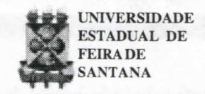

# **FOLHETIM DE EDUCAÇÃO MATEMÁTICA**

**Folhetim Educ. Mat., Ano 10, n. 112, jan. / fev. 2003**

**ISS N 1415-8779**

#### **OBJETIVO**

Este _Folhetim_ é um veículo de divulgação, circulação de ideias e de estímulo ao estudo e à curiosidade intelectual. Dirige-se a todos os interessados pelos aspectos pedagógicos, filosóficos e históricos da Matemática. Pretende construir uma ponte para unir os que estão próximos e os que estão distantes.

# **EDITORIAL**

Ainda sobre coisas elementares .... o _Folhetim_ n° 112 prossegue com a tentativa de esclarecer dúvidas que são comuns àqueles que lidam diretamente com a matemática, sejam professores e/ou alunos. O exemplo envolvendo limite nos alerta sobre a necessidade de não deixar que as intermináveis listas de exercícios muitas vezes repetitivos e mecânicos, venham encobrir a essência desse importante conceito. Em outra discussão, as relações produzidas por homomorfismo são mostradas de forma clara, com aplicações bastante interessantes.

Agradecemos desde j á aos leitores que nos retomaram a ficha com críticas e sugestões sobre o _Folhetim,_ estamos aguardando a sua.

# **COMITÊ EDITORIAL**

Carloman Carlos Borges (Doutor) Inácio de Sousa Fadigas (Mestre)

# **PERGUNTE QUE O NEMOC RESPONDE**

**Pergunta.** _Coisas elementares de Matemática provocam dúvidas no alunado (continuação)._

R. Após a resolução de centenas de exercícios sobre limites, alguns até por eles chamados de "cavernosos", tal a quantidade de "macetes" empregados, nossos alunos, vítimas de um ensino bastante defeituoso, sentem-se incapazes de resolver questões Ugadas a velocidade limite de um corpo de massa _m_ que cai, apartir do repouso, em um meio que apresenta uma resistência proporcional à magnitude da velocidade instantânea, na suposição de que a força da gravidade é constante. Trata-se de um curso onde o cálculo é dado através de equações diferenciais ordinárias (geralmente, o chamado Cálculo **ni).** Pois bem, após a tradução matemática do problema que leva à equação diferencial:

_dv k dt m_ " I — v - g (I) derordem,linearquetemumfatorintegrante _e""_ ,chega-se à solução:

$$v(t) = \frac{mg}{k} + c_1 e^{-\frac{kt}{m}}$$
(II)

Para achar a velocidade-limite faz-se t ^ **oo** em (II) _mg_ quando chega-se ao resultado ~~7~- Verifica-se que a velocidade limite não depende das condições iniciais, senão apenas da massa do objeto e do coeficiente de resistência do meio. Ora, se o conceito de limite fosse anteriormente bem trabalhado se chegaria ao mesmo resultado por maneira mais _dv_ cómoda e elegante anulando ~ na equação diferencial, na chamada passagem ao limite, que é o resultado da interdependência da infinidade de termos da expressão (11);

$$v(t) = \frac{mg}{k} + c_1 e^{-\frac{kt}{m}} ,$$

não há mais nenhuma variação, e como esta, nesse _dv_ fenómeno, é simbolizada pelo termo — , este tem de ser

$$v_e = \frac{mg}{k}$$

_é o_ resultado da interdependência dos termos de (II); O limite é uma constante. Na passagem ao Umite, toda variação cessa. Essa é a ideia grandiosa de limite, à qual, infelizmente poucos alunos têm acesso em virtude de um ensino caricatural.

Nos cursos de graduação em matemática, outra ideia importante é a de homomorfismo cuj a definição é dada a seguir. Sejam dois conjuntos _E e F_ munidos, respectivamente, por duas leis de composição interna, _T_ e \* . Chama-se homomorfismo de _E_ dentro de _F,_ pelas leis \*Te\** todaapHcação/: *E\* —>F tal que

$$(\forall a,b \in E)$$
$f(a \ T \ b) = f(a) * f(b)$

U m homomorfismo bijetivo é chamado de isomorfismo. Quando/ é um homomorfismo de _{E, T)_ dentro dele mesmo, recebe o nome de endomorfismo. Além disso, se ele é bijetivo, toma o nome de automorfismo. isto é, todo isomorfismo de £ em £. Vej a oquadro:

Automoríismo Endomorfismo Isomorfismo li Homomorfismo

Exemplos:I)Homomorfismo n —>a" (a ^tO).

Qualquer que sej a o real a não nulo e qualquer que seja o inteiro relativo _n,_ «"é não nulo: seja a aplicação:

$$f: \mathbb{Z} \to \mathbb{R}^*$$
$$n \to a^n$$

Quaisquer que sejam os inteiros relativos _ntp,_ temos:

$$f(n+p)=a^{n+p}=a^n \times a^p=f(n) \times f(p)$$
.

Assim, somos levados a considerar/como uma aplicação de Z , munido da adição em R munido da multiplicação:

$$\mathbb{Z} \to \mathbb{R}^*$$

$$\begin{cases} n \to a^n \\ p \to a^p \end{cases}$$

$$\Rightarrow n + p \to a^{n+p} = a^n \times a^p$$

I I) Isomorfismo entre os inteiros positivos e os números racionais positivos.

Consideremos os números racionais _a eh_ primos entre si na forma _{a,_ 1), o qual será designado por Q. As operações de adição e multipUcação, como sabemos são definidas pelas igualdades:

$$(a, 1) + (b, 1) = (a + b, 1)$$

$(a, 1) \cdot (b, 1) = (a.b, 1)$

# **NEMOC - NÚCLEO D E EDUCAÇÃO MATEMÁTICA OMAR CATUNDA**

Folhetim Educ. Mat., Ano 10, n. 112, jan./fev. 2003 - **Editores:** Carloman e Inácio - **Secretária:** Josenildes Oliveira Venas Almeida - **Editoração:** Evandro Vaz e Nivaldo de Assis - **Impressão:** Imprensa Gráfica Universitária - **Periodicidade:** bimestral - **Tiragem:** 1.900 exemplares - _Distribuição gratuita -_ **Endereço:** Av. Universitária, **s**/n - km 03 - BR 116 - Campus Universitário - **Telefone:** (75)224-8115 - **Fax:** (75)224-8086 - CEP 44031-460 - Feira de Santana - Ba - BRASIL - **E-mail:** nemoc@uefs.br

Vamos estabelecer uma correspondência entre % ' e **Q** ' : ao inteiro _a_ faça corresponder o racional _{a,_ 1) e reciprocamente. Claramente tal correspondência, além de biunívoca, conserva as duas operações envolvidas, a adição e a multiplicação. Vejam os dois quadros abaixo:

$$
\begin{cases}
a \leftrightarrow (a,1) \\
b \leftrightarrow (b,1)
\end{cases}
$$

$$a + b \leftrightarrow (a + b, 1)$$

$$\Rightarrow a \cdot b \leftrightarrow (a \cdot b, 1)$$

Qual o significado de tudo isso?

Quando escrevemos por exemplo _a -_ (a, 1), significamos que se trata de uma igualdade para efeitos operacionais. Os inteiros**Q** não são iguais aos números (íz, 1) no sentido de igualdade lógica, isto é, de identidade, pois ambos pertencem a conjuntos diferentes. Para convencer-se disso, basta notar que entre os inteiros 3 e 4, não existe nenhum outro inteiro, enquanto que, entre os racionais (3,1) e (4,1) existe uma infinidade de outros racionais, além de outra infinidade de irracionais.

III) Isomorfismo entre progressões aritméticas e progressões geométricas: consideremos a progressão geométrica infinita de termos estritamente positivos:

$$\mu_0 = 1$$
, $\mu_1 = q$ , ..., $\mu_n = q^n$ , ...  
essa seqüência pode ser indexada "à esquerda" com  
índices pertencentes a $\mathbb{Z}$ :

se -
$$m < 0$$
, coloquemos $\mu_{-m} = q^{-m}$

Chegamos, assim, a seguinte sequência:

$$(\mu_n):(...,q^{-m},...,q^{-1},q^0=1,q,...,q^n,...)$$

Consideremos, agora a progressão aritmética (v^), também indexada por Z :

$$(v_n)$$
: $(..., -mr, ..., -r, 0, r, ..., nr, ...)$

Chamemos de U o conjunto dos termos de (/i **J** e

V o conjunto dos termos de (v^). A aplicação / de U={^";«eZ}emV= { v";« € Z}talque(V« e Z ) _ifÍM"_) = v"), isto é _{f{q" ) = nr)é_ bijetora, pois se trata da composta da bijeção que, à /i ^ faz corresponder n e da que, à _n_ faz corresponder v^. Claramente (U,.) é um grupo e igualmente (V, +).

Além disso:
$$(\forall (m,n) \in \mathbb{Z}^2)$$
,  
 $f(\mu_m \cdot \mu_n) = f(\mu_{m+n}) =$  
 $= (m+n)r = mr + nr = f(\mu_m) + f(\mu_n)$ .  
 $f(\mu_m \cdot \mu_n) = f(\mu_m) + f(\mu_n)$

Logo, a aphcação/ é um isomorfismo de (U,.) sobre (V, +).

Examinemos essa questão mais concretamente.

Sejam as duas progressões:

1,3,9,27,81,... (Progressão geométrica de razão igual a 3)

O, 1,2, 3, 4,... (Progressão aritmética de razão igualai)

Elas formam um sistema de logaritmos. Basta observar que os logaritmos de cada termo da progressão geométrica são dados, respectivamente, pelos termos correspondentes na progressão aritmética:

$$\log_3 1=0$$
; $\log_3 3=1$ ; $\log_3 9=2$ ; $\log_3 27=3$ ; $\log_3 81=4$ ; ...

Prolonguemos indefinidamente, tanto os termos da progressão geométrica quanto os termos da progressão aritmética para "o lado esquerdo". Temos:

$$0 \leftarrow \dots, \frac{1}{9}, \frac{1}{3}, 1, 3, 9, 27, 81, \dots \rightarrow +\infty$$

$-\infty \leftarrow \dots, -2, -1, 0, 1, 2, 3, 4, \dots \rightarrow +\infty$

Observe que os termos da progressão aritmética são os logaritmos, na base 3, dos termos correspondentes da progressão geométrica. Podemos, ainda acrescentar, seguindo, aliás, a ordem histórica, que os termos da progressão geométrica são os antilogaritmos dos termos correspondentes na progressão aritmética. Logo, no sistema considerado, o antilogaritmo de 1 é 3 e o antilogaritmo de 4 é 81. A base de um sistema de logaritimos é dada pela razão da correspondente progressão geométrica, ou - o que é mesmo - é o termo, na progressão geométrica que corresponde ao termo "1" na progessão aritmética. Veja que dada a base da progressão geométrica, fica caracterizado o sistema de logaritmos. Agora, se conservarmos a progressão aritmética e variarmos a base da progressão geométrica, obtém-se o quê? Quem cursou o segundo grau há poucas décadas não deve estranhar a apresentação de logaritmos por intermédio de progressões, pois os livros da época costumavam fazertal desenvolvimento. Basta consultar o Curso de Álgebra de Sinésio de Farias, autor muito popular na época. Como já escrevemos diversas vezes, a falha major, dos manuais escolares é a falta de unidade metodológica. Fala-se em logaritmos sem qualquer menção à progressões...

A importância do conceito de isomorfismo transborda o espaço matemático e invade todas as áreas do saber humano, pois trata-se de uma das mais importantes categorias epistemológicas. Citemos alguns casos:i) o filósofo Ludwig Wittgenstein que em virtude de suas metáforas e extrema obscuridade está fadado a ficar muito tempo ainda sendo considerado como grande filósofo, falou muito sobre o "isomorfismo mundolinguagem"como a condição de possibilidade da linguagem; alguns incautos sonham pela formulação (colocar numa fórmula) desse isomorfismo. Tentam, até mesmo, apresentar uma suposta "demonstração matemática" dele... como se tal fosse possível. ii) na modelagem matemática, esse conceito é de grande relevância; iii) ele se encontra mesmo na sugestão de grandes viagens metafísicas com um suposto isomorfismo entre o mundo absoluto (formado pelas "coisas em si") e o mundo fenomenológico. A matemática mostra abundantemente o seguinte: por meio do descobrimento de relações isomórficas pode-se transferir o conhecimento de um espaço cognitivo para outro.

# **ATENÇÃO**

NÃO ESQUEÇA DE NOS RETORNAR A FICHA DE PESQUISA ANEXA AO FOLHETIM Nº 111

Pergunte que o NEMOC Responde é uma coluna de autoria do prof. Dr. Carloman Carlos Borges e objetiva atingir ao público interessado em Matemática nos seus múltiplos aspectos.

Caso o leitor queira fazer alguma pergunta escreva-nos.

#### PRÓXIMO NÚMERO

Coisas elementares de Matemática provocam dúvidas no alunado (continuação).

Aguardem!

# **NÚMEROS ATRASADOS**

Envie para cada folhetim um selo de postagem nacional de 1º porte. Dentro de no máximo quatro semanas, contadas a partir da data de recebimento do seu pedido, você estará recebendo os folhetins solicitados.

OBS.: É permitida a reprodução total ou parcial deste folhetim, desde que citada a fonte.

#### **ERRATA**

No Folhetim 111:

pág. 4, PERGUNTE QUE O NEMOC RESPONDE, 2ª

coluna, 3 a linha, onde se lê
$$\frac{mx-10}{x-3m}$$
, leia-se $\frac{mx-10}{x-3m} = 0$ .
