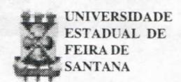
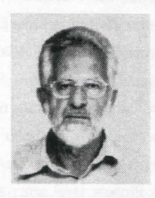

# **FOLHETIM DE EDUCAÇÃO MATEMÁTICA**

**Folhetim Educ Mat., Feira de Santana, Número Especial. 2003** 

**Número Especial ISSN 1415-8779** 

## **OBJETIVO**

Este *Folhetim é* um veículo de divulgação, circulação de ideias e de estímulo ao estudo e à curiosidade intelectual. Dirige-se a todos os interessados pelos aspectos pedagógicos, filosóficos e históricos da Matemática. Pretende construir uma ponte para unir os que estão próximos e os que estão distantes.

#### **EDITORIAL**

Mais uma vez levamos aos leitores um *Folhetim Especial .* que trata de "O nome 'Matemática' ", escrito pelo prof. Dr. Irineu Bicudo. Diferentemente dos textos já publi cados. a erudição é uma característica marcante no presente artigo do professor Bicudo.

Não vamos nos alongar, pois o próprio artigo, bem como a apresentação feita pelo prof. Carloman Carlos Borges, já trazem informações claras sobre a obra e o autor.

A propósito, no Folhetim n° 112 anunciamos a continuação do tema *Coisas elementares de Matemática provocam dúvidas no alunado.*  Porém esta ficará para o próximo número regular.

Aproveitamos ainda para informar que está chegando de todo país as "fichas de pesquisa de satisfação". Estamos esperando a sua, se ainda não enviou.

# **COMITÉ EDITORIAL**

Carloman Carlos Borges (Doutor) Inácio de Sousa Fadigas (Mestre)

## **PERGUNTE QUE O NEMOC RESPONDE**

*O nome JlCaíemáiica* 

*por Irineu CBicaéo'^* 

## **I. O nome**

Em uma singela nota, como soem ser as publicadas na coluna "Painel" da Folha de São Paulo, do dia 3 de janeiro próximo (o dia seguinte àquele em que os ministros do atual governo assumiram seus postos), sob o expressivo título "Ego Ferido", lê-se: "O governador do Piauí, Wellington Dias (PT), reclamou ontem que conhece (José) Dirceu há 20 anos e ele nunca acerta seu nome:' Até no discurso de posse ele me chamou deÉUton'".

Talvez, para cada um. o som mais belo do idioma seja aquele de seu próprio nome.

Mas, o que é um nome?

Devemos aceitar o que diz a apaixonada Julieta a seu Romeu, na mais conhecida passagem da tragédia de Shakespeare (Ato II, Cena 1 - No jardim dos Capuletos):

"E somente teu nome que é meu inimigo; Tu és tu mesmo, no entanto, não um Montecchio. O que é um Montecchio?Não é mão, nem pé. Nem braço, nem rosto, nem qualquer outra parte Pertencente a um homem. O, sê de algum outro nome! O que há em um nome ? O que chamamos uma rosa Por qualquer outro nome seria igualmente perfumada; Assim Romeu, não fosse Romeu chamado, manteria Aquela querida perfeição que possui

Sem aquele nome (...)'"?

Ou o que, fazendo coro com isso, escreve o mais conhecido e premiado escritor hol andes contemporâneo. Cees Nooteboom, em seu romance "Rituais":

"Já estava duas ruas adiante, quando percebeu que nem sabiam o nome um do outro (...) Pensando bem, o que representava um nome? Qual seria a diferença, no que se referia àquele breve encontro, se soubesse como se chamava ela? Nenhuma (...) O que representa um nome? Uma série de letras arrumadas numa certa ordem e que, pronunciadas formavam uma palavra com a qual se podia chamar ou designar uma pessoa"?

Creio que não! Defendo que o nome tenha algo de mági**CO**, de sagrado, como na cultura de quase todas as nações orientais. Os egípcios, por exemplo, atribuíam grandíssima importância ao conhecimento de nomes e do modo de usá-los. Para eles, fazer menção a nomes que possuíam poderes era uma necessidade tanto para os vivos quanto para os mortos. Acreditava-se que, se um homem conhecesse o nome de um deus ou de um demónio, e o chamasse pelo seu nome, o deus ou o demónio interpelado era obrigado a responder-lhe e a fazer o que ele desej asse; e o conhecimento do nome de um homem permitia ao seu vizinho fazer-lhe o bem ou o mal. Para o egípcio, o nome representava uma parte tão grande do ser de um homem quanto sua alma, seu duplo (KA), ou seu corpo.

Cito, ainda, em apoio a esse modo de pensar, a

passagem do Velho Testamento, Êxodos, 3,13-15;

- Moisés disse a Deus: "Quando eu for aos filhos de Israel e disser: 'O Deus de vossos pais me enviou ate vós'; e me perguntarem: 'Qual é o seu nome'?', que direi?".

Disse Deus a Moisés: "Eu sou aquele que c'". Disse mais: "Assim dirásaosfilhosde Israel: 'EuSOUmc enviou até vós'".

'•"^ Disse Deus ainda a Moisés: "Assim dirás aos filhos de Israel: 'lahweh, o Deus de Isaac e o Deus dc Jacob me enviou até vós. Este é o meu nome para sempre, e esta será a minha lembrança de geração cm geração'".

No termo lahweh, pode-se ver, provavelmente, segundo eruditos, o verbo' 'ser'' numa forma arcai ca. O s tradutores da "Septuaginta", a famosa versão grega do Velho Testamento, entenderam - como é explicado na antiga interpolação do versículo 14 - que a expressão significaria "Eu sou aquilo que é" (Ego eimi ho ôn). 1 sso mostraria que, no espírito da tradição oriental. Deus declina revelar seu nome.

Para a matemática, veremos, vale o que sentencia Unamuno, o filósofo espanhol:

"O nome é, em certo sentido, a própria coisa, dar nome às coisas é conhecê-las e apropriar-se delas; a nomeação é o ato de posse espiritual".

Unidos os diferentes juízos, à maneira de Fernando Pessoa, digo:

"O nome é o nada que é tudo".

#### **NEMOC - NÚCLEO DE EDUCAÇÃO MATEMÁTICA OMAR CATUNDA**

Folhetim Educ. Mat., Feira de Santana, Número Especial, mar./abr. 2003 - **Editores:** Carloman e Inácio - • **I Secretária:** Josenildes Oliveira Venas Almeida - **Editoração:** Evandro Vaz e Nivaldo de Assis - **Impressão:**  Imprensa Gráfica Universitária - **Periodicidade:** mensal - **Tiragem:** 1.600 exemplares - *Distribuição gratuita •*  **Endereço**:Av. Universitária, s/n - km 03 - BR 116 - Campus Universitário - **Telefone:** (75)224-8115 - **Fax:** (75)224-8086 - CEP 44031-460 - Feira de Santana - Ba - BRASIL - **E-mail:** nemoc@uefs.br

#### **II. O nome Matemática**

A língua grega clássica possui um verbo, MANTHANO, em polaridade com um outro, DIDASKO. Este significa "ensinar, instruir", aquele, "aprender". A nuança expressa nos textos antigos, em relação a manthano, é "aprender praticamente, aprender por experiência, aprender a conhecer, aprender a fazer", mas acaba por se aproximar do sentido de "compreender".

Dos substantivos de ação derivados desse verbo, destaco "MATHESIS". "ação ou fato de aprender" (chegando, por alargamento de sentido, até "conhecimento, instrução, ciência"), e o resultativo "MATHEMA","aquiloqueé aprendido" (culminando, por extensão, com "aprendizagem, conhecimento, ciência"). O plural de "tò máthema" é "tà mathêma", já usado por Arquitas, Platão e outros para designar "o conhecimento matemático".

O substantivo vemáculo "matemática" (comomuitos outros substantivos portugueses, "gramática", "dialética", ' "retórica",...) era, na língua grega, a forma feminina de um adjctivo. "MATHEMATIKÊ". Ofemininosendoexigido pclaconcordânciacomosubstantivofeminino'TÉCHNE" ("o saber fazer de uma profissão; técnica, arte"), que acompanhava .sempre o adjetivo:' 'he mathematikê téchne", literalmente, "a arte relativa àquilo que pode ser aprendido". Como tempo, o substantivo "téchne" deixou de ser mencionado, e o adjetivo "mathematikê" ganhou status de substantivo: "he mathematikê", "a matemática".

## **III. Como os antigos explicavam o nome Matemática**

Anatólio, bispo de Laodicea (ca. 280 A.D.), citado por Heron (Definições), justifica do seguinte modo a origem do nome "matemática" (traduzo do grego clássico):

"E a partir de que foi chamada matemática?

Os peripatéticos, afirmando, por um lado, alguém haver de ser capaz, não tendo aprendido, de familiarizarse com a retórica, com a arte da poesia, e com a música popular, como um todo, e, por outro lado, relativamente às coisas que são, particularmente, chamadas mathêmata. ninguém aprender o conhecimento, sem antes ter passado pela instrução dessas coisas, pensavam ser chamada matemática a teoria dessas coisas, por causa disso".

#### **rv. Epilogo**

Assim, desde que os gregos conceberam nossa ciência, como a entendemos hoje, está expresso em seu nome ("que, em certo sentido, é apropria coisa") que ela não é, como a retórica, ou a poesia, ou a música, um presente dos deuses aos homens, gratuitas. Não, a matemática, para ser conhecida, demanda estudo árduo, persistência, ânimo forte, paixão, pois, aqui, "os deus vendem, quando dão". •

## *\* 3^rineu OSicutío*

**Carloman Carlos Borges** 

O professor Irineu Bicudo é uma pessoa bastante conhecida nos meios académicos nos quais trabalha. Atualmente, concentra as suas atividades na UNESP, na cidade de Rio Claro, São Paulo, onde desempenha relevante papel na formação de mestres e doutores em Educação Matemática.

O Folhetim de Educação Matemática, bastante honrado, apresenta seu trabalho de pesquisa acerca das origens do termo "matemática". Mais uma vez. nota-se um traço característico do Prof. Irineu Bicudo: sua larga erudição em campos aparentemente tão distantes da matemática. E preciso salientar que existem outras interpretações sobre esse vocabulário que não "batem" com a apresentada pelo ilustre Prof. Bicudo. Ao leitor cabe o exercício de cotejá-las e extrair suas próprias conclusões.

# *O^íyuns dados soSre o 'J-\*rof. Irineu !23icudo*

- Nascido em São Paulo (Capital), em 4 de maio de 1940.
- Bacharel eLicenciadoem Matemática pelaantiga Faculdade de Filosofia, Ciências e Letras da Universidade de São Paulo, 1963.
- Doutor em Matemática (Fundamentos da Matemática)-PUC-SP. 1973.
- Livre-DocenteemMatcmática-IGCE-UNESP-Rio Claro, 1979.
- Professor Titular (por Concurso) IGCE-UNESP-Rio Claro, 1982.
- Bolsista de Pós-Doutoramento da FAPESP, nos três anos que passou como Vi siting Scholar na Universidade da Califórnia, Berkeley (1974-76, 78-79).
- Nos últimos anos, tem-se dedicado ao estudo da cultura grega clássica (Filosofia - Platão e Aristóteles - e Matemática), sobre o que tem pubhcado vários artigos. Prepara, atualmente, as

notas que acompanharão sua tradução, diretamenie do grego, (já pronta), em colaboração com seu ex-aluno de Doutoramento, Carlos Henrique B. Gonçalves, dos ELEMENTOS de Euclides. Será a primeira tradução completa, feita a pan ir do texto grego, a ser publicada, quer no Brasil querem Portugal.

- Pesq u i sador con **V** i dado Fundação Hardt (para o estudo da anti guidade clássica - greco-romana). Genebra, junho dc 1998.
- Tem tido participação constante em Bancas Examinadoras dc Doutoramento, de Livre-Docênciac dc Concursos para Professor Titular no Departamento de Letras Clássicas (Grego, Latim c Filologia Românica) da Faculdade de Filosofia, Letras e Ciências Humanas da Universidade dcSão Paulo.

#### ATENÇÃO

NÃO ESQUEÇA **D E** NOS RETORNAR A FICHA **DE**  PESQUISA ANEXA AO FOLHETIM N" **111** 

## **PRÓXIMO NÚMERO**

*Aguardem.* 

# **NÚMEROS ATRASADOS**

Envie para cada folhetim um selo de postagem nacional de 1° porte. Dentro de no máximo quatro semanas, contadas a partir da data de recebimento do seu pedido. \ocê estará recebendo os folhetins .solicitados.

OBS.: É permitida a reprodução total ou parcial desse folhetim, desde que citada a fonte.