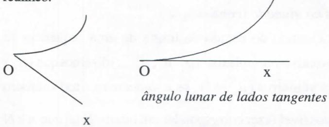
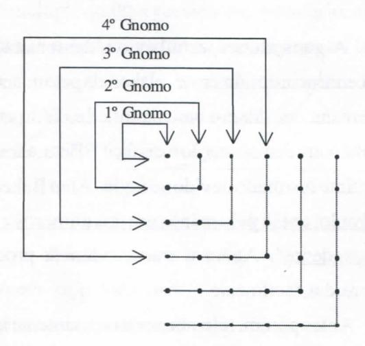

# **FOLHETIM DE EDUCAÇÃO MATEMÁTICA**

**UNIVERSIDADE ESTADUAL DE FEIRA DE SANTANA**

**Folhetim Educ. Mat., Ano 10, n. 114, maio / jun. 2003 ISS N 1415-8779**

### **OBJETIVO**

Este _Folhetim é_ um veículo de divulgação, circulação de **ideias** e de estímulo ao estudo e à curiosidade intelectual. Dirige-se a todos os interessados pelos aspectos pedagógicos, filosóficos e históricos da Matemática. Pretende construir uma ponte para unir os que estão próximos e os que estão distantes.

## **EDITORIAL**

Ainda sobre coisas elementares de matemática, o presente Fo//ierim traz respostas a algumas indagações frequentes. Podemos observar que estas estão agrupadas em vários blocos: sobre a desigualdade no conceito de limite de uma sequência ; sistemas nã o arquimedianos; sobre congruência módulo m; sobre soma de quadrados; sobre a demonstração da transcendência do número ;r e finalmente sobre a palavra gnomo e seu uso na matemática.

Aproveitamos a oportunidade para agradecer a todos os que nos enviaram sugestões e avaliaram nosso trabalho através da ficha de pesquisa que foi anexa ao _Folhetim n°_ 111. Garanta o recebimento dos números a partir do 116, enviando-nos a citada ficha preenchida.

## **COMITÉ EDITORIAL**

Carloman Carlos Borges (Doutor) Inácio de Sousa Fadigas (Mestre)

#### **PERGUNTE QUE O NEMOC RESPONDE**

**Pergunta.** _Coisas elementares de Matemáticaprovocam dúvidas no alunado (continuação)._

R.Quando do estudo do limite de uma sequência de números reais ou complexos: **(^j , //^, /Xj**,...) dizemos que _{fi^)_ tende ao número / _{fl^ -^t)_, se, e somente se, a todo número e > O é possível fazer corresponder um inteiro N tal que n > N _^ H^-t_ < e, escrevendo-se lim _fl^ =1._ Algumas vezes os alunos perguntam se uma das duas desigualdades _n>N, ^"-t\<E_ pode ser substituída pelas desigualdades estritas, isto.é, substituir <e por < e. A resposta é afirmativa. A nova definição é equivalente à definição precedente. Exemplificando, ao substituirmos <e por < e, a nova definição (com o uso da desigualdade estrita < e ) implica, claramente, a precedente. Reciprocamente, se a definição anterior é verificada, existe, para todo e > O, um inteiro N tal que _n>N_ implica _M"-^_ consequentemente _ILI " - 1_ < e.O que não se deveétoma r **E** = O pois, assim, teríamos uma definição demasiadamente restritiva. ^

® Quando da exposição do Axioma de Arquimedes (para dois segmentos desiguais, existe um múltiplo inteiro do menor superior ao maior) de quando em quando, alguns alunos levantam a seguinte questão: há sistemas nos quais esse Axioma perde a sua validade? A resposta é afirmativa. O cálculo Não Standard (vide Folhetim de Educação Matemática n°. 109) com os números infinitesimais é um exemplo de um sistema não arquimediano.

Outro exemplo: os denominados ângulos lunares nos quais não se verifica o Axioma de Arquimedes. Abaixo está arepresentação de dois ângulos lunares: No primeiro, o lado curvo não é tangente ao lado retilineo, enquanto no segundo temos um ângulo lunar de lados tangentes. Pois bem: um múltiplo qualquer deste sempre é inferior a um ângulo lunar cujo lado curvo não é tangente ao lado retilineo. /

_ângulo lunar cujo lado curvo não é tangente ao lado retilineo_

® Quando se estuda as congruências módulo _m_ (m inteiro e positivo) é possível somar, subtrair ou multiplicar móldulo m. O que grande parte dos livros não menciona é que quando _m é_ igual a um número*p* primo, também pode dividir-se. Nesse sentido pode-se falar em frações módulo um número primo. Assim módulo 5 - que é um número primo - temos:

$$2 \times 3 \equiv 1$$
, $2 \times 8 \equiv 1$ ; $3 \times 7 \equiv 1$  
e, portanto, pode escrever-se:

$$\frac{1}{2} \equiv 3$$
, $\frac{1}{3} \equiv 2$ , $\frac{1}{2} \equiv 8$ , $\frac{1}{8} \equiv 2$ , $\frac{1}{3} \equiv 7$ , $\frac{1}{7} \equiv 3$ que

podemos chamar as frações módulo 5.

® Por diversas vezes alguns alunos nos procuram com problemas envolvendo somas de dois quadrados. Aclaremos melhor a questão: que possuem de comum os números 2,5,13,17,29,37,...?Umarápida verificação visual leva a conclusão que todos eles são números primos; verticalizadndo nossa "pesquisa" concluímos poderem os mesmos serem escritos como somas de dois quadrados:

$$2 = 1^2 + 1^2$$
, $5 = 2^2 + 1^2$ ; $13 = 3^2 + 2^2$ ,  
 $17 = 4^2 + 1^2$ , $29 = 5^2 + 2^2$ ; $37 = 6^2 + 1^2$ .

Deve-se concluir daí de que todo número primo pode ser escrito como soma de quadrados? A resposta é negativa. Basta examinar os números 3,7,11,43, ... Eles são primos, porém não são somas de dois quadrados, pois os quadrados deixam restos O ou 1 quando divididos por 4; logo, a soma de dois quadrados pode deixar como restos apenas, ou O ou 1 ou 2. Cabe a Fermat a descoberta: pode-se escrever um número primo*p,* como soma de dois quadrados, apenas *sep+\o for divisível por4. Apliqueesse magnífico resultado a 2.*5.13,17,29, 37 e, também, aos números 3,7,11,43 ... A questão, agora, é a seguinte: dado um número inteiro e positivo arbitrário, quando podemos afirmar que ele pode ser escrito como soma de dois quadrados? Em primeiro lugar, faça-se a decomposição do número em fatores primos _n = p"\p2''^ -p"^ •••_ Quando nenhum dos números pj"' _->r\,p.^"^ ^^^Pi"^_ +1 for divisível por 4,

## **NEMOC - NÚCLEO D E EDUCAÇÃO MATEMÁTICA OMAR CATUNDA**

**Folhetim Educ. Mat, Ano 10,n. 114, maio/jun. 2003 -Editores: Carloman e Inácio - Secretária: Josenildes Oliveira Venas Almeida - Digitação: Manoel Aquino dos Santos - Editoração: Evandro Vaz e Nivaldo de Assis - Impressão: Imprensa Gráfica Universitária - Periodicidade: bimestral - Tiragem: 1.900 exemplares -** _Distribuição gratuita -_ **Endereço: Av. Universitária, s/n - km 03 - BR 116 - Campus Universitário - Telefone: (75)224-8115 - Fax: (75)224-8086 - CEP 44031-460 - Feira de Santana - Ba - BRASIL - E-mail: nemoc@uefs.br**

então, podemos afirmar que ele pode ser escrito como a soma de dois quadrados. Alguns exemplos servirão para ilustrar o que foi escrito: Sej a o número 125 que é igual a 5^ Logo **53**+1 = 126 = 4.31+2 . Assim, o número 125 pode ser escrito como soma de dois quadrados. De fato:

$$125 = 10^2 + 5^2$$
.

Paran= 100 podemos escrever n = 10^; logo, 100 = 102 + 02.

Para n = 72 = 2' . 32 como 2' + 1 = 9 e 32+1 = 10, ambos (9 e 10) não divisíveis por 4, o número 72 pode ser escrito como a soma de dois quadrados.

Realmente, 72 = 6^+ 6-.

Para n = 1000 = 2' . \*5\e 2^ + 1 = 9 (não divisívelpor4**\*)e53+**1 = 126 (também não divisível por 4); dessa forma, o número 1000 pode ser representado como a soma de dois quadrados. É preciso notar que essa representação não é única, pois 1000 = 900+ 100 = 302 + 102. poj. o^jro lado: 1000 = **262 + ^** = 676 + 324.

Ao escrever sobre esse assunto, é difícil deixar de lembrar o brilhante matemático indiano Ramanujan (1887 -1920) com a sua inacreditável capacidade de perceber relações numéricas complicadas. "Descoberto" pelogrande matemático inglês G. H. Hardy (1877 -1947), Ramanujan fez com ele uma bela parceria que produziu belos resultados matemáticos. Hardy conta o seguinte: ao visitar o seu amigo indiano no hospital, comentou com ele que viera em um táxi de chapa numerada com o número 1729, número sem nenhum interesse. Ramanujan imediatamente questionou essa afirmativa dizendo: 1729 é o menor inteiro que se pode expressar de duas maneirascomo soma de dois cubos:

$$1^3 + 12^3 = 1729 = 9^3 + 10^3$$
.

Em outra ocasião, calculou mentalmente o valor de afirmando situar-se o seu valor "muito proximamente de umnúmerointeiro".Realmente,onúmCTo _^7t ^ 3_ é um inteiro seguido de doze zeros antes de aparecer qualquer outro algarismo.

® Alguns alunos, estudando a demonstração da transcendência do número _n ,_ elaborada pelo matemático Lindemarm, considera-a bastante difícil e, daí, a pergunta: "Não há outra demonstração mais fácU" ?Bem, admitamos o seguinte resultado devido ao inglês Alan Baker: _"sex_ não é nulo, então pelo menos um dos números _xoue^é_ transcendente". Agora a transcendência procurada decorre, daí, facilmente.

Antes porém, relembremos rapidamente que um número real ou complexo _x é_ chamado de número algébrico se ele é raiz de um polinómio com coefientes inteiros. Caso contrário, _x é_ transcendente. Ainda, se _a_ e è são dois números algébricos, então a sua soma _a + b, 0_ produto _abe, se a_ não é nulo, seu inverso _l/a_ também são números algébricos. Vejamos, agora como se demonstrafacUmenteatranscendênciado número _n_ -Da teoria dos números complexos sabemos que: _e'"_ = - 1 •

Como -1 é algébrico por ser solução da equação algébrica _x+l=0, e'"_ também o é. Pelo teorema de Alan Baker

$$x = i\pi$$

tem que ser um número transcendente, visto ser o outio número _e'"_ umnúmer o algébrico (eleé igual a-1). Mas _x=i7t_ é o produto de de dois números: i que é algébrico por ser solução de **A:^ +** 1 = 0) e ;r ; se ;r fosse algébrico, _1 n_ também o seria (produto de dois algébricos), o que contraria o teorema anunciado de Alan Backer.

® A palavra gnomo nem sempre vem bem explicada

nos textos escolares. Os antigos gregos chamavam de gnomon a uma peça ajustável a uma outra com a finalidade de, após o ajustamento, produzir outra peça de tamanho maior, porém, da mesma forma.

Veja a figura abaixo:

Uma observação mais atenta dessa figura, levanos a calcular "visualmente" a soma dos _n_ primeiros números ímpares: 1 + 3 + 5 + 7 + ... + n

Vejamos: . . , .

**A** soma do primeiro P = 1 **A** soma dos dois primeiros 2^ = 4 **A** soma dos três primeiros 3^ = 9 **A** soma dos quatro primeiros 4^=1 6

**A** soma dos n-ésimos primeiros — _n^ = n^_

Logo: 1 + 3 + 5 + 7 + **... = «2 .**

Esse exemplo mostra a unidade entre os aspectos cardinal e ordinal do número natural. •

#### **ATENÇÃO**

**N ÃO ESQUEÇA D E NOS RETORNA R A FICH A D E PESQUIS A ANEX A A O FOLHETI M N" 111**

_Pergunte que o NEMOC Responde é_ uma coluna de autoria do prof. Dr. Carloman Carlos Borges e objetiva atingir ao púbUco interessado em Matemática nos seus múltiplos aspectos.

Caso o leitor queira fazer alguma pergunta escreva-nos.

## **PRÓXIMO NUMERO**

_Génese e y/is/or/ar Á/yar nos corações matemáíicos?_

_(T^or droa òimis)_

_Aguardem!_

## **NÚMEROS ATRASADOS**

Envie para cada folhetim um selo de postagem nacional de 1° porte. Dentro de no máximo quatro semanas, contadas a partir da data de recebimento do seu pedido, você estará recebendo os folhetins sohcitados.

OBS.: É permitida a reprodução total ou parcial deste folhetim, desde que citada a fonte.
