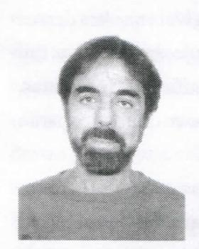

# FOLHETIM DE EDUCAÇÃO MATEMÁTICA

UNIVERSIDADE ESTADUAL DE FEIRA DE SANTANA

Número Especial ISSN 1415-8779

Folhetim Educ. Mat., Feira de Santana, Número Especial, 2003

#### **OBJETIVO**

Este Folhetim é um veículo de divulgação, circulação de idéias e de estímulo ao estudo e à curiosidade intelectual. Dirige-se a todos os interessados pelos aspectos pedagógicos, filosóficos e históricos da Matemática. Pretende construir uma ponte para unir os que estão próximos e os que estão distantes.

#### **EDITORIAL**

O Folhetim de Educação Matemática, através do seu corpo editorial, sente-se honrado em publicar o artigo de Aron Simis: Gênese e História: lugar nos corações matemáticos? no qual esse celebrado matemático tem como objetivo "tornar aceitável a noção de como o conhecimento de períodos anteriores, enfocado criticamente, pode desempenhar papel na formação do aluno e do profissional da área".

# COMITÉ EDITORIAL

Carloman Carlos Borges (Doutor) Inácio de Sousa Fadigas (Mestre)

# Sênese e História: lugar nos corações matemáticos?

por Aron Simis\*

Ao que parece, caro leitor, logrei atrair sua atenção através de umtítulo sentimental. Mas, não se sinta ludibriado, pois há mais paixão e emotividade na formação do tecido matemático do que deixa antever a habitual rejeição nos meios escolares. O erro, este sim, seria o de confundir o tema da paixão científica com o amor pela educação. Ambos têm seu espaço de ação, mas são atitudes diferentes, embora mutuamente agentes. Por exemplo, a paixão científica produz uma inegociável urgência de transmitir o fato científico; o amor pela educação não tem qualquer pressa nesta transmissão, seu objetivo é o desdobrameno a médio ou longo prazo da reação à informação transmitida. Por esta e outras razões, é comum ser versado em uma, demonstrando ignorância no outro.

De uma maneira ou de outra, meu modesto objetivo é tornar aceitável a noção de como o conhecimento de períodos anteriores, enfocado criticamente, pode desempenhar papel na formação do aluno e do profissional da área. A dificuldade deste enfoque é que pressupõe anos de experiência profissional am ambas as facetas da ciência: ensino crítico e pesquisa relevante. Daí, a renúncia usual à implementação da vertente histórica nas disciplinas de matemática, mesmo nas etapas mais avançadas da formação profissional.

# I. A abordagem genética

O enfoque crítico do desdobramento de uma ciência ou, mais modestamente, de uma teoria matemática, depende do que chamarei, talvez inapropriadamente, de "abordagem genética". Nesta abordagem, a personagem central é o conceito matemático através de sua gênese e cristalização. A interveniência dos autores matemáticos é um elemento natural nesta abordagem, contrapondo-se à aborrecida enumeração das efemérides e datas principais das biografias daqueles autores.

A objeção conceitual mais comum a este modelo é a do círculo vicioso, pelo qual a complexidade na formulação e tratamento apropriado do conceito matemático exigiria uma experiência previamente adquirida de modo não genético, o que resultaria em depender do modelo tradicional, invalidando a abordagem proposta como elemento principal da formação matemática. Em suma, por este ângulo, o ensino genético se constituiria em um luxo desnecessário e, mais do que provavelmente, repetitivo.

Esta objeção é bastante razoável. Contudo, esquece em sua argumentação o aspecto do amadurecimento gradativo do aluno, aspecto sobre o qual repousa, fundamentalmente, o modus operandi do mesmo ensino tradicional. Além disso, não se pode esquecer que o conteúdo matemático a que é exposto o aluno, desde os primeiros anos escolares, segue, em grandes linhas, a ordem histórica de seu surgimento. As exceções são, via de regra, acidentais ou experimentais.

Assim, para dar um exemplo no setor do ensino da geometria, primeiro aprende-se a lidar com a forma e a posição relativa dos objetos geométricos, como abstração preliminar do mundo real (geometria sintética (do primeiro grau)); em seguida, vêm as diversas noções de medição desses objetos, tais como comprimentos de segmentos, áreas de triângulos e elementos de medida de ângulos e de arcos (geometria métrica¹ e trigonometria plana); depois, a percepção dos mesmos por meio de equações cartesianas e algébricas (geometria analítica ou o antigo cálculo vetorial); mais adiante, sofistica-se a apreensão desses objetos através de sua representação funcional e a sua invariância sob a ação de certas estruturas (álgebra linear (matrizes e espaços vetoriais), topologia geral, diferencial e algébrica, geometria diferencial e algébrica).

Observemos que as etapas mencionadas obedecem, essencialmente, à seqüência histórica do nascimento dos conceitos. Devido a grandes lacunas causadas por perdas temporárias ou permanentes de manuscritos importantes, esta ordem pode ter sofrido inversões ou ajustes. Por exemplo, Cajori (ibid.) nota que somente no século XVIII os oito tomos de Seções Cônicas, de Apolônio, foram traduzidos ao latim por Halley, de Oxford (o oitavo tomo, de fato, nunca foi encontrado e sua tradução é, na verdade, uma interpolação editorial). É possível que, não fosse por este retardamento, a geometria das curvas planas viesse a se institucionalizar como primeira etapa na formação escolar e as crianças viessem a desenhar sinuosidades antes de angulosidades...

Tambémé de notar que a chamada geometria sintética tem um significado mais amplo do que aquele mencionado acima como primeira etapa no aprendizado – daí ter sido

## NEMOC - NÚCLEO DE EDUCAÇÃO MATEMÁTICA OMAR CATUNDA

Folhetim Educ. Mat., Feira de Santana, Número Especial, jul./ago. 2003 - Editores: Carloman e Inácio - Secretária: Josenildes Oliveira Venas Almeida - Digitação: Manoel Aquino dos Santos - Editoração: Evandro Vaz - Impressão: Imprensa Gráfica Universitária - Periodicidade: bimestral - Tiragem: 1.900 exemplares - Distribuição gratuita - Endereço: Av. Universitária, s/n - km 03 - BR 116 - Campus Universitário - Telefone: (75)224-8115 - Fax: (75)224-8086 - CEP 44031-460 - Feira de Santana - Ba - BRASIL - E-mail: nemoc@uefs.br

&lt;sup>1 A geometria sintética elementar, no tratamento de congruência de figuras geométricas, vê medidas de ângulos e de segmentos como propriedades intrínsecas ou como elementos de axiomatização. É interessante ver a mudança de atitude ao longo dos tomos dos _Elementos_ de Euclides. Segundo Cajori (_History of Mathematics_, Chelsea, Fourth Ed., 1985), a geometria grega até (inclusive) Euclides, não era muito versada em teoremas sobre medição de objetos geométricos. Aparentemente, foram Arquimedes e Apolônio os grandes pioneiros da geometria métrica propriamente dita.

acrescida do complemento "do primeiro grau". Evidentemente, esta expressão não faz qualquer sentido na categorização intrínseca da matemática, mas evita a confusão potencial com o que se costuma denominar a geometria sintética dos séculos XVIII e XIX, na qual se destacaram Monge, Desargues, Poncelet, Gergonne, Chasles (França), Magnus, Moebius, Steiner, Staudt (Alemanha), Cremona (Itália), paracitar os mais célebres.

Desta maneira, ambas abordagens – tradicional ou genética – se reportam ao método gradual e histórico, considerando portanto a dificuldade e a abstração progressiva, sem que nisto exista qualquer distinção significativa. A diferença residiria na forma de introduzir o conceito matemático e não no seu grau de complexidade e abstração. Naturalmente, esta diferença se manifestaria mais acentuadamente à medida que o conceito matemático se fizesse mais sofisticado e tardio no desdobramento histórico.

A linha genética aborda o conceito matemático in vivo, em suas condições naturais de nascimento e existência, explicando o status quo do conhecimento do período, elaborando sobre fases e conceitos imediatamente anteriores ou posteriores a ele relacionados. Ressalta o alcance dos modelos existentes, compara-os, extrapola para trás e para frente, interpola conclusões à medida que desenvolve a análise. Substitui a apresentação moderna definitiva a priori pelo encadeamento natural histórico, sem se prender rigidamente seja à notação do período, seja à sua deficiência, mas ainda assim analisa estes aspectos, interpolando dados somente possíveis devido ao nosso distanciamento crítico e visão de conjunto.

#### II. Dificuldades de implementação

Tendo sido acima diagnosticada a diferença básica entre a abordagem tradicional e a genética, passarei a analisar o aspecto da implementação efetiva desta última. Como sempre, existem ângulos de natureza psicológica e técnica. Mudanças soem acarretar obstruções mentais nos hábitos do público alvo—composto de professores e alunos—provocando uma reação contrária. Não é apenas a natureza da mudança em si, mas também o empenho que exige sua efetivação. Um afeta o item da preparação do corpo docente, o outro a sua reorganização. (Curiosamente, estes fatores podem afetar o elemento discente na ordem inversa!).

Do ponto de vista prático, um fator secundário, mas nemportal menos preocupante, na institucionalização de disciplinas genéticas nos bancos da universidade (por exemplo) é a formulação de ementas adequadas. Existe uma solução óbvia para esta questão: deixar as ementas livres! Desafortunadamente, ao sabor da idiossincrasia do professor e de sua reduzida disponibilidade, a rotina conduziria, fatalmente, àquela superficialidade já mencionada do rol das efemérides mundanas da vida de um matemático—em vez da do atacante Ronaldinho, por exemplo!

Abandonando esta "solução", deparamo-nos com o velho paradigma de que uma bela teoria pode desembocar em péssima aplicação. Qualquer um dos meus excelentes colegas matemáticos (que não são poucos) é completamente capaz de escrever uma ementa atraente. Redigir belas e coerentes ementas de disciplinas é como redigir harmoniosos projetos de pesquisa. O problema reside na implementação de facto. Ou ainda, usando uma pobre metáfora informática, o abismo entre a formulação correta de um algoritmo e a sua eficácia para o cálculo efetivo.

Pessimisticamente, a dificuldade de implementação de disciplinas de natureza genética, no atual modelo das universidades, é praticamente insuperável. Os prérequisitos seriam, minimamente:

1. Reformulação total das ementas tradicionais

- 2. Treinamento docente suplementar
- 3. Motivação do corpo discente
- 4. Visão administrativa de alcance
- 5. Tomada de decisões rápidas (em meio ao presente emaranhado burocrático)

Em seu conjunto, a superação destes requisitos mínimos parece uma quimera longínqua. Contudo, dissecados individualmente, são os mesmos propugnados para o ensino tradicional. Embora não funcione a pleno vapor este conjunto, nem por isto abrimos mão do ensino tradicional. Esta observação permite entrever uma discussão mais aprofundada sobre as duas abordagens, sem que nenhuma delas saia em desvantagem inicial devido à realidade atual das nossas instituições.

Perguntar-se-ia, neste ponto: afinal, para que tanto esforço? Em que serviria a mudança de abordagem? Eu responderia que o principal objetivo seria o de formar alunos e profissionais mais criativos e críticos. No panorama atual, a característica central tem sido a "reprodutividade", pela qual a preocupação é a formação de quadros e a perpetuidade do modelo. Evidentemente, este modelo tem servido, com maior ou menor eficácia, à rolagem do sistema como um todo. Contudo, se quisermos produzir professores e pesquisadores mais críticos, mais motivados ou mais criativos, o modelo tradicional deixou de funcionar (pelo menos no país). A proposta genética poderá vir a ser lenta e pesada no início, mas como tem uma meta bem definida será, na pior das hipóteses, uma tartaruga de Zenão.

#### III. Exemplo propedêutico

Darei um exemplo, de natureza algébrica – área em que, naturalmente, me sinto mais confortável. Na teoria da resolução de equações algébricas (modernamente, Teoria de Galois), tem relevo a noção de permutar as raízes de um polinômio f(x). Esta idéia

aparece originalmente no célebre artigo de Lagrange Réflexions sur la résolution algébrique des équations (Oeuvres, Tome III, pp. 205-421, Gauthier-Villars, Paris, 1869; originalmente publicado nas Memórias da Berlinischer Akademie em 1770-71). Trata-se de uma das idéias mais fecundas da área, que levaria Galois a construir uma teoria quase definitiva e abriria o mundo matemático à importância da noção de simetria finita, produzindo, em particular, as bases da teoria dos grupos finitos.

Havendo já trabalhado exaustivamente na solução numérica das equações algébricas, tendo publicado todo um compêndio sobre como calcular raízes reais, melhorando e tornando rigoroso o algoritmo newtoniano, Lagrange possivelmente deu-se conta da necessidade de contornar, de uma vez por todas, a dificuldade intrínseca do cálculo explícito das raízes de uma equação de grau superior. Assim, foi levado a considerar, abstratamente, o conjunto $\{\dot{a}_1, ..., \dot{a}_n\}$ das raízes de um polinômio f(x) de grau n, notando a existência de propriedades inerentes deste conjunto, independentes do seu cálculo efetivo. Estas propriedades seriam expressas através das relações (polinomiais) satisfeitas por estas raízes e das simetrias de f(x). Afinal, pensara Lagrange, que propriedades seriam mais naturais do que estas? E, através de seu longo artigo de mais de 200 páginas, passou a bola ao século seguinte, que encontrou Galois atento na grande área. As tres primeiras seções do artigo são perfeitamente legíveis, mesmo para as nossas gerações. Nelas, Lagrange recolhe os principais fatos da teoria conhecidos até então, com ênfase nos trabalhos anteriores dos renascentistas (Cardano, Ferrari, Tartaglia, Hudde) e nos mais tardios (Euler, Tschirnhaus, Bézout).

Mas, o que eram exatamente _relações_ e _simetrias_? Lagrange jamais introduziu estas noções explicitamente. Em verdade, é mesmo muito difícil em meio à longa e inextricável sequência de relações e igualdades produzidas no artigo, divisar o método a ele

atribuido. Os historiadores competentes de matemática costumam, frequentemente, atribuir a matemáticos de períodos anteriores a paternidade de certas idéias e conceitos que são dificilmente legíveis na obra desses autores, em uma espécie de auto-projeção retroativa. Em muitos casos, esta paternidade se justifica, mas em outras, é preciso um esfôrço muito próximo do dramático para a plena justificação da atribuição.

Uma relação polinomial das raízes de f(x) é um polinômio $F = F(x_1, ..., x_n)$ (em n indeterminadas) tal que = 0. Para cada polinômio f(x), o número mínimo de relações básicas (isto é, tal que qualquer relação é uma expressão racional nestas) é igual a n. Por exemplo, se f(x) é irredutível sobre o corpo de coeficientes considerado, o próprio f(x) pode sempre ser pinçado como uma dessas relações básicas, o que fornece uma cota preliminar para o grau de complexidade do polinômio (o grau da extensão do corpo de raízes). As conhecidas relações de Girard-Vieta, entre raízes e coeficientes, não são relações são relações básicas, mas podem ser detectadas como combinações "lineares" destas permitindo "coeficientes" polinomiais.

Um polinômio $\mathbf{F}$ é dito ser _invariante_ por uma permutação $\sigma$ dos índices $\{1,...,n\}$ se $F(x_{\sigma(1)},...,x_{\sigma(n)})$ . Uma simetria de f(x). O conjunto das simetrias de f(x) constitui um subgrupo simétrico de grau n

Neste ponto, a abordagem genética pausa para respirar, analisando criticamente os dados e o contexto. Algumas das provocações aos alunos seriam

- 1. Se $\{a_1, \dots a_n\}$ é o conjunto abstrato, o que significa precisamente dizer que $a_i$ é uma raiz de f(x)?
- 2. Mesmo definindo uma raiz de $f(x) = \sum_{i} c_{i} x^{i}$ como sendo um "elemento" $\alpha$ tal que $f(\alpha) = \sum_{i} c_{i} x^{i} = 0$ , onde "vive" $\alpha$ e onde se processam as operações e a igualdade?
- 3. Onde se processam as operações implicitas e a igualdade em $F(a_1, ..., a_n) = 0$ ?

- 4. (De natureza computacional). Tendo elaborado as questões anteriores em grau satisfatório, como calcular efetivamente as relações $F(a_1, ..., a_n) \neq 0$ ?
- 5. (Descoberta fundamental de Lagrange-Galois) Se $F(a_1, \ldots, a_n) \neq 0$ é uma expressão polinomial invariante por todas as simetrias de f(x), é verdade que $a \in k$ tal que $F(x_1, \ldots, x_n)$ a é a expressão racional nas relações básicas?

Na sequência em algum momento apropriado, esta linha de abordagem sintetizaria o primeiro bloco introduzindo a noção de corpo, de extensão de corpos e de corpo de raízes. A dinâmica e a flexibilidade próprias do método permite esta dramática interposição de épocas, quando sabemos que a noção de extensão de corpos foi minimamente considerada por Galois e a noção mais precisade corpo de geradores de extensão só foi elaborada mais tarde, por Kronecker e Dedekind. Mesmo a resposta adequada à provocação 1 acima só seria satisfatoriamente precisada pelo primeiro desses matemáticos - no que hoje é hábito designar por "teorema de Kronecker". Embora a idéia da raiz de um polinômio seja quase tão antiga como a matemática, o problema de sua rigorosa definição e de sua existência só viria a ser adequadamente abordado no final do século XVII e início do século XIX. A prova de D'Alembert do teorema fundamental da álgebra era insuficiente, bem como a de Lagrange. Ambas, entre outras publicadas no período, foram criticadas por Gauss, quem, em um espaço de 40 -50, anos produziu quatro provas diferentes do teorema - também não completamente livres de uma análise crítica. O argumento principal de Gauss sobre a falha de todas as outras demonstrações era a hipótese da existência a priori de raízes em algum lugar não precisado; partindo deste pressuposto, tornava-se fácil provar que existiam raízes complexas! A história desta simples rotina "seja α uma raiz de f(x)" é tão rica que só viria a ter um desfecho tardio com resultados de Kronecker postumamente

recolhidos por Fine (Bull. Amer. Marth. Soc. 20 (1914)).

O fecho deste bloco inicial poderia culminar com anoção de homorfismo de anéis e seu núcleo, introduzindo a noção de apresentação polinomial do corpo de raízes. Finalmente, o "quadrado mágico" do assunto (a ser recortado pelo aluno e puxado do bolso em qualquer situação algébrica emergencial):

$$\begin{array}{cccc} k[\nu_1, \ldots, \nu_n] & \subset & k[x_1, \ldots, x_n] \\ \downarrow & & \downarrow \\ k & \subset & k[\alpha_1, \ldots, \alpha_n] \end{array}$$

onde $k[x_1, \ldots, x_n]$ é um anel de polinômios a n indeterminadas, $k(\alpha_1, \ldots, \alpha_n)$ é o corpo de raízes f(x). A seta vertical da direita é um nomomorfismo apropriado de anéis, cujo núcleo gerado pelas relações básicas a seta da esquerda é a sua restrição ao subanel gerado pelos polinômios de Girard-Vieta (explicando a relação entre estes e as relações básicas). A inclusão horizontal superior é a clássica extensão inteira do anel dos polinômios simétricos que, em nível dos respectivos corpos de frações tem grau n!. Na extensão dos corpos na linha horizontal inferior, o grau degenera em geral para um divisor de n!. Para usar uma imagem grosseira, conquanto eloqüente, Lagrange passeou no andar superior com olho no inferior, enquanto Glois andou no piso inferior, com olhares furtivos para cima.

Algumas noções mencionadas no parágrafo anterior são tardias em álgebra que ensejariam um deliciosa excursão pela história da álgebra do início do século XX.

Mas, isto, leitor, é uma outra estória. Agradeço o espaço cedido por esta valiosa revista à minha vaga elaboração de uma alternativa didática e termino com uma pergunta: você, leitor, consideraria o texto deste artigo uma abordagem genética?

## \*Aron Simis

Carloman Carlos Borges

O matemático Aron Simis é mundialmente conhecido por suas pesquisas na Álgebra. Seus artigos podem ser lidos nos principais periódicos de Matemática, de nível internacional. Além disso, foi professor convidado das mais

importantes universidades mundiais, nas quais desenvolveu suas atividades de pequisador original e criativo.

Nas dezenas de artigos por ele publicados, notase a criatividade do puro matemático - aquele que, fundamentalmente, cria matemática.

Atualmente como, Professor Titular da UFPE, além de continuar efetuando suas originais pesquisas, o Prof. Aron Simis derrama a sua generosidade no apoio e estímulo aos jovens potencialmente voltados ao conhecimento matemático e, com isso, presta um grande serviço ao País.

Mais uma vez agradecemos ao ilustre e generoso Mestre por nos distinguir com o artigo ora publicado no Folhetim.

# PRÓXIMO NÚMERO

Aguardem!

# **NÚMEROS ATRASADOS**

Envie para cada folhetim um selo de postagem nacional de 1º porte. Dentro de no máximo quatro semanas, contadas a partir da data de recebimento do seu pedido, você estará recebendo os folhetins solicitados.

OBS.: É permitida a reprodução total ou parcial desse folhetim, desde que citada a fonte.
