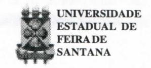
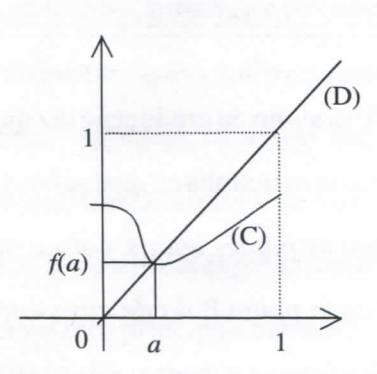
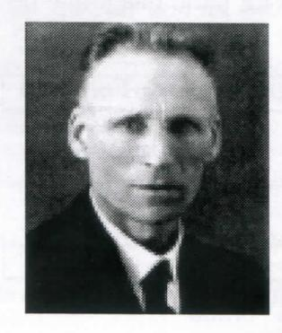

# **FOLHETIM DE EDUCAÇÃO MATEMÁTICA**

**Folhetim Educ. Mot., Ano 10, n. 116, set. / out. 2003** 

**ISSN 1415-8779** 

## **OBJETIVO**

Este *Folhetim é* um veículo de divulgação, circulação de **ideias** e de estímulo ao estudo e à curiosidade intelectual. Dirige-se a todos os interessados pelos aspectos pedagógicos, filosóficos e históricos da Matemática. Pretende construir uma ponte para unir os que estão próximos e os que estão distantes.

# **EDITORIAL**

Anexo ao Folhetim de número 111, o leitor recebeu umaFicha de Pesquisa de Satisfação, na qual algumas informações sobre a nossa publicação foram solicitadas. Desde já, agradecemos a você que está recebendo este número, pois certamente foi uma das centenas de pessoas que nos ajudaram a avaliar nosso trabalho. Nomes conhecidos ou não, a todos demos a mesma importância, acolhendo a avaliação, as críticas e sugestões, na perspectiva de cada vez melhorar.

Em média, o Folhetim obteve **55^%** de conceito **ótimo** e **38,1** % de conceito **bom.** 

Os resultados detalhados encontram-se na coluna RESULTADOS DA PESQUISA.

# **COMITÉ EDITORIAL**

Carloman Carlos Borges (Doutor) Inácio de Sousa Fadigas (Mestre)

## **PERGUNTE QUE O NEMOC RESPONDE**

**Pergunta.** Um aluno da graduação diz que leu em uma revista de divulgação uma notinha na qual se ha: *Arranca do seu caderno duas folhas de papéis iguais, colocando-as uma em cima da outra. A cada ponto V da de cima corresponde um ponto* P' *na de baixo (que se encontra exaamente embaixo da folha constituída pelos pontos daquela que se acha sobre ela). Em seguida, deixando a folha que se encontra embaixo exatamente no seu lugar, suspende a folha de cima e amarrota-a à sua vontade sem no entanto rasgá-la. Coloque essa folha assim amarrotada dobrada várias vezes, por cima da outra folha. Com um objeto como um livro comprima essa folha amarrotada de maneira que toda ela fique dentro das margens da de baixo. Você sabe que podemos ter certeza de que pelo menos um ponto* P *da folha de cima ocupa o mesmo lugar que ocupava antes da folha ser amarrotada, ou seja esse mesmo ponto* P *está por cima do mesmo ponto F?"* 

R. Antes de tentarmos aexplicação para tal correspondência pontual, vejamos outro exemplo: no seu café da manhã, quando sua xícara estiver cheia de café mexa o conteúdo da xícara com a colher durante, digamos, meio minuto, tendo apenas o cuidado de nehuma gota do Kquido cair fora. Quando o Kquido imobilizarse, você pode ter a certeza de que pelo menos uma partícula de

seu café ocupa exatamente o mesmo lugar que ocupava no início, antes de você ter começado a mexer. Começaremos nossa explicação pelo conceito de ponto fixo de uma transformação. Veja a figura abaixo:

Ela mostra que se uma função (uma transformação...) f definida no intervalo [0,1] é contínua e toma seus valores nesse mesmo intervalo, sua representação gráfica (C) intercepta a primeira bissetriz (D) de equação y = x, em pelo menos um ponto. Logo, tem-se f(a) = a e o ponto a é chamado de ponto fixo da transformação f. A certeza da existência desse ponto fixo dentro das condições mencionadas, é dada pelo famoso teorema de Brouwer que afirma que, se uma função é definida e contínua em um disco do plano e toma seus valores nesse disco, então existe um ponto fixo para f. A importância desse teorema é decisiva em diversas

situações. Vejamos a seguinte: consideremos o conjunto de todas as trajetórias da Terra à Lua como uma curva de determinado espaço cujos elementos são curvas. Pergunta-se: existe algum ponto nesse espaço (uma trajetória) que nos leve de um ponto a outro com um determinado custo fixo de energia? Pelo teorema de Brouwer podemos assegurar que a resposta é afirmativa. Atenção: consideremos agora a questão de, dado um palheiro, nele, procurarmos uma agulha. Nessa questão a primeira coisa a ser esclarecida antes da busca é se, realmente, existe uma agulha nesse palheiro. O teorema citado lida com questões desse tipo: ele assegura a existência da agulha porém não nos diz como encontrála. Ele assegura que determinadas equações possuem soluções (pontos fixos), porém não nos diz como encontrá-las.

É preciso observar que existem situações nas quais não existem pontos fixos. Assim, uma roda girando de acordo com um ângulo fixo. Veja que todos os pontos se movimentam para novas posições, o que caracteriza a inexistência de pontos fixos. Na resolução de equações, para efeito de aplicação do teorema de Brouwer, temos de mostrar a existência de um ponto fixo para a

## NEMOC - NÚCLEO DE EDUCAÇÃO MATEMÁTICA OMAR CATUNDA

Folhetim Educ. Mat., Ano 10, n. 116, set./out. 2003 - Editores: Carloman e Inácio - Secretária: Josenildes Oliveira Venas Almeida - Digitação: Manoel Aquino dos Santos - Editoração: Evandro Vaz - Impressão: Imprensa Gráfica Universitária - Periodicidade: bimestral - Tiragem: 500 exemplares - Distribuição gratuita - Endereço: Av. Universitária, s/n - km 03 - BR 116 - Campus Universitário - Telefone: (75)224-8115 - Fax: (75)224-8086 - CEP 44031-460 - Feira de Santana - Ba - BRASIL - E-mail: nemoc@uefs.br

transformação *C(x).* Porque? Ora, tal procedimento é o mesmo que encontrar a solução da equação *G(x) =* O, quando você coloca, por definição *G(x) = C{x) - x.*  Agora, se desejarmos resolver a equação *G(x)=*O, basta introduzir o operador identidade /, isto é *I(x) = x.* Logo, teremos a nova transformação //=/ - G, donde a equação original *G{x)=*O assume a forma *G{x) = {I-H)(x) = Oou H(x) = I(x) =x.* Conclusão: determinar pontos fixos é o mesmo que resolver equações. Vejamos um exemplo mais palpável.

Seja o sistema de duas equações com duas incógnitas jc,>':

$$x + \sin^{2}(xy) + \cos^{3}y = 0$$
$$y + \sin^{3}(x^{2} + y^{2}) + \cos^{5}(x + y) = 0$$

Esse sistema terá solução? Inicialmente, coloquemo-lo na forma:

$$x = -\sin^{2}(xy) - \cos^{3}y$$
$$y = -\sin^{3}(x^{2} + y^{2}) - \cos^{5}(x + y)$$

Agora: que significa o sistema possuir solução? Significa que algumponto *(x,y)* do plano cartesiano, quando substituído em

$$- \sec^2(xy) - \cos^3 y$$

$$-\sin^3(x^2+y^2)-\cos^5(x+y)$$

leva-nos aos valores *xey* respectivamente. O que realmente acontece é que cada ponto P(x, *y)é*  transformado no ponto T(P) = - sen^(xy) - cos^>', - sen^(x^ *+ y^)-* **COS^(A:+** *y). A* existência de uma solução **(J**:\*, / ) do sistema é equivalente a existência de um ponto P\* = *(x\*,y\*)* tal que T(P\*)=Pãstn *â, a PK* isíêgcia^eidarn, ponto fixo para a transformação T. Um simples cálculo mostra a existência de pelo menos um ponto fixo nessa transformação.

Para mais detalhes, consultar Miguel de Guzman, *Aventuras Matemáticas,* Gradiva. e *Cinco Regras de Ouro,* de John L. Casti, Gradiva.

Luitzen Egbertus Jan BROUWERnasceu a 27 de

fevereiro de 18 81, na Holanda. Em 1907, ele defende sua tese de doutorado sobre os '' Fundamentos daMatemática", criando, assim, uma nova vertente filosófica, denominada

de Intuicionismo, quando pretende interpretar a Matemática como pensamento construtivo a partir de uma obscura intuição primordial. Ainda nessa linha de raciocínio, BROUWER rejeita o Princípio do Terceiro Excluído da Lógica Clássica - quando se trata de aplicálo a conjuntos infinitos. Como consequência dessa rejeição, não aceita as chamadas "demonstrações por absurdo". Isso fica bem claro em seu trabalho "Fundamentos de uma teoria de conjuntos, independente do princípio do terceiro excluído" apresentado em 1917, na Real Academia Holandesa.

Hoje, o intuicionismo é uma página virada da História da Matemática - uma vez que sua aplicação afetaria profundamente alguns valiosos resultados da Análise Clássica. Ademais, a assim denominada matemática intuicionista, através de sua produção científica, revelou-se aquém das expectativas construidas em torno dela pelos seus principais mentores.

BROUWER faleceu em 2 de dezembro 1961 na Holanda •

## RESULTADOS DA PESQUISA

Apresentamos aqui os resultados da pesquisa de satisfação, cujo questionário foi parte integrante do Folhetim nº 111.

#### Quanto ao formato e diagramação do Folhetim

53,8% ótimo 42,0% bom

4,2% regular

#### Quanto ao conteúdo

Abrangência 55,3% ótimo 40.5% bom 4,2% regular Profundidade 56,8% ótimo 37.5% bom 5,7% regular Ataulidade 54.9% ótimo 36,0% bom 6,4% regular 1.5% ruim 1,2% não se aplica **Importância** 68.9% ótimo 27.7% bom 3,1% regular

0,4% não se aplica

## Quanto a linguagem

| Clareza      | 58,7% ótimo  |
|--------------|--------------|
|              | 36,0% bom    |
|              | 4,9% regular |
|              | 0,4% ruim    |
| Objetividade | 59,8% ótimo  |
|              | 33,3% bom    |
|              | 6,8% regular |
| Exemplos     | 43,9% ótimo  |
|              | 45,8% bom    |
|              | 9,1% regular |
|              | 1,1% ruim    |
|              | Objetividade |

## Quanto ao aproveitamento por parte do leitor

44,7% ótimo 44,3% bom 10,2% regular 0,4% ruim 0,4% não se aplica

Pergunte que o NEMOC Responde é uma coluna de autoria do prof. Dr. Carloman Carlos Borges e objetiva atingir ao público interessado em Matemática nos seus múltiplos aspectos.

Caso o leitor queira fazer alguma pergunta escreva-nos.

# PRÓXIMO NÚMERO

Aguardem!

# **NÚMEROS ATRASADOS**

Envie para cada folhetim um selo de postagem nacional de 1º porte. Dentro de no máximo quatro semanas, contadas a partir da data de recebimento do seu pedido, você estará recebendo os folhetins solicitados.

OBS.: É permitida a reprodução total ou parcial deste folhetim, desde que citada a fonte.