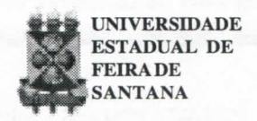
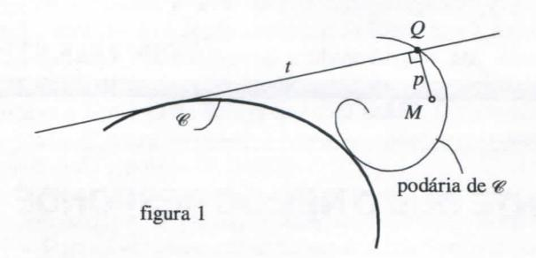
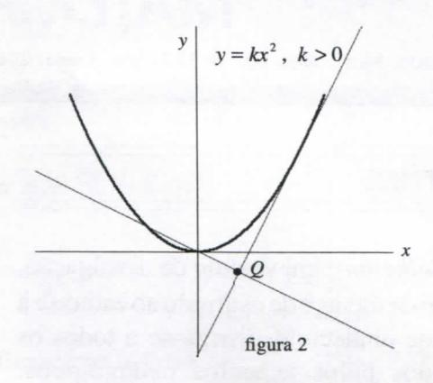
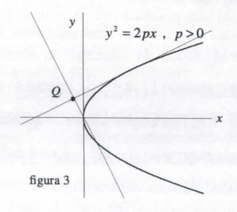
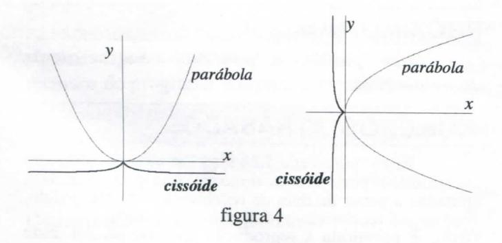
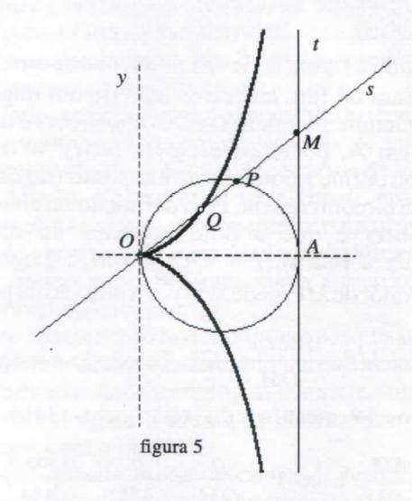
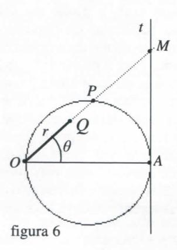

# FOLHETIM DE EDUCAÇÃO MATEMÁTICA

Folhetim Educ. Mat., Ano 10, n. 117, nov. / dez. 2003

ISSN 1415-8779

### **OBJETIVO**

Este Folhetim é um veículo de divulgação, circulação de idéias e de estímulo ao estudo e à curiosidade intelectual. Dirige-se a todos os interessados pelos aspectos pedagógicos, filosóficos e históricos da Matemática. Pretende construir uma ponte para unir os que estão próximos e os que estão distantes.

### **EDITORIAL**

A partir do presente Folhetim iniciamos uma série que trata de tópicos relacionados a algumas curvas, ás vezes de nomes estranhos, e suas propriedades. Trata-se de uma abordagem que relaciona as propriedades geométricas com suas respectivas expressões algébricas, o que abre novas possibilidades para o uso de outras tecnologias, como os programas de computação, para a exploração, com vantagens, de tais propriedades, além de propiciar uma visualização dinâmica. O recorte inicial enfoca as chamadas podárias da parábola, como elemento motivador à investigação de outras curvas. Neste número são investigados as equações algébricas da podária da parábola relativa ao seu vértice e sua relação com a cissóide reta, curva conhecida desde o segundo século a. C., e usada por Diócles para resolver o clássico problema da duplicação do

Para o traçado das curvas que aparecem em algumas figuras deste número, foram usados recursos do programa winplot, que será mais explorado nos próximos *Folhetins*.

### COMITÉ EDITORIAL

Carloman Carlos Borges (Doutor) Inácio de Sousa Fadigas (Mestre)

### PERGUNTE QUE O NEMOC RESPONDE

# Sobre parábolas, podárias e outras curvas por Inácio Jadigas

A nossa experiência de docente num curso de Licenciatura em Matemática mostra que a maioria dos alunos – e também professores – aparenta uma estranheza quando nomes como aqueles que aparecem no título do presente artigo são apresentados. Os alunos acham até engraçado, e percebe-se um ar geral de questionamento: o que significam tais nomes? Qual o por quê dos nomes?

Sabendo que os nomes são atribuídos a curvas, ficariam ainda mais espantados com a diversidade de nomes encontrados nos livros sobre o assunto, com por exemplo, no livro de Alcyr Rangel, cujo título é *Curvas*, e foi publicado em 1974. A propósito, uma das razões para a falta de familiaridade dos graduandos com certas curvas, é a ausência de muitas delas nos modernos livros, sobretudo os de geometria analítica (sic).

Por outro lado, a mídia eletrônica possibilita o contato virtual com sítios que tratam amplamente de dezenas de curvas, suas propriedades, representação gráfica e até recursos de visualização e movimento. Aliado a internet e seus sítios, programas de computador oferecem recursos que concorrem para uma facilidade cada vez maior de visualização e manipulação gráfica das curvas. Infelizmente, o acesso a tais recursos ainda é restrito para uma parcela considerável dos estudantes.

O contexto apresentado nos motivou a pesquisar e escrever algumas notas sobre o assunto, sobretudo porque acreditamos ser a geometria, tratada através de tecnologias computacionais, um dos elementos motivadores para o estudo da matemática.

Comecemos com a podária.

Lembro que quando numa determinada turma ministrei a disciplina Geometria Euclidiana para um curso de especialização, o livro texto usado, numa certa altura apresentava essa palavra. Foi uma novidade para os alunos, e para mim a certeza de que a podária não lhes fora apresentada na graduação. Apesar do nome, etmologicamente cabível, a definição é simples: é o lugar geométrico dos pés das perpendiculares traçadas de um ponto às tangentes a uma curva dada. A curva dada chama-se, de forma natural, anti-podária. Vamos esclarecer um pouco mais. Considere uma curva © como a mostrada na figura 1. Tome um ponto qualquer no plano (inclusive algum ponto de ©), por exemplo o ponto M. Para cada ponto da curva, traça-se uma tangente, como a reta t. A partir de M, baixa-se uma perpendicular p à reta t. O ponto Q obtido - o pé da perpendicular - é um ponto da podária. Repetindo-se o processo para todos os pontos da curva, resulta a podária.

Uma vez definida a podária de uma curva, é interessante usar a definição em uma curva conhecida, para que possamos aplicar conhecimentos de geometria, álgebra e cálculo. Seja por exemplo encontrar a equação que define a podária da parábola. É interessante, por razões que ficarão mais claras adiante, investigar a podária para as duas formas mais comuns da equação da parábola, ou seja,  $y = kx^2$ ,  $k \ne 0$  e  $y^2 = 2px$ ,  $p \ne 0$ . A primeira forma é mais comum quando se estuda funções, enquanto a segunda é típica dos manuais de geometria analítica.

Pela definição de podária, o ponto M é escolhido no plano da curva. Porém, alguns deles são particularmente interessantes. No caso da parábola por exemplo, vamos começar tomando como referência o vértice (0,0).

Seja então a parábola dada pela equação  $y = kx^2$ ,  $k \ne 0$ . Pela definição de podária, os pontos da curva estão nos pés das perpendiculares baixadas do ponto (0,0) até as tangentes à parábola, como mostrado na figura 2. Primeiro vamos mostrar que a equação da reta tangente a uma parábola em função do parâmetro m, que mede sua

inclinação é dada por  $y = mx - \frac{m^2}{4k}$ .

Como 
$$y = kx^2$$
,  $m = \frac{dy}{dx} = 2kx$ , donde  $x = \frac{m}{2k}$ . Por outro lado a equação da reta, conhecida sua inclinação m

e um ponto (x, y) é, Y - y = m(X - x).

Substituindo os valores de x e y em função de m,

temos 
$$Y - k \left(\frac{m}{2k}\right)^2 = m(X - \frac{m}{2k})$$
. Após simplificações

algébricas, chegamos a  $Y = mX - \frac{m^2}{4k}$ .

Como na expressão não aparece explicitamente as coordenadas do ponto, podemos usar as variáveis x e y, e a equação toma a forma que queríamos encontrar:

$$y = mx - \frac{m^2}{4k} \quad (A).$$

Com o resultado acima, é fácil expressar a equação da reta suporte da perpendicular que passa por (0,0), uma vez que a relação entre os coeficientes angulares de retas perpendiculares satisfaz a m.m' = -1, onde m' é o coeficiente

procurado. Assim, temos 
$$y = -\frac{1}{m}x$$
 (B).

Para encontrar a equação da podária, basta eliminar m das equações (A) e (B).

Como de (B) temos  $m = -\frac{x}{y}$ , substituindo em (A)

chegamos a 
$$x^2 = \frac{y^3}{-\frac{1}{4k} - y}$$
, ou  $x^2 = \frac{y^3}{a - y}$  ( I )

onde  $a = -\frac{1}{4k}$ .

A equação ( I ), que representa a podária da parábola  $y = kx^2$ , não é a forma mais comum que aparece nos manuais de geometria. Nestes, a parábola é dada pela equação  $y^2 = 2px$ ,  $p \neq 0$ .

Vamos então retomar os cálculos anteriores para

deduzir tal equação.

Seja então a parábola dada pela equação  $y^2 = 2px$ , p > 0 (figura 3). Vamos mostrar que a equação

# NEMOC - NÚCLEO DE EDUCAÇÃO MATEMÁTICA OMAR CATUNDA

Folhetim Educ. Mat., Ano 10, n. 117, nov./dez. 2003 - Editores: Carloman e Inácio - Secretária: Josenildes Oliveira Venas Almeida - Digitação: Manoel Aquino dos Santos - Editoração: Evandro Vaz - Impressão: Imprensa Gráfica Universitária - Periodicidade: bimestral - Tiragem: 850 exemplares - Distribuição gratuita - Endereço: Av. Universitária, s/n - km 03 - BR 116 - Campus Universitário - Telefone: (75)224-8115 - Fax: (75)224-8086 - CEP: 44031-460 - Feira de Santana - Ba - BRASIL - E-mail: nemoc@uefs.br

da reta tangente em função do parâmetro m é dada por  $y = mx + \frac{p}{2m}$ . Temos no caso:  $y^2 = 2px$ ,  $m = \frac{dy}{dx} = \frac{p}{y}$ , donde  $y = \frac{p}{m}$ .

Como a equação da reta é Y - y = m(X - x), substituindo os valores de x e y em função de m, temos

$$Y - \frac{p}{m} = m(X - \frac{\left(\frac{p}{m}\right)^2}{2p})$$
 que após simplificações resulta em 
$$y = mx + \frac{p}{2m}.$$

Voltando às variáveis usuais,  $Y = mX + \frac{p}{2m}$  (A').

A equação da perpendicular é pois  $y=-\frac{1}{m}x$  (B'). Eliminado o parâmetro m nas equações (A') e (B') vamos chegar a equação  $y^2=\frac{x^3}{-\frac{p}{2}-x}$ , ou  $y^2=\frac{x^3}{a-x}$  (II) onde  $a=-\frac{p}{2}$ .

As curvas dadas pelas expressões ( I ) e ( II ) recebem o nome de cissóide reta cuspidal ou cissóide de Dioclés, e suas representações aparecem na figura 4.

A expressão (II) é a mais usual. Cabe aqui mais um

esclarecimento sobre a terminologia. Uma curva cuspidal é a que tem um ponto cuspidal. Um ponto cuspidal é aquele a partir do qual o sentido do movimento do ponto gerador muda bruscamente. Quando há somente uma tangente, o ponto cuspidal é chamado ponto de reversão. Quando há duas tangentes distintas, o ponto é dito ponto anguloso.

#### A CISSÓIDE DO PONTO DE VISTA GEOMÉTRICO

As equações da cissóide foram obtidas a partir da definição de podária da parábola, usando conhecimentos da geometria analítica com a ajuda do cálculo. Vale ressaltar que no caso particular da parábola é possível chegar à equação da reta tangente sem explicitamente usar o conceito de derivada. Mas a cissóide é uma curva que tem "vida" própria, ou seja, podemos deduzir suas equações sem vínculo com a parábola. A curva é um *lugar geométrico*, termo usado para caracterizar as curvas obtidas quando o movimento de um ponto gerador tem uma expressão matemática o que caracteriza o <u>lugar geométrico</u> como um conjunto de partes, <u>todas</u> elas possuindo uma mesma propriedade, já expressa, aliás, na própria expressão geométricas. As curvas assim obtidas são chamadas *curvas geométricas*.

A cissóide pertence ao grupo das curvas cissoidais, que têm como elementos básicos: um cículo (base), uma reta (diretriz) e um ponto fixo (polo) que pertence a base. No caso particular, quando o polo pertence ao diâmetro da base que é perpendicular à diretriz, a curva chama-se cissóide reta, que é o caso da cissóide de Diócles.

Vamos melhor definir, encontrar a equação e traçar a cissóide reta cuspidal.

Seja um círculo de diâmetro OA e seja t a tangente em A (figura 5). O círculo é a base, o ponto O é o polo e a tangente t é a diretriz.

Cada reta traçada do ponto O no plano do círculo determina um ponto no círculo e outro ponto na reta

tangente t. Sejam P e M tais pontos, respectivamente, obtidos através do traçado da reta s. Sobre a reta s, marcase um ponto Q de tal forma a obter MQ = OP. Como MQ = MP + OQ e OP = OQ + QP, podemos marcar também o ponto Q de forma que OQ = MP. O movimeto do ponto Q, para as retas s traçadas, descreve a curva denominada cissóide de Dioclés.

Para completar, falta mostrar a parte algébrica, ou seja, encontrar uma das equações deduzidas anteriormente.

Parece-nos mais conveniente deduzir inicialmente a equação em coordenadas polares para, em seguida, transformá-la em coodenadas cartesianas.

Olhando a figura 6, devemos encontrar uma função  $r=r(\theta)$ . Para tal fim, lancemos mão de um importante teorema da Geometria Euclidiana. Como a reta t é tangente ao círculo em A, podemos escrever  $(AM)^2=OM.MP$ . Esse teorema define a potência de um ponto (no caso, M), em relação à circunferência. Pela definição da cissóide de Dioclés (observe que o polo pertence ao diâmetro perpendicular à reta t), r=OQ==MP. Logo, basta conhecer o valor de MP, deduzido da expressão da potência

de um ponto:  $MP = \frac{(AM)^2}{OM}$  (C). Tomando a = OA que é o diâmetro do círculo, do triângulo OMA temos

que sen 
$$\theta = \frac{AM}{OM}$$
 e  $\cos \theta = \frac{a}{OM} = \frac{a}{\frac{AM}{\sin \theta}} = \frac{a \sin \theta}{AM}$ .

Daí resulta que  $AM = \frac{a \sin \theta}{\cos \theta}$ . Substituindo em ( C ),

$$MP = \frac{AM}{OM} \cdot AM = \sin \theta \cdot \frac{a \sin \theta}{\cos \theta} = \frac{a \sin^2 \theta}{\cos \theta}$$
. Logo,

 $r = \frac{a \operatorname{sen}^2 \theta}{\cos \theta}$  (III) é a expressão em coordenadas polares da cissóide de Dioclés.

Usando as relações de transformação de coordenadas:

 $x = r\cos\theta$  ;  $y = r\sin\theta$  e  $r^2 = x^2 + y^2$  e substituindo em (III)

$$r = \frac{a \sin \theta . \sin \theta}{\cos \theta} = \frac{a . r \sin \theta . \sin \theta}{r \cos \theta} = \frac{a . y . (y / r)}{x} = \frac{a . y^2}{rx}$$

ou ainda 
$$r^2 = \frac{a \cdot y^2}{x}$$
. Logo,

$$x^{2} + y^{2} = \frac{a \cdot y^{2}}{x} \Rightarrow x^{3} + xy^{2} = a \cdot y^{2} \Rightarrow x^{3} = y^{2}(a - x)$$
.

Então, finalmente teremos 
$$y^2 = \frac{x^3}{(a-x)}$$
 ( IV ).

Uma parametrização para a curva pode ser obtida fazendo-se y = tx em (IV). A substituição conduz a

$$x = \frac{at^2}{1+t^2}$$
 e, consequentemente  $y = \frac{at^3}{1+t^2}$ .

Observe que a expressão ( IV ) é essencialmente a mesma expressão ( II ), com a observação que na expressão ( II ) (de acordo com a posicão da parábola na figura 3) o parâmetro p > 0, e a assume então um valor negativo, enquanto que na expressão ( IV ) a é positivo (confira a figura 5).

Outro fato é que a expressão ( IV ) pode ser obtida da expressão ( I ) permutando-se as variáveis (rotação de 90° dos eixos coordenados).

Não foi sem propósito que adotamos o parâmetro a nas expressões ( I ) e ( II ). Reconhecemos agora tratarse do valor algébrico do diâmetro do círculo (base) da cissóide. Na equação ( I )  $a=-\frac{1}{4k}$  enquanto na expressão ( II )  $a=-\frac{p}{2}$ . Um fato conhecido é que quando a parábola é descrita pela expressão  $y=kx^2$  o foco é dado pelo ponto  $(0,\frac{1}{4a})$ . Então, a distância do foco ao vértice da parábola é numericamente igual ao diâmetro do círculo. Quando a parábola é expressa por  $y^2=2\,px$ , o foco é o ponto  $(\frac{p}{2},0)$ , e novamente temos o mesmo resultado.

# PRÓXIMO NÚMERO

Sobre parábolas, podárias e outras curvas (continuação).

# **NÚMEROS ATRASADOS**

Envie para cada folhetim um selo de postagem nacional de 1º porte. Dentro de no máximo quatro semanas, contadas a partir da data de recebimento do seu pedido, você estará recebendo os folhetins solicitados.

OBS.: É permitida a reprodução total ou parcial deste folhetim, desde que citada a fonte.