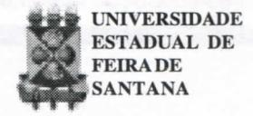
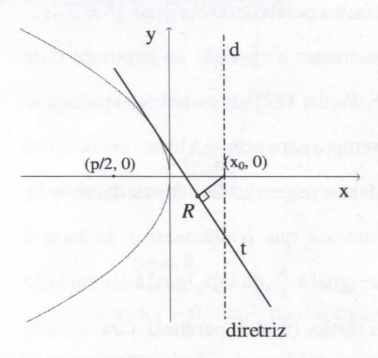
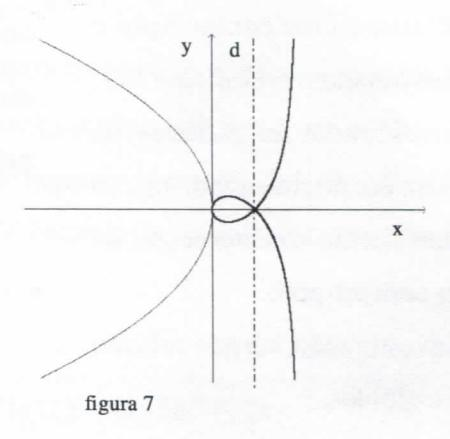
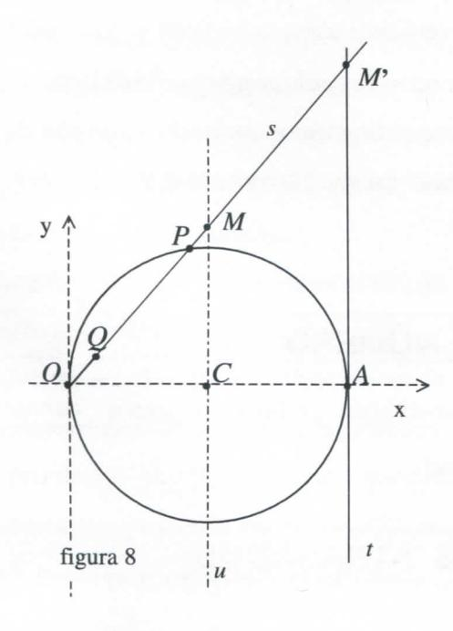
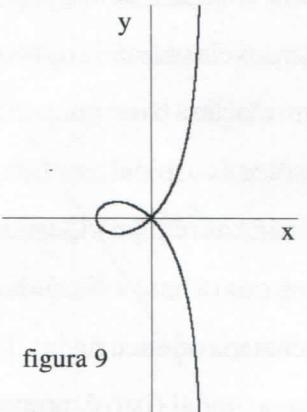
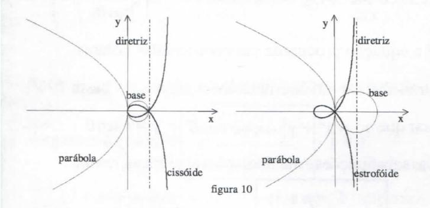
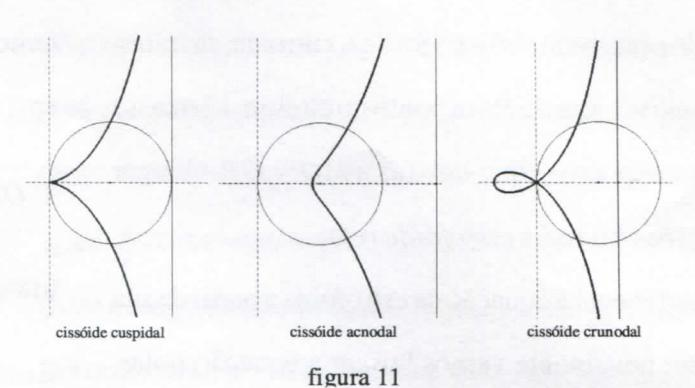

# FOLHETIM DE EDUCAÇÃO MATEMÁTICA

Folhetim Educ. Mat., Ano 10, n. 118, jan. / fev. 2004

ISSN 1415-8779

#### **OBJETIVO**

Este Folhetim é um veículo de divulgação, circulação de idéias e de estímulo ao estudo e à curiosidade intelectual. Dirige-se a todos os interessados pelos aspectos pedagógicos, filosóficos e históricos da Matemática. Pretende construir uma ponte para unir os que estão próximos e os que estão distantes.

### **EDITORIAL**

O presente _Folhetim_ é uma continuação e extensão dos asuntos tratados no _Folhetim_ 117. Desta vez são investigadas as podárias da parábola em relação a um ponto situado na sua diretriz, mais precisamente na intesecção da diretriz da parábola com seu eixo.

A partir dessa investigação, surge a relação entre cissóides e estrofóides.

Aproveitamos para nos desculpar diante de nossos leitores pela demorados últimos _Folhetins_. Houve problemas técnicos no nosso parque gráfico, e tratando-se de uma Instituição pública, nem sempre os problemas são resolvidos na velocidade desejada.

# COMITÊ EDITORIAL

Carloman Carlos Borges (Doutor) Inácio de Sousa Fadigas (Mestre)

## PERGUNTE QUE O NEMOC RESPONDE

Sobre parábolas, podárias e outras curvas

por Inácio Tadigas

(Continuação)

PODÁRIA DA PARÁBOLA RELATIVA A UM PONTO NA DIRETRIZ

Da mesma forma que chegamos à podaria da parábola relativa ao seu vértice, podemos estabelecer as equações para outros pontos, como por exemplo, um ponto pertencente à diretriz d da parábola. Desta vez vamos usar apenas a curva dada pela expressão $y^2 = 2px$ e adotar p < 0, como na figura 6.

figura 6

Por simplicidade, escolhemos o ponto da diretriz que também está no eixo da parábola. Designemos por $(x_0,0)$ tal ponto. Como a equação da reta tangente à parábola $y^2 = 2px$

em função da sua inclinação m é _y = mx + - ^_ (D) , a _2m_ equação da reta perpendicular traçada do ponto _(XQ_ ,0) no eixo da parábola, uma vez que = , é dada por **1** _-{x + —) y = (x + í),_ donde _m = — ._ Para encontrar _m y a_ equação dos pontos _R_ (pés das perpendiculares),

$$y = \left(\frac{-(x + \frac{p}{2})}{y}\right)x + \frac{p}{2\left(\frac{-(x + \frac{p}{2})}{y}\right)} = \frac{-(x + \frac{p}{2})}{y}.x - \frac{py}{2(x + \frac{p}{2})}$$

Após as manipulações e simplificações algébricas chegamos a equação ( V ) **2** _X{X + ^)^ y = — -p-x_

A curva podaria da parábola, em relação ao ponto (-y,0) , dada por ( V ) com _p <Q é_ mostrada na figura?, associada à parábola de equação _y'^ =2px._ Quando apresentamos a cissóide do ponto de vista geométrico _{Folhetim_ 117) vimos um caso particular onde o pólo - sempre pertencente à base - encontra-se num diâmetro da base perpendicular à diretriz da parábola. Também mostramos que o diâmetro _a_ da base é algebricamente igual a y , ou seja, igual à distância do foco ( y ,0) ao vértice (0,0) da parábola. Ora, quando buscamos a equação da podaria da parábola relativa ao ponto de interseção da diretriz com o eixo, vimos que este ponto tem coordenadas ( - y ,0) comp < 0. Uma vez que _a = -E.,_ concluímos que o dito ponto está no círculo (base), e logo a curva da figura 7 é também uma cissóide. Por outro lado, se folhearmos um texto específico sobre curvas, ou um manual mais completo de geometria anaHtica,descobriremosqueessacurvaé"muitopróxima" de uma _estrofóide reta._ Nosso propósito agora é definir, encontrar a equação e traçar a _estrofóide reta,_ e depois estabelecer a possível relação com a equação (V) .

Sej a um círculo de diâmetro _O A_ e sej a **M** uma reta perpendicular a _O A_ passando pelo centro _C_ do círculo. O círculo é a base, o ponto O é o pólo e a reta **M** é a diretriz da curva. Cada reta que passapor _O_ determina um ponto

## **NEMOC - NÚCLEO D E EDUCAÇÃO MATEMÁTICA OMAR CATUNDA**

Folhetim Educ. Mat., Ano 10,n. 118,jan./fev.2004 **-Editores:** Carloman e Inácio - **Secretária:** Josenildes Oliveira Venas Almeida - **Digitação:** Manoel Aquino dos Santos - **Editoração:** Evandro Vaz - **Impressão:** Imprensa Gráfica Universitária - **Periodicidade:** bimestral - **Tiragem:** 850 exemplares - _Distribuição gratuita -_ **Endereço:** Av. Universitária, s/n - km 03 - BR 116 - Campus Universitário - **Telefone:** (75)224-8115 - **Fax:** (75)224-8086 - CEP 44031-460 - Feira de Santana - Ba - BRASIL - **E-mail:** nemoc@uefs.br

no círculo e outro em u (figura 8). Seja s uma dessas retas, M um ponto da reta u e P um ponto no círculo. Marca-se na reta s um ponto Q que satisfaz a MQ = OP. O lugar geométrico obtido é a estrofoide reta.

Para chegar à equação da estrofóide a partir da sua definição, novamente vamos buscar a equação polar. Como $MQ = MO - OQ \ e \ OP = MO - MP$ , podemos escrever a definição usando OQ = MP.

Aplicando o teorema da potência de um ponto em relação à base a um ponto M', interseção de s com uma reta tangente t, temos:

$$(OM')^2 = OM'. M'P$$
(E)

Aplicando um conhecido teorema da geometria plana ao triângulo OAM', uma vez que C é ponto médio de OA, podemos concluir que AM' = 2CM. Lembrando também o teorema fundamental da proporcionalidade,

temos OM = MM' e OM' = 2OM. Substituindo em (E) e simplificando, resulta que $2(CM)^2 = (OM)^2 + COM$ . Has do triângulo OMC temos $OM = \frac{2(CM)^2 - (OM)^2}{OM}$ . Mas do triângulo OMC temos $OM = \frac{OC}{\cos \theta}$ e CM = OM sen $\theta$ . Então $= OM(2 \sin^2 \theta - 1) = -OM \cos 2\theta$ ou $MP = -\frac{OC}{\cos \theta} \cos 2\theta$ . Fazendo $OC = \rho$ , que é o raio do círculo, e MP = OQ = r teremos $r = -\rho \left(\frac{\cos 2\theta}{\cos \theta}\right)$ , que é a equação procurada em coordenadas polares. Para transformar em coordenadas retangulares basta lembrar que $r^2 = x^2 + y^2$ , $x = r \cos \theta$ e $y = r \sin \theta$ . Após as substituições e manipulações algébricas, resulta a equação $\sqrt{y^2 - x^2} = \sqrt{(\rho + x) \over \rho - x}$ (VI). A figura 9 mostra uma curva da família dada por (VI).

Compare agora a figura 9 com a figura 7. Se conseguirmos mostrar algebricamente que uma pode ser obtida da translação horizontal da outra, teremos chegado ao nosso propósito.

Se na equação ( VI ) fizermos uma translação para a direita no valor de $\rho$ , teremos

$$y^{2} = \frac{(x-\rho)^{2} x}{\rho - (x-\rho)} = \frac{(x-\rho)^{2} x}{2\rho - x}$$
. Atribuindo o valor
$$\rho = -\frac{p}{2}$$
, a equação acima resulta em $y^{2} = \frac{x(x+\frac{p}{2})^{2}}{-p-x}$ , que é a mesma equação ( V ).

Como o valor absoluto de ^ corresponde ao diâmetro _a_ da base (círculo) da cissóide reta, concluímos que, na _estrofóide reta_ o raio p tem o mesmo valor do diâmetro _a,_ ou seja, o raio da base da estrofóide tem o mesmo valor do diâmetro da base da cissóide. A figura 10 Uustra a situação.

Para completar e melhor esclarecer os resultados anteriores, é interessante ampliar mais um pouco o estudo da cissóide reta. Podemos classificá-la de acordo com a posição da diretriz em relação à base: quando a diretriz é tangente à base, a cissóide é cuspidal (também chamada normal, perfeita, ordinária ou regular). Quando a diretriz não tem ponto comum com a base a cissóide é _acnodal_ (também chamada achatada ou encu rtada). Também se diz que ela tem ponto acnodal (isto é, ponto isolado). Quando a diretriz é secante à base, a cissóide é _crunodal_ e também se dizque ela tem ponto cronodal, isto é, ponto múltiplo. Afigura 11 ilustra as diversas situações.

Então,aestrofóideretaéuma cissóide reta crunodal, quando a diretriz passa pelo centro da base. Tais curvas

podem ser facilmente obtidas através de um programa de computação algébrica ou numérica se na equação da cissóide (ver _Folhetim_ 117, equação B') fizermos _y -_ **(X-XQ) , O** que resultaria na equaçã o _m ^ x{x-x^f_

Agora é só variar adequadamente _x^_ e _p._ Outra forma é utiUzar um programa de geometria dinâmica e construir lugares geométricos variando a posição da diretriz. Voltaremos a discutir tais tecnologias no próximo _Folhetim.9_

# **PRÓXIMO NÚMERO**

_Sobre parábolas, podarias e outras curvas (continuação). Aguardem!_

# **NÚMEROS ATRASADOS**

Envie para cada folhetim um selo de postagem nacional de 1° porte. Dentro de no máximo quatro semanas, contadas a partir da data de recebimento do seu pedido, você estará recebendo os folhetins solicitados.

OBS.: É permitida a reprodução total ou parcial deste folhetim, desde que citada a fonte.
