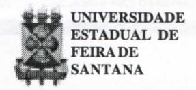
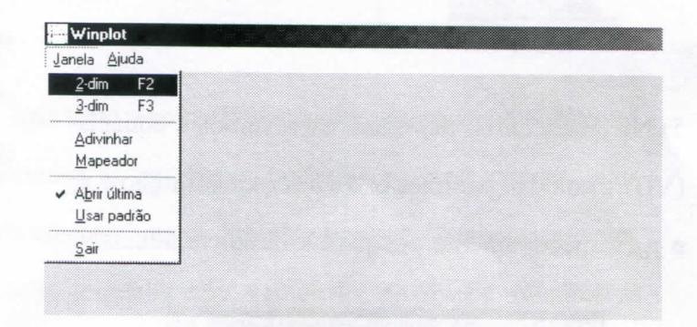
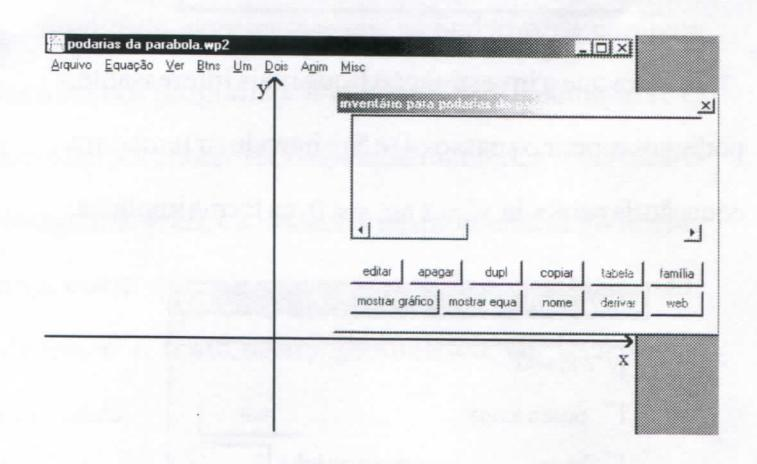
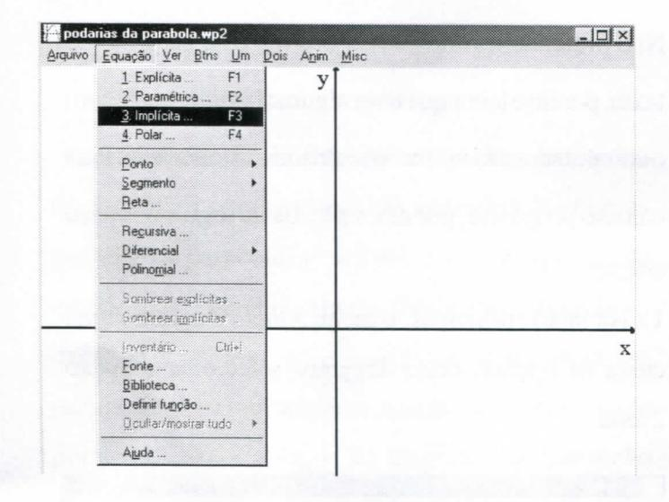
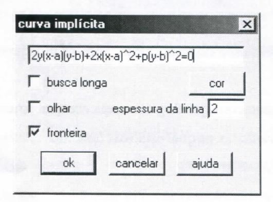
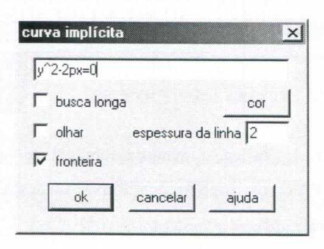
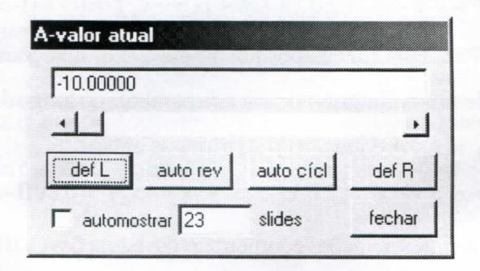

# FOLHETIM DE EDUCAÇÃO MATEMÁTICA

Folhetim Educ. Mat., Ano 10, n. 119, mar. / abr. 2004

ISSN 1415-8779

### **OBJETIVO**

Este Folhetim é um veículo de divulgação, circulação de idéias e de estímulo ao estudo e à curiosidade intelectual. Dirige-se a todos os interessados pelos aspectos pedagógicos, filosóficos e históricos da Matemática. Pretende construir uma ponte para unir os que estão próximos e os que estão distantes.

## **EDITORIAL**

Como mesmo tema dos dois últimos Folhetins, agora é introduzido um tratamento mais moderno, com o emprego de programas computacionais, tanto de computação numérica, quanto de geometria dinâmica. No primeiro caso, será empregado o programa Winplot para plotar as curvas. Porém, o emprego do Winplot possibilita explorar outras característica das curvas que não são explicitadas nas equações. O presente Folhetim introduz as equações generalizadas das podárias, bem como os aspectos introdutórios do Winplot.

O propósito também é apresentar as tecnologias computacionais como um recurso auxiliar na Educação Matemática, atentos porém às limitações dos mesmos.

# COMITÉ EDITORIAL

Carloman Carlos Borges (Doutor) Inácio de Sousa Fadigas (Mestre)

## PERGUNTE QUE O NEMOC RESPONDE

Sobre parábolas, podárias e outras curvas

por Inácio Tadigas

(Continuação)

A partir do presente Folhetim, abordaremos outros aspectos relacionados às parábolas, podárias e outras curvas, mais especificamente, faremos duas abordagens do assunto: na primeira, a guisa de generalização, vamos desenvolver e trabalhar as equações da podária de uma parábola relativa a um ponto qualquer do plano onde a mesma está contida; é um tratamento algébrico. Na segunda, lançaremos mão de alguns recursos que o computador oferece, no sentido de dinamizar o estudo dessas curvas, o que poderá motivar o interesse para outras investigações. Para tal finalidade, apresentaremos as podárias da parábola tratadas à luz dos programas Winplot e Cabri-Géomètre II. O primeiro é um porgrama de computação numérica muito usado para plotagem de gráficos. O Cabri é um programa de geometria dinâmica, e será aplicado na exploração do conceito de lugar geométrico; é o tratamento geométrico via tecnologias computacionais.

A seguir, desenvolveremos o arcabouço algébrico, com as equações de generalização, que servirá de referência para o tratamento com os programas de computação.

## A GUISA DE GENERALIZAÇÃO

No Folhetim 117 encontramos dois resultados fundamentais para se chegar às equações das curvas podárias da parábola $y^2 = 2 px$ , p < 0: a equação da reta tangente à parábola em função de sua inclinação m, dada por $y = mx + \frac{p}{2m}$ (D), e a equação da reta perpendicular à reta tangente, que no caso geral é dada por $y - y_0 = -\frac{1}{m}(x - x_0)$ (E). Os pontos de interseção das duas retas, quando a reta tangente se desloca ao longo da parábola, definemo lugar geométrico da podária a esta curva relativa ao ponto $Q(x_0, y_0)$ . Usando o mesmo princípio anterior, de (E) temos $m = -\frac{1}{(y - y_0)}(x - x_0)$ . Substituindo em (D), temos $y = -\frac{(x - x_0)}{(y - y_0)}x - \frac{y - y_0}{x - x_0}\frac{p}{2}$ , que é equivalente a $2y(x - x_0)(y - y_0) + 2x(x - x_0)^2 + p(y - y_0)^2 = 0$ (VII)

Quando a podária é relativa à origem, a equação (VII) reduz-se a $y^2 = \frac{x^3}{-\frac{p}{2} - x}$ , que é essencialmente a equação (II), Folhetim 117, que corresponde à cissóide reta cuspidal (verifique!).

No caso da podária ser relativa ao ponto $\left(-\frac{p}{2},0\right)$ , interseção do eixo da parábola com a reta diretriz, temos $2y(x+\frac{p}{2})(y-0)+2x(x+\frac{p}{2})^2+p(y-0)^2=0$

que após manipulações e simplificações algébricas resulta

na equação
$$y^2 = \frac{x(x + \frac{p}{2})^2}{-p - x}$$
, que é a mesma equação

(V) (ver Folhetim 118), correspondente à estrofóide reta.

Outros pontos particulares podem ser investigados a partir da equação (VII). Por exemplo, suponha que queremos encontrar a equação das podárias relativas aos pontos ao longo do eixo da parábola, ou seja, os pontos $(x_0,0)$ . A equação (VII) reduz-se então a

$$y^{2}(x-x_{0}+\frac{p}{2})+x(x-x_{0})^{2}=0$$
(VII-a)

É claro que a equação (VII-a) engloba os casos particulares, já descritos anteriormente quando $x_0=0$ e quando $x_0=-\frac{p}{2}$ .

Se agora escolhermos um outro ponto particular tal que $x_0 = \frac{p}{2}$ (observe que esta é a coordenada do foco da parábola), a equação (VII-a) será reduzida a

$$y^{2}x + x(x - \frac{p}{2})^{2} = 0$$

$$\downarrow x[y^{2} + (x - \frac{p}{2})^{2}] = 0$$

As soluções da equação acima são: x=0, ou seja, uma reta que é o próprio eixo y, ou $\left\{y=0 \text{ e } x=\frac{p}{2}\right\}$ , que corresponde a um ponto. Logo, a podária relativa ao foco da parábola degenera-se numa reta tangente ao seu vértice e num ponto. O resultado acima é conhecido como Teorema de La Hire (1640-1718), e pode ser enunciado como: "O lugar geométrico das projeções

# NEMOC - NÚCLEO DE EDUCAÇÃO MATEMÁTICA OMAR CATUNDA

Folhetim Educ. Mat., Ano 10, n. 119, mar. / abr. 2004 - Editores: Carloman e Inácio - Secretária: Josenildes Oliveira Venas Almeida - Digitação: Manoel Aquino dos Santos - Editoração: Evandro Vaz - Impressão: Imprensa Gráfica Universitária - Periodicidade: bimestral - Tiragem: 850 exemplares - Distribuição gratuita - Endereço: Av. Universitária, s/n - km 03 - BR 116 - Campus Universitário - Telefone: (75)224-8115 - Fax: (75)224-8086 - CEP 44031-460 - Feira de Santana - Ba - BRASIL - E-mail: nemoc@uefs.br

ortogonais do foco nas tangentes a uma parábola, é a tengente no vértice". Podemos destacar ao longo do eixo da parábola três intervalos; $x_0 < \frac{p}{2}$ , $\frac{p}{2} < x_0 < 0$ e $0 < x_0$ , cada um dos quais vai gerar curvas com características próprias, conforme veremos adiante.

Raciocínio análogo podemos usar para as podárias relativas aos pontos situados ao longo da diretriz, ou seja, os pontos $(-\frac{p}{2}, y_0)$ . Quando $y_0 = 0$ , já vimos que a curva resultante é a estrofóide reta, dada pela equação (V).

Para os demais valores de $y_0$ a equação (VII) torna-se:

$$2y(x+\frac{p}{2})(y-y_0)+2x(x+\frac{p}{2})^2+p(y-y_0)^2=0$$
(VII-b)

Para concluir a abordagem das generalizações, consideremos ainda as podárias da parábola do longo da reta $y_0 = x_0$ . A equação (VII) torna-se então

$$2y(x-x_0)(y-x_0)+2x(x-x_0)^2+p(y-x_0)^2=0$$
(VII-c)

As interpretações geométricas das equações (VII), (VII-a), (VII-b) e (VII-c) para a obtenção das várias curvas possíveis (a rigor, uma infinidade), é um processo que se torna mais ameno e eficaz com o uso dos programas computacionais já citados, o que passaremos a discutir.

### ABORDAGEM COM O USO DO WINPLOT

Conforme introduzido anteriormente, o Winplot é um porgrama de plotagem de gráficos em 2 ou 3 dimensões, muito difundido e usado em vários países. Uma vez que é um programa de licença livre, pode ser baixado do seu sítio oficial http://math.exeter.edu/rparris, onde encontrase disponível em vários idiomas, incluisive em Português.

Não pretendemos descrever o programa no presente texto, porém o leitor que tiver alguma familiaridade com o computador não vai ter dificuldades no manuseio. Para o nosso propósito, por exemplo, basta seguir o roteiro abaixo:

1. Na janela principal, o menu _Janela_ desdobra uma caixa de opções, onde devemos selecionar a opção 2-dim

- 2. Uma vez escolhida tal opção, abre-se uma janela gráfica.
- 3. Juntamente com a janela gráfica, aparece também uma janela _inventário_, na qual estão os comandos relativos ao gráfico.

4. Na janela gráfica, o menu desdobrável _Equação_ permite selecionar o tipo de equação a ser usada, que no caso em estudo será a _Implícita_.

5. Na janela _curva implícita_, escrevemos a equação (VII), usando os parâmetros a e b em substituição a $x_0$ e $y_0$ , respectivamente, por questão de conveniência.

Para que a investigação fique mais interessante, podemos repetir os passos 4) e 5) e introduzir também a equação da parábola $y^2 = 2 px$ , p < 0, na forma implícita.

Com isso, teremos no mesmo sistema de eixos as duas curvas associadas.

A edição das curvas, se necessário, é feita através da janela _inventário_.

6. Com a ajuda do recurso de animação do Winplot, podemos através do menu _Anim_, da janela gráfica, estabelecer as variações para os parâmentros _a_, _bep_. Ao abrir a janela _Anim_, surge uma lista de parâmetros, e ao selecionar cada um deles por vez, aparecem janelas onde o intervalo de variação dos parâmetros devem ser definidos.

Aqui usamos -10 < a, b < 10 e - 2 < p < 2.

# PRÓXIMO NÚMERO

Sobre parábolas, podárias e outras curvas (continuação). Aguardem!

# **NÚMEROS ATRASADOS**

Envie para cada folhetim um selo de postagem nacional de 1º porte. Dentro de no máximo quatro semanas, contadas a partir da data de recebimento do seu pedido, você estará recebendo os folhetins solicitados.

OBS.: É permitida a reprodução total ou parcial deste folhetim, desde que citada a fonte.
