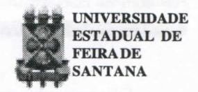
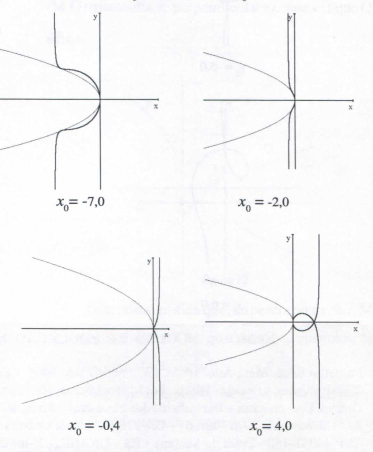
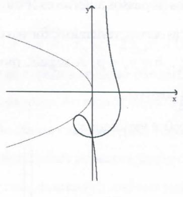
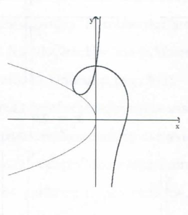
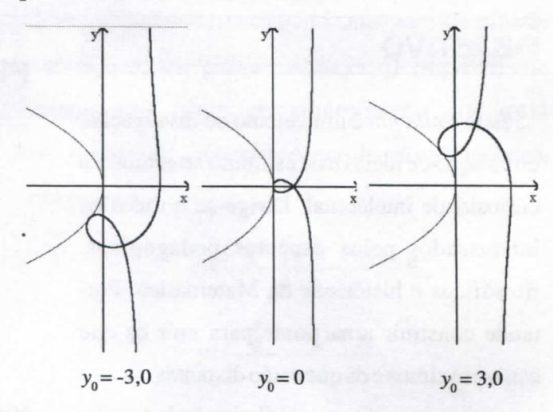
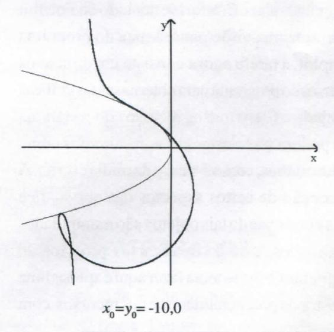
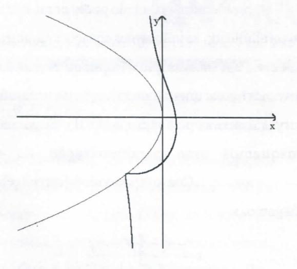
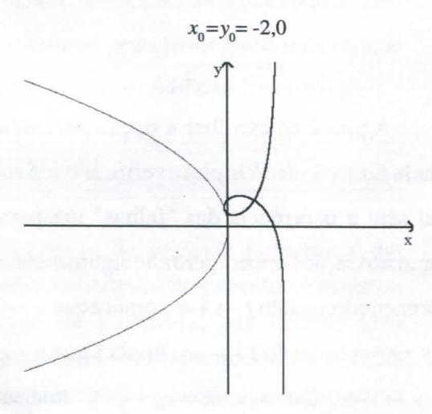
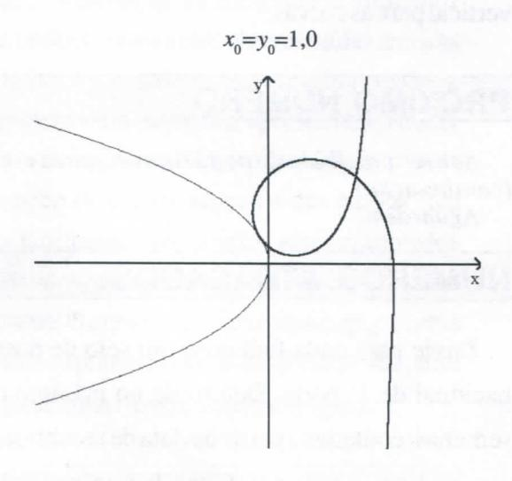
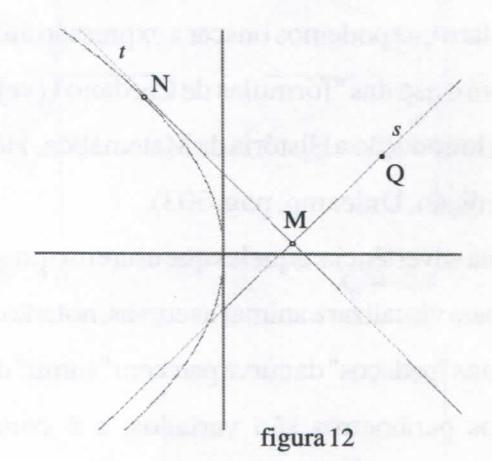

# FOLHETIM DE EDUCAÇÃO MATEMÁTICA

Folhetim Educ. Mat., Ano 10, n. 120, majo / jun. 2004

ISSN 1415-8779

### **OBJETIVO**

Este Folhetim é um veículo de divulgação, circulação de idéias e de estímulo ao estudo e à curiosidade intelectual. Dirige-se a todos os interessados pelos aspectos pedagógicos, filosóficos e históricos da Matemática. Pretende construir uma ponte para unir os que estão próximos e os que estão distantes.

#### **EDITORIAL**

O propósito do presente Folhetim é dar continuidade ao tratamento geométrico das curvas podárias da parábola, via tecnologias computacionais. Conforme iniciado no Foletim 119, com uma visão panorâmica do programa Winplot, a tarefa agora consiste em aplicar os recursos do programa para obter as saídas gráficas desejadas. Claro que os recursos do programa não podem ser totalmente apresentados numa mídia estática, como é o caso da mídia escrita. A percepção de certos aspectos das curvas fica mais clara quando tais objetos são manipulados e animados, usando os recursos próprios do programa. O que se tenta fazer aqui é apenas uma amostra da potencialidade de tais recursos, com vistas a auxiliar o ensino-aprendizagem.

# COMITÊ EDITORIAL

Carloman Carlos Borges (Doutor) Inácio de Sousa Fadigas (Mestre)

## PERGUNTE QUE O NEMOC RESPONDE

Sobre parábolas, podárias e outras curvas por Inácio Tadigas (Continuação)

Uma vez seguidos os passos anteriores (Folhetim 119), estamos aptos a explorar as curvas, variando de forma conveniente os parâmetros, $a = x_0$ , $b = y_0$ e p. A seguir, mostraremos algumas saídas gráficas possíveis:

1. Fixamos p=-2,0, $y_0=0$ e variamos $x_0$ .

Observe que, se p=-2,0, então o foco da parábola está no ponto de coordenada -1,0. Logo, temos gráficos representativos de $x_0 < -1,0$ , $-1,0 < x_0 < 0$ e $x_0 > 0$ .

Note que, quando $x_0 = 0$ a curva é uma cissóide reta cuspidal, se $-1.0 < x_0 < 0$ uma cissóide reta acnodal, e se $x_0 > 0$ , uma cissóide reta crunodal, que é a sequência de figuras apresentadas no Folhetim 118, p.4. Ou seja, variar o parâmetro $a = x_0$ nos intervalos dados, produz o mesmo efeito geométrico que variar a diretriz (da cissóide) em relação à base.

2. Fixamos $p = -2, 0, x_0 = 0$ e variamos $y_0$ .

$$y_0 = -5.0$$

$y_0 = 6.0$

Com uma pequena alteração, fixando $x_0$ = -1,0, obteremos cissóides _oblíquas crunodais_, passando pela cissóide _reta crunodal_

3. Fixamos p = -2.0 e variamos $x_0$ (que é igual a $y_0$ ).

Para melhor manipulação no **Winplot**, editamos a janela da equação, escrevendo a expressão da equação (VII-c). Isso permite trabalhar com apenas uma janela de parâmetros, no caso _a_.

## NEMOC - NÚCLEO DE EDUCAÇÃO MATEMÁTICA OMAR CATUNDA

Folhetim Educ. Mat., Ano 10, n. 120, maio / jun. 2004 - Editores: Carloman e Inácio - Secretária: Josenildes Oliveira Venas Almeida - Digitação: Manoel Aquino dos Santos - Editoração: Evandro Vaz - Impressão: Imprensa Gráfica Universitária - Periodicidade: bimestral - Tiragem: 850 exemplares - Distribuição gratuita - Endereço: Av. Universitária, s/n - km 03 - BR 116 - Campus Universitário - Telefone: (75)224-8115 - Fax: (75)224-8086 - CEP 44031-460 - Feira de Santana - Ba - BRASIL - E-mail: nemoc@uefs.br

$x_0 = y_0 = 4.0$

É interessante notar que as curvas geradas pela equação (VII) - exceto as singularidades - são curvas do

terceiro grau. Podemos questionar se algumas delas não seriam também curvas do terceiro grau definidas através de outras propriedades, a exemplo da visiera, versiera, conchóides, entre outras.

As curvas mostradas nas três situações anteriores, entre outras propriedades, exibe um padrão: todas elas têm um ponto em cumum com a parábola. O fato pode ser notado com muito mais propriedade com o uso da animação no programa **Winplot**, através das inúmeras variações possíveis dos parâmetros a, e b e p. Uma justificativa intuitiva e geométrica decorre da própria definição de podária. A observação da figura 12, com um pouco de abstração, permite inferir que, quando a reta tangente t percorre a parábola, o ponto M desliza ao longo da tangente t para que a reta s que passa por (M,Q) mantenha-se perpendicular a t, uma vez que Q éfixo.

Ora, isso significa que, ao percorrer a reta t, M deverá coincidir com N, que também é um ponto de t, para alguma inclinação de t.

Algebricamente, para se encontrar a interseção das duas curvas, um caminho direto é resolver o seguinte sistema de equações:

$$\begin{cases} 2y(x-x_0)(y-y_0) + 2x(x-x_0)^2 + p(y-y_0)^2 = 0\\ y^2 - 2px = 0 \end{cases}$$

que pode ser transformado numa única equação, sublstituindo a segunda na primeira. Obviamente não é uma equação de simples solução, pois torna-se uma equação de sexto grau. Com a ajuda, mais uma vez, de um recurso computacional, agora um programa de computação algébrica, como o MuPAD (versão alemã do conhecido Maple, com a vantagem de ser livre), chegamos a um resultado não muito animador; o programa responde que a solução da equação são as raízes da equação

$$k^3 + 2p(p - x_0)k - 2y_0p^2 = 0$$
(G)

na variável k, pois a solução não tem uma expressão analítica simples. Ao menos temos a garantia de que a interseção das curvas existe, pois a equação possui pelo menos uma raíz real (a observação das curvas sugere que se existir mais de uma raíz real esta será tripla).

Éclaro que podemos buscar a expressão analítica de (G) com o uso das "fórmulas de Cardano" (veja, por exemplo, Introdução a História da Matemática, Howard Eves, 2ª edição, Unicamp, pag. 303).

Uma advertência: aqueles que usarem o programa Winplot para visualizar e animar as curvas, notarão que às vezes alguns "pedaços" da curva parecem "sumir" da tela, quando os parâmetros são variados, e é comum a impressão de que, visualmente, para certos valores de a e b a podária visualmente não toca a parábola. O fato decorre de uma limitação do programa, principalmente quando é executado a partir da forma implícita. O que foi mostrado no parágrafo anterior assegura que é apenas uma "falha" do programa.

O problema apresentado pode ser minimizado, ou até eliminado, se utilizarmos equações paramétricas da curva, em substituição à implícita. Significa que devemos buscar uma parametrização para a família de curvas descritas pela equação (VII). Suponha que busquemos uma parametrização na qual $y-y_0=t(x-x_0)$ . Comumpouco de esforço algébrico, chegamos a

$$x = \frac{(x_0 - \frac{p}{2})t^2 - y_0 t}{t^2 + 1}$$
e  
$$y = \frac{-\frac{p}{2}t^3 - x_0 t + y_0}{t^2 + 1}$$

Agora é só escolher a opção _paramétrica_ na janela _Equação_ do **Winplot** e verificar que a animação flui sem a ocorrência das "falhas" inesperadas. A parametrização também pertmite algumas conclusões: por exemplo, quanto $t \to +\infty$ , implica que $x \to x_0 - \frac{p}{2}$ e $y \to -\infty$ ; quando $t \to -\infty$ , implica que $x \to x_0 - \frac{p}{2}$ e $y \to +\infty$ . Ou seja, $x = x_0 - \frac{p}{2}$ é uma assíntota vertical para as curvas.

## PRÓXIMO NÚMERO

Sobre parábolas, podárias e outras curvas (continuação). Aguardem!

## **NÚMEROS ATRASADOS**

Envie para cada Folhetim um selo de postagem nacional de 1º porte. Dentro de no máximo quatro semanas, contadas a partir da data de recebimento do seu pedido, você estará recebendo os Folhetins solicitados.

OBS.: É permitida a reprodução total ou parcial deste folhetim, desde que citada a fonte.
