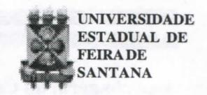
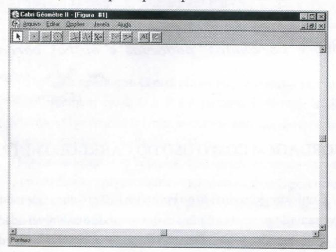
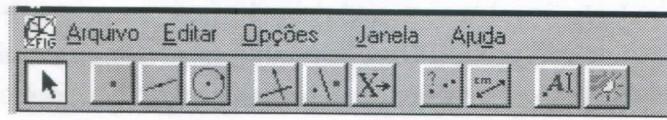
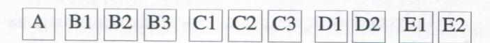
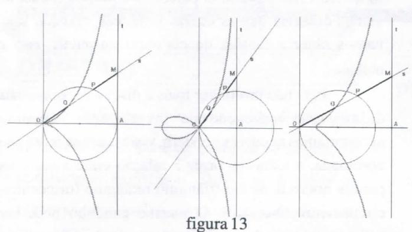
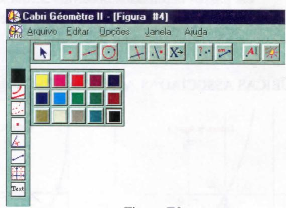
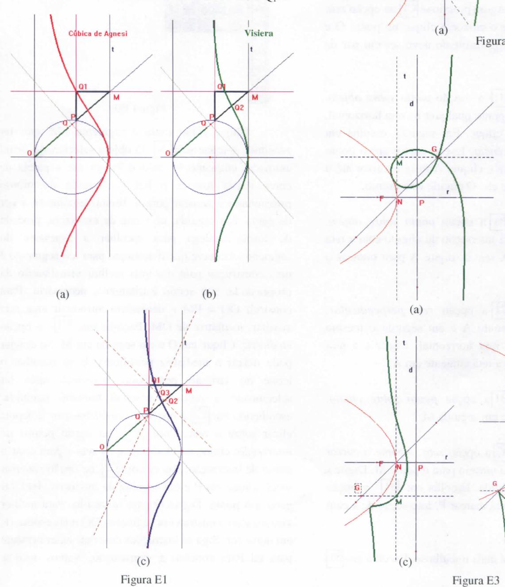
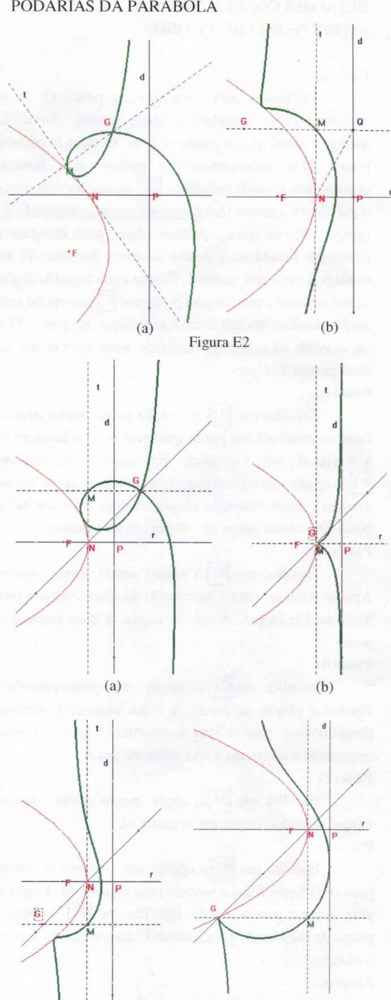

# **FOLHETIM DE EDUCAÇÃO MATEMÁTICA**

**Folhetim Educ. Mat., Ano 10, n. 121, jul. / ago. 2004** 

**ISSN 1415-8779** 

#### **OBJETIVO**

Este *Folhetim* é um veículo de divulgação, circulação de ideias e de estímulo ao estudo e à curiosidade intelectual. Dirige-se a todos os interessados pelos aspectos pedagógicos, filosóficos e históricos da Matemática. Pretende construir uma ponte para unir os que estão próximos e os que estão distantes.

## **EDITORIAL**

Com o presente *Folhetim* encerra-se uma série sobre as podarias de parábola com um tratamento via geometria dinâmica. Encerra-se também mais um ano de pubUcação do *Folhetim, o* décimo ano. O propósito dos tópicos tratados apartirdo *Folhetim*  117 foi mostrar como ferramentas modernas, a exemplo dos programas de computador, podem auxiliar os estudantes, professores e pesquisadores em Educação Matemática no trato com curvas planas e suas propriedades, de maneira motivadora. Com a aplicação dos programas quer-se evidenciar as vantagens de uma mídia que oferece a possibilidade de manipulação, movimento e visualização dos objetos matemáticos representados.

# **COMITÉ EDITORIAL**

Carloman Carlos Borges (Doutor) Inácio de Sousa Fadigas (Mestre)

# **PERGUNTE QUE O NEMOC RESPONDE**

*SoBre paráSoías^ pocfárías e ouíras curuas por !Jnácio O^adiyas (Continuação)* 

#### ABORDAGEM COM O USO DO CABRI-GÉOMÈTRE

Conforme introduzido no Folhetim 119, o Cabri-Géomètre é um programa de geometria dinâmica desenvolvido na Universidade Joseph Fourier, Grenoble, França. Permite a manipulação de objetos geométricos tais como pontos, retas, círculos, etc, e é largamente usado em vários países, nas áreas de pesquisa e ensino de geometria. A versão usada nesse íirtigo é denominada de Cabri-Géomètre II. Entre as vantagens do uso do Cabri está a possibilidade de manipulação dos objetos geométricos abstratos; iteratividade e elaboração de conjecturas. Uma desvantagem porém, dentro de nossa realidade sócio-econômica - e por isso mesmo pode ser um f ator limitante para o seu uso - é que não é um programa de licença gramita, e sua distribuição no Brasil está a cargo da PUC/SP através do PROEM. Por outro lado, o Instituto de Matemática e Estatística da Universidade de São Paulo disponibiliza um programa gratuito denominado iGeom, na versão iterativa na internet, bem como uma versão para ser instalada no seu computador. É também um programa de geometria dinâmica semelhante ao Cabri. Este pode ser obtido na página http://www.matematica.br/igeom/. Não vamos nos estender muito na questão do uso do programa Cabri, mas a mesma observação feita para o Winplot vale aqui: para quem tem uma certa familiaridade com o computador, não será difícil manipular seus comandos.

Na abordagem com o uso da geometria dinâmica, nenhuma equação será necessária para visualizar as podarias da parábola; basta que saibamos quais as propriedades ou invariantes que estão presentes. No caso em questão (estudo das podarias da parábola), usaremos um importante recurso do Cabri que é a opção *lugar geométrico.* 

#### **Aspecto geral do Cabri**

A tela do Cabri é com se fosse uma folha de desenho na qual os objetos desenhados podem ser manipulados , interagindo-se assim com os mesmos. A propósito, isso justifica a sigla que dá nome ao programa: CAhier de BRouillon Iteráctif (caderno de rascunho interativo). A tela principal é apresentada abaixo.

Na barra de ferramentas, aparecem **11** janelas em **5** grupos, em que cada janela desdobra, exibindo várias opções. A opção ativada corresponde àquela representada pelo ícone da janela.

Para facilitar a referência no texto, vamos nos referir às janelas da seguinte maneira:

#### **Construção de císsóides e estrofóides .**

Antes de partir para a construção das podarias da parábola relativas a um ponto do plano que a contém, é instmtivo usar o programa para a construção de cissóides (ou estrofóides). Alguns sítios na internet fornecem os passos para tal construção, a exemplo de http:// www.proem.pucsp.br/cabri\_prof.htm. Porém as construções são feitas de forma separada, com o pólo e adiretrizfixos.

A nossa contribuição é no sentido de fornecer os passos para o caso mais geral, a partir do qual será possível obter cissóides e estrofóides, com a manipulação dos objetos.

Inicialmente lembremos da definição da cissóide de Diocles (Folhetim **117,** pág **3)** 

Sejaum círculo de diâmetro *OA* e seja í atangente em A (figura 5). O círculo é a base, o ponto O é o polo e a tangente *t*  é a diretriz. Cada reta traçada do ponto *O* no plano do círculo determina um ponto no círculo e outro ponto na reta tangente í. Sejam f e Aí tais pontos, respectivamente, obtidos através do traçado da reta *s.* Sobre a reta s, marca-se um ponto g de tal forma a obter *MQ = OP.* Como *MQ = MP + OQeOP = OQ + QP,*  podemos marcar também o ponto *Q* de forma que *0Q = MP.* O movimeto do ponto *Q,* para as retas s traçadas, descreve a curva denominada cissóide de Diocles.

Os passos são os seguintes:

- a) Construir um par de retas perpendiculares que se intersectam num ponto O;
- b) Construir um círculo de centro no eixo horizontal (à direita, por escolha) passando por O;
- c) Marcar o ponto A, na interseção do círculo com a reta horizontal;
- d) Traçar uma tangente *t* ao círculo, passando por A;
- e) Em t, criar um ponto M (diferente de A);
- f) Traçar uma reta *s,* passando por O e M. Seja P a interseção de *s* com o círculo;
- g) Definir Q em *s* de forma que OQ = PM.

O lugar geométrico dos pontos Q quando M desliza sobre í é a cissóide reta.

O detalhamento dos passos acima com o uso do

# **NEMOC - NÚCLEO DE EDUCAÇÃO MATEMÁTICA OMAR CATUNDA**

FolhetimEduc.Mat.,Ano **10,**n. **121,** jul./ago. **2004 -Editores:** Carloman e Inácio - **Secretária:** Josenildes Oliveira Venas Almeida - **Digitação:** Manoel Aquino dos Santos - **Editoração:** Evandro Vaz - **Impressão:** Imprensa Gráfica Universitária - **Periodicidade:** bimestral - **Tiragem: 850** exemplares - *Distribuição gratuita* **- Endereço:**  Av. Universitária, s/n - km **03** - BR **116** - Campus Universitário - **Telefone: (75)224-8115 - Fax: (75)224-8086 -** CEP **44031-460** - Feira de Santana - Ba - BRASIL - **E-mail:** nemoc@uefs.br

Cabri encontra-se no ENCARTE, p. 1.

**O** resultado é apresentado na figura 13 abaixo

A vantagem da construção acima é que os pontos estão "livres", e podem ser manipulados. Por exemplo, movendo o ponto A (sempre com o cursor ativado) para a direita ou para a esquerda, ao longo da reta horizontal, obtemos uma "família" de cissóides retas; cuspidal (deDiocles); acnodal; crunodal (estrofóide). Confira com a figura 11, Folhetim 118, p. 4. A propósito, quando o ponto A coincide com o centro do círculo, a curva é a estrofóide reta discutida no Folhetim 118, p.3.

Uma pequena alteração no passo f) permite uma maior flexibilidade, como descreveremos: antes de construir a reta *s,* que passa por O e M, crie um novo ponto O sobre o círculo com BI na opção *ponto sobre objeto.* Isso fará com que o ponto O possa percorrer livremente o círculo, e podemos obter também as cissóides e estrofóides oblíquas (quando o pólo O não pertence ao diâmetro da base)

Uma outra vantagem da construção é que, com pequenos ajustes, poderemos obter outras curvas. Por exemplo, se traçarmos uma reta paralela à tangente *t*  passando por P e uma outra perpendicular a / passando por M, temos o ponto de interseção, digamos Q^. O lugar geométrico dos pontos Qj quando M desliza sobre *t é* a famosa **versiera** ou **cúbica de Agnesi.** Note que, no triângulo retângulo PQjM, Q, é o encontro das alturas. Se no mesmo triângulo, marcarmos o ponto médio de P e M, digamos Q^, que corresponde ao encontro das mediatrizes de PQjM, o lugar geométrico de Q^quando M desliza sobre *té a* curva chamada **visiera.** Uma outra curva, ainda não catalogada, pode ser obtida como o lugar geométrico de Q^, interseção das bissetrizes do triângulo PQjM, quando M desliza sobre /. As curvas são apresentadas na figura El do encarte.

### **Podarias da parábola**

Vamos retomar o nosso propósito inicial que é estabelecer os passos necessários para obter o lugar geométrico das podarias à parábola relativas a um ponto genérico no plano que a contém. Retomando a definição de podaria (Folhetim 117, p. 1), é o *lugar geométrico dos pés das perpendiculares traçadas de um ponto às tangentes a uma curva dada.* Note que, ao contrário do que foi feito na abordagem com o Winplot, nenhuma equação algébrica é necessária para o tratamento com o Cabri.

Por tratar-se de podarias da parábola, o primeiro passo é construí-la com os recursos do Cabri. Sabemos que, geometricamente, uma parábola é o lugar geométrico dos pontos que são eqiiidistantes de um ponto fixo, chamado foco, e de uma reta, chamada diretriz.

# Construção da parábola

- a) Construa uma reta *d* (vertical, de preferência) e um ponto F fora dela.
- b) Obtenha um ponto P sobre *d*
- c) Construa a reta *r* perpendicular à reta *d* pelo ponto P.
- d) Construa a reta *t,* mediatriz do segmento FP. Observe que a mediatriz é tangente à parábola.
- e) Nomeie de N a interseção *áe r e t.*
- f) Obter o "lugar geométrico" determinado por N. Construção das podarias
- g) Crie um ponto G qualquer no plano da parábola.
- h) Construa uma perpendicular a *t* passando por G.
- i) Crie um ponto M de interseção da perpendicular com a reta
- j) Estabeleça o lugar geométrico de M quando P percorre a reta *d.*

Com os passos anteriores, a construção está terminada. Basta que manipulemos adequadamente certos objetos criados para visualizar as podarias da parábola.

Segue a apresentação e discussão de alguns fatos interessantes.

- 1) Ao deslizar o ponto P ao longo da reta *d,* observe, como esperado, que o ponto N percorre a parábola e a reta *t*  está sempre tangente a esta.
- 2) A posição relativa do foco F e da reta *d* determina a maior ou menor "abertura" da parábola.
- 3) Como o foco F está livre, a parábola pode ocupar

várias posições. De preferência vamos mantê-la sobre a reta *r,* pois o interesse maior aqui é explorar as podarias. 4) Se o ponto G coincide com o vértice da parábola (ponto N), temos a cissóide reta (de Diocles). Se G está no ponto médio de N e P, surge a estrofóide reta. Outras curvas são geradas quando G percorre a reta r, inclusive alguns tipos de cissóides já vistas em Folhetins anteriores.

- 5) quando G coincide com o foco F da parábola, a curva degenera-se num ponto e numa reta tangente à parábola. Isso está de acordo com o que foi apresentado no Folhetim 119,p.2.
- 6) Suponha agora que G está numa reta que passa por um ponto qualquer entre N e P e é paralela à diretriz *d.* Se fizermos G percorrer tal reta, as curvas obtidas são aquelas já apresentadas no Folhetim 120, p.2.
- 7) Quando usamos o Winplot, obtivemos algumas curvas que correspondem geometricamente ao caso de G percorrer a reta *y = x* (Folhetim 120, p.2). O propósito agora é analisar tais curvas a partir da construção feita com o Cabri. Para melhor atingir tal objetivo, precisamos retomar à constmção e introduzir alguns aspectos novos. Por exemplo, é conveniente inserir uma "grade" em nossa geometria sintética, de forma que o ponto N coincida com um dos pontos da grade. Para tanto, crie um sistema de E2 na opção *mostrar eixos.* Em seguida, com eixos com o ícone ativado, posicione o cursor na origem do sistema de eixos e arraste-o até coincidir com o ponto N. Agora com E2 na opção *definir grade,* clique sobre um dos eixos criados. Deve aparecer uma tela pontilhada na forma de grade quadrada. Com a grade, é possível construir com facilidade retas que passam por dois pontos da mesma, a exemplo da reta *y = x.* Com [B2 na opção *reta,* clique em quaisquer dois pontos da grade tal que *y = x.* Então, é só arrastar o ponto G para a reta assim criada, e deslizá-lo ao longo da mesma. Observe que as curvas obtidas podem ser agrupadas de acordo com a seguintes características: curvas *crunodais* (que tem ponto múltiplo); curvas *cuspidais* (apresentam um ponto anguloso) e curvas *acnodais* (tem um ponto isolado). O mais interessante é que os pontos onde a reta *y = x* corta a parábola' definem a passagem de um tipo para o outro. Por exemplo, se G é tal que **j:,** >'>0, a curva é crunodal. Porém, na origem, passa a ser cuspidal. Num ponto qualquer da reta entre as duas insterseções, a curva é acnodal. É novamente cuspidal no

outro ponto de interseção, e volta a ser crunodal na parte das curvas onde a parábola está acima da reta.

8) Se fizermos o ponto G percorrer a própria parábola, vamos observar que as curvas serão cuspidais,ou seja, vamos obter a família de cissóides cuspidais, reta e oblíquas.

Para não prolongar mais a discussão, queremos deixar uma indicação de investigação. Quando apresentamos as curvas versiera, visiera e uma outra não nominada, a ideia foi fazer a relação entre estas e os pontos notáveis de um triângulo retângulo (ortocentro, circuncentro, incentro). O mesmo caminho pode ser trilhado, a partir das podarias da parábola. Observe na figura E2 (b) que os pontos N, M e Q formam um triângulo retângulo em M, ponto este que descreve as podarias. Note também que M é o encontro das alturas do triângulo NMQ (ortocentro). As questões a serem, investigadas são: qual o lugar geométrico dos pontos Mj, interseção das mediatrizes do triângulo NMQ, quando P desliza sobre a reta *d.* Qual o lugar geométrico dos pontos M^, interseção das bissetrizes do triângulo PMQ, quando P desliza sobre *dl* 

Outras "descobertas" podem surgir da manipulação dos objetos através do Cabri, bem como pode-se aplicá-lo ao estudo de outras curvas. O potencial dos programas de geometria dinâmica é muito grande, e aqui foi mostrado apenas um exemplo desse pontencial.

# **PRÓXIMO NÚMERO**

*Aguardem!* 

# **NÚMEROS ATRASADOS**

Envie para cada Folhetim um selo de postagem nacional de 1° porte. Dentro de no máximo quatro semanas, contadas a partir da data de recebimento do seu pedido, você estará recebendo os Folhetins solicitados.

OBS.: É permitida a reprodução total ou parcial deste folhetim, desde que citada a fonte.

**&#x27; Se a equação da parábola é da forma** *y^lpx,* **os pontos de interseção são (0,0) e** *(2p,2p)* 

### DETALHES CONSTRUTIVOS DA CISSÓIDE E ESTROFÓIDE COM O CABRI

Passo a)

Iniciemos com a criação do ponto O. É só pressionar BI e escolher a opção *ponto.* Antes de qualquer outro passo digite a letra O para nomear o ponto. Esse procedimento é padrão para nomear objetos. Em seguida pressione B2 na opção *reta.* Leve o cursor até o ponto O e pressione o botão esquerdo do mouse. (Vamos usar a palavra *dique* para designar a expressão sublinhada). Afaste o cursor do ponto O até conseguir uma reta vertical. Clique e em seguida digite y para nomear a reta. Agora pressione Cl na opção *reta perpendicular,* aponte o cursor e clique no ponto O e em seguida na reta v. O resultado deve ser um par de retas perpendiculares.

Passo b)

Escolha em **81** a opção *ponto sobre objeto.*  Leve o cursor até um ponto qualquer na reta horizontal, à direita da reta v e clique. Em seguida, escolha em B3 a opção *circunferência,* leve o cursor até o ponto marcado anteriormente e clique. Arraste o cursor até o ponto O e clique sobre ele. O círculo está pronto. Passo c)

Escolha em BI a opção *ponto sobre objeto.*  Aponte o cursor para a interseção do círculo com a reta horizontal e clique. A seguir, digite A para nomear o ponto '.

Passo d)

Escolha em ^ a opção *reta perpendicular.*  Aponte e clique no ponto A e em seguida o mesmo procedimento para a reta horizontal. Digite *t* e terá constmído e nomeado a reta tangente em A. Passo e)

Escolha em BI a opção *ponto sobre objeto.*  Clique na reta *t.* Digite em seguida M. Passo **O** 

Escolha em B2 a opção *reta.* Aponte o cursor para O e clique. Faça o mesmo para o ponto M. Digite .v para nomear a reta obtida. Escolha em BI a opção *ponto de interseção* para marcar P. interseção de *s* com o círculo.

Passo g)

O passo final é mais trabalhoso. Escolha em B2

a opção *segmento.* Aponte o cursor para P e clique. Em seguida faça o mesmo para M. Para destacar o segmento, proceda da seguinte forma: no menu opções selecione *mostrar atributos.* Uma lista de atributos (ícones em coluna à direita da tela) é mostrada. O primeiro (de cima par baixo) refere-se a cor. o segundo à espessura do traçado do objeto. o terceiro à forma de pontilhado, etc. Veja a figura abaixo.

Figura EO

Clique então sobre o segmento PM após ter escolhido o ícone seta A . O objeto selecionado ficará animado, enquanto levando o cursor até a paleta de cores (basta manter o botão esquerdo do mouse pressionado e arrastar para a direita) escolhe-se a cor desejada. Em seguida, no ícone de espessura, proceda de forma análoga para escolher a espessura do segmento. Observe que o destaque para a o segmento é uma construção para dar uma melhor visualização da propriedade, não sendo estritamente necessário. Para construir OQ = PM é necessário introduzir uma reta auxiliar, mediatriz de OM. Escolha em Cl a opção *mediatriz.* Clique em O e em seguida em M. Se desejar pode deixar a mediatriz pontilhada. É só escolher o ícone do atributo pontilhado (terceiro), após ter selecionado a reta. É possível também oculta-la. escolhendo em E2 a opção *esconder/mostrar* e depois clicar sobre a reta. Com BI na opção *pontos de interseção,* clique na mediatriz e na reta .v para criar o ponto de interseção. Agora com C2 na opção *simetria axial,* clique em P e em seguida na mediatriz. Isso vai gerar um ponto. Digite Q para nomeá-lo. Para melhor visualização, construa um segmento OQ mais espesso e em outra cor. Siga as instruções descritas anteriormente para tal. Para concluir a construção, vamos usar a

**Poderia ser usada a opgão** *pontos de interseção,* **mas não teríamos o ponlo A livre** 

opção *lugar geométrico.* Escolha em Cl a opção *lugar geométrico.* 

Aponte e clique no ponto Q e em seguida no ponto M. A curva que aparece é o lugar geométrico dos pontos tais que OQ = MP quando o ponto M desliza sobre a reta *t.* ou seja. é a cissóide reta ou cissóide de Diocles. Observe que. ao mover o ponto M sobre *t,* com ativado. o ponto Q percorre a curva. **O ícone** 

Os passos detalhados descritos acima são suficientes para construir também a parábola e suas podarias, conforme pag. 3, *T'* coluna.

## CÚBICAS ASSOCIADAS AO TRIÂNGULO PQ,M

#### PODARIAS DA PARÁBOLA

