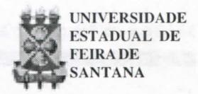
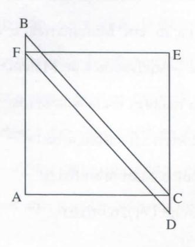

# **FOLHETIM DE EDUCAÇÃO MATEMÁTICA**

**Folhetim Educ. Mat., Ano 11, n. 122, set. / out. 2004**

**ISSN 1415-8779**

#### **OBJETIVO**

Este _Folhetim é_ um veículo de divulgação, circulação de **ideias** e de estímulo ao estudo e à curiosidade intelectual. Dirige-se a todos os interessados pelos aspectos pedagógicos, filosóficos e históricos da Matemática. Pretende construir uma ponte para unir os que estão próximos e os que estão distantes.

### **EDITORIAL**

**o** _Folhetim de Educação Matemática_ quebra a barreira dos dez anos e inicia seu "Ano 11". Foi um longo caminho até aqui, produzindo artigos ininterruptamente (às vezes com atrasos causados por fatores fora do controle dos editores). Com o número 122, retoma-se a coluna _Pergunte que o Nemoc Responde_ com mais um (de mais de uma centena) artigo do prof. Carloman Carlos Borges. Neste, um importante aspecto do ensino aprendizagem é abordado - resolução de problemas. Mais especialmente, trata-se de ir ao cerne da questão para identificar o que é um problema - do ponto de vista matemático, é claro. As observações feitas no texto são importantes e devem ser refletidas, principalmente por aqueles diretamente ligados e atuantes em educação Matemática.

# **COMITÉ EDITORIAL**

Carloman Carlos Borges (Doutor) Inácio de Sousa Fadigas (Mestre)

# **PERGUNTE QUE O NEMOC RESPOND E**

_uns C/^spec/os no &nsino cia UCaíemáíica por Ga/íoman Ciaríos Jiotyes_

' Costuma-se dizer que aprender matemática é aprender a resolver problemas, porém, não é costume dizer o que é um problema matemático, ou de modo mais geral, quando uma determinada situação torna-se um problema.

Aprender um algoritmo da multiplicação é um problema matemático? A mesma pergunta vale para os demais algoritmos empregados nessa disciplina.

Todos os processos de cálculo como, exemplificando, as quatro operações fundamentais elementares - adição, subtração, multiplicação e divisão - são respondidas por mecanismos que já estão prontos nas cabeças dos alunos, levando-os imediatamente à solução. A reflexão, aqui, por parte do aluno, cede lugar aos automatismos estudados e memorizados, como a tabuada. Eles se constituem em simples exercícios de matemática, cuja justificativa encontra-se na automatização, neste caso, da tabuada.

Vale observar: na resolução de um exercício de matemática a reflexão cede lugar aos automatismos memorizados e, se os alunos estão bem treinados, a resposta é imediata. Aliás, tal tarefa pode ser executada, com menos tempo investido e mais segurança quanto aos resultados, por uma simples máquina de calcular. Não devemos sobrecarregar nossos alunos com tarefas mais apropriadas a essas máquinas.

Uma outra observação a ser feita: na resolução de um exercício matemático, seus passos são automáticos, não há uma tomada de decisões sobre eles a serem seguidos.

Estamos, agora, em condições de definir um problema matemático. Vamos fazer referência àquela definição contida em F. K. LESTER: _"Trendes and issues in mathematical problem solving research",_ NEW YORK ACADEMIC PRESS, 1983, e repetida por diversos outros autores: _"uma situação na qual um indivíduo ou mesmo um grupo quer ou precisa resolver e para a qual não dispõe de um caminho rápido e direto que o leve à solução"._

No caso da matemática, uma determinada situação para ser considerada um problema pelo aluno, este deve estar motivado a resolvê-la, deve sentir necessidade nessa direção criada pela sua natural curiosidade. Essa situação deve ativá-lo a refletir até encontrar a melhor estratégia para a sua solução através de respostas consistentes com os dados da situação apresentada. Aqui, não há mecanismos prontos, como no caso da tabuada. O que existe é um grande interesse do aluno - ativado por uma natural

curiosidade que transforma a busca da solução em verdadeiro desafio cognitivo.

Geralmente, perante um problema, não somos bem sucedidos nas tentativas iniciais. Nossas respostas iniciais são inadequadas. E após vários ensaios que vamos nos aproximando da solução desejada.

No caso da Matemática, uma grande dificuldade enfrentada pelo aluno é o excessivo formalismo de seus professores. Em que consiste tal formalismo? Na apresentação da Matemática como uma linguagem unidimensional, isto é, elaé apresentada como umalinguagem sem conteúdo, um mero conjunto de regras sintáticas apenas suficientes para a articulação do discurso matemático - nos primeiros níveis de estudo a matemática deve estar associada a problemas científicos de outras disciplinas. Não apenas isso; a dimensão semântica deve ser considerada, principalmente na chamada fase final do problema, a sua verificação. O que é consistente com a sintaxe matemática pode não ser com a sua semântica. Exemplificando: se dez operários constroem um mesmo muro em oito horas, isso não quer dizer que um milhão de operários o construam em alguns segundos, embora a solução matemática formalmente aponte nessa direção.

Ao considerar a Matemática apenas uma

#### **NEMOC - NÚCLEO D E EDUCAÇÃO MATEMÁTICA OMAR CATUNDA**

Folhetim Educ. Mat., Ano 11 ,n. 122, set./out. 2004 - **Editores:** Carloman e Inácio-**Secretária:** Josenildes Oliveira Venas Almeida - **Digitação:** Manoel Aquino dos Santos - **Editoração:** Evandro Vaz - **Impressão:** Imprensa Gráfica Universitária - **Periodicidade:** bimestral - **Tiragem:** 850 exemplares - _Distribuição gratuita -_ **Endereço:** Av. Universitária, s/n - km 03 - BR 116 - Campus Universitário - **Telefone:** (75)224-8115 - **Fax:** (75)224-8086 - CEP 44031-460 - Feira de Santana - Ba - BRASIL - **E-mail:** nemoc@uefs.br

linguagem uni-dimensiorial como foi descrita acima-alguns professores prestam um grande desserviço à educação de nossos jovens. O conhecimento matemático é um poderoso e insubstituível instrumento para a compreensão do mundo no qual vivemos, e influencia na tomada de decisões em nossa vida cotidiana: pedir um empréstimo, analisar resultados eletorais, etc. A simples observação de que o conhecimento matemático é a base fundamental do conhecimento científico e tecnológico, justifica o caráter de privilégio dado ao ensino dessadisciplina. Mas, mesmo aqui, o formalismo é um grave obstáculo enfrentado pelo aluno, pois ele é capaz de resolver um problema científico reduzido ao formalismo matemático sem compreendê-lo no seu aspecto físico, pois o professor continua encarando a Matemática como uma linguagem na qual existe apenas a dimensão sintática, isto é, como um simples jogo. Aliás, há uma tendência até de associar o ensino da matemática ao ensino do jogo de xadrez. Tenho lido muitas tolices a esse respeito. Não conheço algum matemático que seja exímio jogador de xadrez ou de qualquer outro jogo e vice-versa. No máximo pode-se apontar algo em comum: a precocidade manifestada tanto pelos jogadores de xadrez como pelos grandes matemáticos.

Infelizmente e apesar dos resultados obtidos pelas ciências cognitivas, a ênfase, ainda hoje, na sala de aula é direcionada para a solução de exercícios e não de problemas. Com isso o papel formativo da Matemática fica seriamente prejudicado.

Segundo Polya, a solução de um problema

matemático abrange quatro passos: compreensão, concepção de um plano, execução do plano e exame da solução alcançada. Para maiores detalhes, leia-se:Aa/-re _de resolver problemas,_ G. POLYA, Editora Interciência. Apenas uma curiosidade: a fase denadeira na solução de um problema que é o exame da solução sua análise rigorosa, a separação da dimensão sintática da dimensão semântica - é completamente relegada pela maioria dos professores, uma amostra a mais do seu exagerado formalismo."Resolve-se" um problema sem examinar a solução encontrada.

Apresentamos, agora, um exemplo ilustrativode que a solução do problema depende de sua formulação. Este exemplo foi extraído do livro _"el Pensamiento_ y _los Camínos de su Investigacion "_ Ediciones Pueblos Unidos, de S. Rubinstein.

O problema é o seguinte: "Ache a que equivale a soma das áreas do paralelogramo FBCD e do quadrado AFEC". Outra formulação era apresentada aos alunos: "Que forma tem a soma dos triângulos ABC e FED da figura, e a que é igual essa soma?" Nas duas variantes eram dadas: lado AB é igual a a e o lado AC igual a _b._

A análise das soluções obtidas mestra que no primeiro caso, todos os alunos resolverem o problema calculando separadamente a área do quadrado e a do paralelogramo, depois do que somaram os resultados parciais.

Todos que resolveram a segunda variante do problema, sem exceção, o fizeram sem recorrer a cálculos analíticos. •"

Articularam mentalmente as distintas partes da figura e em seguida deram o resultado quantitativo total, coincidente com o obtido pelos alunos que resolveram o problema segundo a primeira formulação.»

### **NOTÍCIAS**

A Sociedade Brasileira de Matemática (SBM) realizará II BIENAL em Salvador, no Instituto de Matemática da UFBa, no período de 25 a 29 de outubro de 2004.

A II BIENAL terá conferências, minicursos, oficinas e exposições.

Público alvo: Alunos do ensino médio, de graduação e pós-graduação em Matemática e de áreas afins, professores e pesquisadores de Matemática.

Para maiores esclarecimentos:

Site: www.bienasbm.ufba.br

E-mail: bienasbm @ ufba.br

Telefone: (71)263-6265

**Será realizada de 15 a 19 de novembro de**

**2004, a VI Semana de Matemática da UEFS/Ba.**

**Tema: A beleza oculta da Matemática**

**Inscrições:**

**Período: 03 a 12 de novembro de 2004**

**Valor: R\$15,00**

**Informações:**

**D. A. de Matemática/UEFS / Mód. V - MT 51**

**Av.Universitária,km03,BR 116**

**' Feira de Santana - Ba**

**Tel.: (75) 224 - 8233 (COLMAT / UEFS)**

**E-mail: damat@uefs.br**

**O evento tem o apoio do Departamento de Ciências Exatas da UEFS e do Niíncleo de Educação Matemática Omar Catunda - NEMOC.**

# **PRÓXIMO NÚMERO**

_Alguns aspectos no ensino da Matemática. (Continuação)_

# **NÚMEROS ATRASADOS**

**Envie para cada Folhetim um selo de postagem nacional de 1° porte. Dentro de no máximo quatro semanas, contadas a partir da data de recebimento do seu pedido, você estará recebendo os Folhetins solicitados.**

**OBS.: É permitida a reprodução total ou parcial deste folhetim, desde que citada a fonte.**
