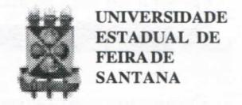
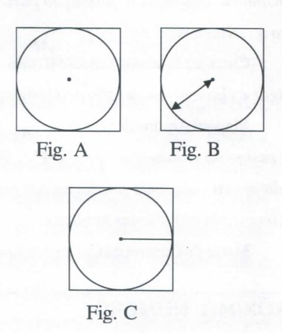
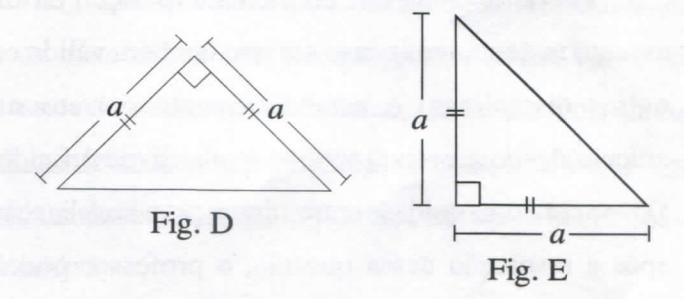

# FOLHETIM DE EDUCAÇÃO MATEMÁTICA

ISSN 1415-8779

Folhetim Educ. Mat., Ano 11, n. 123, nov. / dez. 2004

## **OBJETIVO**

Este Folhetim é um veículo de divulgação, circulação de idéias e de estímulo ao estudo e à curiosidade intelectual. Dirige-se a todos os interessados pelos aspectos pedagógicos, filosóficos e históricos da Matemática. Pretende construir uma ponte para unir os que estão próximos e os que estão distantes.

#### **EDITORIAL**

Encerra-se mais um ano no calendário civil, mas o trabalho da equipe não para, graças a aceitação e crescimento do número de assinantes. Apesar dos inúmeros atropelos, o ano de 2004 foi bastante produtivo, e seus resultados divulgados nos _Folhetins_ desde o número 1 até o presente. Este dá seguimento ao tema abordado no nº 122, ou seja, _Alguns aspectos no Ensino da Matemática_. Aspectos da linguagem com a resolução de problemas apresentados aqui, com vários exemplos de como a representação simbólica pode ajudar - e muito - na resolução dos problemas.

# **COMITÊ EDITORIAL**

Carloman Carlos Borges (Doutor) Inácio de Sousa Fadigas (Mestre)

# PERGUNTE QUE O NEMOC RESPONDE

Alguns aspectos no Ensino da Matemática

por Carloman Carlos Borges

(Continuação)

O ensino de matemática deve ser um convite para que aluno empregue a língua materna com mais correção e clareza. Aliás, um professor de matemática sem tais qualidades (o que não é tão incomum assim) deveria procurar sanar essas carências - pois um dos aspectos formativos dessa disciplina é precisamente o emprego correto e claro da língua mãe, importante até mesmo em nossa própria identidade.

Costuma-se dizer que é caminhando que se aprende a andar, mas não é costume dizer que se aprende matemática também caminhando, ou seja, manipulando-a. A criança deve agir sempre através da ação, pois esta operação: agir manualmente deve preceder sempre às operações matemáticas. Isso deve levar a criança à representação simbólica, isto é, à representação através da linguagem.

Segundo G. Mialaret, em A Aprendizagem da Matemática, Livraria Almedina, Coimbra, 1975; "... existe uma diferença de alguns meses entre o que chamamos <u>idade da leitura</u> e <u>idade do cálculo</u>. Os psicólogos e os psicopedagogos estão de acordo ao pensarem que existe um pequeno desencontro de alguns meses entre as duas idades: <u>a idade da leitura precederá a do cálculo</u> em alguns meses (cerca de dois - três). As duas séries de atividades são, portanto, muito próximas - partir de uma certa realidade e traduzir esta numa certa linguagem:

linguagem oral → tradução → linguagem escrita ação concreta → tradução → operação matemática.

Na resolução de problemas, são exigidos comportamentos específicos e capacidades necessárias. Não se deve esquecer, no entanto, a grande variabilidade dos problemas, o que dificulta a apresentação de normas gerais para sua solução. As "regras" dadas acima, inclusive aquelas apresentadas por Polya, devem ser olhadas com prudência e criatividade, pois são valiosas indicações na solução de problemas.

Para ilustrar nossas idéias, consideremos oproblema: aprender a nadar. Seria absurdo tentar ensinar verbalmente a uma pessoa nessa tarefa. Não se aprende a nadar por correspondência ou, para empregar uma linguagem tão em moda: "à distância".

Há problemas, cuja solução está na dependência de uma representação simbólica. Assim, segundo S. Glucksberg, Psicologia dos Processos Simbólicos, Livraria José Olímpio Editora, Coleção Psicologia Contemporânea, o seguinte problema (nosso conhecido desde o Ensino Médio) exige não só uma representação simbólica, como também uma transformação em outra representação simbólica de mais acesso a sua resolução. O problema é este: "Duas estações ferroviárias estão 50 km uma da outra. Às 14 horas de um sábado, dois trens partem, um em direção ao outro, um de cada estação. No momento em que os trens deixam as estações, um pássaro começa a voar a partir do primeiro trem em direção ao começa a voar a partir do primeiro trem em direção ao

outro e vice -versa, decrevendo esse movimento até o momento em que os trêns se encontram. Se ambos os trens viajam 25 km por hora e o pássaro voa a 100 km por hora, quantos quilômetros o pássaro terá voado até o momento em que os trens se cruzam?".

Destaquemos a pergunta do problema: "quantos quilômetros o pássaro terá voado até o momento em que os trens se cruzam?"

Essa pergunta admite, segundo S. Glucksberg a seguinte transformação simbólica: "Háquanto tempo o pássaro estava voando?" Segundo esse autor, com essa transformação o problema torna-se banal e a sequência do pensamento seria a seguinte:

- 1. Os trens distam 50 km um do outro.
- 2. Como viajam na mesma velocidade, ambos devem percorrer 25 km antes do encontro.
- 3. Como viajam a 25 km/h, encontram-se após uma hora.
  - 4. O pássaro voa a 100 km/h.
- 5. Como os trens encontram-se uma hora após a partida, o pássaro voou 100 km.

Realmente, uma simples transformação simbólica na pergunta original do problema, o torna um problema banal.

Outra transformação simbólica para a mesma pergunta, é: após quanto tempo os trens se cruzarão? A resposta é imediata: os trens se cruzarão após uma hora. como o pássaro voa a 100km por hora, ele voou 100 km.

Quando estudei pela primeira vez esse problema

# NEMOC - NÚCLEO DE EDUCAÇÃO MATEMÁTICA OMAR CATUNDA

Folhetim Educ. Mat., Ano 11, n. 123, nov. / dez. 2004 - Editores: Carloman e Inácio - Secretária: Josenildes Oliveira Venas Almeida - Digitação: Manoel Aquino dos Santos - Editoração: Evandro Vaz - Impressão: Imprensa Gráfica Universitária - Periodicidade: bimestral - Tiragem: 900 exemplares - Distribuição gratuita - Endereço: Av. Universitária, s/n - km 03 - BR 116 - Campus Universitário - Telefone: (75)224-8115 - Fax: (75)224-8086 - CEP 44031-460 - Feira de Santana - Ba - BRASIL - E-mail: nemoc@uefs.br

-ainda no ensino fundamental -ele vinha acompanhado de uma pergunta de puro sabor sádico: "depois de quantos quilômetros o pássaro é esmagado pelos dois trens?". Suponha-se, é claro, que o infeliz pássaro voava "da frente de um trem" para "a frente do outro trem" e que os trens trafegavam na mesma linha.

Emoutras versões do mesmo problema, em lugar de pássaro, era um maribondo ...

Um simples desenho pode dificultar ou facilitar a resolução de um problema. Consideremos a questão: Calcular a área do quadrado inscrito em um dado círculo.

Pode-se, entre outras alternativas, optar pelos desenhos:

Do ponto de vista visual, a figura C mostra maior número de relações entre o círculo e o quadrado do que as outras duas, tornando a resolução da questão apresentada uma simples banalidade.

Deve-se prestar muita atenção à pergunta apresentada no problema, pois não pode haver resposta correta a uma pergunta obscura. As perguntas devem ser claras, precisas e concisas. Vejam mais um exemplo de uma questão em cuja solução há influência de sua formulação verbal.

## Primeira versão:

Temos um triângulo isósceles cujos lados iguais medem a e o ângulo de seu vértice é de 90°. Calcular a área do triângulo dado".

## Segunda versão:

bem mais difícil.

"Qual é a área, de um triângulo isósceles cujos lados iguais medem a e cujo ângulo formado por esses lados medem 90°?"

Vejamos como um simples desenho pode dificultar ou facilitar a resolução dessa questão. Entre as várias alternativas, temos as seguintes:

Ao considerar a figura E, a resolução do problema torna-se, mais uma vez, uma banalidade, pois "salta a vista" que o triângulo dado é a metade do quadrado de lado a, donde sua área é igual a $\frac{a^2}{2}$ .

Quanto a figura D, a sua disposição torna a resolução da questão mais difícile, para jovens do Ensino Fundamental,

Do ponto de vista pedagógico, deve-se lembrar ao professor a necesidade de ficar bem aclarada, junto à criança, a distinção entre <u>explicação do enunciado</u> e a <u>explicação da questão</u>, objeto de estudo. Aquele primeiro tipo de explicação, consiste em aclarar o significado das palavras. É a semântica da questão e passa necessariamente pelo conhecimento da língua materna. Aliás, o desconhecimento da língua materna

é um dos fatores determinantes na aprendizagem matemática.

Pessoalmente falando e fundamentado em minha experiência acho que numa aula de Matemática - há exceções ... - fala-se um Português desfigurado - o que repito-torna mais difícil a aprendizagem matemática.

Após resolvido o problema da explicação do enunciado, deve-se passar a explicar a questão com suas implicações matemáticas, ao mostrar ao aluno como se passa da linguagem materna à linguagem matemática. Não se deve parar no primeiro tipo de explicação como infelizmente acontece na maioria dos casos.

Há de levar-se em conta, na exposição de um assunto matemático (penso ser isso também válido em outras disciplinas) o estabelecimento correto nas articulações do que seja descritivo, explicativo e definidor. Deve existir uma unidade entre a descrição e a explicação; após a resolução dessa questão, o professor poderá trabalhar a definição do objeto apresentado ao aluno. Muitos professores iniciam sua exposição pela definição do objeto a ser trabalhado. Para fixar essas idéias basta observar uma partida de futebol: o narrador (pode até mesmo ser o Galvão, da Globo) descreve a partida, enquanto a explicação dos lances cabe ao comentarista, cabendo aos técnicos a definição do jogo. Tudo, é claro, teoricamente ...

# NOTÍCIAS

No mês de dezembro o curso de Especialização em Educação Matemática certificará mais uma turma, a 5a, que no decorrer do mês defenderá publicamente suas monografias, conforme regimento do curso.

Os temas e autores são os seguintes:

Reflexões sobre o uso da Informática em sala de aula.

#### Marcélia Góes Mendes

• Problemas abertos ou situações-problema no contexto escolar.

## James Cloy Leite Cordeiro

• Atividades lúdicas como auxiliador do desenvolvimento da inteligência lógico-matemática no processo ensino-aprendizagem.

## Elimar de Sousa Fadigas

• Criptografia e sua diversidade.

#### Eraldo Miranda Junior

Ensino de Matemática: formação para exclusão ou para a cidadania?

#### Cleunice Pires dos Santos Silveira

• Rigor e clareza: um desafio pedagógico.

### Manoel Aquino dos Santos

• O ensino da Geometria nos 3° e 4° ciclos do ensino fundamental - algumas considerações sobre o ensino de Geometria nas escolas públicas.

Maria da Conceição Cerqueira Aragão

# PRÓXIMO NÚMERO

Alguns aspectos no Ensino da Matemática. (Continuação)

# **NÚMEROS ATRASADOS**

Envie para cada folhetim um selo de postagem nacional de 1º porte. Dentro de no máximo quatro semanas, contadas a partir da data de recebimento do seu pedido, você estará recebendo os folhetins solicitados.

OBS.: É permitida a reprodução total ou parcial deste folhetim, desde que citada a fonte.
