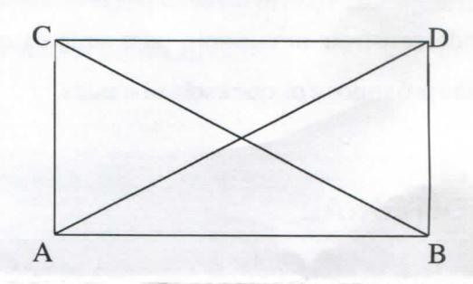
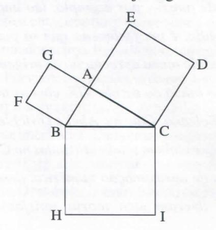

# FOLHETIM DE EDUCAÇÃO MATEMÁTICA

UNIVERSIDADE ESTADUAL DE FEIRA DE SANTANA

ISSN 1415-8779

Folhetim Educ. Mat., Ano 11, n. 124, jan. / fev. 2005

#### **OBJETIVO**

Este Folhetim é um veículo de divulgação, circulação de idéias e de estímulo ao estudo e à curiosidade intelectual. Dirige-se a todos os interessados pelos aspectos pedagógicos, filosóficos e históricos da Matemática. Pretende construir uma ponte para unir os que estão próximos e os que estão distantes.

### **EDITORIAL**

Ao prosseguir com o tema sobre Alguns aspectos no Ensino da Matemática, após abordar a questão da linguagem e seu(bom) uso na matemática, a coluna Pergunte que o NEMOC Responde trás até o leitor uma reflexão sobre os movimentos básicos do pensamento, e como esses se aplicam às questões relativas ao ensino da matemática, comexemplos que ilustram as idéias discutidas no texto. O presente Folhetim coloca a disposição de todos um rico material para pesquisa.

## COMITÉ EDITORIAL

Carloman Carlos Borges (Doutor) Inácio de Sousa Fadigas (Mestre)

## PERGUNTE QUE O NEMOC RESPONDE

Alguns aspectos no Ensino da Matemática
por Carloman Carlos Borges
(Continuação)

Ao desejarmos conhecer um objeto, o fazemos através de aproximações sucessivas, as quais constituem uma sequência infinita, pois dele nos aproximamos assintoticamente. Isso constitui o que se costuma dizer "a aventura do conhecimento humano". Entre as primeiras aproximações o professor deve colocar a descrição e nunca a explicação. Mesmo assim, uma descrição formulada na linguagem do dia a dia sem conter conceitos teóricos. A próxima aproximação poderá ser uma descrição já com alguns conceitos teóricos simples. Aliás, a história da ciência, mais uma vez, nos ensina a sensatez do que foi escrito: as famosas leis de Kepler - descritivas - recebem, em seguida, nas mãos de Newton um tratamento mais fino um tratamento explicativo.

Oque acabamos de colocar possui relação comos movimentos básicos do pensamento: a <u>análise</u>, a <u>síntese</u>, a <u>abstração</u> e a <u>generalização</u>. Quando se diz ser o pensamento um processo, devese ter clareza em acrescentar que tal processo consiste dos quatro movimentos mencionados acima. Inicialmente temos a <u>análise</u> que nos remete a <u>síntese</u>. Por via de consequência desses dois movimentos surgem a <u>abstração</u> e a <u>generalização</u>. A <u>análise</u> e a <u>síntese</u> se encontram fortemente imbricados. Dada uma situação problemática, somos levados, pela <u>análise</u>, a descobrir suas partes constituintes, as correlações entre elas. O estabelecimento das correlações essenciais

desemboca na síntese. A análise não é, como às vezes aparece em alguns desses livros de "metodologia científica": uma mera desintegração da totalidade a ser estudada, mas, sim, a sua transformação. Assim, há, um intercâmbio entre ela e a síntese: ela se verifica através da síntese e esta se realiza através daquela ao juntar suas partes e as correlações descobertas pela análise. Inicialmente, temos uma situação problemática, a qual se constitui na totalidade, no todo a ser conhecido. A partir dessa situação problemática, a análise vai deixando de lado aspectos irrelevantes e concentrando-se naquilo que julga essencial à compreensão dessa totalidade. Aqui, cabe a pergunta: o desprezível é sempre irrelevante? A prática docente nos responde prontamente: nem sempre o aluno sabe fazer essa distinção. Outra questão: nem sempre, a partir de uma totalidade, podemos iniciar a análise. Muitos professores deveriam atentar para tal impossibilidade. Por exemplo: quem não conhece a teoria musical, jamais poderá analisar uma sinfonia. Porém ao ouvir duas sinfonias, uma de Mozarte outra de Beethoven, por exemplo, ele saberá numa segunda audição dizer qual é a de Mozart e qual é a de Beethoven.

Muitos professores colocam seus alunos ante situações problemáticas para as quais eles são incapazes damais elementar <u>análise</u>. Pela sua natureza, a Matemática nos oferece, no processo de aprendizagem, esse tipo de dificuldade, o qual nunca deve ser negligenciado pelo

professor. Na análise de um problema geométrico, por exemplo, surge a questão de o aluno não deixar-se levar apenas pelo sensorial (análise sensorial) mas, desenvolverum tipo de <u>análise verbal</u>, conceitual do que se conhece e do que se desconhece em relação ao problema. Este ponto é dolorosamente negligenciado pelo professor. Como é possível encontar-se a solução de um problema, sem preliminarmente, tal tipo de conhecimento? Para ilustrar essa discussão, passemos à conhecida questão: Quantos triângulos são vistos na figura abaixo:

Segundo o tipo de análise empregado, podemos "ver" na figura quatro triângulos ou oito triângulos.

No processo de abstração, não apenas deixamos de lado propriedades do objeto estudado, como separamos uma coisa da outra.

Por exemplo: ao olhar uma porta vermelha, como chegamos ao conhecimento: essa porta é vermelha? É claro que negligenciamos outras propriedades do objeto, como a sua forma retangular, a sua rigidez, etc., e nos concentramos apenas na cor, uma das inúmeras propriedades do objeto estudado. De maneira diferente, chegamos ao conhecimento:

# NEMOC - NÚCLEO DE EDUCAÇÃO MATEMÁTICA OMAR CATUNDA

Folhetim Educ. Mat., Ano 11, n. 124, jan./fev. 2005 - Editores: Carloman e Inácio - Secretária: Josenildes Oliveira Venas Almeida - Digitação: Manoel Aquino dos Santos - Editoração: Evandro Vaz - Impressão: Imprensa Gráfica Universitária - Periodicidade: bimestral - Tiragem: 900 exemplares - Distribuição gratuita - Endereço: Av. Universitária, s/n - km 03 - BR 116 - Campus Universitário - Telefone: (75)224-8115 - Fax: (75)224-8086 - CEP 44031-460 - Feira de Santana - Ba - BRASIL - E-mail: nemoc@uefs.br

esse livro é maior do que aquele. Maior, menor, são conceitos produzidos por um tipo de abstração diferente daquela que nos levou ao conhecimento de que a porta é vermelha. Aqui, é como se "tirassemos" o conhecimento do próprio objeto, deixando de lado, eliminando tudo o mais a ele pertencente; já na construção dos conceitos maior e menor, o pensamento a ele chegou estabelecendo relações e correlações entre os objetos. Nenhum objeto isoladamente, é maior ou menor; ele é maior ou menor quando posto em correspondência com outro objeto que lhe sirva de comparação.

O processo lógico denominado de generalização (aqui nos referimos à generalização conceitual) é apontado por estudiosos como responsável pela enorme fecundidade da Matemática. Os primeiros exemplos desse processo em Matemática encontramos logo nos primeiros estudos escolares. Doproblema da contagem, abstraimos o conjunto dos números naturais: 1, 2, 3, ..., n, .... A inclusão do zero como um número pode ser considerada a primeira generalização nessa direção; em seguida, pelo mesmo processo lógico, foram criados os conjuntos dos racionais, dos reais e dos complexos. Antes de prosseguir, lembremos aqui que a adição nos naturais possui as seguintes propriedades:

#### 1° Grupo:

i) unicidade: a = a', $b = b' \rightarrow a + b = a' + b'$

ii) monotônica: b > b'

iii) lei do corte: $a + c = b + c \rightarrow a = b$

#### 2° Grupo:

iv) comutativa: a + b = b + a

v) associativa: a + (b + c) = (a + b) + c

Observem que as operações do 1º grupo mostram como os resultados variam quando os dados variam,

enquanto que as operações do 2º grupo mostram as várias formas pelos quais os dados podem ser combinados sem alteração dos resultados. As propriedades do 2º grupo são chamados de <u>propriedades formais</u> (vide: _Conceitos Fundamentais da Matemática_, Bento de Jesus Caraça, Livraria Sá da Costa Editora, Lisboa, pág. 25).

Quando das generalizações já mencionadas, as propriedades formais da adição permaneceram nas demais generalizações: números racionais, números reais, números complexos. Tal permanência é chamada por alguns autores de Princípio de Permanência das Leis Formais (PPLF). Veja que em todas as generalizações mencionadas, foi garantida a existência das operações com a conservação das propriedades formais (aquelas do 2º grupo).

O PPLF que durante tanto tempo serviu aos matemáticos como precioso princípio metodológico para orientar-lhes nas pesquisas, pertence, hoje, ao passado. É uma página virada na História da Matemática.

Outro exemplo de generalização - envolvida em rara beleza - refere-se ao célebre Teorema de Pitágoras. Nos primeiros anos escolares seu enunciado é apresentado aos jovens estudantes desta maneira: "Dado um triângulo retângulo ABC, a medida da área do quadrado construído sobre a hipotenusa é igual à soma das medidas dos quadrados construidos sobre os catetos. Veja a figura:

Ora, se no lugar de quadrado construimos triângulos equiláteros a relação acima também se verifica; o mesmo vale para semi-círculos. Agora, a pergunta: então, a validade do Teorema de Pitagóras (TP) pode ser estendível para quaisquer outras figuras?

A bela generalização do TP afirma: ele se aplica sempre que essas figuras sejam duas a duas semelhantes.

## **NOTÍCIAS**

O professor Geraldo Ávila estará presente na Universidade Estadual de Feira de Santana, a convite do Diretório Acadêmico de Matemática, nos próximos dias 28 e 29 de março, para proferir duas palestras:

- Aspectos Atuais da Formação de Professores do Ensino Básico;
- -O Ensino da Análise Matemática na Licenciatura, cujo resumo desta última destacamos abaixo:

Procuramos mostrar, nessa palestra, a importância da Análise numa boa formação do professor do ensino médio. A origem e evolução do conceito de função, por exemplo, tão importante no ensino médio, é um fenômeno que só pode ser bem compreendido numa apreciação da origem mesma da Análise no início do século XIX, com os trabalhos de Fourier, Bolzano, Cauchy, Abel e Dirichlet. As séries infinitas, que vinham sendo utilizadas no Cálculo e em processos de aproximação numérica, desde o século XVII, só tiveram uma teoria satisfatória com a

introdução de conceitos precisos de continuidade e convergência. É necessário que alunos de licenciatura entendam bem o desenvolvimento da teoria dos números reais por Dedekind, Cantor e outros, como preliminar essencial ao desenvolvimento da teoria da convergência de seqüências, séries numéricas e séries de funções, e na teoria da integral de Riemann. Esses e outros tópicos, apresentados no contexto histórico de seu desenvolvimento, permitem compreender a evolução desses conceitos e teorias, e sua importância na Matemática do século XIX.

# PRÓXIMO NÚMERO

Alguns aspectos no Ensino da Matemática. (Continuação)

# **NÚMEROS ATRASADOS**

Envie para cada folhetim um selo de postagem nacional de 1º porte. Dentro de no máximo quatro semanas, contadas a partir da data de recebimento do seu pedido, você estará recebendo os folhetins solicitados.

OBS.: É permitida a reprodução total ou parcial deste folhetim, desde que citada a fonte.

## **ERRATA**

Na 1ª coluna, página 3 do _Folhetim_ nº 123, final do 2º parágrafo, onde se lê "calcular a área de um quadrado <u>inscrito</u> em um dado círculo", leia-se "calcular a área de um quadrado <u>circunscrito</u> em um dado círculo"
