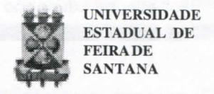
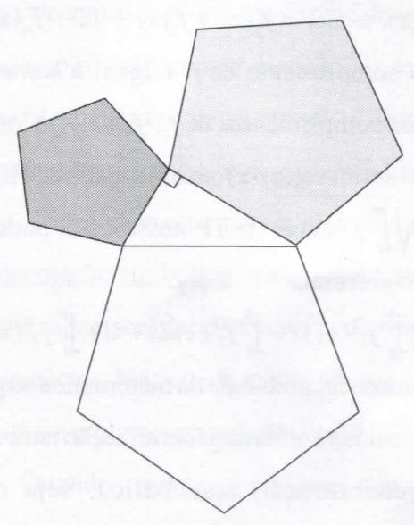

# FOLHETIM DE EDUCAÇÃO MATEMÁTICA

Folhetim Educ. Mat., Ano 11, n. 125, mar. / abr. 2005

ISSN 1415-8779

#### **OBJETIVO**

Este Folhetim é um veículo de divulgação, circulação de idéias e de estímulo ao estudo e à curiosidade intelectual. Dirige-se a todos os interessados pelos aspectos pedagógicos, filosóficos e históricos da Matemática. Pretende construir uma ponte para unir os que estão próximos e os que estão distantes.

#### **EDITORIAL**

Ainda sobre o ensino de Matemática, os leitores são convidados a refletir e compreender a questão da generalização, como um processo fundamental na compreensão da fecundidade da matemática. O artigo mostra a relação muito próxima dos conceitos teóricos usados na matemática, com aqueles empregados ordinariamente. Um ponto a destacar é, mais uma vez, chamar a atenção do professor de matemática da necessidade da compreensão dos conceitos "escondidos" por traz da simbologia usada para representá-los, destacando a matemática, assim como toda ciência, como um conjunto de idéias e não de símbolos.

## **COMITÉ EDITORIAL**

Carloman Carlos Borges (Doutor) Inácio de Sousa Fadigas (Mestre)

### PERGUNTE QUE O NEMOC RESPONDE

Alguns aspectos no Ensino da Matemática por Carloman Carlos Borges (Continuação)

Assim, ele "funciona" na figura abaixo:

De maneira geral: a área de um polígono regular de _n_ lados construido sobre a hipotenusa de um triângulo retângulo ABC é igual à soma das áreas dos polígonos regulares constuídos sobre os catetos.

Como explicar esta regularidade, este padrão: O TP vale não apenas para os quadrados, os triângulos equiláteros, os semicírculos, os polígonos regulares de _n_ lados. Seguindo C. Bachelard, em seu livro _O Racionalismo Aplicado_, Zahar Editores, a <u>causa racional</u> do padrão exposto é a <u>idéia de semelhança</u> que o ser humano posui em sua mente, mesmo sem conhecer o TP ou outros rudimentos

de matemática. Ao descobrir a causa profunda do TP, penetramos no domínio da Filosofia, no reino infinito dos "porquês".

Sabemos que o espaço de Hilbert é um dos exemplos de um espaço de infinitas dimensões. Sua aplicação na Física Moderna não pode ser subestimada. Já vimos que o TP funciona em um espaço <u>n</u> dimensional. Será que ele funciona, também no espaço de Hilbert de ininitas dimensões? A resposta é positiva.

Sejam as N funções duas a duas ortogonais $f_1(x)$ , $f_2(x)$ , ..., $f_N(x)$ , e $f(x) = f_1(x) + f_2(x) + ... + f_N(x)$ . O quadrado do comprimento de f é igual à soma dos quadrados dos comprimentos de $f_1$ , $f_2$ , ..., $f_N$ . Como o comprimento de um vetor f(x) em um espaço de Hilbert é dado por $\sqrt{\int_a^b f^2(x) dx}$ o TP nesse caso pode ser expressado pela fórmula:

$$\int_{a}^{b} f^{2}(x)dx = \int_{a}^{b} f_{1}^{2}(x)dx + \int_{a}^{b} f_{2}^{2}(x)dx + \dots + \int_{a}^{b} f_{N}^{2}(x)dx.$$

A espantosa fecundidade da matemática só pode ser compreendida se a idéia de generalização também o for. Uma generalização matemática, seja ou a generalização de uma demonstração, ou a generalização de uma operação ou a generalização de um ente matemático, parte de uma negação. Assim na generalização da demonstração do TP, foi negado o privilégio do quadrado; nas várias generalizações do

conceito de número, são negadas as impossibilidades operatórias, por exemplo da operação de subtração quando imersa apenas nos números naturais.

O que se observa no ensino da matemática - talvez o domínio mais fértil para essas qualidades do ser humano serem trabalhadas - é um total desconhecimento por parte do professor dos poderosos instrumentais da mente humana. Idéias de semelhança, de classes de equivalência, a capacidade de lidar com padrões, a faculdade de contar - mesmo de maneira rudimentar - lhe são inerentes. Mesmo antes da matemática, a mente humana já trabalhava com elas. Apenas, a título de ilustração, que é um conceito senão uma classe de equivalência?

Há de mostrar ao aluno que a Matemática, ao apossarse dessas idéias inerentes à mente humana, não as torna inteiramente diferente de seu significado comum; apenas elas são tornadas mais precisas. O laço entre o significado ordinário, já conhecido do aluno, e o significado técnico deve ser trabalhado com o aluno da forma mais natural possível, sem qualquer pedantismo por parte do professor.

Tomem um exemplo da Teoria da Informação para ilustrar a existência entre os dois significados mencionados.

A emissão de uma mensagem temos que considerar a existência do <u>emissor</u> e do <u>receptor</u>. O problema colocado é: trabalhar com um número que descreve quanta informação é

## NEMOC - NÚCLEO DE EDUCAÇÃO MATEMÁTICA OMAR CATUNDA

Folhetim Educ. Mat., Ano 11, n. 125, mar. / abr. 2005 - Editores: Carloman e Inácio - Secretária: Josenildes Oliveira Venas Almeida - Digitação: Manoel Aquino dos Santos - Editoração: Evandro Vaz - Impressão: Imprensa Gráfica Universitária - Periodicidade: bimestral - Tiragem: 900 exemplares - Distribuição gratuita - Endereço: Av. Universitária, s/n - km 03 - BR 116 - Campus Universitário - Telefone: (75)224-8115 - Fax: (75)224-8086 - CEP 44031-460 - Feira de Santana - Ba - BRASIL - E-mail: nemoc@uefs.br

transmitida a partir do emissor ao receptor na emissão de uma dada mensagem. Primeiramente é feita uma hipótese relativa a essa quantificação: há probabilidades associadas às mensagens que são emitidas e que a quantidade de informação transmitida por uma mensagem dada pode estar determinada por sua probabilidade de emissão. Supõe-se que um emissor selecione exatamente uma mensagem de um conjunto possível de mensagens:

$$X = \{x_1, x_2, ..., x_i, ..., x_n\}$$

Supõe-se, igualmente, que existe uma probabilidade determinada de que cada mensagem seja selecionada, ou seja, há um conjunto de probabilidades:

$$P(x) = \{p(x_1), p(x_2), \dots, p(x_j), \dots, p(x_n)\}$$
tal que para cada j, $p(x_j)$ , é a probabilidade de que $x_i$ seja selecionado de $X$ .

Oprimeiro princípio em que se fundamenta a medida da informação é que quanto mais provável é uma mensagem, mais informação e la transmita. Esse princípio é precisado do seguinte modo: Se $I(x_j)$ indica a quantidade de informação transmitida por $x_j$ , então:

$$I(x_j) < I(x_k)$$
se e somente se $p(x_j) > p(x_k)$

Veja como o princípio acima mencionado, de forma técnica, precisa, está de acordo com o emprego comum do termo informação. Exemplificando: Suponha que o paraninfo de uma determinada turma de formandos transmite uma mensagem, de um conjunto de mensagens, durante seu discurso de formatura. Se ele diz algo usual, ou seja, uma mensagem muito provável (vocês são uns vencedores...), considera-se que foi dito muito pouco ou nada. Ao contrário, se emite uma mensagem altamente improvável no contexto (o que determina o êxito na vida

é a sorte), então acreditamos que realmente foi dito algo. (O trecho acima sobre informação, com leves modificações, foi extraído do livro: _Introduccion a la psicologia matemática_, Alianza Universidad, Textos).

O trecho acima e tudo o que vimos escrevendo sobre o ensino da matemática, nos remete à uma questão básica: compreensão de um símbolo. Qual o seu significado? Qual a idéia que ele quer nos transmitir. Retornamos, assim, à questão multi-milenar: a aparência e a essência, a forma e o conteúdo, o visível e o invisível. Uma mente semo treinamento adequado tem a tendência irresistível de agarrar-se à forma (ao símbolo) sem prestar atenção ao seu conteúdo. No ensino da matemática essa questão é crucial pois, sem tal conpreensão, resta ao aluno a deletéria "decoreba".

A aprendizagem matemática envolve não apenas a representação simbólica, mas, a sua compreensão. Uma aprendizagem será deficitária se envolver apenas um desses dois aspectos. No caso da materrática, o que temos visto é uma quase sempre manipulação simbólica.

Quando vejo nossos alunos nos seus seminários organizados pelo professor - falarem sobre os temas, questionados, como, exemplificando, sobre os limites de funções, não posso deixar de conjecturar: o ser humano parece possuir a faculdade de falar com convicção sobre o que não compreende, basta possuir um certo domínio na arte da manipulação simbólica.

O professor continua, em suas aulas, a dar preferência ao símbolo e não a idéia por ele representada. Dois equívocos metodológicos são praticados por ele: i) ensinam apenas a manipulação simbólica; ii) primeiro ensinam essa manipulação para em seguida discutir as idéias envolvidas.

O item (ii) representa já um grande progresso metodológico do professor e revela claramente que estamos na presença de um profissional com um bom preparo.

Ora, qualquer ciência é, antes de tudo, um conjunto de idéias e não um conjunto de símbolos. O professor deve esforçar-se, para apresentar, em primeiro lugar, as idéias, após o que seguirão os símbolos que as representam.

Ilustremos, com um exemplo corriqueiro o discutido acima. Sabe-se que todo número perfeito par possui por representação simbólica, $2^{n-1}(2^n-1)$ enquanto on-ésimo número triangular, $T_n$ , é dado por

$$T_n = \frac{n(n+1)}{2} \cdot$$

Oprofessor coloca para os alunos a seguinte questão: mostre que todo número perfeito par também é um número triangular.

Uma questão mal colocada. Não se parte do símbolo para a idéia e sim desta para aquela.

Assim posto, o exercício dificilmente será resolvido pelos alunos. Melhor seria que o professor inicialmente, trabalhasse comos alunos como simbolizar algumas idéias simples, como: a metade do produto de dois números consecutivos. Depois de várias simbolizações para a idéia apresentada, então, seria a vez da manipulação simbólica.

$$2^{n-1}(2^n - 1) = 2^n \cdot 2^{-1}(2^n - 1) = \frac{2^n(2^n - 1)}{2}$$

## **NOTÍCIAS**

O Diretório Acadêmico de Matemática

Profa Maria Hildete de Magalhães França agradece ao

Prof. Geraldo Ávila, pela valiosa contribuição dada em sua vinda à Universidade Estadual de Feira de Santana nos dias 28 e 29 de março quando expôs os temas: Formação de Professores e Análise Matemática. O evento contou com a participação de professores e estudantes da Instituição.

Já se encontra no NEMOC, anexo do MA - 5 da
UEFS, os seguintes lançamentos da SBM:

- 1. Elementos de Aritmética

  A. Hefez

- 2. Introdução à Computação Algébrica com o Maple

Lenimar Nunes de Andrade

Métodos Matemáticos para Engenharia
Edmundo Capelas de Oliveira
Martin Tygel

# PRÓXIMO NÚMERO

Alguns aspectos no Ensino da Matemática. (Continuação)

## **NÚMEROS ATRASADOS**

Envie para cada folhetim um selo de postagem nacional de 1º porte. Dentro de no máximo quatro semanas, contadas a partir da data de recebimento do seu pedido, você estará recebendo os folhetins solicitados.

OBS.: É permitida a reprodução total ou parcial deste folhetim, desde que citada a fonte.
