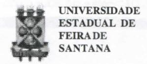
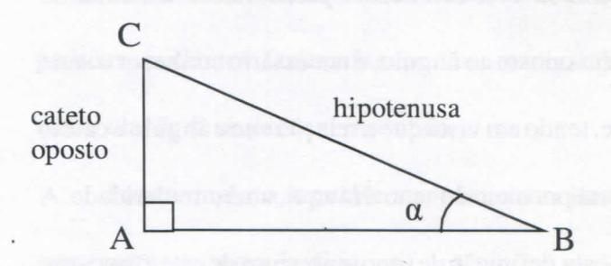

# FOLHETIM DE EDUCAÇÃO MATEMÁTICA

Folhetim Educ. Mat., Ano 11, n. 127, jul. / ago. 2005

ISSN 1415-8779

### **OBJETIVO**

Este Folhetim é um veículo de divulgação, circulação de idéias e de estímulo ao estudo e à curiosidade intelectual. Dirige-se a todos os interessados pelos aspectos pedagógicos, filosóficos e históricos da Matemática. Pretende construir uma ponte para unir os que estão próximos e os que estão distantes.

### **EDITORIAL**

Com a publicação desse número esperamos ter regularizado a periodicidade do Folhetim. Neste número, ainda a questão do significado e significante é abordada, agora com outros exemplos. Para aprofundar um pouco o tema, características de uma definição é discutida no texto. A leitura do número anterior do Folhetim juntamente comeste deve conduzir a uma reflexão crítica sobre a forma que os professores de Matemática conduzem o ensino dessa Ciência. Tal reflexão deverá conduzir a uma mudança na postura daqueles que ainda abordam o ensino de Matemática de forma "acrítica e formal", o que certamente leva a ocultação da beleza escondidas atrás dos símbolos.

## COMITÊ EDITORIAL

Carloman Carlos Borges (Doutor) Inácio de Sousa Fadigas (Mestre)

## PERGUNTE QUE O NEMOC RESPONDE

Alguns aspectos no Ensino da Matemática

por Carloman Carlos Borges

(Continuação)

Outro exemplo: nossos livros didáticos "definem" <u>seno</u> a partir da razão entre comprimentos de lados de um triângulo retângulo. Assim, dado o triângulo retângulo ABC

"define-se" $\sin \alpha = \frac{catetooposto}{hipotenusa}$ . Dada a "definição" mencionada, e como exercício, passa-se ao cálculo de trivialidades, como o seno dos ângulos de 30°, 45°, 60°, etc. Essa é uma boa oportunidade para o professor levantar algumas questões:

a) agora que vocês já sabem calcular o seno dos ângulos de 30°, 45°, 60°, 15°, etc., como calcular o seno do ângulo de $\sqrt{3}$ °?

Ele pode ser calculado sem a ajuda de uma calculadora?

- b) O "resultado" fornecido pela calculadora apresenta um valor "exato" ou ela fornece apenas um valor aproximado? Por quê?
- c) Nesse caso, como "trabalha" a calculadora?

  Ela, no cálculo em questão, "aplica" a "definição" de seno como razão entre o cateto oposto e a hipotenusa?

- d) Finalmente, transcrevemos o trecho abaixo, extraído do livro: O que é uma Definição, de Adonai S. Sant'Anna, série lógica matemática, Manole: "O fato é que uma definição de seno que dependa do valor do cateto oposto depende de um conhecimento prévio da medida de tal cateto. Porém, para conhecer a medida do cateto oposto ao ângulo, é necessário conhecer o seno dele, tendo em vista que a relação entre ângulo e cateto ocorre por meio do seno. Há aqui, uma circularidade. A suposta definição de seno em termos de cateto oposto e hipotenusa não é de fato uma definição. É como se o seno, supostamente definido como razão entre cateto oposto e hipotenusa, fosse um conceito não-eliminável, pois o

seno depende do cateto oposto, o qual depende do seno.

Pode-se dizer, com segurança, que o seno de α coincide com a razão entre cateto oposto e hipotenusa, no caso de α ser um ângulo agudo. Mas essa propriedade não pode ser empregada para efetivamente definir seno".

Um breve esclarecimento: em toda definição há uma equivalência entre um definiendum (o objeto ou termo a ser definido) e um definiens (fórmula definidora do definiendum). Uma característica básica da definição é a chamada condição da eliminalidade: a qualquer momento o definiendum pode ser substituido pelo definiens. Isso é bastante claro ao lembrarmos que há uma equivalência entre os dois termos. A "definição" de seno dada acima não preenche a condição básica da eliminalidade.

Cada vez mais acrítico e formal, o ensino da matemática torna-se tedioso e uma aula dessa disciplina é, para o aluno, uma boa oprtunidade para treinar longos bocejos...

A acriticidade apontada acima não se verifica apenas em aulas de matemática. Algumas "especialistas" - exemplificando - em Piaget seguem o mesmo caminho,

## NEMOC - NÚCLEO DE EDUCAÇÃO MATEMÁTICA OMAR CATUNDA

Folhetim Educ. Mat., Ano 11, n. 127, jul./ago. 2005 - Editores: Carloman e Inácio - Secretária: Josenildes Oliveira Venas Almeida - Digitação: Manoel Aquino dos Santos - Editoração: Evandro Vaz - Impressão: Imprensa Gráfica Universitária - Periodicidade: bimestral - Tiragem: 1.000 exemplares - Distribuição gratuita - Endereço: Av. Universitária, s/n - km 03 - BR 116 - Campus Universitário - Telefone: (75)3224-8115 - Fax: (75)3224-8086 - CEP: 44031-460 - Feira de Santana - Ba - BRASIL - E-mail: nemoc@uefs.br

apresentando-o dogmaticamente.

O ensino da matemática é uma oprtunidade única para o professor trabalhar importantes faculdades da mente humana. Caso já escrevemos diversas vezes, movimentos básicos desta, podem ser identificados, por exemplo, na resolução de problemas. É preciso não esquecer que a mente humana opera por intermédio de conceitos e, consequentemente, opera com classes de equivalência. O reconhecimento de padrões, regularidades; o reconhecimento da ordem e do estabelecimento de relações; o reconhecimento de semelhanças estruturais - base de uma idéia central do conhecimento humano, que é o isomorfismo, tudo isso deveria ser discutido em todas as aulas dessa disciplina. Mas, como discutí-las, se o seu ensino prende-se mais ao significante e quase atenção alguma é reservada ao significado do signo? Destacar o significado - como já vimos - é imprescindível à aprendizagem significativa. É o significado que cria relações e são estas que formam as estruturas. A discussão de tais termos nos parece pertimnente não apenas em aulas de matemática

Em seu belo livro _O Gene da Matemática_, Editora Record, o matemático Keith Devlin escreve: "É a interferência de padrões que causa nossos problemas.

Essa interferência é também a razão pela qual leva-se mais tempo para perceber que $2 \times 3 = 5$ é falso do que para perceber que $2 \times 3 = 7$ também é errado. A primeira equação é correta para a adição (2 + 3 = 5) e portanto o padrão "2 e 3 são 5" nos é familiar. Não existe um padrão familiar para a forma "2 e 3 são 7".

Ainda da mesma fonte: "Para poder usar apropriadamente os números não basta saber como manejar os símbolos de acordo com as regras. Você também tem que relacionar os símbolos e o modo como lida com eles com o seu senso numérico inato- relacioná-los às quantidades numéricas que os símbolos denotam. De outra forma, devido ao fato de nossa mente automaticamente ver padrões, podemos facilmente nos ver realizando uma manipulação de símbolos sem sentido.

Por exemplo, a seguinte soma incorreta ilustra um erro comum na soma das frações:

$$\frac{1}{2} + \frac{3}{5} = \frac{4}{7}$$

Uma pessoa que comete esse erro vê a operação como duas adições, primeiro somando os numeradores 1 + 3 = 4, e depois adicionando os denomonadores 2+5=7. Simbolicamente, isto é o mais lógico de se fazer. Ela é incorreta, porque não faz sentido em termos dos números que os símbolos representam. As manipulações

simbólicas que você tem que fazer para obter a resposta correta - aquelas que correspondem a adicionar os verdadeiros números fracionários representados pelos símbolos $\frac{1}{2}$ e $\frac{3}{5}$ são bastante complicadas. E, ainda mais, essas regras de manipulação de símbolos somente fazem sentido se você pensar nos números que os símbolos representam. Puramente como regras para manipular símbolos, elas não fazem absolutamente sentido".

Aprender matemática é uma tarefa difícil. O professor não deve ser "populista" e afirmar que a matemática é fácil, é igual às outras disciplinas por ele (o aluno) estudadas. Mas, onde reside a dificuldade da matemática? A resposta pode ser apresentada pela palavra abstração. Até onde vai meu entendimento, acredito na não existência de uma ciência, na qual essa capacidade humana seja tão sofisticada. Em primeiro lugar, tanto os objetos como os métodos empregados em matemática são todos abstratos. As tentativas na direção de concretizá-los por intermédio das "badaladas" oficinas ou dos denominados "laboratórios" podem funcionar - e, assim mesmo precariamente - em níveis bem elementares. A explicação para tal precariedade é simples: no material geralmente usado não estão embutidos aqueles princípios que desejamos atingir.

Se o objetivo é ensinar, por exemplo, os princípios de nossa numeração, não adianta pegar uma tesoura e um pedaço de cartolina e ... pronto: o problema foi concretizado e, assim, tornado acessível ao aluno. Agora, se mostrarmos como funciona um ábaco, aí, assim, a aprendizagem torna-se "concreta" e até mesmo agradável, pois, neste material estão embutidos os princípios da numeração.

## PRÓXIMO NÚMERO

Alguns aspectos no Ensino da Matemática. (Continuação)

# **NÚMEROS ATRASADOS**

Envie para cada folhetim um selo de postagem nacional de 1º porte. Dentro de no máximo quatro semanas, contadas a partir da data de recebimento do seu pedido, você estará recebendo os folhetins solicitados.

OBS.: É permitida a reprodução total ou parcial deste folhetim, desde que citada a fonte.
