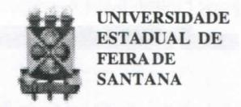

# FOLHETIM DE EDUCAÇÃO MATEMÁTICA

Folhetim Educ. Mat., Ano 12, n. 128, set. / out. 2005

ISSN 1415-8779

#### **OBJETIVO**

Este Folhetim é um veículo de divulgação, circulação de idéias e de estímulo ao estudo e à curiosidade intelectual. Dirige-se a todos os interessados pelos aspectos pedagógicos, filosóficos e históricos da Matemática. Pretende construir uma ponte para unir os que estão próximos e os que estão distantes.

#### **EDITORIAL**

Inicia-se comeste número o ano 12 do Folhetim de Educação Matemática do NEMOC. Ao longo dos anos, os mais diversos assuntos foram veiculados. Todo esse material está sendo compilado e em breve deverá ser disponibilizado em forma de livro. É um projeto antigo que agora está muito próximo de ser concretizado.

O presente número é a sequência do tema geral iniciado com o nº 122 sobre alguns aspectos do ensino da matemática. No presente, o raciocínio analítico e o raciocínio intuitivo são discutidos e exemplificados, com relação ao seus empregos no campo do ensino, tanto fundamental quanto médio.

# COMITÉ EDITORIAL

Carloman Carlos Borges (Doutor) Inácio de Sousa Fadigas (Mestre)

#### PERGUNTE QUE O NEMOC RESPONDE

Alguns aspectos no Ensino da Matemática

por Carloman Carlos Borges

(Continuação)

Sempre repetimos: o ensino da matemática é um lugar privilegiado ao pleno exercício de nossas faculdades intelectuais. Com isso queremos afirmar que tanto o raciocínio analítico (RA) como o raciocínio intuitivo (RI) encontram, aqui, o campo adequado ao seu desenvolvimento. Por RA entendemos aquele raciocínio estruturado em etapas sequenciadas e acessível às manifestações verbais. Tanto no ensino fundamental como no médio, podemos destacar diversos tópicos, nos quais o RA pode ser analisado, estudado, etc. Exemplos desses tópicos: progressões aritméticas e geométricas. Aqui, o aluno deve verificar que o raciocínio exemplificando - partindo do geral - a definição - e analisando sua aplicabilidade a diversos casos particulares, atinge às conhecidas fórmulas do termo geral. Essa é a fase inicial, chamada por alguns outros, como fase empírica, experimental. Trata-se da indução empírica. A última fase é a indução matemática, fase, intelectualmente mais formal que a anterior, pois emprega os recursos da lógica. Já no RI não se percebe o sequenciamento lógico de etapas percorridos pelo raciocínio. Ele parece ser o resultado do trabalho mais do inconsciente do que do consciente. Aqui, existe uma síntese perceptiva de uma situação bastante geral. O relacionamento entre lógica e intuição foi estudado com muita propriedade pelo célebre matemático francês Henri Poincaré em seu livro O Valor da Ciência, Contraponto Editora Limitada.

Vejamos o que esse eminente sábio escreve na obra citada: "A lógica inteiramente pura só nos levaria sempre a tautologias; não poderia criar coisas novas; não é dela sozinha que se pode originar qualquer ciência".

Alguém conhece alguma ciência inteiramente originadana Lógica?

Sugestão para reflexões: as geometrias não euclidianas se originaram apenas da Lógica? Claro. Ninguém deve negar a grande importância dela na criação dessas novas geometrias.

Prossegue Poincaré:

"Para fazer aritmética, assim, como para fazer geometria, ou para fazer qualquer ciência, é preciso algo mais que a lógica pura. Para designar essa outra coisa, não temos outra palavra senão a <u>intuição</u>. Mas quantas idéias diferentes se escondem sobessas mesmas palavras?

Comparemos esses quatro axiomas:

- 1°) Duas quantidades iguais a uma terceira, são iguais entre si.
- $2^{\circ}$ ) Se um teorema é verdadeiro para o número 1 e se demonstramos que ele é verdadeiro para n+1, contando que o seja para n, será verdadeiro para todos

os números inteiros.

- 3°) Se, numa reta, o ponto C está entre A e B e o ponto D entre A e C, o ponto D estará entre A e B.
- 4°) Por um ponto, só poderemos fazer passar uma paralela a uma reta dada.

Os quatro axiomas devem ser atribuidos à intuição. Contudo, o primeiro é o enunciado de uma das regras da lógica formal; o segundo é um verdadeiro juizo sintético a priori, é o fundamento da indução matemática rigorosa; o terceiro é um apelo à imaginação; o quarto é uma definição disfarçada."

Do ponto de vista apresentado acima não é aceito pelos formalistas, como o filósofo Bertrand Russell, o qual, quando se refere à intuição, sempre o faz com desprezo.

No ensino de matemática, alguns comentários sobre esse assunto podem ser proveitosos. Assim, o primeiro axioma: Duas quantidades iguais a uma terceira, são iguais entre si, pode ser à discussão do conceito da igualdade empregado em Matemática.

O exemplo abaixo costuma perturbar os alunos:

$$\int xdx = \frac{x^2}{2} + 3$$

$$A \qquad B$$

$$\int xdx = \frac{x^2}{2} + 7$$

$$A \qquad C$$

Aqui, temos B = A e C = A, donde B = C, isto é,

# NEMOC - NÚCLEO DE EDUCAÇÃO MATEMÁTICA OMAR CATUNDA

Folhetim Educ. Mat., Ano 12, n. 128, set./out. 2005 - Editores: Carloman e Inácio - Secretária: Josenildes Oliveira Venas Almeida - Digitação: Manoel Aquino dos Santos - Editoração: Evandro Vaz - Impressão: Imprensa Gráfica Universitária - Periodicidade: bimestral - Tiragem: 1.000 exemplares - Distribuição gratuita - Endereço: Av. Universitária, s/n - km 03 - BR 116 - Campus Universitário - Telefone: (75)3224-8115 - Fax: (75)3224-8086 - CEP: 44031-460 - Feira de Santana - Ba - BRASIL - E-mail: nemoc@uefs.br

$$\frac{x^2}{2} + 3 = \frac{x^2}{2} + 7$$
,  $\log x = 7$ .

A discussão deverá levar o aluno a melhorar seu entendimento entre o conceito de igualdade como identidade, com as suas três conhecidas propriedades e a igualdade por definição como é o caso logo acima e na qual as propriedades da identidade não devem ser aplicadas sem maiores cuidados.

O terceito axioma: Se, numa reta, o ponto C está entre A e B e o ponto D entre A e C, o ponto D estará entre A e B.

Pode-se colocar a questão: deve-se definir a palavra entre, como o fez Hilbert?

O quarto axioma: Por um ponto, só demos fazer passar uma paralela a uma reta dada.

Esse axioma leva à intermináveis discussões e, do ponto de vista epistemológico, marca a queda dos absolutos matemáticos.

Nas séries iniciais, ensino fundamental e médio, o RI deve prevalecer, enquanto a formalização é reservada para a graduação. É preciso ter cuidados com falsos mitos epistemológicos. Um deles muito apadrinhado até mesmo por professores: só gostamos daquilo que entendemos. O entendimento precede o gostar. Tudo, à maneira de Descartes: O pensmento precede o sentimento. Tal mito epistemológico sustenta boa parte do ensino formal. Tratase de um puro engano. O nosso viver dia a dia, mostra que se trata de um devaneio. A própria história da Ciência também comprova: gostamos de algo quando ele nos é útil, nos provoca agradáveis sentimentos. Apreciamos uma boa música clássica sem ao menos conhecer a escala musical. Os defensores implacáveis do rigor, nem eles

mesmos possuem uma definição rigorosa do rigor (basta lembrar a historicidade dessa categoria). O rigor do tempo de Euclides pode não ser o mesmo do rigor moderno. Uma idéia suficientemente clara dos símbolos empregados e das propriedades operatórias - segundo o grande matemático René Thom - basta à compreensão da validez ou não de um raciocínio matemático. Não é preciso recorrer - ainda segundo René Thom - a grandes construções axiomáticas, nem a refinadas maquinarias conceituais. Mais uma vez enfatizamos serem nossas ponderações pertinentes ao ensino da matemática. Para um jovem sem maiores veleidades matemáticas - não deixa de ser um exercício de paciência e tolerância com o seu professor - vê-lo, com seriedade escrever no quadro de giz a definição de "entre", isto é, para entender quando o ponto C está entre o ponto A e o ponto B, é preceder definir o conceito "entre".

As ponderações acima podem se estender ao ensino de outras disciplinas, com as devidas "acomodações". Assim, intermináveis aulas e seminários são construídos em torno de Paulo Freire, Piaget, Vigotsky, Wallon, etc. Como resultado os alunos terminam seus cursos sem saber ler e escrever. Penso que o estudo da História das Idéias deveria ser inserida em todos os cursos universitários, começando essa inserção até mesmo no curso médio. Pelo menos, certamente, alguns mitos seriam destronados, como aquele que afirma serem as descobertas científicas e as criações científicas feitas sem esforço e sem um grande trabalho consciente. Produto de um tipo de inspiração sobrenatural.

O professor deve levar o aluno a resolver verdadeiras situações problemáticas, perante as quais ele se sinta suficientemente motivado, pois, uma situação problemática

gera o conflito entre aquilo que foi dado e aquilo que se deve alcançar e isso pode servir de fonte do raciocínio criador.

Ante uma verdadeira situação problemática, a sua solução deve iniciar-se por aquele processo de raciocínio denominado de análise, isto é, o processo durante o qual fica bem claro o que é dado (o conhecido) e o que é desconhecido (o procurado). Deve fazer parte da solução do problema, a "amarração" do desconhecido ao conhecido. Para a equação do segundo grau:  $ax^2 + bx + c = 0$ . Qual o conhecido? Claramente  $a, b \in c$ , números conhecidos. Qual o desconhecido? Simplesmente a incógnita "x". Nesse caso, a "amarração" consiste na fórmula  $x = \frac{-b \pm \sqrt{b^2 - 4ac}}{2a}$ .

É preciso enfatizar: o que move o ser humano é a necessidade, isto é, a motivação para alcançar determinado objetivo. A situação problemática surge, então, quando o ser humano sente necessidade de alcançar determinado objetivo, porém, <u>não sabe</u> como alcançá-lo. A compreensão vai sendo construída no processo de resolução da problemática. Ela vem após a motivação, a necessidade, sempre foi assim. No início, o problema central do ser humano era a sua própria sobrevivência. A necessidade de reproduzir-se e sobreviver foi construindo seu entendimento, sua própria razão. Por que, agora, no ensino tem de ser tão diferente?

Ainda este mês, presenciei uma entrevista nessas "famosas" mesas redondas sobre a problemática educacional. Um adolescente entrevistado sobre determinada metodologia empregada pelo professor declarou, convicto, repetindo, aliás, o que o seu mestre já houvera dito em sala de aula: "É, a gente só gosta daquilo que entende". Pobre professor, impingindo a um adolescente justamente aquilo que entra em choque com o seu (do adolescente) desenrolar existencial, pois, ele, o adolescente, sem ser adulto, não sendo mais criança, procura construir seu entendimento do mundo que o cerca, gostando de coisas das quais pouco ou nada entende.

### **NOTÍCIAS**

VII Semana de Matemática (SEMAT) da UEFS que ocorrerá nos dias 28/11 a 02/12 é um evento que pretende possibilitar o debate e a divulgação de pesquisas em torno da ciência matemática e das diversas áreas afins, tais como Física, Engenharia de Computação, Análise de Sistemas entre outras do campo das ciências exatas, além de proporcionar uma interação com demais campos da área de educação e das licenciaturas.

É uma promoção do Dieretório Acadêmico de Matemática da UEFS.

# PRÓXIMO NÚMERO

Alguns aspectos no Ensino da Matemática. (Continuação)

# **NÚMEROS ATRASADOS**

Envie para cada folhetim um selo de postagem nacional de 1º porte. Dentro de no máximo quatro semanas, contadas a partir da data de recebimento do seu pedido, você estará recebendo os folhetins solicitados.

OBS.: É permitida a reprodução total ou parcial deste folhetim, desde que citada a fonte.