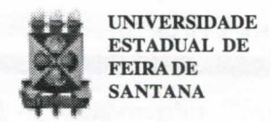
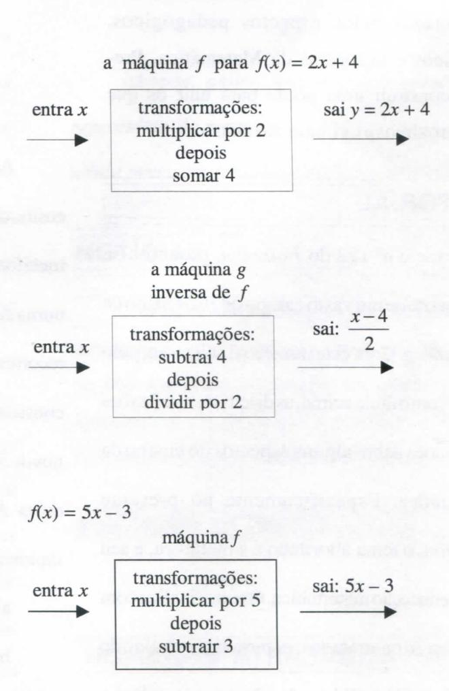
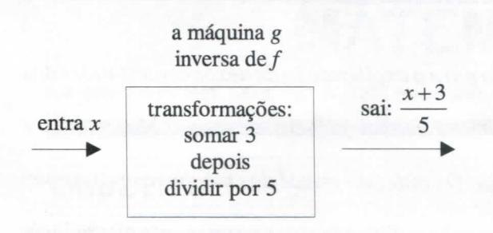
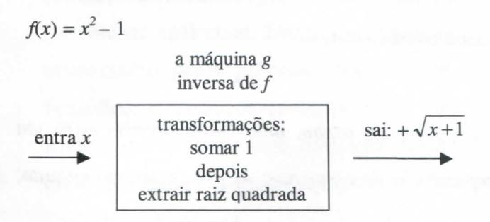

# **FOLHETIM DE EDUCAÇÃO MATEMÁTICA**

**Folhetim Educ. IVIot., Ano 12, n. 129, nov. / dez. 2005**

**ISSN 1415-8779**

### **OBJETIVO**

Este _Folhetim_ é um veículo de divulgação, circulação de **ideias** e de estímulo ao estudo e à curiosidade intelectual. Dirige-se a todos os interessados pelos aspectos pedagógicos, filosóficos e históricos da Matemática. Pretende construir uma ponte para unir os que estão próximos e os que estão distantes.

## **EDITORIAL**

Desde o n° 122 do _Folhetim,_ procurou-se cobrir parte de um vasto campo que é o ensino de matemática. Com este número finaliza-se, pelo menos com o titulo acima, as discussões, reflexões e sugestões sobre alguns aspectos do ensino da matemática. Especificamente no presente _Folhetim, o_ tema abordado é a metáfora, e seu uso na educação matemática. O texto finaliza com uma citação que tratado mesmo tema, extraído do livro MatemáticaeEducação: alegorias, tecnologias e temas afins, de Nilson José Machado.

# **COMITÊ EDITORIAL**

Carloman Carlos Borges (Doutor) Inácio de Sousa Fadigas (Mestre)

#### **PERGUNTE QUE O NEMOC RESPONDE**

_uns aspecios no &nsino da JlCaíemáíica_

_por Garíoman Garfos ÍBoryes_

_{Continuação)_

Agora desej amos falar um pouco sobre o uso da metáfora no ensino da matemática. O mini dicionário de Houaiss registra a palavra metáfora como "transferência de sentido de um termo para o outro, numa comparação impKcita". Em casos como esse, é sempre bom recorrer aos antigos. Para Aristóteles, precursor da lógica, ametáfora consiste em dar a uma coisa A, o nome de outra coisa, B. Lembremonos de Shakespeare: "a vidaé um palco iluminado" - Temos, aí, uma coisa A, a _vida_ sendo denominada por outra coisa B, _palco_ **í/Mminoíio.** Assim, são frases metafóricas:

- a) Para tuas mãos suaves como as uvas.
- b) A patada atómica (referência ao chute do jogador de futebol Rivelino).

O escritor argentino Borges faz uso de uma metáfora - para definí-la como "uma simpatia secreta entre conceitos". A metáfora é como se fosse uma ponte entre contextos diferentes e, aqui, vale a penalembrar: queé acriatividade senão um ligamento entre contextos diferentes? Um exemplo clássico de criatividade, não apenas pela sua extraordinária beleza - como pela sua importância **é** apresentado na fórmula de Euler: _e" + \ 0._ Ntimeros básicos da matemática: e, i , Ji , 1, O, antes dispersos, são agora, apresentados ligados entre **á.**

No ensino da matemática, a metáfora pode ser empregada como um poderoso instrumento pedagógico. Para fixar **ideias,** vejamos o importante conceito de função. A função **é** uma instrução que nos diz como um elemento JcdoconjuntoAsetransformaemoutroelemento \_y no conjunto B.

Metaforicamente, assimilemos o conceito de função ao conceito de máquina

sai _y =fix)_

função é uma máquina

entra _x_ • processo de transformação • a máquina / para _fíx) = x+ l_ entra _x_ • entra _a + 2_ processo de transformação _saiy = x+_ 1 • sai (a + 2) + 1 = _a + 3_

_A_ assimilação do conceito de máquina ao conceito de função, mostra, muito bem o caráter dinâmico de função como um tipo de transformação. Ademais, ao nosso ver facilita a assimilação de outro conceito: o de função inversa. Consideremos pois a função/e a sua inversa g.

#### **NEMOC - NÚCLEO DE EDUCAÇÃO MATEMÁTICA OMAR CATUNDA**

Folhetim Educ. Mat., Ano 12, n. 129, nov. / dez. 2005 - **Editores:** Carloman e Inácio - **Secretária:** Josenildes Oliveira Venas Almeida - **Digitação:** Manoel Aquino dos Santos - **Editoração:** Evandro Vaz - **Impressão:** Imprensa Gráfica Universitária - **Periodicidade:** bimestral - **Tiragem:** 1.000 exemplares - _Distribuição gratuita -_ **Endereço:** Av. Universitária, s/n - km 03 - BR 116 - Campus Universitário - **Telefone:** (75)3224-8115 - **Fax:** (75)3224-8086 - CEP: 44031-460 - Feira de Santana - Ba - BRASIL - **E-maU:** nemoc@uefs.br

As vantagens dessa apresentação não se limitam apenas à parte pedagógica, pois esta leva o aluno firmar melhor tanto o conceito de função como de função inversa. Além disso, aproxima a linguagem corrente da linguagem matemática, que é uma das pedras no ensino da matemática.

A técnica usual em nossas salas de aula para a obtenção da função inversa é substituir em y=f(x), y por x (e vice-versa), seguindo-se depois a explicitação. Para o aluno trata-se apenas de mais um artifício, não muito natural.

Transcrevemos - para finalizar - o trecho abaixo, extraído do livro Matemática e Educação - Nilson José Machado; Alegorias, tecnologias e temas afins - Cortez Editora. Convidamos nossos colegas, a uma reflexão baseada nas palavras transcritas.

# MATEMÁTICA E POESIA - Considerações mínimas sobre uma máxima

Os matemáticos limitam-se a repetir a frase de K. Weierstrass: "Nunca será um matemático completo aquele que não for um pouco poeta"; é mister compreendê-la.

Trata-se de conduzir o aforismo weierstrassiano para além da caricatura ou da metáfora, ainda que tais ultrapassagens possam, de início, parecer inverossímeis.

Suscetíveis às mesmas simplificações, o matemático -poeta, distante do mundo das coisas práticas, ou o poeta-matemático, de rigor e exatidão valerianas, fundem-se em imagens distorcidas em múltiplos espelhos.

Múltiplas são as características que afastam ou aproximam os dois temas. Já nas dimensões básicas da linguagem - denotação/conotação - a distinção poesia/matemática costuma, simploriamente, enraizar-se, negando-se a um dos temas a partilha de ambas as dimensões. A oralidade, que é a origem e a realização última - cinética ou potencial - em um dos temas inexiste, endógena, no outro. No terreno sintático-semântico, há a permanente impregnação entre o conteúdo e a forma em um deles, e o declarado intento de separação entre os momentos da técnica e da significação no outro. No semântico-pragmático, os pares monossemia/polissemia, literal/figurado, entre outros, sugerem distinções nítidas, talvez ilusórias. No que se refere à oposição núcleo/

_superfície, segundo Starobinski, o que balizaria a distinção poético-matemático seria a anuência ao centro, à raiz do real - depositário do máximo de regularidades - da linguagem matemática, enquanto a linguagem poética teria por domínio "a brilhante superfície do mundo ". Ocorre que, segundo o mesmo Starobinski, é nesta zona superficial que "as energias centrais se multiplicam e se ramificam no infinito das aparências". E os resquícios de nitidez matizam-se numa complementaridade essencial quando ouvimos Hofmannsthal: "A profundidade está escondida. Onde? Na superfície". Ou ainda, quando a radicalidade incisiva de Wittgenstein sugere que: "O que está oculto não nos interessa "._

_No que se refere às pontes, as mais notáveis situam-se no âmbito do par lógico/analógico. A medida que se reconhece no analógico não o alógico ou o protológico mas uma fecunda dimensão do pensar matemático, legitimada por resultados retumbantes/ promissores/sedutores, como a teoria das catástrofes, a geometria dos fractais, a "ordenação " do caos, ou indiscutíveis, como a álgebra homológica/teoria das categorias, os dois temas aproximam-se organicamente, mais e mais. Afinal, na sugestiva imagem de Octávio Paz, poemas nada mais são que "cristalizações do jogo universal da analogia"._

_Assim, o terreno analógico parece suficientemente_

_fecundo para a explicitação de nexos constituintes das imbricações mais significativas entre a Matemática e a poesia. O conteúdo visual das metáforas parece um conduto sob medida para uma permanente alternância entre o figurai e o figurado, como em um sistema de vasos comunicantes._

**\* \* \***

_Abre-se, assim, uma janela imensa para um repositório de respostas; as perguntas, no entanto, ainda precisam ser adequadamente formuladas._

### **NOTÍCIAS**

O livro "A Matemática para todos", que traz urna seleção organizada de temas tratados nos mais de 100 _Folhetins_ publicados encontra-se no prelo, aguardando a resposta da editora. Em breve desejamos divulgar o seu lançamento.

## **PRÓXIMO NÚMERO**

_Aguardem!_

## **NÚMEROS ATRASADOS**

Envie para cada folhetim um selo de postagem nacional de 1° porte. Dentro de no máximo quatro semanas, contadas a partir da data de recebimento do seu pedido, você estará recebendo os folhetins solicitados.

OBS.: É permitida a reprodução total ou parcial deste folhetim, desde que citada a fonte.
