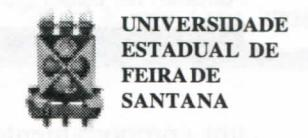

# FOLHETIM DE EDUCAÇÃO MATEMÁTICA

Folhetim Educ. Mat., Ano 12, n. 131, mar. / abr. 2006

ISSN 1415-8779

#### **OBJETIVO**

Este Folhetim é um veículo de divulgação, circulação de idéias e de estímulo ao estudo e à curiosidade intelectual. Dirige-se a todos os interessados pelos aspectos pedagógicos, filosóficos e históricos da Matemática. Pretende construir uma ponte para unir os que estão próximos e os que estão distantes.

#### **EDITORIAL**

O tema proposto por esse _Folhetim_ abre o caminho para uma gama de informações e descobertas atuais, interessantes e aplicáveis ao mundo do século XXI. Começa tentando definir de maneira simples e direta alguns conceitos muito em uso nas pesquisas científicas atuais como; ordem, caos, complexidade, sistemas dinâmicos.

A abordagem dos temas ou do tema, uma vez que estão muito relacionados, desperta o olhar para a Matemática que, apesar de longe das escolas, está bem próxima de nós, isto é, dos fatos, fenômenos e objetos que nos rodeiam. O artigo pretende pois fazer esta aproximação entre a "teoria" e "prática", com desdobramentos muito interessantes. Aguardem.

# COMITÊ EDITORIAL

Carloman Carlos Borges (Doutor) Inácio de Sousa Fadigas (Mestre)

#### PERGUNTE QUE O NEMOC RESPONDE

Sobre Alguns Tópicos Matemáticos
por Carloman Carlos Borges

#### Ordem, Complexidade e Caos

Na ciência moderna, os três conceitos acima são de uma importância cada vez maior. Nesta dissertação procuraremos nos aproximar deles fundamentados nos resultados de pesquisas apresentados pelos cientistas preocupados em esclarecê-los.

Qual a origem do nome "número complexo" para o número representado por z=a+ib, sendo a e b reais e i a unidade imaginária, isto é, $i=\sqrt{-1}$ ? Surge logo a nossa mente, quando se fala de complexo, idéias tais como dificuldade, complicado, etc. Ao compararmos o número z=a+ib com um número real qualquer, notamos que z se apresenta envolvido em mais relações do que o número real. O número z é mais geral do que o número real e isso lhe dar mais complexidade, quando é feita tal comparação. No número complexo z, em relação ao número real, existem maior número de componentes diferentes a interagir, daí, sua maior complexidade. A complexidade de um objeto, caracterizada pelo número de relações no qual ele está envolvido, sugere que ela seja definida como uma medida quantitativa ligada aos conceitos de caos e ordem.

A palavra _caos_ tem sido associada à desordem e até mesmo ao estado desordenado anterior à criação do universo. Modernamente, um novo significado lhe foi acrescentado: trata-se de

um comportamento aleatório exibido em sistemas dinâmicos determinísticos. Rapidamente, lembramos que uma variável aleatória é toda aquela dependente do acaso. Exemplificando: o número de ocorrências "coroa" num jogo de cara ou coroa é uma variável aleatória. Sistema dinâmico determinístico é um desses sistemas de equações diferenciais lineares estudados na cadeira de cálculo e estudados pelos nossos universitários. Eles vêm acompanhado pelas "condições iniciais" que servem para calcular o seu comportamento. É como se ele "congelasse" o passado, o presente e o futuro daquele objeto do qual está sendo um modelo. Por "caos determinístico" queremos significar a grande sensibilidade à pequenas variações nas "condições iniciais". Pareceapesar do clamor de muitos cientistas - que a incerteza é intrínseca a uma boa parte dos eventos. Assim, consideremos uma moeda. Quando jogamos "cara" ou "coroa", estatisticamente, a moeda cai com igual frequência, tanto de um lado, quanto de outro. Será que, se tivéssemos a possibilidade de, com ajuda de um potente computador calcular todas as etapas do movimento da moeda, poderíamos, com certeza, determinar antecipadamente de que lado ela vai cair? A resposta de Prigogine, Nobel de Química em 1977: "O cálculo é impossível, uma vez que a peça percorrerá

regiões de incerteza, de "bifurcações". Em sistemas desse tipo (sistema dinâmico instável), uma condição inicial que leve a um resultado 'coroa' pode ser tão próxima quanto se queira de uma condição que leve a um resultado 'cara'."

Que é <u>ordem</u>? Vamos nos aproximar desse conceito através de exemplos, vez que uma definição apropriada, abrangente de todas as ordens possíveis - foge ao objeto deste trabalho.

Comecemos pela mundovisão medieval. Trata-se de uma ordem atemporal, onde cada coisa possuia seu próprio lugar. Claro, isso faz lembrar Aristóteles quando ordenava o universo, desde a matéria terrestre até à abóboda celeste. Essa ordem, se sustentava nas idéias de eternidade e de perfeição.

Com Newton, o espaço e o tempo eram absolutos.

Para esse grande cientista, o espaço era o "sensório externo
de Deus", enquanto o tempo medido aqui, era o mesmo
daquele medido bem longe daqui.

Com Einstein esses conceitos caem por terra; daí, em diante, conforme se pode ler em David Bohne F. David Peat, Ciência, Ordem e Criatividade, Gradiva, "surgiram novas ordens, dependendo da idéia mais abstrata de simetrias, estados quânticos e níveis de energia". Ainda dos mesmos autores: "Sem dúvida, cientistas como Newton procuraram formular leis universais, pressupostas eternamente válidas,

# NEMOC - NÚCLEO DE EDUCAÇÃO MATEMÁTICA OMAR CATUNDA

Folhetim Educ. Mat., Ano 12, n. 131, mar. / abr. 2006 - Editores: Carloman e Inácio - Secretária: Josenildes Oliveira Venas Almeida - Digitação: Manoel Aquino dos Santos - Editoração: Evandro Vaz - Impressão: Imprensa Gráfica Universitária - Periodicidade: bimestral - Tiragem: 1.000 exemplares - Distribuição gratuita - Endereço: Av. Universitária, s/n - km 03 - BR 116 - Campus Universitário - Telefone: (75)3224-8115 - Fax: (75)3224-8086 - CEP: 44031-460 - Feira de Santana - Ba - BRASIL - E-mail: nemoc@uefs.br

fazendo portanto apelo a algo que se encontraria para lá do tempo. Contudo, veio a concluir-se que tais leis só se aguentavam dentro de certas condições restritas e não podiam, desse modo, ser eternas. Mesmo as teorias da relatividade e quântica, que sucederam à mundovisão newtoniana, acabaram já por ser postas em questão. Sem dúvida que o leitor já ouviu falar dos 'buracos negros', singularidades no tecido do espaço-tempo em que falham todas as leis da física conhecidas, incluindo a relatividade e a teoria quântica e em que as estruturas básicas, como as partículas elementres, deixam de existir".

Mas, quais são nossas primeira noções de ordem? Parece que elas dependem de nossa capacidade de identificar semelhanças e diferenças. O nosso próprio pensamento trabalha com conceitos. Mas, que é um conceito? Um conceito é uma classe de equivalência. Portanto boa parte de nossas atividfades mentais gira em torno de classe de equivalência - conceito bastante conhecido de nossos estudantes.

Mais adiante em outro _Folhetim_, procuraremos trabalhar o conceito de ordem, de maneira formal.

Agora, uma pequena variação em torno do que já foi escrito nas linhas acima.

Nas últimas décadas a ciência tem dado passos significativos. Naquelas áreas, de forte influência matemática, e com a ajuda dos computadores, a investigação científica atingiu resultados notáveis. Descobriu-se que a maioria dos sistemas dinâmicos não obedece a um comportamento regular e previsível-orientação bastante firmada na mecânica de Newton. Seu comportamento é de

alta comprexidade, jogando papel de relevo, as variáveis aleatórias. Palavras como desordenado, caótico, acaso e aleatório fazem parte das conversas dos cientistas de um modorotineiro. Assim, o paradigma newtoniano-laplaciano, criação da física, mostra-se cada vez mais limitado.

Com acomplexidade, ateoria dos modelos matemáticos assume novas formas, abrindo maiores possibilidades ao entendimento, como, exemplificando, a turbulência dos fluídos. Similarmente os modelos ecológicos, ligados a sobrevivência das espécies ganham novos significados.

Para aqueles preconceituosos com relação à Complexidade - principalmente naqueles fenômenos onde a causalidade determinística parece ter menor importância - não é demais recordar que as atividades essenciais dos seres humanos, como viver, sentir, pensar, criar, são efetuadas fora do controle deles. Parece que o desenvolvimento científico o da Biologia, agora no século XXI, possivelmente o seu século - indica a criação de um novo paradigma.

No que vem a seguir, estamos nos baseando na obra Os Sonhos da Razão, Heinz R. Pagels, Gradiva. Vamos nos aproximar, agora, da complexidade, empregando o instrumental matemático. O autor, falecido em julho de 1988, foi Diretor executivo da Academia de Ciêncas de Nova Yorque e professor na Universidade de Rockefeller. É, também, autor dos belos livros, O Código Cósmico e Simetria Perfeita, ambos publicados pela Gradiva.

Consideremos os números 0,10101010101010, 0,42857142 (expansões decimais no contínuo infinito dos números entre zero e um). Para o primeiro desses números pode-se construir o seguinte algorítimo: "Imprima 10 sete

vezes" e para o segundo, um algorítmo seria: "divida três por sete e imprima o resultado". Esses números, segundo Turing são ditos números "computáveis". Consideremos o número 0,185320942116 gerado por meio de lançamento de um dado de dez faces, com os algarismos 0 a 9 inscritos em cada face. Esse é um exemplo, segundo aquele eminente matemático, de um número "incomputável", pois o seu único algarismo conhecido consiste em escrever explicitamente o próprio número dentro do programa. Segundo PAGELS, "se acrescentássemos mais um milhão de algarismos ao número gerado pelo lançamento dos dados, o único programa que computaria esse número seria "Imprima 0,185320942116..." em que "..." representa um outro milhão de algarismos específicos. Teríamos, então, um aumento considerável do comprimento do programa!

Então, fundamentados nas idéias de Turing, podemos considerar o comprimento do programa que é necessário para computar os diferentes números como um meio para classificá-los. Para os números "computáveis" é possível escrever um programa relativamente curto, mesmo que eles tenhamum tamanho infinito. Paraos números aleatórios, "incomputáveis", o único algoritmo possível já contém explicitamente toda a informação do número - o algoritmo é tão comprido como o número. Como, então, definir um número aleatório? Em 1965 o matemático soviético A. N. Kolmogorov e Gregory J. Chaitin-este, ainda um estudante de licenciatura da Universidade de Nova York definiram os números aleatórios como aqueles que exigem programas computacionais tão compridos pelo menos, como o próprio

número.

Para caminharmos mais ainda na <u>definição</u> algorítmica de complexidade de um número - temos de introduziro conceito de <u>programa mínimo</u>. Segundo Pagels, qualquer número particular pode ser computado por um número infinito de algoritmos diferentes. Assim, o número 2397, citado por esse autor, pode ser obtido a partir dos programas: "subtrai 3 de 2400". "Soma 17 a 2380". "Multiplique 51 por 47", ou a partir de uma infinidade de outros programas.

### PRÓXIMO NÚMERO

Sobre Alguns Tópicos Matemáticos. (Continuação)

# **NÚMEROS ATRASADOS**

Envie para cada folhetim um selo de postagem nacional de 1º porte. Dentro de no máximo quatro semanas, contadas a partir da data de recebimento do seu pedido, você estará recebendo os folhetins solicitados.

OBS.: É permitida a reprodução total ou parcial deste folhetim, desde que citada a fonte.

#### **ERRATA**

No Folhetim 130:

pág. 1, Pergunte que o NEMOC Responde, 1ª coluna, onde se lê Alguns avaliações..., leia-se Algunas avaliações...

pág. 2, $2^a$ coluna, onde se lê ... se difinem ... , leia-se ... se definem ...
