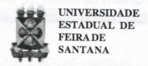

# **FOLHETIM DE EDUCAÇÃO MATEMÁTICA**

**Folhetim Educ. Mat., Ano 12, n. 132, moio / jun. 2006** 

**ISSN 1415-8779** 

#### **OBJETIVO**

Este *Folhetim é* um veículo de divulgação, circulação de ideias e de estímulo ao estudo e à curiosidade intelectual. Dirige-se a todos os interessados pelos aspectos pedagógicos, filosóficos e históricos da Matemática. Pretende construir uma ponte para unir os que estão próximos e os que estão distantes.

#### **EDITORIAL**

**o** texto ora apresentado ao leitor na coluna Pergunte que o NEMOC Responde é uma continuação do Folhetim anterior (n° 131) no qual se inicia a discussão de tópicos como Ordem, Complexidade e Caos. Palavras antigas, mas que apartir do final do século XX, assumem conotações distintas daquelas usadas na linguagem comum. Muitas vezes, o entendimento de tais conceitos não é uma tarefa fácil para os não-iniciados, principalmente se apresentados em textos técnicos e científicos. Seguindo a mesma linhajá iniciada em Folhetins anteriores, o presente texto visa a levar ao leitor, numa linguagem informal e intuitiva, porém objetiva, os conceitos acima citados. Desta vez é dado destaque ao conceito de Caos. Assunto palpitante, e ainda não consensual por parte da comunidade científica, o caos é abordado aqui de uma forma compreensiva, que permite ao leitor uma **ideia** bastante razoável destes temas tão atuais.

## **COMITÉ EDITORIAL**

Carloman Carlos Borges (Doutor) Inácio de Sousa Fadigas (Mestre)

# **PERGUNTE QUE O NEMOC RESPONDE**

*óoSre C/^íyuns ZJôpicos JKaíemáiicos* 

*por Garíoman Garfos D^or^es* 

*(Continuação)* 

O programa mínimo, é aquele que, uma vez codificado sob forma de inteiros, apresenta o menor tamanho possível. Podemos, agora, enfrentar a *definição algorítmica de complexidade de uni número -* como sendo simplesmente o comprimento do programa mínimo necessário para computar esse número. Assim, é possível atribuir uma medida quantitativa a cada número do contínuo, e esta é a definição algotitmica de complexidade. - .

Ainda segundo Pagels, a complexidade dos números aleatórios gerados por lançamentos dos dados é, aproximadamente igual ao comprimento do número. Isto porque o algoritmo mínimo tem forçosamente que conter o próximo número. Ao contrário, o comprimento do programa mínimo de números altamente ordenados, como 0,010101... ou 3/7 = 0,42857142... é bastante pequeno, o que faz com que a sua complexidade sej a baixa.

Podemos clarificar mais esses conceitos: o conhecimento da complexidade de um número pede, inicialmente, o comprimento do algoritmo mínimo necessário para o computar; em seguida temos de provar que esse algoritmo é mínimo. Ora, em matemática, provar

requer logo de partida uma axiomática. Aí, temos o problema da escolha dos axiomas. Como existirão números cujo conteúdo de informação seja superior ao de qualquer sistema de axiomas, a conclusão de Chaitin, já citado nas linhas acima, é óbvia: "Neste tipo de sistemas formais nãoépossível demonstrar que uma série particular de algarismos tem uma complexidade (algorítmica) maior que o número de bits do programa utilizado para especificar a série [...]. Assim, existirão sempre números cuja aleatoriedade não pode ser provada".

A Matemática, considerada como um sistema formal, com seus axiomas, teoremas, etc, não passa de uma enorme tautologia. Nas demonstrações, temos de explicitarinformaçõesjácontidas nos axiomas. Ademais, há sistemas matemáticos decidiveis, nos quais todas as afirmações podem ser provadas, porém o tempo empregado para decidir se uma dada proposição é verdadeira ou não, pode ser muito longo: demoraria muito mais tempo do que o tempo de vida do universo. Para maiores informações, repetimos, aconselhamos a leitura sempre agradável do Uvro: Os sonhos da razão (o computador e a emergência das ciências da complexidade). Editora Gradiva.

O que é exatamente o caos? Ele existe na reaUdade ou não passa de uma fantasia criada pelos seres humanos? Desde a década de 1960 ele vem sendo sistematicamente pesquisado e essas pesquisas apontam para a sua realidade. Podemos especular: a aceitação do caos, como um objeto científico, não seria a mesma coisa que aceitar ser o universo não inteligível? Para alguns pensadores, entre eles o eminente francês René Thom (1923-2002) atrás do chamado acaso, existe certamente causas determinísticas, porém, nós não a conhecemos ainda.

Imaginemos o caso da moeda. Quando jogamos cara ou coroa, estatisticamente, a moeda cai com igual frequência, tanto de um lado quanto de outro.

Suponhamos que, com a ajuda de um computador, seja possível mapear, e obviamente, calcular todas as etapas do movimento da moeda (sua velocidade no tempo *t,* seus ângulos de rotação, etc). Seria possível, de posse de todos esses dados, saber, antecipadamente, de que lado a moeda vai cair? Para Prigogine, Nobel de Química, esse cálculo é impossível, pois a moeda percorrerá regiões de incerteza, de

## **NEMOC - NÚCLEO DE EDUCAÇÃO MATEMÁTICA OMAR CATUNDA**

Folhetim Educ. Mat., Ano 12, n. 132, maio/jun. 2006 - **Editores:** Carloman e Inácio - **Secretária:** Josenildes Oliveira Venas Almeida - **Digitação:** Manoel Aquino dos Santos - **Editoração:** Evandro Vaz - **Impressão:** Imprensa Gráfica Universitária - **Periodicidade:** bimestral - **Tiragem:** 1.000 exemplares - *Distribuição gratuita -* **Endereço:**  Av. Universitária, s/n - km 03 - BR 116 - Campus Universitário - **Telefone:** (75)3224-8115 - **Fax:** (75)3224-8086 - CEP: 44031-460 - Feira de Santana - Ba - BRASIL - **E-mail:** nemoc@uefs.br

"bifurcações". Trata-se de um sistema dinâmico instável, no qual uma condição inicial que leve a um resultado "coroa" pode ser tão próximo quanto se queira de uma condição inicial que leve a umresultado "cara".

Para tomarmaisclarootextologoacima, lembremos os seguintes conceitos da Teoria dos Sistemas Dinâmicos:

a) consideremos o sistema, *x^+px+l=0,* regido pelo parâmetro *p.* A teoria de bifurcações estuda as variações qualitativas na evolução desse sistema quando*p*  varia. Assim, para *p* superior a 2, as soluções são dois niímeros reais e distintos. Quando *p=2,as* duas soluções coincidem e são iguais a -1 . Quando *p<2,as* soluções são complexas. Ocorreu uma bifurcação quando *p>2.* 

b) Em sua tese de doutorado, em 1892, Liapunov definiu estabilidade para uma solução de uma equação diferencial ordinária: uma solução é estável se outras soluções de valores de *x{t^)* para *t =* permanecem "próximas" de *x(i)* com o passar do tempo.

Existem diversas definições de caos, porém, nenhuma delas é aceita, por consenso pela comunidade científica. Talvez uma das características importante de um sistema dinâmico caótico F: D ^ D é ele apresentar dependência sensível às condições iniciais. Metaforicamente, é como o bater de asas de uma borboleta na China provocasse um furacão em Nova York. Outras características de F, como se a densidade em D de suas órbitas periódicas e a transitividade topológica, não são discutidas aqui.

Procuraremos sempre apresentar umaexposição mais informal e intuitiva, do que formal. Seremos mais informativos.

Todosjáouviramfalaremeletroencefalogramas (EEGs) (regtistros da atividade elétrica do cérebro em função do tempo) e em eletrocardiogramas (ECGs) (registros das atividades elétricas do coração). Modelos matemáticos sobre a dinâmica de tais atividades estão sendo cada vez mais estudados. Tais estudos vêm mostrando a presença do caos em EEGs e ECGs. E também, sua ausência pode significar a existência de cardiopatias. Fica claro, igualmente, que sua presença (do caos) pode ser indesejável.

Será que o determinismo está fora de moda, enquanto o acaso surge inesperadamente nas mais diversas situações? Claro que não, pois, parece-me que o determinismo clássico, com a existência do caos, tende a enriquecer-se, podendo existir ao lado dele.

O grande sábio francês Poincaré classificou a existência de dois grandes tipos de sistemas dinâmicos: "integráveis" e "não-integráveis". O significado destes últimos, segundo a teoria dos matemáticos Kolmogorov, Arnold e Moser, teoria K AM é o seguinte: nos sistemas não-integráveis há dois tipos de trajetórias, que são as periódicas (como nos sistemas dinâmicos habituais) e as aleatórias, nas quais duas trajetórias vizinhas se afastam exponencialmente com o tempo.

Recordemos as belas palavras do pensador francês Edgar Morin (vide: Do caos à inteUgência artificial. Editora UNESP): Com efeito, a ordem e a desordem, isoladas, são duas calamidades. Um Universo que fosse apenas ordem seria um Umverso onde não haveria nada de novo, sem criação. Já um Universo que fosse apenas desordem não chegaria a constituir uma organização, e seria inapto ao desenvolvimento e à inovação. Épor isso que precisamos conceber o Universo a partir daquilo que denominei o "tetragrama": ordem/desordem/interações/organização. Esse tetragrama não fornece a "chave" do Universo; ele permite compreender o seu jogo. Ele nos revela a sua complexidade. O objetivo do conhecimento não é descobrir o segredo do mundo numa palavra-chave. É dialogar com o mistério do mundo".

Não acredito, portanto, numa disjunção entre a visão determim'sticae a visão, por assim dizer, caótica - no entendimento deste grande mistério: o Universo. Essa é mais uma falsa dicotomia, talvez subproduto de outra visão mais geral que é a cartesiana, a qual não mais se sustenta, a não ser como simples exercício em aulas de filosofias, orientada por professores que ainda apregoam: ciência é ciência, e filosofia é filosofia.

Algumas pessoas acreditam, na sua exarcebada empolgação pelo caos, no fim do determinismo. Isso é uma grande toUce, pois sistemas deterministas são capazes de gerar o novo. Mais uma vez, se mostra que não se sustenta a anunciada disjunção de inspiração cartesiana.

Rcamos com as palavras de Edgar Morin (vide Uvro jácitadonestas Unhas):

"Popper já observava que a noção de simpUcidade é complexa! É preciso distinguir entre o mito deUrante da simpUcidade do universo e a admirável simpUcidade das teorias científicas que unificam em um mesmo princípio fenómenos extremamente diversos, como a lei da gravitação de Newton, que permite conceber ao mesmo tempo a queda das maçãs na Terra, a não queda da Lua sobre a Terra e o movimento cíclico das marés. A simpUcidade do Universo foi o mito da ciência clássica, buscando a Unidade elementar e a lei suprema do Uni verso. Essa busca foi extremamente fecunda, pois ocasionou a descoberta das moléculas, etc. Contudo ela desembocou precisamente sobre acomplexidade".

## **PRÓXIMO NÚMERO**

*Sobre Alguns Tópicos Matemáticos. (Continuação)* 

### **NÚMEROS ATRASADOS**

Envie para cada folhetim um selo de postagem nacional de 1° porte. Dentro de no máximo quatro semanas, contadas a partir da data de recebimento do seu pedido, você estará recebendo os folhetins soUcitados.

OBS.: É permitida a reprodução total ou parcial deste folhetim, desde que citada a fonte.