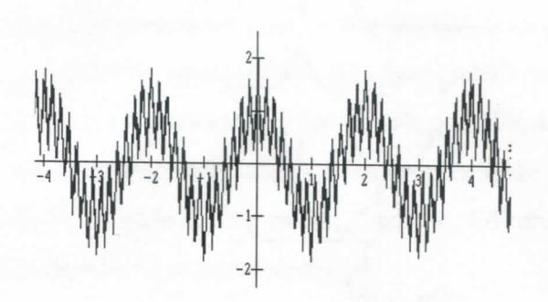
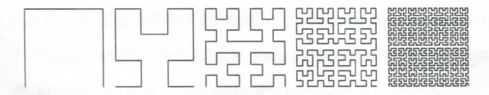
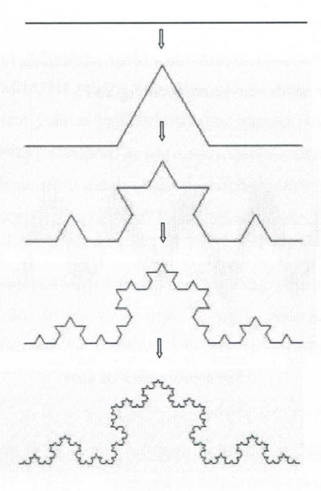
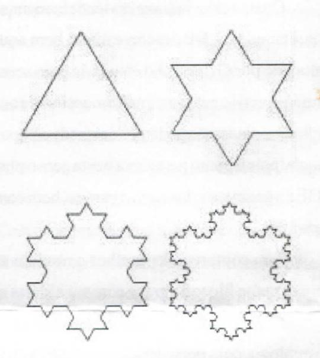

# FOLHETIM DE EDUCAÇÃO MATEMÁTICA

ISSN 1415-8779

Folhetim Educ. Mat., Ano 13, n. 134, set. / out. 2006

#### **OBJETIVO**

Este Folhetim é um veículo de divulgação, circulação de idéias e de estímulo ao estudo e à curiosidade intelectual. Dirige-se a todos os interessados pelos aspectos pedagógicos, filosóficos e históricos da Matemática. Pretende construir uma ponte para unir os que estão próximos e os que estão distantes.

#### **EDITORIAL**

Um interessante tema é abordado nesse Folhetim: trata-se dos fractais. A relação com os temas tratados anteriormente, a exemplo da teoria do caos, está registrada em diversos estudos. Porém, os fractais são investigados em um leque amplo de áreas: estuda-se fractais e sistemas dinâmicos, fractais e computação gráfica, fractais no ensino, fractais e medicina (imagens de tomografias), fractais na natureza (plantas, relevos, etc), fractais na geografia (florestas, imagens de satélites), fractais na economia, na análise de alimentos para animais. Também, de forma mais artística, aparecem relacionados à música e às artes.

É esse fascinante mundo dos fractais que a partir desse número será abordado.

# COMITÉ EDITORIAL

Carloman Carlos Borges (Doutor) Inácio de Sousa Fadigas (Mestre)

#### PERGUNTE QUE O NEMOC RESPONDE

Fractais

por Carloman Carlos Borges e Inácio de Sousa Fadigas

#### Introdução

Para alguns estudiosos, a compreensão de um determinado fenômeno, está ligada a sua geometrização, isto é, ao estudo que tenha por objeto caracterizá-lo como forma. Assim, eles concluem que compreender significa, antes de tudo, geometrizar. O trecho abaixo, atribuído a Galileu espelha muito bem essa tendência:

"A filosofia está escrita nesse enorme livro que temos aberto diante dos olhos, o Universo. Mas não se pode entendêlo antes de se aprender a entender a língua, de se conhecer os caracteres em que está escrito. Está escrito em linguagem matemática e seus caracteres são triângulos, círculos e outras figuras geométricas, sem as quais é impossível uma palavra sequer" (...). Esse trecho se encontra em Il Saggiotores (O ensaiador) escrito em 1623. Ainda no mesmo livro e citado por Ilden de Castro Moreira, em seu artigo os fractais (vide complexidade & caos, organização H. Moysés Nussenzveiz, 2ª edição, Editora UFRJ/COPEA), pode-se ler o seguinte trecho:

"Chamamos linhas regulares aquelas que (...) se podem definir e demonstrar delas seus acidentes e propriedades. Assim o espiral é regular e se define dizendo que nasce de dois movimentos uniformes, um reto e outro circular; assim, a elipse, que nasce de secção do cone e do cilindro. Porém, as linhas irregulares são aquelas que, não tendo determinação alguma são infinitas e (...) indefiníveis. Não se pode demonstrar delas

propriedade alguma, nem definitivamente saber nada sobre elas. Dizer-se: "tal acidente ocorre graças a uma linha irregular", é o mesmo que dizer: "Não sei por que ocorre". A introdução de tal linha não é melhor que a introdução das simpatias, antepatias, propriedades ocultas, influências e outros termos usados por alguns filósofos como máscara da verdadeira resposta que é "não sei"."

Os dois trechos nos levam a algumas reflexões. Uma delas: Ninguém pode fugir inteiramente ao espaçotempo de seu entorno. Outra: Eles pressupõem, antes de tudo, a aceitação de muita simplicidade da Natureza. Ela se organiza de modo simples, linear. Assim, atrás de qualquer fenômeno natural, existem leis matemáticas simples. E por falar em simplicidade como modelo para descrever os eventos físicos, nada mais adequado do que a Geometria Euclidiana com suas "verdades evidentes por si mesmas". Organizada como ciência no século III a.C. por Euclides, então pertencente à Escola de Alexandria, ela reinou, soberana, até o século XIX. quando surgiram as geometrias não euclidianas. E agora, com várias geometrias ao seu dispor, qual o critério de escolha para uma determinada descrição, que deve ser seguido pelo pesquisador? Para o grande matemático francês, Poincaré, verdadeiro universalista quanto ao saber matemático, o uso dessa ou daquela geometria na descrição do espaço-tempo, é pura questão de comodidade, de simplicidade ou "economia de pensamento" - para lembrar a conhecida frase do grande físico idealista Mach (Veja La Matemática: su contenido, métodos y significado, Alianza Editorial, volume 3). Ainda segundo os autores dessa bela obra (A. D. Alekansadrov, A. N. Kolmogorov, M. A. Laurentiev e outros sábios da antiga União Soviética) Poincaré"... assegurou que se abandonaria antes a lei da propagação retilínea da luz que a geometria euclidiana, já que esta é a mais simples". Ainda dos mesmos autores: "Poincaré morreu três anos antes desenvolvimento da relatividade e nela sucede precisamente o contrário: a geometria euclidiana é abandonada, conservando em troca a lei de propagação da luz, ainda que de forma generalizada: a luz se propaga segundo linhas geodésicas". Como surgimento das geometrias não euclidianas, surge a questão da revisão conceitual da geometria euclidiana (GE) quanto à expressões como "verdades absolutas e eternas", "coisas evidentes por simesmas". Enfim, o declínio dos absolutos matemáticos. Esse não é o nosso propósito por enquanto.

Voltemos a Galileu. Para ele a GE era insuperável na descrição dos fenômenos por ele estudados. A GE era a geometria das formas ideais, com suas linhas "certinhas" e suas figuras perfeitas. Basta lembrar a cicunferência, a figura perfeita, entre as mais perfeitas, cujo reinado durou até as descobertas das leis de Kepler. Nela, não há curvas P irregulares, apenas curvas suaves - hoje, diremos, curvas contínuas e deriváveis ao longo de toda a sua "suavidade". As demais, de tão estranhas, são até denominadas de

### NEMOC - NÚCLEO DE EDUCAÇÃO MATEMÁTICA OMAR CATUNDA

Folhetim Educ. Mat., Ano 13, n. 134, set./out. 2006 - Editores: Carloman e Inácio - Secretária: Josenildes Oliveira Venas Almeida - Digitação: Manoel Aquino dos Santos - Editoração: Evandro Vaz - Impressão: Imprensa Gráfica Universitária - Periodicidade: bimestral - Tiragem: 1.000 exemplares - Distribuição gratuita - Endereço: Av. Universitária, s/n - km 03 - BR 116 - Campus Universitário - Telefone: (75)3224-8115 - Fax: (75)3224-8086 - CEP: 44031-460 - Feira de Santana - Ba - BRASIL - E-mail: nemoc@uefs.br

"curvas patológicas", uma pequena exceção: Hoje em dia, as coisas mudaram. Até mesmo o conceito de "evidente" tão querido pela filosofia cartesiana, sofreu profunda influência com as novas descobertas matemáticas. No decorrer deste artigo, retornaremos a discutir, com maior profundidade, os conceitos mencionados.

Como a ciência é uma atividade humana socialmente condicionada, a GE descreve muito bem aquilo que foi estudado por Galileu. Ao estudá-la com seus pontos adimensionais e suas retas unidimensionais e seus planos bidimensionais, não podemos deixar de compará-la a uma magia: pois o ponto gera a reta e esta gera o plano. Enfim, a GE é a geometria das curvas suaves, bem comportadas, deriváveis.

Para compreender melhor o modelo euclidiano, pensemos na filosofia grega com suas idéias místicas da perfeição. Pensemos em Aristóteles, em sua fantástica cosmologia cuja persistência no arcabouço intelectual ocidental somente esgotou-se depois de mais de dois mil anos.

Quais os traços mais salientes dessa cosmologia? Vejamos: - cada coisa, cada objeto, cada ente possui o seu <u>lugar próprio</u>. Se qualquer coisa estiver fora de seu <u>lugar próprio</u>, a "potencialidade" que lhe é imanente, forçará a atingí-lo.

- a porção do Universo formada por coisas pertencentes ao entorno do Homem, era chamada de "mundo sublunar".
- há um motor divino que torna possível o movimento uniforme de todas as estrelas.
- No mundo supralunar feito de éter, uma substância divina que persistiu até a Relatividade de Einstein não existe a corrupção, atributo do mundo sublunar.

Ante tais premissas, a GE foi considerada como intrinseca à Natureza; daí, suas verdades evidentes por si

mesmas e suas verdades absolutas. Com o surgimento das geometrias não euclidianas fica evidente a existência de outros mundos não euclidianos e autoconsistentes.

O mito fundamentado numa suposta simplicidade da Natureza, criou a ilusão de que as curvas suaves regulares, deriváveis em todos os pontos ou com apenas alguns pontos sem derivadas, constituiam caso particular da grande maioria das curvas irregulares. Mais claramente, as curvas que não possuem tangente são a regra; as curvas que possuem tangente, são a exceção, casos particulares daquelas.

Assim, foi com algum espanto que a Acacemia de Berlim no ano de 1872 recebeu de Weierstrass a famosa curva definida pela função

$$f(x) = \cos \pi x + b \cos \pi (ax) + b^2 \cos \pi a^2 x + \dots$$

ou
$$f(x) = \sum_{k=0}^{\infty} b^k \cos(a^k px)$$

sendo $a$ impar, $b < 1$ , $ab > \frac{3\pi}{2} + 1$ .

Essa função é contínua, porém, não tem derivada em qualquer um de seus pontos (ver figura 1).

fig. 1 – "curva" de Weierstrass para os 12 primeiros termos da série

Outra curva admirável é a Curva de Peano (ver figura 2), cuja construção é a seguinte:

Dado um quadrado, dividamo-lo em quatro quadrados iguais; unamos seus centros por uma linha e imaginemos um

ponto que, em tempo finito, na unidade de tempo percorre a linha em movimento uniforme. Dividamos cada um desses quatro quadrados parciais em outros quatros e procedamos como anteriormente. Recorrentemente teremos áreas como limites de linhas que "enchemo plano", pois, em 1890, Peano demonstrou que o ponto descreve uma curva que pecorre todos os pontos do quadrado na unidade de tempo.

fig. 2 - Curva de Peano em suas primeiras etapas

Outros conjuntos admiráveis, porém, "irregulares", "patológicos", são os chamados conjuntos de Koch. Seu processo de formação pode ser sugerido pelas diversas figuras abaixo:

fig. 3 - Formação da curva de Koch em seus primeiros estágios

Essa curva, também conhecida por curva de Koch ou curva de floco de neve, pode servir de um modelo aproximadamente bruto de linha litorânea. Sua construção é simples: consiste em dividir em três partes iguais e substituir a parte central por dois lados de um triângulo equilátero (veja a figura 4 abaixo).

fig. 4 – Curva de Koch (floco de neve)

# PRÓXIMO NÚMERO

Sobre Fractais (continuação).

Aguardem!

# **NÚMEROS ATRASADOS**

Envie para cada folhetim um selo de postagem nacional de 1º porte. Dentro de no máximo quatro semanas, contadas a partir da data de recebimento do seu pedido, você receberá os folhetins solicitados.

OBS.: É permitida a reprodução total ou parcial deste folhetim, desde que citada a fonte.
