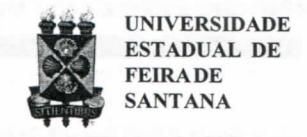
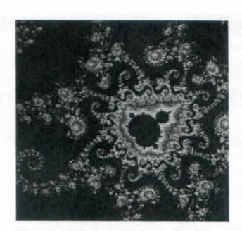
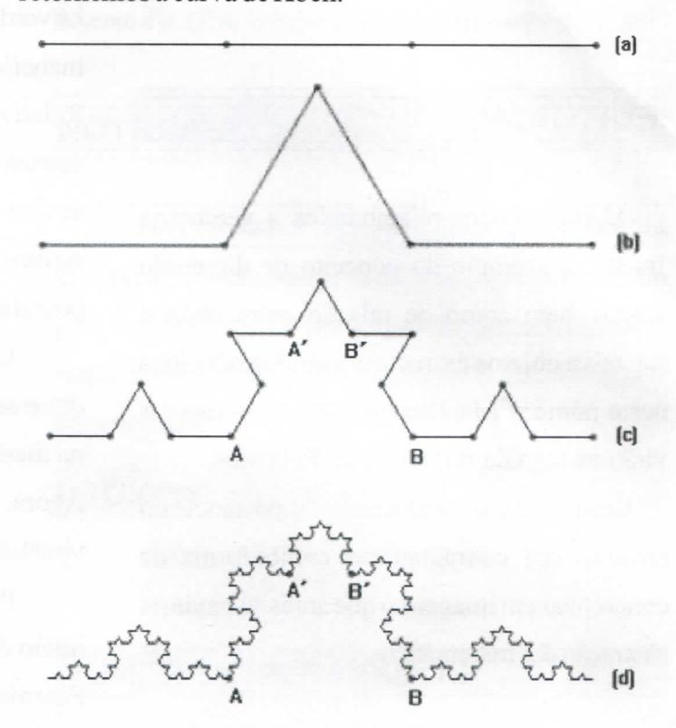
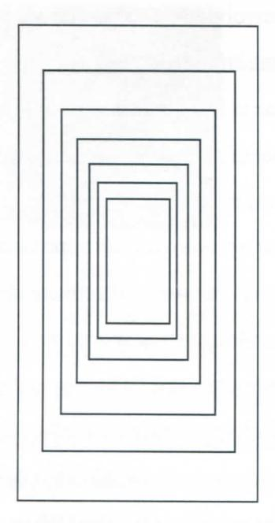

# FOLHETIM DE EDUCAÇÃO MATEMÁTICA

Folhetim Educ. Mat., Ano 13, n. 135, nov. / dez. 2006

ISSN 1415-8779

#### **OBJETIVO**

Este Folhetim é um veículo de divulgação, circulação de idéias e de estímulo ao estudo e à curiosidade intelectual. Dirige-se a todos os interessados pelos aspectos pedagógicos, filosóficos e históricos da Matemática. Pretende construir uma ponte para unir os que estão próximos e os que estão distantes.

### **EDITORIAL**

Alguns tópicos relacionados a geometria fractal, a exemplo do conceito de dimensão fractal, bem como de relação entre objetos fractais a objetos da natureza são introduzidos neste número. Mais detalhes sobre tais tópicos virão em seguida, nos próximos Folhetins.

Neste número, é mostrada a importância do advento dos computadores como forma de concretizar em imagens o que antes só havia na abstração dos matemáticos.

# COMITÊ EDITORIAL

Carloman Carlos Borges (Doutor)
Inácio de Sousa Fadigas (Mestre)
Trazíbulo Henrique Pardo Casas (Doutor)

## PERGUNTE QUE O NEMOC RESPONDE

Fractais

por Carloman Carlos Borges e Inácio de Sousa Fadigas

Descrições. Definições. Depois de mais de 2000 anos, com o surgimento das Geometrias Não Euclidianas, no século XIX, a humanidade foi tomando conhecimento de coisas, hoje óbvias: não há verdades absolutas, a GE não é intrínseca à natureza, há outras maneiras mais adequadas para o seu conhecimento. O emprego, na Relatividade, da Geometria de Riemann, ilustra muito bem o que escrevemos. Antes dela, surgida no ano de 1854, era inconcebível aceitar sua idéia fundamental: a propriedade de ser ilimitado o espaço não implica que ele, o espaço, seja infinito e daí, a postulação de retas paralelas com pontos comuns.

Com o advento do computador, a matemática adquire uma dimensão experimental. Antes dele, as estruturas que existem apenas na mente do matemático, eram inacessível ao não matemático. Agora, com a ajuda desse poderoso instrumento, podemos visualizá-las.

Podemos situar o início dos sistemas complexos dinâmicos no início da década de 1920, com os matemáticos franceses Pierre Faton e Gaston Julia, porém tivemos que esperar pelas décadas de 1970 e 1980 para a visualização, por intermédio dos gráficos feitos em computador, das estruturas trabalhadas mentalmente por aqueles citados matemáticos franceses.

Veja a fotografia abaixo de uma imagem computadorizada de um objeto, designado por conjunto de Mandelbrot, nome de seu autor. Esse conjunto é um exemplo de classe de objetos conhecidos por <u>fractais</u>. (Veja: Matemática - A ciência dos Padrões - Keith Devlin, Porto Editora).

Da observação dessa foto, salta a vista, imediatamente, a abundância de curvas irregulares, contínuas, porém, sem tangente em qualquer um de seus pontos. Galileu, ressuscitado hoje, ficaria estarrecido na presença delas. Mais ainda: seu espanto seria imensurável ao saber que seu estudo sistemático pertence a uma nova ciência, a Geometria Fractal, criação do matemático norte-americano Benoêt Mandelbrot. Observem como tais curvas apresentam ramificações (rugosidades) em qualquer escala de comprimento. Essas propriedades servem para caracterizar uma classe de objetos denominados de fractais. Porém, para aprofundarmos mais o assunto, temos que recorrer a outros conceitos.

Todos estamos acostumados, desde crianças, a ouvir a palavra dimensão nas mais diversas situações: a dimensão desta sala, a dimensão de um campo de futebol e assim, por diante...

Uma primeira idéia de dimensão dizo seguinte: um contínuo tem n dimensões quando podemos dividí-lo por

meio de cortes também contínuos de (_n_ - 1) dimensões. Assim, aceitamos que o ponto tem dimensão zero (essa é uma convenção compatível com a existência dos números irracionais), a reta, dimensão 1, o plano, dimensão 2, o espaço, dimensão 3, o espaço - tempo, dimensão 4; chegamos até aos espaços de dimensões infinitas, estudados na Álgebra Linear e de grandes aplicações na Mecânica Quântica. A esse tipo de dimensão, dar-se o nome de <u>dimensão</u> topológica.

Para caracterizar um fractal, é preciso recorrer a outros tipos de dimensão. Fixemos na seguinte: que chamaremos de dimensão fractal, $D_f$ . Como ilustração, retornemos a curva de Koch.

## NEMOC - NÚCLEO DE EDUCAÇÃO MATEMÁTICA OMAR CATUNDA

Folhetim Educ. Mat., Ano 13, n. 135, nov./dez. 2006 - Editores: Carloman e Inácio - Secretária: Josenildes Oliveira Venas Almeida - Digitação: Manoel Aquino dos Santos - Editoração: Evandro Vaz - Impressão: Imprensa Gráfica Universitária - Periodicidade: bimestral - Tiragem: 1.000 exemplares - Distribuição gratuita - Endereço: Av. Universitária, s/n - km 03 - BR 116 - Campus Universitário - Telefone: (75)3224-8115 - Fax: (75)3224-8086 - CEP: 44031-460 - Feira de Santana - Ba - BRASIL - E-mail: nemoc@uefs.br

Em (a) o segmento AB, unitário, é dividido em (r=3) três segmentos equivalentes. O segmento do meio é transformado em dois outros (b) donde surgem N(=quatro) novos segmentos. Novamente, cada um dos quatros segmentos é dividido em três, obtendo-se (c). Quando esse processo se repete indefinidamente, obtémse um objeto que é chamado de fractal. Pelo exposto, é fácil calcular a dimensão da curva de Koch:

$D_f = ln N/ln r = ln4/ln3 = 1,2618...$ , que é um número irracional.

Um outro exemplo: o tão falado Conjunto de Cantor. Sua construção parte, também, de um segmento de reta que é seccionado em outros três segmentos iguais. Então, retiramos o pedaço intermediário, sobrando dois segmentos iguais os quais são igualmente repartidos em três novos segmentos iguais. Então, retiramos os segmentos intermediários e o processo já descrito anteriormente, prossegue indefinidamente. Após infinitas operações realizadas, temos o conjunto de pontos que restaram - que é o Conjunto de Cantor. Vejam as figuras abaixo:

Analogamente com o processo da construção do Conjunto de Koch, é fácil calcular a dimensão fractal do de Cantor: $D_f = ln2/ln3 = 0,6$ . É interessante observar que

esses dois processos de construção, tanto o Conjunto de Koch como o Conjunto de Cantor, são processos limites e, assim, estão envolvidos em duas infinidades: uma infinidade potencial e uma infinidade atual, acabada - que é um conceito nuclear na teoria dos conjuntos, criada por Cantor - e que mereceu tantas críticas de ilustres matemáticos no decorrer da história da matemática.

Outra observação para nós importante: com a dimensão fractal, que geralmente resulta em um número não inteiro, estamos tentando quantificar uma qualidade característica dos conjuntos fractais, que é a sua rugosidade, irregularidade, no sentido já apontado neste trabalho. Ora, todas as vezes que quantificamos uma qualidade (veja, de passagem, quando quantificamos a qualidade calor) não podemos deixar de recordar o sonho pitagórico de que tudo é número... E mais uma vez a precisão se transforma em aproximação, embora uma aproximação tão "próxima da certeza" quanto se queira. Portanto, aidéia básica e característica de um fractal é que ele estar envolvido com um processo limite, surgido de outros processo representado pelas iterações infinitas. A autosimilaridade, isto é, a invariância do sistema sob transformações de escala, é outra característica do objeto fractal. Aqui, convém ressaltar o seguinte: para exemplificar basta considerar os colóides, isto é, substâncias divididas em partículas infinitesimais - como a névoa, a nuvem, a gelatina, a fumaça, etc. Se, de uma nuvem - que consideramos como a totalidade - tirarmos um pedaço, por mais infinitesimal que seja, esse pedaço continua sendo uma nuvem. Assim, o todo persiste em qualquer uma de suas partes. Isso pode ser explicado por uma das características do objeto fractal, qual seja, a sua auto - similaridade (invariância de escala). Veja a figura abaixo

Assim, qualquer ampliação de um trecho da curva de Koch, mostrará uma curva de Koch. Algumas pessoas mais desavisada poderão dizer que as curvas mencionadas, como a Curva de Koch, a de Weierstrass e outras mais referidas anteriormente, são curvas artificiais e daí, a pergunta inevitável: e a Natureza apresenta algo similar a tal artificialismo? A resposta é afirmativa, a qual mostra a importância da Geometria Fractal. A analogia entre o movimento brownianode uma partícula (isto é, a agitação de qualquer pequena partícula em suspenso num fluido - um acontecimento natural) e a curva de Weierstrass (uma criação artificial de um matemático), já foi ressaltada por Jean Perrin e isso é até lembrado por Benoêt Mandelbrot, em seu belo livro: Objetos Fractais, Ciência Aberta, Gradiva. Nesse livro, o autor escreve:

"Em suma, este livro trata, em primeiro lugar, de objetos bastante familiares, mas demasiado irregulares para caírem na alçada da Geometria Clássica: Terra, lua, céu, atmosfera e oceano.

Em segundo lugar, consideramos brevemente diversos objetos que, apesar de não serem muito familiares, ajudam a esclarecer a estrutura daqueles que o são. Por exemplo: a distribuição dos erros em certas linhas telefônicas demonstrou ser um excelente utensílio de transição. Outro exemplo: a articulação demoléculas orgânicas nos sabões (sólidos, não desfeito em bolhas). Os físicos descobriram que a dita articulação é governada por um expoente de semelhança. E verifica-se que esse expoente é uma dimensão fractal. Se este último exemplo se generalizasse, o domínio de aplicação das questões alcançaria a teoria dos fenômenos críticos, um campo particularmente ativo hoje em dia. (P.S. Esta previsão cumpriu-se totalmente)".

## NOTÍCIAS

No Folhetim nº 129, anunciamos a publicação do Livro A Matemática para Todos, de autoria do prof. Dr. Carloman Carlos Borges - É com satisfação que anunciamos já estar pronto o volume 1. Em breve mais informações.

## PRÓXIMO NÚMERO

Sobre Fractais (continuação).

Aguardem!

## **NÚMEROS ATRASADOS**

Envie para cada folhetim um selo de postagem nacional de 1º porte. Dentro de no máximo quatro semanas, contadas a partir da data de recebimento do seu pedido, você receberá os folhetins solicitados.

OBS.: É permitida a reprodução total ou parcial deste folhetim, desde que citada a fonte.
