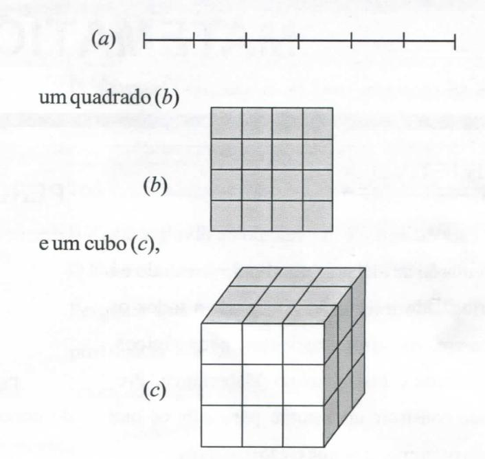
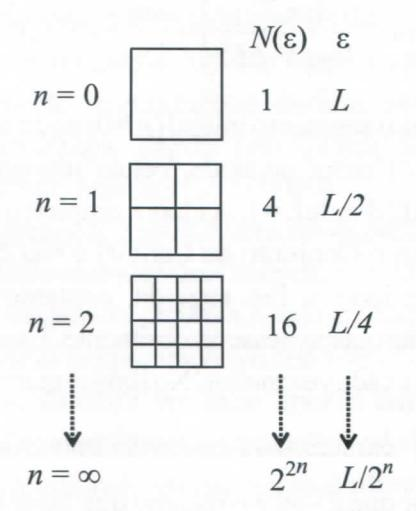

# **FOLHETIM DE EDUCAÇÃO MATEMÁTICA**

**Folhetim Educ. Mat., Ano 13, n. 136, jan. / fev. 2007**

**ISSN 1415-877**

# **OBJETIVO**

Este _Folhetim_ é um veículo de divulgação, circulação de **ideias** e de estímulo ao estudo e **à** curiosidade intelectual. Dirige-se a todos os interessados pelos aspectos pedagógicos, filosóficos e históricos da Matemática. Pretende construir uma ponte para unir os que estão próximos e os que estão distantes.

# **EDITORIAL**

Uma das características que difere a Geometria Fractal da Geometria Euclidiana é a possibilidade dos objetos fi-actais possuírem dimensões não inteiras. É esse o tópico principal abordado no presente _Folhetim._ Através de exemplos claros, é apresentado, com detalhes e figuras ilustrativas, como calcular a dimensão fractal de certos objetos. A partir da leitura, percebe-se que o conceito de dimensão, quando aplicado a objetos fi-actais, leva em conta outras características, como aspereza, espessura, textura, etc.

# **COMITÊ EDITORIAL**

Carloman Carlos Borges (Doutor) Inácio de Sousa Fadigas (Mestre) Trazíbulo Henrique Pardo Casas (Doutor)

## **PERGUNTE QUE O NEMOC RESPONDE**

_bradai_

_por Caríoman Garfos Xoryes e SJnácio ffe óousa !7at/iya_

Dimensão. Vamos, agora, nos aproximarmos mais um pouc do conceito de dimensão. Da nossa experiência do dia a di; sabemos que um objeto de estudo se toma complexo quanto mai for o número de suas dimensões. Tudo indica que a complexidad de um obj eto está ligada ao número de suas dimensões. Um exempl simples: o estudo dos números reais (objetos unidimensionais) mais simples do que o estudo dos números complexos(objetc bidimensionais). Imagine, agora, o ser humano, em todas as sua dimensões... A percepção que possuímos do mundo foi sempi enriquecida com o aumento do número de dimensões dos objetos d nosso entorno. Falávamos, até recentemente, na imersão do st humano num universo tri-dimensional; arelatividadegeral, acrescento mais uma dimensão, o _tempo_ e, assim, o espaço-tempo faz part» agora de nossas percepções. Hámais de dois milenos, a Geometri Euclidiana, postulava a existência de três dimensões para o Univers( dando-lhe os atributos de comprimento, largura e altura. Iss concordava com o senso comum e, assim, persistiu até o século X> No final de contas era fácil visualizar o universo tridimensional (trí eixos perpendiculares entre si), enquanto não podemos colocar enti esses três eixos perpendiculares entre si, um quarto eixo que sej perpendicular aos outros três. A existência de uma quarta dimensã aparecia com alguma íreqúência, na ficção.

Com a invenção da Geometria Analítica, Descartes conceituo o espaço de maneira diferente da conceituação grega. Como j vimos, Euclides, ao atribuir qualidades às dimensões (comprimentí largura e altura) firmou-semais àuma conceituação qualitativa dess conceito, enquanto Descartes, ao algebrizaros conceitos geométricc descrevendo os pontos (objetos geométricos) por coordenada (números) abre a possibilidade de uma conceituação quantitativa < daí, por via de consequência, amplia o conceito de dimensão

espaço. O próprio Aristóteles evita falar de espaço, quando afirma que todas as coisas possuem um <u>lugar</u>. A independência do conceito de espaço de qualquer conteúdo está na Geometria Analítica, invenção de Descartes e Fermat. Apesar da idéia de um espaço infinito-dimensional, jáestá implícita nadefinição cartesiana de dimensão como coordenadas, os matemáticos ainda hesitam na aceitação até mesmo de uma quarta dimensão. Parece que era muito difícil para eles aceitar a existência de algo que não poderia ser visualizado...

Em 1854, o matemático alemão Bernard Riemann anunciou a ampliaçãio tanto da Geometria Euclidiana, quanto da Geometria Analítica - criando a conhecida geometria diferencial de Riemann. Ele aderiu à definição cartesiana de dimensão e, além disso, deu um grande salto ao postular a existência de uma quarta dimensão. Mais ainda: estava assentada a possibilidade de espaços de dimensões de zero ao infinito. Agora, a parte sensorial (comprimento, largura e altura) da dimensão euclidiana estava sepultada, dando prevalência aos espaços conceituais de dimensões zero-infinito.

A dimensão fractal. Agora, o conceito de dimensão é novamente enriquecido. O matemático Hausdorff, na segunda década do século XX fala em dimensões não inteiras, descritas por frações como 1/4, 1/6, etc. Alguns autores se limitam em falar apenas em dimensões fracionárias, quando, na Geometria Fractal são freqüentes números irracionais na caracterização dimensional dos objetos.

Cabe a Benoit Mandelbrot criador da Geometria Fractal, a consolidação conceitual de dimensões não inteiras, tanto fracionárias como representadas por números irracionais.

Consideremos um segmento de reta (a)

de dimensões respectivamente, iguais a 1, 2 e 3.

As figuras logo acima ilustram que (a) está dividido em 6 (seis) peças (b) em 16 (dezesseis) peças e (c) em 27 (vinte e sete) peças cúbicas (cada aresta foi dividida em 3 (três) peças. Temos, resumidamente que o número de peças nos três casos é igual, respectivamente:

- a) ao fator de aumento $(6^1)$ ;
- b) ao quadrado do fator de aumento (42);
- c) ao cubo do fator de aumento $(3^3)$ .

Generalizando, o número n de peças é dado por $n = m^D$ , onde m é o fator de aumento e D a dimensão do objeto em questão. É interessante observar, nesse exemplo, a importância da auto-similaridade (cada peça é similar ao objeto do qual ela faz parte).

Como vimos, a partir de Descartes, o conceito de dimensão começa a libertar-se de atributos, tais como comprimento, largura e altura (lembre-se da Geometria Euclidiana e como você estudou este assunto no ensino fundamental/médio). Com Riemann já se pode falar em

### NEMOC - NÚCLEO DE EDUCAÇÃO MATEMÁTICA OMAR CATUNDA

Folhetim Educ. Mat., Ano 13, n. 136, jan. / fev. 2007 - Editores: Carloman, Inácio e Trazíbulo - Digitação: Josenildes Oliveira Venas Almeida e Manoel Aquino dos Santos - Editoração: Evandro Vaz - Impressão: Imprensa Gráfica Universitária - Periodicidade: bimestral - Tiragem: 1.000 exemplares - Distribuição gratuita - Endereço: Av. Universitária, s/n - km 03 - BR 116 - Campus Universitário - Telefone: (75)3224-8115 - Fax: (75)3224-8086 - CEP: 44031-460 - Feira de Santana - Ba - BRASIL - E-mail: nemoc@uefs.br

dimensão zero, dimensão infinita; com Mandelbrot surgeo conceito de dimensão não inteira, isto é, fracionária e até mesmo dimensão representada por números irracionais. Na fórmula _n =_ w^, veja o aparecimento, agora da dimensão como um expoente. Nós estamos acostumados a falar: em uma linha, basta um único número para caracterizar um ponto, dois para uma superfície, três para um volume, quatro para o espaço - tempo e, assim, sucessivamente. Na Geometria Fractal, quando a caracterização de um ser geométrico é feita pelo número mínimo de "células" ou "hiper-cubos" necessários paraa sua "cobertura", o cálculo dele mostra a dimensão como um expoente conformemostramos nas linhas acima.

A fórmula _n = nP,_ geralmente aparace nos livros de

forma equivalente
$$D = \lim_{\epsilon \to 0} \frac{\log N(\epsilon)}{\log (1/\epsilon)}$$
ealguns autores

a chamam a dimensão de Hausdorff - Besicovitch ou dimensão fractal. Ela se aplica para um conjunto depontos _A_ num espaço de dimensão*p.* Esses pontos são recobertos porhiper-cubos ou "caixas" de lado £ .Para tomar mais concreta essa **ideia,** retomemos ao Conjunto de Cantor.

Toma-se um segmento de comprimento unitário. Divide-se esse segmento em três partes iguais e suprimese a parte central. Faz-se a iteração da mesma operação: divide-se por frês cada um dos dois segmentos restantes e suprimimos a parte cenfral. O processo iterativo pode ser repetido indefinidamente e termina na constmção de um conjunto infinito não enumerável de pontos desconexos. Claramente, nesse caso, não é possível a descrição do assim chamado Conjunto de Cantor em termos de comprimento. Mesmo ante tal impossibilidade, épossível caracterizar o Conjunto de Cantor por meio de uma dimensão. Vej a a ilustração desse fenómeno.

$$n = 0$$

$$n = 0$$

$$1 \quad L$$

$$n = 1$$

$$n = 2$$

$$1 \quad L/3$$

$$n = 2$$

$$1 \quad L/3$$

$$1 \quad L/2$$

$$1 \quad L/3$$

$$1 \quad L/3$$

Repetindo: _N{E) é o_ número mínimo de "hiper-cubos" ("caixas") de lado **8** necessário para a cobertura de pontosyl. Empregando a fórmula \_ ©

$$D = \lim_{\varepsilon \to 0} \frac{\log N(\varepsilon)}{\log(1/\varepsilon)}$$

tem-se:
$$D = \lim_{\epsilon \to 0} \left[ \frac{\log 2^n}{\log(3^n / L)} \right] = \frac{\log 2}{\log 3} \cong 0,63$$

Notar que o segmento inicial (« = 0) pode ser coberto por "hiper-cubo" ("caixa" ou, ainda, "célula") de comprimento unitário igual _aL,_ dondeZ = 1. A **ideia** é simples: o objeto em estudo (no caso o Conjunto de Cantor) é recoberto com "caixinhas" de lado **8.** Em seguida, contamos quantas "caixinhas" foram gastas nesse recobrimento. Essa operação é repetida para s cada vez menor. No limite, quando **8** tende para zero, _(J^_ caracteriza a dimensão fractal do obj eto.

Observar que _e -^0 é o_ mesmo que fazer _n_ **-^co.** Exemplo 2: Seja, agora, um segmento de reta. Veja ilusfração abaixo:

$$N(\varepsilon)$$
$\varepsilon$
$n = 0$ $1$ $L$
$n = 1$ $2$ $L/2$
$n = 2$ $4$ $L/4$
$n = 3$ $1$ $1$ $1$ $1$ $1$ $1$ $1$ $1$ $1$ $1$

Aplicando, novamente _(J^ :_

$$D = \lim_{\epsilon \to 0} \left[ \log 2^{n} / \log \left( 2^{n} / L \right) \right]$$

Como fazer $\varepsilon \to 0$ é o mesmo que $n \to \infty$ , temos $\log(2^n/L) \to \log 2^n$ então D=1, resultado consistente com a dimensão euclidiana. Visando, ainda, a uma maior clareza: esse segmento de reta é coberto por "caixa" (um "hiper-cubo" ou "célula") de comprimento unitário L, ou por duas "caixas" de comprimento L/2, ou por quatro "caixas" de comprimento L/4 ou, generalizando, por $2^n$ "caixas" de comprimento L/2. Assim:

$$D = \lim_{n \to \infty} \frac{\log 2^n}{\log(2^n / L)} = \lim_{n \to \infty} \frac{\log 2^n}{(\log 2^n - \log L)} = 1$$

<u>Exemplo 3</u>: Veja, agora, a ilustração para uma superfície:

A fórmula já nossa conhecida (I), fornece:

$$D = \lim_{\varepsilon \to 0} \left[ \log 2^{2n} / \log(2^n / L) \right] = 2$$
, resultado também

consistente com o apresentado pela Geometria Euclidiana.

Deve-se sempre ter na mente que $N(\varepsilon)$ na fórmula é o <u>número mínimo</u> de "hiper-cubos" de lado $\varepsilon$

necessário ao recobrimento de todo o conjunto de pontos A (nos exemplos acima, respectivamente, A = Conjunto de Cantor, A = segmento de reta, A = uma superfície).

#### **NOTÍCIAS**

Já está disponível o Livro A Matemática para Todos, volume I de autoria do prof. Dr. Carloman Carlos Borges, conforme anunciado em _Folhetins_ anteriores. O livro é uma seleção de artigos publicados na coluna Pergunte que o Nemoc Responde, organizado pelo prof. Inácio de Sousa Fadigas. O primeiro volume reúne textos dos seguintes tópicos:

- -Álgebra
- Funções
- Números
- Conjuntos e Lógica
- Contagem e Combinatória
- Demonstração

Estamos em fase adiantada da organização do volume II que deverá abordar outros tópicos como: Cálculo, Computação, Ensino, Geometria, História da Matemática, Matemática, Probabilidade. Aguardem.

#### PRÓXIMO NÚMERO

Sobre Fractais (continuação).

Aguardem!

### **NÚMEROS ATRASADOS**

Envie para cada folhetim um selo de postagem nacional de 1º porte. Dentro de no máximo quatro semanas, contadas a partir da data de recebimento do seu pedido, você receberá os folhetins solicitados.

OBS.: É permitida a reprodução total ou parcial deste folhetim, desde que citada a fonte.
