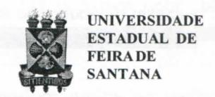
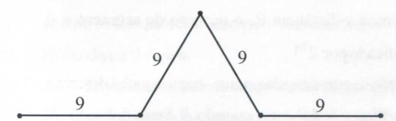
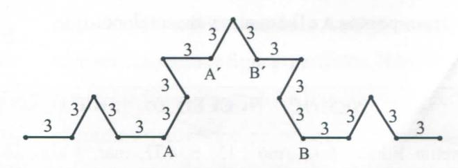
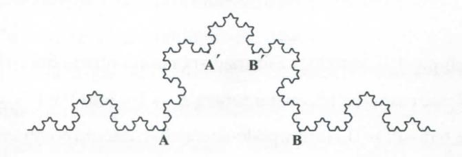
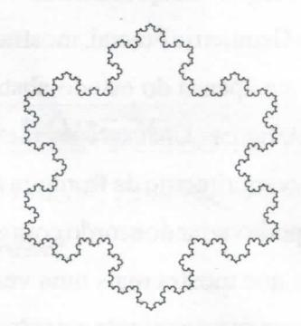
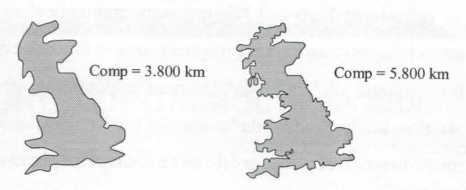

# **FOLHETIM DE EDUCAÇÃO MATEMÁTICA**

**Folhetim Educ. Mat., Ano 13, n. 137, mar. / abr. 2007**

**ISSN 1415-8779**

#### **OBJETIVO**

Este _Folhetim_ é um veículo de divulgação, circulação de ideias e de estímulo ao estudo e à curiosidade intelectual. Dirige-se a todos os interessados pelos aspectos pedagógicos, filosóficos e históricos da Matemática. Pretende construir uma ponte para unir os que estão próximos e os que estão distantes.

#### **EDITORIAL**

Ainda sobre fractais, na sequência do Folhetim anterior, outros exemplos são apresentados para tomar mais clara a definição de dimensão fi-actal. Um exemplo numérico da dimensão da curva de Koch é apresentado e algumas propriedades são exploradas. A seguir são apresentadas algumas aplicações da Geometria Fractal, mostrando-se que não se trata apenas do estudo abstrato de propriedades de figuras. Um interessante exemplo mostra que o comprimento da fi-onteira de uma região (país) pode variar de acordo com a escala empregada, o que mostra mais uma vez que a natureza comporta-se mais de acordo com a geometria íractal de que propriamente com a geometria euclidiana.

## **COMITÉ EDITORIAL**

Carloman Carlos Borges (Doutor) Inácio de Sousa Fadigas (Mestre) Trazíbulo Henrique Pardo Casas (Doutor)

#### **PERGUNTE QUE O NEMOC RESPONDE**

_por Garíoman Garfos J5oryes e Inácio <fe Sousa Jatfiyas_

Exemplo 4: E quando A é formado por um conjunto finito de pontos? Nesse caso _N{e)é_ constante para s —> O e log (1 / s) **—> oo** e no limite, tem-se D=0. Assim, pode-se concluir, que um ponto tem dimensão igual a zero.

Exemplo 5: Novamente, voltamos à Curva de Koch, cuja reconstrução recapitulamos.

Sejaum segmento inicial de27 cm de comprimento, divida-o em três partes de 9 cm cada

9 9 9

Retiremos aparte central e em seu lugar ponhamos dois lados de igual medida (9 cm) como se fosse um triângulo:

Essa operação pode ser repetida, para cada um dos quatro segmentos de 9 cm, surgindo, daí, 16 segmentos de 3 cm cada:

A curva de Koch, como os demais fi-actais, é obtida como resultado de um processo-limite, isto é, ela será obtiba após as infinitas iterações já explicadas. Temos, aí, o "encontro" do infinito potencial (produzido pelas infinitas iterações) com o infinito atual, acabado, surgido na passagem ao limite.

Indutivamente, é fácil ver que o comprimento dessa curva é infinito, pois, no 1" passo ela mede 2 7 cm; no 2°passo, elamede 36 cm (4x9 = 36); no _3°,_ elamede 48cm(16x3=48)e assim, prossegue indefinidamente.

Exploremos, repetindo algumas passagens mais uma vez, a dimensão fractal Dj, da Curva de Koch. Primeiro uma definição:

_N ~ ,_ (definição equivalente à dada anteriormente), onde A^^é o número de segmentos num trecho da curva de tamanho _R,_ para/? suficientemente grande. Coloquemos a seguintepergunta: dequemaneira A'^ varia quando _R_ varia? Observemos o seguinte: Se dobrarmos a distância R, o número de segmentos é multiplicado por **2 .**

Numa curvaregular, suave - como aquelas descritas por Galileu - A'^ dobraria quando _R_ fosse dobrado, _N_ triplicaria com atriphcação _de Re_ assim sucessivamente. Para a curva em apreço, vide figuras acima - a parte da curva entre os pontos A e B é quatro vezes maior do que

a parte compreendida entre A' e B'. Por outro lado a distância entre os pontos A e B (1/3 do segmento original) é tão somente três vezes maior do que entre A' e B' (1 /9 do mesmo segmento). Conclusão: A^^qua-druplica quando _R_ triplica. Logo, para a curva de Koch

$$D_f = \ln 4 / \ln 3 = 1,2618...$$

que é um número irracional.

E interessanteobservar, queo fi^ctal sempreproduzido afravés de um processo limite nunca é atingido. A relação _N ~ R_ nunca é alcançada, pois sempre haverá novas rugosidades, dentro de qualquer escala empregada na medição. Voltaremos breve a esse assunto.

Fundamentado na Curva de Koch, pode ser obtida a Curva Floco de Neve de Koch. B asta partir de um triângulo equilátero e sobre cada lado construirmos uma Curva de Koch. Mais uma vez se repete este fato: o comprimento do Floco de Neve, embora infinito, possui uma superfície finita, uma vez que será sempre menor que um círculo traçado à sua volta.

Todos conhecemos grandes aplicações da Geometria Euclidiana. E as aplicações da Geometria Fractal, perguntaria

### **NEMOC - NÚCLEO DE EDUCAÇÃO MATEMÁTICA OMAR CATUNDA**

Folhetim Educ. Mat., Ano 13, n. 137, mar. / abr. 2007 - **Editores:** Carloman, Inácio e Trazíbulo - **Digitação:** Josemldes Oliveira Venas Almeida e Manoel Aquino dos Santos - **Editoração:** Evandro Vaz - **Impressão:** Imprensa Gráfica Universitária - **Periodicidade:** bimestral - **Tiragem:** 1.200 exemplares - _Distribuição gratuita -_ **Endereço:** Av. Universitária, s/n - km 03 - BR 116 - Campus Universitário - **Telefone:** (75)3224-8115 - **Fax:** (75)3224-8086 - CEP: 44031 -460 - Feira de Santana - Ba - BRASIL - **E-mail:** nemoc@uefs.br uma pessoa mais pragmática? Nas salas de aula é a pergunta mais escutada pelo professor de matemática quando explica algum tópico: para que serve isso? Nada mais cabível que o aluno o faça, pois o grande prestígio da matemática está ligado ao laço que a liga às demais ciências e à tecnologia. A utilidade daquilo que é ensinado deve sempre ser salientado por nós, professores. Infelizmente, as coisas não acontecem assim...

Finalmente, qual a serventia da Geometria Fractal? Nossos vasos sanguíneos possuem inúmeras ramificações e se dividem tal qual os lados do Floco deNeve. Compare o imenso comprimento do sistema circulatório imerso em uma área limitada, que é a de nosso corpo. A analogia com a Curva de Koch é evidente.

Outros exemplos de fi-actais: o sistema coletor urinário, o canal biliar no fígado, sem contar as fibras do coração transmissor de pulsos elétricos aos nossos músculos.

Que acontece quando tentamos medir as fi-onteiras de um país? Como medir todas as suas rugosidades, todas as suas reentrâncias?

Entre outras coisas, já vimos o seguinte: quanto menor o tamanho dos lados da Curva de Koch, maior é o seu comprimento total, pois quanto mais repetimos o processo iterativo maior é o seu comprimento.

Em 1967, o matemático Benoit Mandelbrot, o criador da Geometria Fractal, tentou medir o tamanho da costa da Grã-Bretanha e observou o seguinte:

- a) Em um mapa com a escala 1:50000000 cm, isto é, 1 cm no mapa correspondia a 500km na realidade. Mas, é claro que com essa escala, pequenas reentrâncias, enseadas, etc de poucos quilómetros não podem ser medidas ou representadas com a precisão devida;
  - b) Se mudarmos a escala, agora: 1:5 km, coisas não

registradas na escala anterior, podem, agora, ser melhor representadas. Vej am as figuras abaixo

No mapa da esquerda cada segmento vale 100 km, enquanto no mapa da direita cada um representa 50 km. Ao variar a escala, mais aumetará a fidelidade das medidas, com o aumento do comprimento total do litoral do país.

É impossível responder com absoluta precisão à famosa pergunta feita por Mandelbrot: Que extensão tem o litoral da Grã-Bretanha? " " ' "

As diversas respostas acompanharão as variações de escalas diferentes. A cada escala empregada, corresponderá uma resposta possível. Novos acidentes Geográficos, como baías e penínsulas surgirão ou não, dependendo da escala empregada.

Em documentos dos dois países, Espanha e Portugal sua fronteira difere em tomo de 20%, o mesmo verificandose com outros países fronteiriços, como, exemplificando, a Holanda e a Bélgica.

Já podemos, pelo menos "sentir" algumas diferenças entre a geometria dos gregos e a geometria cujo objeto é o estudo dos fractais. Aquela é a Geometria do senso comum, cujos objetos de estudos são fortemente idealizados, alguns atéenvolvidosemidéiasmísticas. Assim, foiaescolapitagórica com seus números e figuras perfeitos. Números perfeitos e figuras perfeitas. Exemplos: O número seis éperfeito, pois a soma de seus divisores próprios (1+2+3 = 6) é igual a seis, enquanto a circunferência é igualmente a figurapor excelência perfeita, pois é altamente simétrica (apresenta diversos tipos de simetria: ela é simétrica para qualquer rotação em tomo de

seu centro, como também, ésimétrica para uma reflexão sobre qualquer diâmetro). Não nos esqueçamos que alguns especialistas consideram Pitágoras como o fundador da numerologia... A "perfeição" da circunferência atravessou séculos - sendo, finalmente "quebrada" por Kepler quando mostrou serem elípticas as órbitas descitas pelos planetas em tomo do sol. A geometria dos gregos baseada no senso comum (SC), no qual a intuição é um forte componente, "salvou-se" da armadilhado SC pelagenial criação feita por eles do método axiomático. Contudo ela ainda é um modelo meio grosseiro darealidade, levando-nos apensar queestasemanifestaporintermédiodeimagens geométricas bem "certinhas" de contornos suaves e regulares. As chamadas "figuras de Galileu". Hoje, sabemos não ser bem assim. As figuras "ásperas" cheias de "mgosidades" - como os fi-actais, abundam na natureza e superam, em número, as figuras euclidianas. O SC não alcança os processos infinitos e, nesse domínio, anossa famiUar intuição costuma levar-nos a enganos. Um exemplo ilustrativo. Vamos iniciar nossa "brincadeira" com um segmento de reta de 16 cm; divida-o ao meio, produzindo outro segmento de 8 cm. Continue produzindo segmentos cada vez menores (de4,2, **U** 2 ' — centímetros). Problema: O comprimento que representa a soma de todos os segmentos assim formados é finito ou infinito?

**8**

A resposta é: finito e sua medida não ultrapassa 32 cm. O resultado do processo acima é uma espiral poligonal e o simples conhecimento de progressões

**16**

geométricas, mostra ser o seu comprimento tão próximo de 32 cm, "quanto se queira". Estamos perante um processo-limite e, consequentemente, perante o infinito. Mais, ainda, duas infinidades: uma, potencial e outra atual, acabada.

Uma grande revolução conceituai trazida pela geometria fi-actal é aquela sobre a existência da dimensão não inteira de um objeto. Essa revolução está ligada a constatação, na natureza, de objetos ásperos, cheios de reentrâncias - bem diferentes dos objetos euclidianos, todos eles "lisos e suaves".

## **NOTÍCIAS '**

No Folhetim n° 129, anunciamos a publicação do Livro A Matemática para Todos, de autoria do prof Dr. Carloman Carlos Borges - E com satisfação que anunciamos já estar pronto o volume 1. Em breve mais informações.

## **PRÓXIMO NÚMERO**

_Sobre Fractais (continuação). Aguardem!_ **.^f r**

## **NÚMEROS ATRASADOS**

Envie para cada folhetim um selo de postagem nacional de 1° porte. Dentro de no máximo quatro semanas, contadas a partir da data de recebimento do seu pedido, você receberá os folhetins sohcitados.

OBS.: E permitida a reprodução total ou parcial deste folhetim, desde que citada a fonte.
