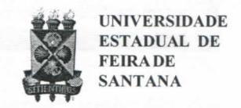
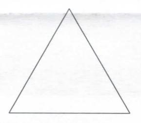
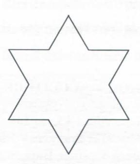
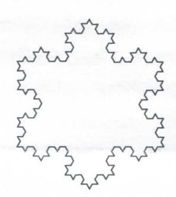
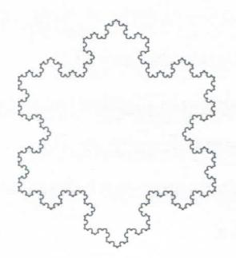
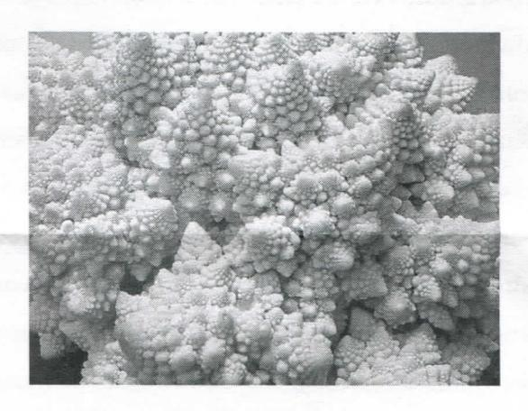

# **FOLHETIM DE EDUCAÇÃO MATEMÁTICA**

**Folhetim Educ. Mat., Ano 13, n. 138, maio / jun. 2007**

**ISSN 1415-8779**

## **OBJETIVO**

Este _Folhetim_ é um veículo de divulgação, circulação de ideias e de estímulo ao estudo e à curiosidade intelectual. Dirige-se a todos os interessados pelos aspectos pedagógicos, filosóficos e históricos da Matemática. Pretende construir uma ponte para unir os que estão próximos e os que estão distantes.

## **EDITORIAL**

No _Folhetim_ n° 137 foi apresentado um exemplo numérico da dimensão da Curva de Koch, bem como algumas explicações da Geometria Fractal. O _presente Folhetim_ trata, de umaformadetalhada,docálculodecomprimentoda Curva Floco de Neve. Mais especificamente mostra que tal curva tem comprimento infinito, embora possua uma superfície finita. Tais propriedades causaram embarços a grandes matemáticos como Poincaré e Hermita que consideram os obj etos íractais como anomalias, não merecendo portanto seu estudo muita dedicação. Hoj e porém tais obj etos j á fazem parte até do ensino fiindamental e médio, mesmo que no nível de divulgação e curiosidade. A propósito da divulgação, é interessante a concepção da artista plástica Fayga Ostrwer sobre as figuras fi^actais.

# **COMITÊ EDITORIAL**

Carloman Carlos Borges (Doutor) Inácio de Sousa Fadigas (Mestre) Trazíbulo Henrique Pardo Casas (Doutor)

## **PERGUNTE QUE O NEMOC RESPONDE**

_^raciais_

_por Caríoman Garfos OBoryes e Inácio <fe Sousa ^aJiyas_

A curva do Floco de Neve. Como escrevemos no _Folhetim_ anterior, essa curva é fundamentada na Curva de Koch, pois basta partir de um tirângulo eqiiilátero e sobre cada lado contruirmos uma curva de Koch. Mostremos, agora, que seu comprimento é infinito.

Comecemos nossa exposição com um tirângulo equilátero de lado unitário de comprimento:

**Primeiro estágio da Curva Floco de Neve - E i**

Chamaremos esse triângulo de Curva E j .

Vamos dividir cada lado do triângulo em três partes iguais, e no terço médio de cada um, um triângulo equilátero é construído, apontando para fora: (As partes comuns aos triângulos antigo e novo são apagadas). Temos a curva:

**Segundo estágio da Curva Floco de Neve -** E2

Continuando com o mesmo processo, construimos a curva E3:

Terceiro estágio da Curva Floco de Neve - E3

#### A curva E4:

Quarto estágio da Curva Floco de Neve - E4

#### A curva E5:

Quinto estágio da Curva Floco de Neve - E5

E, assim, sucessivamente. Para mostrar que o Floco de Neve possui um comprimento infinito, é suficiente verificar (baseado no seu processo construtivo) que o perímetro do triângulo de partida $(E_1)$ é 3;

o perímetro de E, é 3 + 1;

o de
$$E_3$$
, $3+1+\frac{4}{3}$ ;

o de E4,
$$3 + 1 + \frac{4}{3} + \frac{4^2}{3^2}$$
;

o de $E_5$ , $3 + 1 + \frac{4}{3} + \frac{4^2}{3^2} + \frac{4^3}{3^3}$ . Enfim, o perímetro de

$$E_n \notin 3 + 1 + \frac{4}{3} + \frac{4^2}{3^2} + \frac{4^3}{3^3} + ... + \frac{4^{n-2}}{3^{n-2}}$$
.

Estamos na presença de uma série infinita divergente. Veja, o leitor, que o Floco de Neve, embora de comprimento infinito, possui uma superficie finita, uma vez que será sempre menor que um círculo traçado a sua volta. Outra "surpresa": (lembre-se da Curva de Weierstrass) essa curva, embora contínua, não possui derivada em qualquer um de seus pontos, o que vale afirmar: não é possível dizer, dado um ponto qualquer dessa curva, qual a sua direção, isto é, em qualquer ponto dado da curva limite não existe a tangente. Esse exemplo mostra que existem limites na aplicação da análise clássica. A maioria dos matemáticos encarava tais objetos fractais como objetos artificiais, "patológicos", de menor interesse. Não valia a pena serem estudados. Até mesmo o grande matemático francês Poincaré não acreditava que eles merecessem um estudo sério. Chama-os de uma

## NEMOC - NÚCLEO DE EDUCAÇÃO MATEMÁTICA OMAR CATUNDA

Folhetim Educ. Mat., Ano 13, n. 138, maio / jun. 2007 - Editores: Carloman, Inácio e Trazíbulo - Digitação: Josenildes Oliveira Venas Almeida e Manoel Aquino dos Santos - Editoração: Evandro Vaz - Impressão: Imprensa Gráfica Universitária - Periodicidade: bimestral - Tiragem: 1.200 exemplares - Distribuição gratuita - Endereço: Av. Universitária, s/n - km 03 - BR 116 - Campus Universitário - Telefone: (75)3224-8115 - Fax: (75)3224-8086 - CEP: 44031-460 - Feira de Santana - Ba - BRASIL - E-mail: nemoc@uefs.br

"galeriademonstros"; enquanto, seu ilustre contemporâneo, Hermiteescrevia"fugircommedoehorrordestalamentável praga de funções sem derivada". A sua intolerância chegou ao ponto de levá-lo a tentar impedir Lebesgue de publicar um artigo sobre funções diferenciáveis: Esse fato vale a pena ser aprofundado. Para isso recorro a Ian STEWART, matemático que foi considerado pela revista Nature o divulgadormaisdotadoparaexplicarmatemáticaao leitor comum. Em seu livro: Os problemas da matemática. Ciência Aberta, Gradiva, Ian Stewart assim descreve o episódio: "como vimos no capítulo 12,Lebesguedescobriu o importantíssimo método de integração que ainda hoj e tem o seu nome, não era uma especulação intelectual de importância diminuta. Escreveu mais tarde acerca da rejeição do seu artigo por Hermite: "Ele devia ter pensado que aqueles que se embrenham monotonamente neste estudo estão a perder o seu tempo em vez de o dedicarem ainvesti^çãoútil!"Edisse, ainda: "Paramuitosmatemáticos tomei-me o homem das funções sem derivada. E, visto que o medo eo horror que Hermitemostrou eram sentidos por quase toda a gente, sempre que eu tentatava tomar parte numa discussão matemáticahaviaum analista que dizia: "Isto não interessa; estamos a discutir fianções com derivadas." E, assim, conclui, Ian Stewart: "A experiência de Lebesgue mostra que temos que ser cuidadosos na distinção entre a corrente matemática principal e o puramente convencional ou na moda. Em boa verdade, é claro que a exagerada proliferação destes conjuntos, sem um objeto definido, é um exercício bastante fútil. Mas, vendo bem, observamos que a matemática começa a agarrar fortemente a estruturados íractais."

As relações que podem existir entre uma totaHdade dada e suas partes sempre foi motivo de intresse para alguns estudiosos. Nahistória da ciência tais estudos têm aberto novas fronteiras no conhecimento humano. Um dos exemplos célebre foi provocado pelo axioma de Euclides: "O todo é sempre maior que qualquer uma de suas partes." O seu abandono - no caso de totalidades infinitas - juntamente com a postulação de infinitos atuais, acabados - levou o grande matemático Cantor à criação da Teoria dos Conjuntos. Como escreve Keith Devlin, em O Gene da Matemática, Editora Record. "Se olharmos atentamente para um lilás, notaremos que uma pequena parte se parecemuito com a flor toda. Vemos o mesmo fenómeno em algumas outras flores e em algumas verduras, tais como os brócolis ou a couve-flor.

Os matemáticos chamam a essa propriedade de autosimilaridade." A auto-similaridade mereceu a atenção do matemático Helge Kock. Foi dessa situação que surgiu a curva Floco de Neve. Veja como a aplicação de uma regra bem simples (pegarmos um triângulo equilátero, acrescentarmos um triângulo equilátero menor no terço médio de cada lado, depois repetirmos o processo, acrescentando triângulos cada vez menores nos terços médios dos lados) produz uma forma extraordinária que é a curva Floco de Neve.

Alguns matemáticos - e não são poucos - exercitam seu pragmatismo fazendo perguntas tais como: e daí, qual a utilidade dos fractais? Aonde nos pode levar o estudo do lilás? A forma de uma nuvem? Eles parecem ser adeptos da máxima do pragmatismo: "Tudo que é útil é verdadeiro", máximaessamuitas vezes desmentidapelo desenvolvimento cientifico, o qual émais compatível, com amáxima: "Tudo que é verdadeiro é útil." Porém, uma vez mais, passemos apalavraaKeith Devlin, em suaobrajámeaicionada: "Uma resposta, que ahistóriatem nos ensinado repetidas vezes, é que o conhecimento científico geralmente vem a ser benéfico. Por exemplo, no início do século 19 os matemáticos começaram a estudar os padrões dos nós. Sua única motivação era a curiosidade (o grifo é nosso). Mas, nos últimos vinte e cinco anos, os biologistas têm usado a matemática dos nós para ajudá-los a lutar contra os vírus, muitos dos quais alteram o modo pelo qual a molécula do DNA se enrola em tomo de si mesma, formando um nó." E, continuando: "As nuvens também têm auto-similaridade. Umamaneira matemática de descrever os padrões auto-similares poderia ser estudar as nuvens. Dada uma descrição matemática de nuves, poderíamos simular a formação, crescimento e movimento das nuvens num computador. Usando essas simulações, talvez pudéssemos aperfeiçoar nossa capacidade de prever condições climáticas severas, usando essas previsões para nos proteger melhor das consequências de uma grande tempestade ou de um tomado. Isso não é pura fantasia. Há alguns anos ospesquisadores vêm realizando investigações desse tipo."

Antes de tentarmos mostrar aproximações entre os íractais e a Teoria do Caos, transcrevemos algumas partes do depoimento da artista plástica e professora da Teoria da Arte, Fayga Ostrower dada à revista Ciência Hoj e, vol. 14, número 80 Marco - Abril de 1992. Escreve essa artista: "Nas representações visuais, as figuras de íractais pertencem aumanova geometria: elas exibem dimensões Iracionárias, não inteiras. Mais importante, ainda, cada

detalhe de uma imagem pode ser ampliado infinitamente, mantendo a forma estrutural do todo e sem perder a precisão. E um exemplo concreto de que existe um número infinito de subdivisões entre o "O" e o " 1" e que, por menor que sej a a distância, sempre haverá um novo segmento a ser dividido. O extraordinário dessa experiência é a possibilidade de ilustrar o infinito! Isto significa que, cada instante de nossa vida, cada mínima fi-ação de instante, incorpora o infinito e novamente se estende nele. O que é tão difícil de ser concebido e imaginado pode ser ilustrado visualmente pelas imagens de flictais."

# **NOTÍCIAS**

No Folhetim n" 129, anunciamos a publicação do Livro A Matemática para Todos, de autoria do prof Dr. Carloman Carlos Borges - É com satisfação que anunciamos já estar pronto o volume 1.0 livro pode ser adquirido localmente no NEMOC, ou através do PIDL nas distribuidoras em todo Brasil.

# **PRÓXIMO NÚMERO**

_Sobre Fractais (continuação). Aguardem!_

## **NÚMEROS ATRASADOS**

Envie para cada folhetim um selo de postagem nacional de 1° porte. Dentro de no máximo quatro semanas, contadas a partir da data de recebimento do seu pedido, você receberá os folhetins soUcitados.

OBS.: E permitida a reprodução total ou parcial deste folhetim, desde que citada a fonte.
