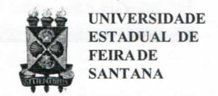
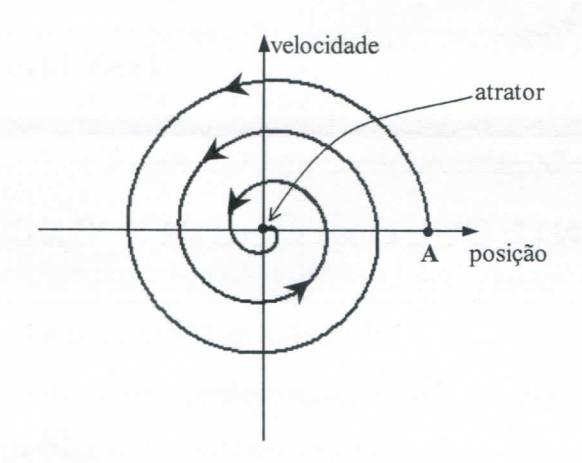
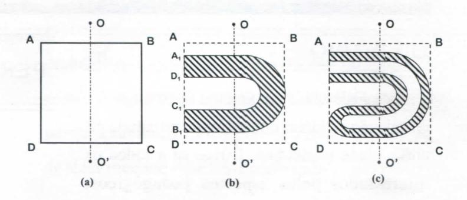

# FOLHETIM DE EDUCAÇÃO MATEMÁTICA

Folhetim Educ. Mat., Ano 13, n. 139, jul. / ago. 2007

ISSN 1415-8779

#### **OBJETIVO**

Este Folhetim é um veículo de divulgação, circulação de idéias e de estímulo ao estudo e à curiosidade intelectual. Dirige-se a todos os interessados pelos aspectos pedagógicos, filosóficos e históricos da Matemática. Pretende construir uma ponte para unir os que estão próximos e os que estão distantes.

#### **EDITORIAL**

O amplo tema sobre caos e fractais continua a ser discutido no presente _Folhetim_. Desta vez com alguns esclarecimentos conceituais sobre Sistema Dinâmico. São exibidos alguns exemplos simples de conceitos da teoria dos sistemas dinâmicos, tais como o conceito de atrator. Além do atrator do pêndulo simples, baseado na 2ª lei de Newton, uma interessante discussão é feita sobre o processo denominado Ferradura de Smole. São apresentados também a definição de caos determinístico, e em seguida uma breve discussão do conceito de acaso.

Ainda serão necessárias mais algumas colunas do _Folhetim_ para que a proposta de discussão sobre Fractais tenha um desfecho, o que não significa porém que o assunto esteja esgotado.

# COMITÉ EDITORIAL

Carloman Carlos Borges (Doutor) Inácio de Sousa Fadigas (Mestre) Trazíbulo Henrique Pardo Casas (Doutor)

#### PERGUNTE QUE O NEMOC RESPONDE

Fractais

por Carloman Carlos Borges e Inácio de Sousa Fadigas

<u>Caos e Fractais.</u> Uma possível aproximação entre a Teoria do Caos e a dos Fractais, deve ser precedida por alguns esclarecimentos conceituais:

<u>Sistema Dinâmico:</u> seja um sistema normal de equações diferenciais

$$x = f(x)$$
(I)

cujo segundo membro não depende da variável temporal t. Sistemas de equações diferenciais da forma (I) são chamados de <u>dinâmicos</u> ou <u>autônomos</u>. Em um sistema dinâmico(SD) temos o espaço de fase, que é o espaço de estados possíveis do sistema (espaço constituídos pelas variáveis que descrevem completamente o sistema). Assim, cada ponto do espaço de fases é representativo de um estado possível para o sistema e por ele passa apenas uma só trajetória. Um exemplo simples de SD: movimento de uma partícula sob a ação de uma força. No caso, temos como regra de evolução $\frac{mdv}{dt} = F$ (2ª lei de Newton); variáveis dependentes: posição x e velocidade v.

Atrator: no espaço de fase de alguns sistemas há uma região para a qual tendem algumas de suas trajetórias. Ela é denominada de atrator. Na figura abaixo ilustraremos o atrator de dimensão zero (um ponto) para o pêndulo amortecido pelo atrito com o ar:

Intuitivamente, um atrator é um conjunto invariante para o qual as órbitas próximas convergem depois de um tempo suficientemente longo.

O atrator do pêndulo amortecido apresenta uma dimensão inteira. No caso acima, sua dimensão é dada pelo inteiro zero. Há outros sistemas que, além de apresentarem contração numa direção e expansão em outra, apresentam dobras. Um exemplo de dobra é dado no processo denominado de Ferradura de Smole (matemático americano ganhador da Medalha Fields em 1966). Vejamos com mais detalhes a construção da Ferradura de Smole. Seja um retângulo S de vértices ABCD, (a). O mapa da ferradura (F) atua seguindo a seguinte seqüência: inicialmente, S é contraído na direção vertical (por um fator $\delta < \frac{1}{2}$ ) e expandido na direção horizontal por um fator $\frac{1}{2}$ ; em seguida o retângulo alterado (vértices $A_1B_1C_1D_1$ ) é dobrado e colocado

novamente em S (conforme(b)). Isso é repetido mais uma vez, outra vez, enfim, tantas vezes quanto desejar (figura (c)).

Observemos que, através dessas sucessivas aplicações do mapa da ferradura, chega-se a uma estrutura foliada; observemos como a reta OO' com as áreas resultantes de cada iteração apresenta como resultado segmentos disjuntos cada vez menores. Isso lembra, claramente, o Conjunto de Cantor. Vejamos, aqui, que a evolução do atrator é por intermédio de dobras e alongamentos; ele é chamado de atrator estranho. Os atratores estranhos podem ser encontrados em sistemas dinâmicos contínuos e eles apresentam - uma estrutura tipo - Cantor, auto - similaridade e dimensão fractal. A analogia do processo denominado de ferradura de Smole, descrito acima, com o Conjunto de Cantor é visível: Seja a reta OO' perpendicular aos lados AB eDC do retângulo S (figura (a)). De início temos a intersecção com Fo(S) ≅ S, que apresenta um segmento; a próxima intersecção (depois da primeira iteração) produz dois segmentos, quatro para a segunda iteração (começamos

### NEMOC - NÚCLEO DE EDUCAÇÃO MATEMÁTICA OMAR CATUNDA

Folhetim Educ. Mat., Ano 13, n. 139, jul. /ago. 2007 - Editores: Carloman, Inácio e Trazíbulo - Digitação: Josenildes Oliveira Venas Almeida e Manoel Aquino dos Santos - Editoração: Evandro Vaz - Impressão: Imprensa Gráfica Universitária - Periodicidade: bimestral - Tiragem: 1.200 exemplares - Distribuição gratuita - Endereço: Av. Universitária, s/n - km 03 - BR 116 - Campus Universitário - Telefone: (75)3224-8115 - Fax: (75)3224-8086 - CEP: 44031-460 - Feira de Santana - Ba - BRASIL - E-mail: nemoc@uefs.br

como $F^{\circ}(S) \cong S...$ ) e $2^n$ segmentos para a n-ésima iteração.

Para entender a ligação existente entre o caos e fractais, precisamos, ainda, rever algumas definições. A primeira delas é a definição de caos determinístico, a qual, para ficarmelhor esclarecida, exige uma pequena digressão. Quem nunca leu a famosa declaração de Laplace: "Um intelecto que num dado momento conhece todas as forcas que animam a natureza e as posições relativas dos seres que o compõem, se esse intelecto fosse suficientemente vasto para submeter esta informação à uma análise, poderia condensar numa só fórmula o movimento dos maiores corpos do universo e o do átomo mais leve; para um tal intelecto nada poderia ser incerto; o futuro, tal como o passado, seria presente perante os seus olhos". Essa visão clássica do determinismo persistiu muito tempo como um verdadeiro padrão científico. Uma olhada superficial em torno de nós, parece confirmar tal visão: as elipses de Klepernos levam a pensar na permanência e regularidade dos fenômenos naturais. A previsibilidade torna-se, assim, um atributo que serve para caracterizar o conhecimento científico. E que dizer das três célebres leis de Newton? Não continuamos, ainda, a ensinar aos nossos jovens alunos, nas universidades, nas cadeiras de cálculo diferencial e integral que a solução de uma equação diferencial étotalmente determinada pelas suas condições iniciais? É como se o passado e o presente estivesem congelados no instante presente.

Mais uma vez, damos a palavra a Laplace: "Estavase longe de pensar, naqueles tempos de ignorância, que a natureza obedece sempre a leis imutáveis. Conforme os fenômenos chegassem e se sucedessem com regularidade ou sem ordem aparente, considerava-se que dependessem de causas finais ou do acaso. Quando ofereciam algo de extraordinário e pareciam contrariar a ordem natural, eram considerados como outros tantos sinais da cólera celeste." A mensagem aristotélica está clara! Cada coisa possui o seu lugar natural. Se há desordem, ela, apenas, é aparente.

Em sua grande obra, Princípios, Newton apresenta duas regras norteadoras do trabalho científico:

- I) Não se devem admitir mais causas das coisas naturais do que aquelas que são ao mesmo tempo verdadeiras e suficientes para a explicação de seus fenômenos, pois a natureza é simples e não é pródiga em causas supérfluas.
- II) É por isso que as causas dos efeitos naturais de mesmo gênero são as mesmas.

A idéia da simplicidade da natureza, juntamente com a de que a maioria dos fenômenos naturais são lineares, persistiu por muito tempo. O <u>acaso</u> era simplesmente "a interseção de duas séries causais e temporais", pois, segundo Einstein, Deus não joga dados.

Agora, uma pergunta "inocente": Que é <u>acaso</u>? Esse conceito, ainda hoje, não está suficientemente definido. Ora, é possível definir precisamente o que é <u>acaso</u>? Essa suposta definição não negaria a natureza íntima do próprio acaso?

Como é que um conceito, ainda mal definido, como o do <u>acaso</u> deu lugar à criação do cálculo das probabilidades, considerado como a sua interpretação científica? Em seu belo livro, O Código Cósmico, Heinz R. Pagels, Editora Gradiva, ao abordar esse tema, escreve: "Para ilustrar estas dificuldades, consideremos o problema de definir uma sucessão aleatória dos números inteiros de 0 a 9. Por exemplo, consideremos a sucessão:

314115926535897932384626433832795028841971... onde ... significa que a sucessão poderia continuar por mais um milhão de algarismos e depois parar. Não vou escrevê-los todos. Isso parece ser um conjunto caótico dos dez inteiros, e podemos aplicar a esse conjunto vários testes para ver se de fato é aleatório...

Uma prova de aleatoriedade seria por exemplo, dividir a sucessão em blocos de dez inteiros, de forma a termos

(3141592653) (5897932384) (6264338327).

Agora podemos contar o número de inteiros pares que ocorrem em cada bloco de dez - o primeiro bloco tem três inteiros pares, o segundo tem quatro, o terceiro tem seis, e assim por diante. O número de inteiros pares num dado bloco pode variar entre zero a dez. Portanto, depois demuitos blocos de dez, podemos estabelecer a distribuição dos números pares - quantos blocos não têm números pares, quantos têm um número par, etc. - e devem obter um resultado próximo da chamada "distribuição de Poisson". Se, ao aumentar o número de blocos em consideração, a distribuição obtida se aproximar ainda mais da distribuição de Poisson, teremos uma indicação suplementar de que a sucessão é aleatória.

... Para qualquer sucessão finita de inteiros é sempre possível encontrar uma regra que diga exatamente a maneira de a construir.

... No entanto, encontrar uma regra de formação depende da inteligência humana, enunca podemos garantir que a regra que descobrimos é a mais simples que descreve a sucessão.

... Portanto, os matemáticos não sabem o que é acaso!" Ainda, do mesmo autor: "A teoria matemática das probabilidades começa depois de serem atribuidas probabilidades a acontecimentos elementares. A forma como essas probabilidades são atribuidas não é discutida, porque a sua discussão requereria uma definição prévia de aleatoriedade - que não é conhecida".

## NOTÍCIAS

No Folhetim nº 129, anunciamos a publicação do Livro A Matemática para Todos, de autoria do prof. Dr. Carloman Carlos Borges - É com satisfação que anunciamos já estar pronto o volume 1. O livro pode ser adquirido localmente no NEMOC, ou através do PIDL-Programa Interinstitucional de Distribuição de Livros nas instituições que participam do programa em todo Brasil.

# PRÓXIMO NÚMERO

Sobre Fractais (continuação).

Aguardem!

# **NÚMEROS ATRASADOS**

Envie para cada folhetim um selo de postagem nacional de 1º porte. Dentro de no máximo quatro semanas, contadas a partir da data de recebimento do seu pedido, você receberá os folhetins solicitados.

OBS.: É permitida a reprodução total ou parcial deste folhetim, desde que citada a fonte.
