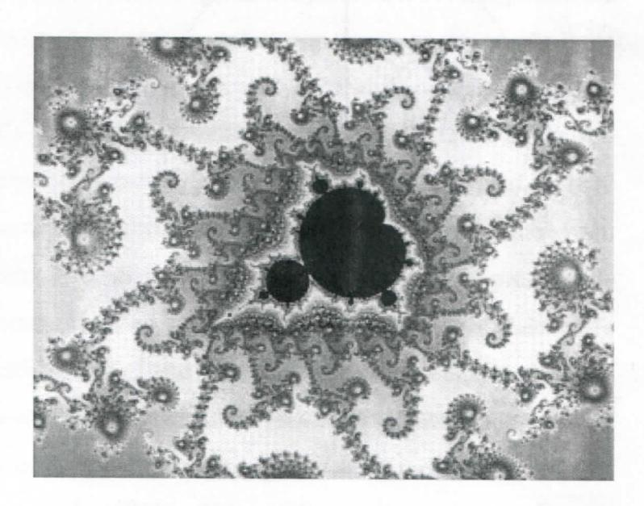
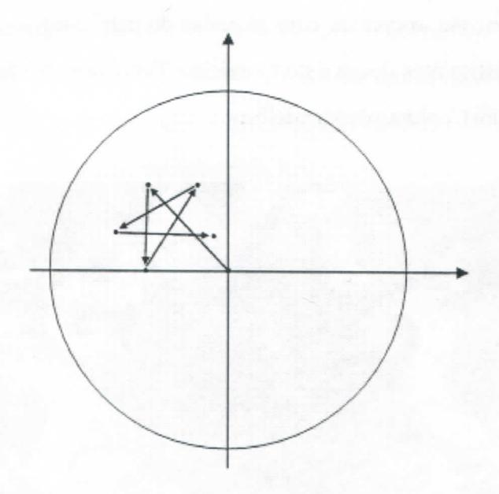

# FOLHETIM DE EDUCAÇÃO MATEMÁTICA

Folhetim Educ. Mat., Ano 14, n. 141, nov. / dez. 2007

ISSN 1415-8779

### **OBJETIVO**

Este Folhetim é um veículo de divulgação, circulação de idéias e de estímulo ao estudo e à curiosidade intelectual. Dirige-se a todos os interessados pelos aspectos pedagógicos, filosóficos e históricos da Matemática. Pretende construir uma ponte para unir os que estão próximos e os que estão distantes.

#### **EDITORIAL**

Ao longo dos últimos Folhetins (este já é o 8°) o tema Fractais esteve presente, e continuará ainda por alguns Folhetins. Iniciado com uma abordagem histórica, parte da geometria euclidiana como expressão da natureza, mas aponta para outro tipo de geometria que apresentam conjuntos irregulares (fogem ao padrão da geometria euclidiana). Em seguida, os Folhetins apresentam descrições e definições próprias da geometria fractal. Entre estas, o número 136 é dedicado à dimensão, seguido de exemplos no número 137 e 138. A partir daí, a relação entre caos e fractais começa a ser estabelecida a partir dos sistemas dinâmicos conceitos como atrator e acaso são abordados. A hipersensibilidade às condições iniciais é abordada em seguida. O presente número trata ainda da relação caos e fractais e associa os dois conceitos a partir dos atratores estranhos. Destaca-se as citações dos trabalhos de Ruelle e Prigogine, que é um convite a aprofundar esta bela temática.

## COMITÉ EDITORIAL

Carloman Carlos Borges (Doutor) Inácio de Sousa Fadigas (Mestre) Trazíbulo Henrique Pardo Casas (Doutor)

## PERGUNTE QUE O NEMOC RESPONDE

Fractais

por Carloman Carlos Borges e Inácio de Sousa Fadigas

Como já mencionamos anteriormente, não há consenso em torno da definição da palavra caos. Esse termo muitas vezes é reservado para caracterizar comportamentos complexos de sistemas dinâmicos. Como já sabem, determinismo e ordem sempre foram dois dogmas sagrados da ciência: as mesmas causas produzem os mesmos efeitos. Assim, a previsão era uma das características do saber científico e a simplicidade, junto com a ordem pertencia à Natureza. Alguns novos resultados apontam em outra direção. Basta lembrar o movimento browniano, que é um processo estocástico, ou seja, a sua evolução pode depender do acaso. O termo browniano é em homenagem ao botânico inglês, Robert Brown, o qual, em 1827 observou a trajetória de partículas de pólen em movimento em um líquido. Esse movimento é muito errático, dada a presenca de inúmeros choques entre as partículas aí presentes. Ademais a trajetória das partículas muda frequentemente de direção. Segundo o Dicionário das Ciências, direção de Lionel Salem, Editora Vozes, Petropólis, a formalização rigorosa desse processo é devida ao matemático americano Wiener. Ele mostrou que suas trajetórias são contínuas e não deriváveis, o que faz lembrar a denominada curva de Weiertrass, já mencionada linhas acima, e referente a uma função contínua sem derivada em nenhum de seus pontos -

apresentada por esse ilustre matemático à Academia de Berlim no ano de 1872.

Nesta altura, queremos passar aos nossos leitores uma aproximação entre <u>caos</u> e <u>fractal</u>. Antes da descoberta do caos, era consensual: causas simples sempre produzem efeitos simples e causas complexas produzem sempre efeitos complexos. Hoje, a situação é outra: mesmas causas produzem efeitos simples e podem, também, produzir efeitos complicados. A antiga simetria entre causa e efeito, parece rompida.

O caos está associado com formas fractais chamadas de <u>atratores estranhos</u>. Você ainda se lembra do que seja um atrator? Vale apena repetir, dada a importância desses objetos. Vamos recorrer ao matemático Ian STEWART, esse extraordinário divulgador da matemática. Em seu livrinho *Os Números da Natureza*, editado pela Rocco, escreve, com uma clara pedagogia: "Imagine que você deixa cair uma bola de pingue - pongue sobre um mar tempestuoso. Quer você deixe cair do ar ou a solte embaixo da água, a bola se move em direção à superfície. Uma vez na superfície, ela segue uma trajetória muito complicada sobre as ondas, mas, não importa quão complexa seja essa trajetória, a bola permanece sobre a superfície - ou pelo menos muito perto dela. Nesta imagem, a superfície

do mar é um atrator. Assim, apesar do caos, não interessa qual tenha sido o ponto inicial, o sistema terminará por permanecer muito próximo de seu atrator".

Uma das aproximações ao conceito de caos é imaginálo, primeiro como um processo e não como um objeto - que é o caso de um fractal. Em seguida, considerá-lo como uma "evolução temporal com dependência hipersensível às condições iniciais".

Os atratores estranhos não são curvas ou superfícies lisas, porém, objetos de dimensão não inteira, isto é, fractais. Segundo o conhecido físico David Ruelle, em *Acaso e Caos*, UNESP: o movimento sobre um atrator estranho apresenta o fenômeno da DHCI. Foi uma surpresa para a comunidade científica a descoberta da geração de fractais pelo comportamento assintótico de sistemas dinâmicos, no espaço de fases correspondente. O que foi dito acima, pode ser dito mais simplesmente: fractais podem ser atratores de sistemas dinâmicos. É no mínimo, admirável que a geometria do caos nos revele a sua associação com formas irregulares denominadas de fractais.

O estudo do caos vem apresentando facetas admiráveis. Por exemplo, já podemos falar sobre as "leis do caos", construção, aparentemente paradoxal. Para um entendimento mais profundo, aconselhamos a leitura do belo livro: *As Leis do Caos*, escrito pelo Nobel Ilya Prigogine, UNESP.

# NEMOC - NÚCLEO DE EDUCAÇÃO MATEMÁTICA OMAR CATUNDA

Folhetim Educ. Mat., Ano 14, n. 141, nov./dez. 2007 - Editores: Carloman, Inácio e Trazíbulo - Digitação: Josenildes Oliveira Venas Almeida e Manoel Aquino dos Santos - Editoração: Evandro Vaz - Impressão: Imprensa Gráfica Universitária - Periodicidade: bimestral - Tiragem: 1.200 exemplares - Distribuição gratuita - Endereço: Av. Universitária, s/n - km 03 - BR 116 - Campus Universitário - Telefone: (75)3224-8115 - Fax: (75)3224-8086 - CEP: 44031-460 - Feira de Santana - Ba - BRASIL - E-mail: nemoc@uefs.br

Uma mudança profunda na descrição da natureza, mudança radical - pelas raízes - ocorreu na ciência com o estudo dessa categoria - para muitos sinônimo da mais pura desordem. Como alerta Prigogine, o conceito de caos balançou outro conceito importantíssimo na ciência, qual seja, o da "lei da natureza" - termo, classicamente, associado ao determinismo e a reversibilidade temporal e, onde tanto o futuro como o passado desempenhavam o mesmo papel. Realmente, ao examinarmos importantes equações físicas - ou, para sermos mais generalistas - "todas as equações bem sucedidas da físicas são simétricas no tempo". Elas podem ser empregadas, igualmente, quer num sentido quanto noutro sentido do tempo (isso é consequência de sua simetria). Passado e futuro, fisicamente, são indistinguíveis.

Um simples examedas leis de Newton, das equações de Hamilton, das equações de Maxwell, da relatividade geral de Einstein revela este fato: todas continuam sem alterações ante uma inversão no sentido do tempo (basta substituir a coordenada t, representativa do tempo. por -t). Esse simples fato atesta uma enorme discrepância entre nossas percepções sensóriais do tempo ante aquilo exibido pela física moderna - para o que chama nossa atenção o ilustre físico contemporâneo Roger Penrose, em seu livro A Mente Nova do Rei, Editora Campus. Segundo esse pensador, não existe, de acordo com a Relatividade, o "agora", isto é, o "agora" de um observador não seria o mesmo do outro. O tempo seria simplesmente uma ilusão: todos conhecem o pensamento do autor da Relatividade a tal respeito. Essa idéia é chocante, principalmente, ante os fenômenos estudados

pela Biologia.

De equações determinísticas como as equações da mecânica de Newton podem surgir o caos; isso é dito pelo já citado físico contemporâneo David Ruelle, na sua admirável obra de divulgação científica *Acaso e Caos*. Que diz David Ruelle? Numa simples frase, ele sintetiza a relação entre o caos e o determinismo quando escreve: "Nos fenômenos caóticos, a ordem determinista cria, portanto, a desordem do acaso".

Essa nova geometria, a Geometria dos Fractais, está ligada - por um lado a uma ordem que se repete, a <u>autosimilaridade</u> - e por outro lado às formas irregulares, como a parte costeira de um país, produto de inúmeros fatores (a erosão, o contato com as ondas do mar, etc.) fatores constituintes de um sistema caótico. Tomemos uma parte de um Conjunto de Mandelbrot.

Esse conjunto pode ser construido a partir da transformação

$$z \rightarrow z^2 + c$$

aqui z é substituido por um número complexo e c é outro

complexo, porém, <u>fixo</u>. O número  $z^2 + c$  pode ser representado no plano Argand-Gauss. Assim, se c for dado por 1,54 - 1,37i, o mapeamento de z seria dado por:

$$z \rightarrow z^2 + 1,54 - 1,37i$$
.

Logo pontualmente, para o número 4, teríamos:

$$4^2+1,54-1,37i=16+1,54-1,37i=17,54-1,37i$$
 e, assim, sucessivamente. Ao aplicarmos a transformação a  $c^2+c$ , teremos  $(c^2+c)^2+c=c^4+2c^3+c^2+c$ . Ao continuarmos com tais iterações formaremos uma sequência modulada pelas diversas escolhas de  $c$ : todo membro da sequência se encontra dentro de um círculo fixo, com centro na origem, no plano de Argand-Gauss:

Maiores detalhes veja o livro citado de Roger Penrose.

O processo acima, agora, com auxílio do computador, pode ser continuado, ad-infinitum... Isso significa que estamos na presença do conceito de limite, provavelmente, um dos mais profundos de toda a matemática. (A propósito, existirá algum matemático que

o "domine" em toda a sua vastidão? Acredito na resposta negativa). Conclusão: todos os detalhes da estrutura do Conjunto de Mandelbrot jamais poderão ser alcançados por qualquer mente humana, hoje ou em qualquer outro futuro.

Veja como a simplicidade dá origem à tamanha complexidade - o Conjunto de Mandelbrot. Complexidade que nunca chega ao fim, inexaurível, originária das iterações produzidas numa transformação matemática de grande simplicidade.

Será que a complexidade do fractal é uma pura ilusão? Achamos que não, da mesma forma como a complexidade de um ninho de cupim não é ilusória - apesar de resultar da repetição simples de um processo simples. A Natureza nos oferece curiosos exemplos dos processos complexos e caóticos dando origem a estruturas regulares, como também mostra a "coexistência pacífica" da complexidade com a simplicidade no mesmo tempo e espaço.

# PRÓXIMO NÚMERO

Sobre Fractais (continuação).

Aguardem!

## **NÚMEROS ATRASADOS**

Envie para cada folhetim um selo de postagem nacional de 1º porte. Dentro de no máximo quatro semanas, contadas a partir da data de recebimento do seu pedido, você receberá os folhetins solicitados.

OBS.: É permitida a reprodução total ou parcial deste folhetim, desde que citada a fonte.