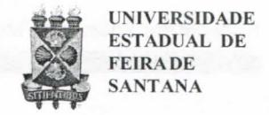
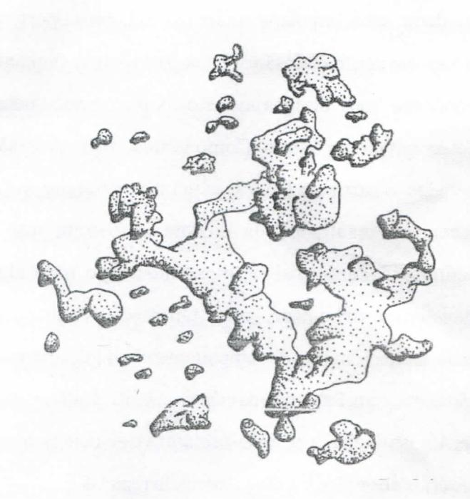

# FOLHETIM DE EDUCAÇÃO MATEMÁTICA

Folhetim Educ. Mat., Ano 14, n. 142, jan. / fev. 2008

ISSN 1415-8779

### **OBJETIVO**

Este Folhetim é um veículo de divulgação, circulação de idéias e de estímulo ao estudo e à curiosidade intelectual. Dirige-se a todos os interessados pelos aspectos pedagógicos, filosóficos e históricos da Matemática. Pretende construir uma ponte para unir os que estão próximos e os que estão distantes.

#### **EDITORIAL**

A seqüência do presente artigo aborda uma questão interessante: trata-se da "verdade", mais especificamente a "verdade absoluta". Deve ainda causar espanto para alguns a descoberta de que a matemática não está isenta de contradições. O texto inicia levantando a questão de ser o todo sempre maior do que qualquer uma de suas partes. Tal afirmação só tem validade diante de certos referenciais, não sendo pois verdade absoluta.

Que relação tem o fato com os fractais? É que nessa geometria, o todo pode estar contido em uma de suas partes(auto-similaridade), uma das características fundamentais dos fractais.

Geometrias não euclidianas e fractais são exemplos de um importante aspecto na pesquisa científica: orientar a pesquisa para a aplicação pode empobrecer a ciência, pois muitos resultados "abstratos" só mostraram suas possibilidades de aplicação a *posteriori*.

# COMITÉ EDITORIAL

Carloman Carlos Borges (Doutor) Inácio de Sousa Fadigas (Mestre) Trazíbulo Henrique Pardo Casas (Doutor)

## PERGUNTE QUE O NEMOC RESPONDE

Fractais

por Carloman Carlos Borges e Inácio de Sousa Fadigas

O estudo dos fractais pode evidenciar algumas belas lições.

Desde a Grécia Antiga - talvez antes, mesmo, da Grécia Antiga - afirmava-se que "o todo era sempre prevalente a qualquer uma de suas partes"; isto é, numa linguagem mais clara, porém, menos rigorosa: "o todo é sempre maior do que qualquer uma de suas partes". Essa proposição manifestava algo tão evidente, que Euclides colocou como um entre seus famosos axiomas. Tratava-se de uma "verdade evidente por si mesma". A questão de saber o que era uma verdade evidente por si mesma, parece não ser foco da atenção, naquela época. Pelo menos de uma atenção sistemática, onde coubesse alguma dúvida. Tanto é assim que essa "verdade" persistiu muitos séculos como aceita por vários estudiosos. Aliás, a Geometria de Euclides, firmou, durante séculos, conceitos como "verdades eternas", "verdades absolutas", etc. A Matemática - talvez como recordação desse passado - sempre foi tida como dogmática, cheia de certezas, isenta de contradições. Nada é tão falso como tal visão, embora, em salas de aulas, muitas vezes seu conhecimento seja passado para os alunos, envolvido nessa aura. Quando se afirmaexemplificando - que a soma dos ângulos internos de um triângulo mede 180°, subjacente a tal afirmação, ancorando-lhe a validez, deve ser evidenciado que tal verdade somente vale no espaco

euclidiano, de curvatura zero. Aí, sim, dentro desse referencial e dentro da lógica clássica, podemos afirmar tratar-se de uma "verdade eterna". Veja bem: de uma "verdade eterna", isto é, daqui para sempre, a soma dos ângulos internos de um triângulo euclidiano, mede 180°. Porém, não se trata de uma "verdade absoluta" independente de qualquer referencial. Com as geometrias não euclidianas, nas quais a soma dos ângulos internos de um triângulo pode medir ora mais do que 180°, ora, menos de 180°, a matemática enriquece o próprio conceito de verdade - conceito nuclear no conhecimento científico. Trata-se, pois, de uma verdadeira revolução epistemológica. Mais, ainda, elanos convida a refletir sobre o conceito de contradição, pois, a medição falada acima, ora é de 180°, ora mais de 180° e finalmente é menos de 180°, o que parece contraditório.

O axioma de que o todo é sempre maior do que qualquer uma de suas partes, de verdade absoluta passou a ser uma verdade "amarrada" ao referencial: ela prevalece quando estamos na finitude, pois, na infinitude, o todo pode ser igual a uma de suas partes. Com essa restrição, Cantor criou a extraordinária Teoria dos Conjuntos.

Com os fractais Benoit Mandelbrot mostra que a totalidade pode estar contida em uma de suas partes, ou

que uma das partes da totalidade a contém. Aliás, em meados da década de 60, a holografia - uma forma de fotografia na qual as lentes são substituídas por um feixe de raio laser - aponta nessa mesma direção.

Assim, se você quebrar uma chapa holográfica em vários pedaços, em cada um deles você ainda verá a imagem original da chapa completa.

Atenção casais denamorados: seum de vocês aparecer abraçado ao outro, numa chapa holográfica, sempre permanecerão assim, pois, ao tentar separar-se do parceiro ou da parceira, cortando a chapa com a tesoura, em vários pedaços, em qualquer um desses pedaços, o casal sempre aparecerá junto, abraçado. O que a holografia uniu jamais será separado.

Por intermédio da auto-similaridade no fractal a parte contém o todo. O fractal está ligado ao infinito e é uma nova maneira de aproximar-se do caos. Com o surgimento de novos computadores, cada vez mais potentes, a visibilidade do fractal torna-se mais bela.

Muito antes disso tudo, o grande poeta William Blake já escrevia:

Para ver o mundo num grão de areia

E o céu numa flor selvagem

Segura o infinito na palma da tua mão

E a eternidade em uma hora.

## NEMOC - NÚCLEO DE EDUCAÇÃO MATEMÁTICA OMAR CATUNDA

Folhetim Educ. Mat., Ano 14, n. 142, jan./fev. 2008 - Editores: Carloman, Inácio e Trazíbulo - Digitação: Josenildes Oliveira Venas Almeida e Manoel Aquino dos Santos - Editoração: Evandro Vaz - Impressão: Imprensa Gráfica Universitária - Periodicidade: bimestral - Tiragem: 1.200 exemplares - Distribuição gratuita - Endereço: Av. Universitária, s/n - km 03 - BR 116 - Campus Universitário - Telefone: (75)3224-8115 - Fax: (75)3224-8086 - CEP: 44031-460 - Feira de Santana - Ba - BRASIL - E-mail: nemoc@uefs.br

Tem sido dificil para alguns estudiosos desse assunto moderar seus impulsos místicos. Achamos oportuno relembrar que fractais são objetos geométricos enquanto o conceito "caos" designa um certo tipo de comportamento desenvolvido no tempo. Como vimos, os fractais são gerados a partir de processos iterativos regulares. Os recentes resultados da ciência mostram que a complexidade, da qual fugimos tanto tempo, não é algo subjetivo do ser humano, porém, um imperativo do real. A idéia de uma Natureza de comportamento simples e regular não se mantém. Esse mito da ciência clássica desmoronouse. A postulação cartesiana de clareza e evidência como critérios de verdade, vem merecendo reparos

De passagem, é interessante observar a ênfase dada ao erro na aprendizagem, como vertente de criatividade. pelas assim chamadas modernas teorias pedagógicas. Ora, por milhares e milhares de anos, a Natureza através da mutação antecipa essa importância. A história dos fractais serve, também, para entendermos melhor a relação entre pesquisa científica e suas aplicações. Ela confirma, aliás, o que nos ensinam as demais histórias das outras ciências: as pesquisas não devem ser orientadas apenas em direção às aplicações, pois, essas, muitas vezes só aparecem muitos anos após a criação das teorias. Os exemplos extraídos da matemática são bem ilustrativos: os números complexos só vieram encontrar aplicações séculos após a sua criação. O mesmo vale em relação às geometrias não euclidianas que seriam avaliadas - ante os critérios de avaliação dos "práticos" - como delirantes.

Sempre estivemos cercados de fractais. Nós não os víamos, pois estávamos deformados por velhos dogmas.

Basta mencionar aquele que persistiu durante séculos, qual seja, a simplicidade da Natureza. Criamos até uma ciência para melhor nos aproximarmos dela: o Cálculo. Ora, poucas coisas hoje, evoluem linearmente. Curvas regulares, deriváveis em todos os seus pontos, constituem a exceção e não a regra: Isso é bem mostrado na geometria fractal, a qual ilustra, também, um conceito de dimensão diferente daquele adotado pela geometria euclidiana. Nessa altura, vale a pena recordar Caetano Veloso - Um Índio:

E aquilo que nesse momento se revelará aos povos

Surpreenderá a todos não por ser exótico

Mas pelo fato de poder ter sempre estado oculto

Quando terá sido óbvio.

Também achamos oportuna a citação bem conhecida do criador da geometria fractal, Benoit Mandelbrot, em *The Fractal Geometry of Nature*:

"Nuvens não são esferas, montanhas não são cones, os litorais não são círculos, a casca das árvores não é lisa e tampouco a lua viaja em linha reta".

O físico francês Pierre - Gilles de Gennes, nobel de Física em 1991, em seu livro *Os Objetos Frágeis*, Editora da Unicamp, fala de suas conferências para estudantes franceses. Em uma delas, um estudante lhe perguntou:

"Você estuda a matéria na direção de infinitamente pequeno, o que o leva, obrigatoriamente, a olhar o infinitamente grande. Você pode nos expor sua concepção do universo?".

Resposta: "Não, porque eu não tenho uma formação sólida de astrofísico. Eu não posso responder a esta pergunta de maneira séria. Mas eu vou responder sobre um pequeno

ponto que não é totalmente afastado das ciências que eu lhe descrevi.

Temos a impressão, imposta por muitas observações, de que o universo no instante zero era um sistema infinitamente denso. Esse sistema dilatou-se, evoluiu para densidades menores, temperatura menores. Nós temos finalmente (atualmente) um universo relativamente imóvel que nos indica como as coisas estavam talvez alguns milessegundos depois do Big Bang... Mas, nessa situação existem dois aspectos muito contraditórios. A radiação térmica infravermelha que resta dessa época é perfeitamente isotrópica, a mesma em todas as direções do céu. Em compensação, se observamos a distribuição de galáxias longínquas, isso não é absolutamente uma repartição uniforme do céu, é um pouco análogo a uma espuma (o que chamamos de uma estrutura fractal). Essas estruturas são típicas de fenômenos cooperativos que ocorrem nas transições de fase. Na transição entre água - vapor e águalíquida temos uma situação particularmente interessante quando o vapor possui mais ou menos a mesma densidade que o líquido (no ponto crítico). Perto desse ponto, se olhamos em uma escala muito pequena, ocorrem estruturas fractais (o grifo é nosso) no arranjo das microgotículas de vapor e de líquido.

O fato de ver as coisas um pouco próximas a essas escalas muito grandes nos sugere que talvez tenha ocorrido, numa época precoce na vida do universo, um análogo de uma transição de fase.

É a lembrança dessa transição que nós veríamos hoje em dia na distribuição de galáxias.

Abaixo uma figura ilustrativa desse fenômeno".

A distribuição de galáxias no espaço de dez mil anos-luz a partir da Terra. Será uma distribuição fractal?

# PRÓXIMO NÚMERO

Sobre Fractais (continuação).

Aguardem!

# **NÚMEROS ATRASADOS**

Envie para cada folhetim um selo de postagem nacional de 1º porte. Dentro de no máximo quatro semanas, contadas a partir da data de recebimento do seu pedido, você receberá os folhetins solicitados.

OBS.: É permitida a reprodução total ou parcial deste folhetim, desde que citada a fonte.